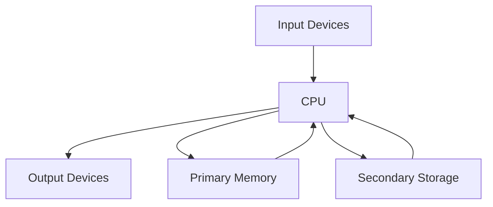
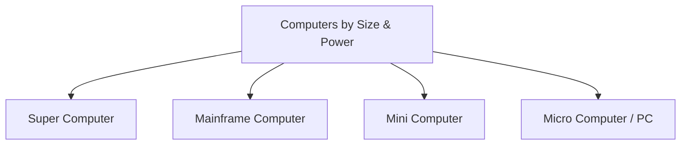

## 1. Basic Computer Organization

### 1.1 Block Diagram

**Function of each block**:

- **Input**: Feeds data and instructions.
- **CPU**: Processes data.
- **Primary Memory**: Holds active data/programs.
- **Secondary Storage**: Permanent backup.
- **Output**: Displays results.

---

### 1.2 Central Processing Unit (CPU) – _Deep Dive_

The CPU has **three main internal parts**:

1. **Arithmetic Logic Unit (ALU)**
   - Performs **Arithmetic** operations: `+`, `-`, `×`, `÷`.
   - Performs **Logical** operations: `AND`, `OR`, `NOT`, comparisons (`>`, `<`, `=`).

2. **Control Unit (CU)**
   - Fetches instructions from memory.
   - Decodes them to understand what needs to be done.
   - Generates control signals to coordinate all other components (like a traffic police).

3. **Registers**
   - Smallest, fastest memory inside the CPU.
   - Hold data immediately required for processing (e.g., Accumulator, Program Counter, Instruction Register).

> **Speed Hierarchy**: Registers > Cache > RAM > Secondary Storage.

---

### 1.3 Primary Memory – _Deep Dive_

| Feature       | RAM (Random Access Memory)           | ROM (Read Only Memory)                             | Cache Memory                                           |
| :------------ | :----------------------------------- | :------------------------------------------------- | :----------------------------------------------------- |
| **Nature**    | Volatile (data lost on power off)    | Non-Volatile (retains data)                        | Volatile                                               |
| **Operation** | Read / Write                         | Read Only                                          | Read / Write                                           |
| **Speed**     | Slower than Cache                    | Slower than RAM                                    | Fastest among primary (Level 1, 2, 3)                  |
| **Usage**     | Stores running programs and OS data. | Stores BIOS/UEFI and firmware (boot instructions). | Stores frequently accessed data to reduce access time. |
| **Types**     | SRAM (Static) & DRAM (Dynamic)       | PROM, EPROM, EEPROM                                | L1, L2, L3 (L1 is fastest, inside CPU chip)            |

---

### 1.4 Secondary Storage Devices

Non-volatile permanent storage. Examples:

- **Magnetic**: Hard Disk Drive (HDD) – large capacity, mechanical.
- **Solid State**: Solid State Drive (SSD) – no moving parts, faster.
- **Optical**: CD, DVD, Blu-ray.
- **Flash**: Pen drives, Memory cards.

---

### 1.5 Input / Output (I/O) Devices

- **Input**: Keyboard, Mouse, Scanner, Joystick, Microphone, Webcam, Barcode reader.
- **Output**: Monitor (VDU), Printer (Laser/Inkjet), Plotter, Speakers, Projector.

---

### 1.6 Units of Memory (Exact Binary Standards)

| Unit         | Abbrev. | Exact Size (Binary)     | Decimal Equivalent (approx) |
| :----------- | :------ | :---------------------- | :-------------------------- |
| **Bit**      | b       | 1 binary digit (0 or 1) | -                           |
| **Byte**     | B       | 8 bits                  | -                           |
| **Kilobyte** | KB      | $2^{10}$ Bytes          | 1024 Bytes                  |
| **Megabyte** | MB      | $2^{20}$ Bytes          | 1024 KB                     |
| **Gigabyte** | GB      | $2^{30}$ Bytes          | 1024 MB                     |
| **Terabyte** | TB      | $2^{40}$ Bytes          | 1024 GB                     |
| **Petabyte** | PB      | $2^{50}$ Bytes          | 1024 TB                     |

> _Exam Tip_: Be careful—storage manufacturers sometimes use decimal (1000), but for Computer Science exams, use **binary multiples** ($2^{10}$).

---

## 2. Classification of Computers

### 2.1 Hierarchy Diagram

### 2.2 Detailed Comparison Table (All 4 Types)

| Feature        | **Super Computer**                               | **Mainframe Computer**                   | **Mini Computer**          | **Personal Computer (PC)**           |
| :------------- | :----------------------------------------------- | :--------------------------------------- | :------------------------- | :----------------------------------- |
| **Size**       | Largest (fills a room/building)                  | Large (cabinet size)                     | Medium (refrigerator size) | Small (desk/lap size)                |
| **Speed**      | Fastest (Petaflops/Exaflops)                     | Very High (millions of transactions/sec) | Moderate                   | Slowest among these                  |
| **Processing** | Parallel processing (thousands of CPUs)          | Massive I/O & transaction processing     | Multi-user, time-sharing   | Single-user                          |
| **Users**      | Only specific researchers (single/multi limited) | Thousands of concurrent users            | Tens to hundreds of users  | Single user                          |
| **Cost**       | Extremely Expensive ($ millions)                 | Very Expensive                           | Moderate                   | Cheap / Affordable                   |
| **OS**         | Custom Linux/UNIX                                | z/OS, IBM Linux                          | UNIX, VMS                  | Windows, macOS, Linux                |
| **Examples**   | Fugaku, Summit, Param (India)                    | IBM Z-series, Unisys                     | DEC VAX, PDP-11            | Dell, HP, Apple MacBook, Smartphones |

---

### 2.3 Additional Key Points for Exams

- **Supercomputers** are used for **Weather Forecasting**, **Nuclear Simulations**, **Aerospace**, and **Cryptography**.
- **Mainframes** are used in **Banking**, **Railway/Airline Reservations**, and **Insurance** due to high reliability.
- **Mini Computers** were popular in the 1960s–80s for departmental systems; now largely replaced by powerful servers.
- **PCs** are further divided into **Desktops**, **Laptops**, **Tablets**, and **Smartphones** (Microcomputers).

---

### Summary of Volatility (Memory types)

- **Volatile**: RAM, Cache, Registers. (Lost when power is off).
- **Non-Volatile**: ROM, Secondary Storage (HDD/SSD), Pen drives. (Retained when power is off).

## 3. MCQ

#### Q1. What are the three main internal parts of the CPU?

A) ALU, Control Unit, and Registers ✅
B) RAM, ROM, and Cache
C) Input, Output, and Storage
D) HDD, SSD, and Flash

#### Q2. Which unit of the CPU performs arithmetic and logical operations?

A) Control Unit
B) Arithmetic Logic Unit (ALU) ✅
C) Memory Unit
D) Register Unit

#### Q3. What is the function of the Control Unit (CU)?

A) Performs addition and subtraction
B) Stores permanent data
C) Fetches, decodes instructions, and generates control signals ✅
D) Handles input/output devices

#### Q4. Which of the following holds the smallest and fastest memory inside the CPU?

A) RAM
B) Cache
C) Registers ✅
D) Secondary Storage

#### Q5. According to the speed hierarchy, which is the fastest?

A) RAM
B) Secondary Storage
C) Cache
D) Registers ✅

#### Q6. In the speed hierarchy, which memory is slower than Registers but faster than RAM?

A) Secondary Storage
B) Cache ✅
C) ROM
D) Hard Disk

#### Q7. Which component feeds data and instructions into the computer?

A) Output Devices
B) CPU
C) Primary Memory
D) Input Devices ✅

#### Q8. The CPU processes data and sends results to which block?

A) Primary Memory
B) Secondary Storage
C) Output Devices ✅
D) Input Devices

#### Q9. Which memory holds active data and programs currently in use?

A) Secondary Storage
B) Primary Memory ✅
C) Registers
D) Output Devices

#### Q10. What is the nature of RAM?

A) Non-Volatile
B) Volatile ✅
C) Read Only
D) Permanent

#### Q11. What is the nature of ROM?

A) Volatile
B) Non-Volatile ✅
C) Read/Write
D) Slower than Secondary Storage

#### Q12. Which memory is Read Only by operation?

A) RAM
B) Cache
C) ROM ✅
D) Registers

#### Q13. What is the primary usage of ROM?

A) Stores running programs
B) Stores frequently accessed data
C) Stores BIOS/UEFI and firmware boot instructions ✅
D) Stores user documents

#### Q14. Which memory is the fastest among primary memory types?

A) RAM
B) ROM
C) Cache ✅
D) Secondary Storage

#### Q15. Which type of RAM is static and faster?

A) DRAM
B) SRAM ✅
C) EEPROM
D) PROM

#### Q16. Which of the following is an example of Secondary Storage?

A) RAM
B) Registers
C) Solid State Drive (SSD) ✅
D) Cache

#### Q17. Which secondary storage device uses magnetic technology and has moving mechanical parts?

A) SSD
B) Pen drive
C) Hard Disk Drive (HDD) ✅
D) CD

#### Q18. Which secondary storage device has no moving parts and is faster than HDD?

A) Magnetic Tape
B) SSD ✅
C) Blu-ray
D) DVD

#### Q19. Which of the following is an optical secondary storage device?

A) Hard Disk Drive
B) Memory Card
C) CD, DVD, Blu-ray ✅
D) Pen drive

#### Q20. Which of the following is a Flash memory device?

A) HDD
B) SSD
C) Pen drives and Memory cards ✅
D) Magnetic Tape

#### Q21. Which of the following is an Input Device?

A) Monitor
B) Printer
C) Scanner ✅
D) Plotter

#### Q22. Which of the following is an Output Device?

A) Keyboard
B) Mouse
C) Microphone
D) Projector ✅

#### Q23. What is the exact binary size of 1 Kilobyte (KB)?

A) 1000 Bytes
B) 1024 Bytes ✅
C) 2^20 Bytes
D) 2^30 Bytes

#### Q24. How many Bytes are exactly in 1 Megabyte (MB) according to binary standards?

A) 2^10 Bytes
B) 2^20 Bytes ✅
C) 1024 Bytes
D) 2^30 Bytes

#### Q25. 1 Gigabyte (GB) in binary terms is equal to:

A) 1024 MB ✅
B) 1000 MB
C) 2^20 MB
D) 1024 KB

#### Q26. What is the binary standard size of 1 Terabyte (TB)?

A) 2^20 Bytes
B) 2^30 Bytes
C) 2^40 Bytes ✅
D) 2^50 Bytes

#### Q27. Which unit is equal to 2^50 Bytes?

A) Terabyte
B) Gigabyte
C) Petabyte ✅
D) Exabyte

#### Q28. The smallest unit of memory in a computer is:

A) Byte
B) Bit ✅
C) Nibble
D) Kilobyte

#### Q29. A Byte consists of how many bits?

A) 4
B) 8 ✅
C) 16
D) 32

#### Q30. According to exam tips, which multiples should be used for Computer Science exams?

A) Decimal multiples (1000)
B) Binary multiples (2^10) ✅
C) Hexadecimal multiples
D) Octal multiples

#### Q31. In the block diagram, which component has a direct two-way connection with Primary Memory?

A) Input Devices
B) Output Devices
C) CPU ✅
D) Secondary Storage

#### Q32. In the block diagram, Secondary Storage connects directly to which component?

A) Input Devices
B) Output Devices
C) CPU ✅
D) Primary Memory

#### Q33. Which CPU component is compared to a "traffic police" for coordinating other components?

A) ALU
B) Registers
C) Control Unit ✅
D) Memory

#### Q34. Which register holds the address of the next instruction to be executed?

A) Accumulator
B) Instruction Register
C) Program Counter ✅
D) Memory Address Register

#### Q35. Which register holds the current instruction being executed?

A) Program Counter
B) Instruction Register ✅
C) Accumulator
D) Cache

#### Q36. Which register is commonly used to store intermediate arithmetic results?

A) Program Counter
B) Instruction Register
C) Accumulator ✅
D) Memory Buffer Register

#### Q37. Which of the following is a logical operation performed by the ALU?

A) Addition
B) Multiplication
C) AND, OR, NOT ✅
D) Division

#### Q38. Which of the following is an arithmetic operation performed by the ALU?

A) Comparison (<, >, =)
B) AND
C) OR
D) Division (÷) ✅

#### Q39. Cache memory is typically divided into how many levels?

A) 1
B) 2
C) 3 (L1, L2, L3) ✅
D) 4

#### Q40. Which level of cache is the fastest and located inside the CPU chip?

A) L3
B) L2
C) L1 ✅
D) All are equally fast

#### Q41. Which of the following is true about RAM?

A) It is Non-Volatile
B) It is Read Only
C) It stores running programs and OS data ✅
D) It stores BIOS

#### Q42. Which of the following is an example of ROM types?

A) SRAM and DRAM
B) PROM, EPROM, EEPROM ✅
C) HDD and SSD
D) L1, L2, L3

#### Q43. What is the nature of Cache Memory?

A) Non-Volatile
B) Volatile ✅
C) Read Only
D) Permanent

#### Q44. According to the speed hierarchy, which is the slowest?

A) Registers
B) Cache
C) RAM
D) Secondary Storage ✅

#### Q45. In the classification of computers by size and power, which is the largest?

A) Mainframe Computer
B) Mini Computer
C) Micro Computer
D) Super Computer ✅

#### Q46. Which type of computer typically fills a room or building?

A) Mainframe
B) Mini
C) Super Computer ✅
D) PC

#### Q47. Which computer is the fastest in terms of processing speed (Petaflops/Exaflops)?

A) Mainframe
B) Mini
C) Super Computer ✅
D) Personal Computer

#### Q48. Which type of computer uses parallel processing with thousands of CPUs?

A) Mini Computer
B) Mainframe
C) Super Computer ✅
D) PC

#### Q49. Which computer is known for massive I/O and transaction processing?

A) Super Computer
B) Mainframe Computer ✅
C) Mini Computer
D) Micro Computer

#### Q50. Which type of computer can handle thousands of concurrent users?

A) Super Computer
B) Mainframe Computer ✅
C) Personal Computer
D) Mini Computer

#### Q51. Which computer supports tens to hundreds of users simultaneously?

A) Super Computer
B) Mainframe
C) Mini Computer ✅
D) PC

#### Q52. A Personal Computer (PC) is designed for how many users?

A) Thousands
B) Hundreds
C) Tens
D) Single user ✅

#### Q53. Which computer type is the most expensive?

A) Mainframe
B) Super Computer ✅
C) Mini
D) PC

#### Q54. Which computer is typically cheap and affordable?

A) Super Computer
B) Mainframe
C) Mini
D) Personal Computer (PC) ✅

#### Q55. What operating system is commonly used on Super Computers?

A) Windows
B) z/OS
C) Custom Linux/UNIX ✅
D) VMS

#### Q56. What operating system is commonly used on Mainframes like IBM Z-series?

A) Windows
B) macOS
C) z/OS, IBM Linux ✅
D) Android

#### Q57. Which of the following is an example of a Super Computer?

A) IBM Z-series
B) DEC VAX
C) Fugaku, Summit, Param ✅
D) Dell, HP

#### Q58. Which of the following is an example of a Mainframe Computer?

A) Fugaku
B) IBM Z-series ✅
C) PDP-11
D) Apple MacBook

#### Q59. Which of the following is an example of a Mini Computer?

A) Summit
B) Unisys
C) DEC VAX, PDP-11 ✅
D) Dell

#### Q60. Which of the following is an example of a Personal Computer?

A) Param
B) IBM Z-series
C) Apple MacBook ✅
D) DEC VAX

#### Q61. Supercomputers are primarily used for which application?

A) Banking
B) Railway reservations
C) Weather Forecasting and Nuclear Simulations ✅
D) Departmental systems

#### Q62. Mainframe computers are primarily used in which sector?

A) Aerospace
B) Cryptography
C) Banking and Railway reservations ✅
D) Personal use

#### Q63. Mini Computers were popular in which era?

A) 1920s–40s
B) 1960s–80s ✅
C) 1990s–2000s
D) 2010s–present

#### Q64. Which of the following falls under Micro Computers / PCs?

A) Desktops, Laptops, Tablets, Smartphones ✅
B) DEC VAX, PDP-11
C) IBM Z-series
D) Fugaku, Summit

#### Q65. Which memory types are volatile?

A) ROM and HDD
B) RAM, Cache, and Registers ✅
C) SSD and Pen drives
D) ROM and Cache

#### Q66. Which memory types are non-volatile?

A) RAM and Cache
B) Registers and RAM
C) ROM and Secondary Storage ✅
D) Cache and Registers

#### Q67. The CPU connects to Primary Memory and Secondary Storage. Which unit manages this data flow?

A) ALU
B) Registers
C) Control Unit ✅
D) Cache

#### Q68. What does ALU stand for?

A) Automatic Logic Unit
B) Arithmetic Logic Unit ✅
C) Array Logic Unit
D) Advanced Logical Unit

#### Q69. What does CU stand for?

A) Computer Unit
B) Control Unit ✅
C) Cache Unit
D) Central Unit

#### Q70. Which operation is performed by the ALU when comparing two values?

A) Arithmetic
B) Logical ✅
C) Storage
D) Input

#### Q71. Which type of memory is used to reduce access time by storing frequently accessed data?

A) ROM
B) Secondary Storage
C) Cache Memory ✅
D) Registers

#### Q72. Which is true about SRAM?

A) It is dynamic and needs refreshing
B) It is static and faster ✅
C) It is non-volatile
D) It is used for BIOS

#### Q73. Which is true about DRAM?

A) It is static
B) It is dynamic and needs refreshing ✅
C) It is faster than SRAM
D) It is non-volatile

#### Q74. What does EEPROM stand for?

A) Electrically Erasable Programmable Read-Only Memory ✅
B) Erasable Electronic Programmable ROM
C) Electrically Erasable Permanent ROM
D) Extended Erasable Programmable ROM

#### Q75. Which device is used for permanent backup of data?

A) Primary Memory
B) Registers
C) Cache
D) Secondary Storage ✅

#### Q76. Which of the following is an example of a magnetic secondary storage device?

A) SSD
B) Blu-ray
C) Hard Disk Drive (HDD) ✅
D) Pen drive

#### Q77. Which of the following is a solid-state secondary storage device?

A) HDD
B) Magnetic Tape
C) SSD ✅
D) CD

#### Q78. Which device is an output device used for printing large engineering drawings?

A) Printer
B) Plotter ✅
C) Scanner
D) Monitor

#### Q79. Which device is an input device used to read barcodes?

A) Mouse
B) Barcode reader ✅
C) Webcam
D) Joystick

#### Q80. Which device is an output device used for visual display?

A) Printer
B) Plotter
C) Monitor (VDU) ✅
D) Scanner

#### Q81. In the block diagram, CPU sends data to Output Devices. What is the reverse flow?

A) Output Devices send data to CPU
B) Input Devices send data to CPU ✅
C) CPU sends data to Secondary Storage
D) Primary Memory sends data to Secondary Storage

#### Q82. A Program Counter (PC) is a type of:

A) Cache
B) Register ✅
C) ALU component
D) RAM

#### Q83. An Instruction Register (IR) holds:

A) The address of the next instruction
B) The current instruction being decoded/executed ✅
C) Intermediate arithmetic results
D) Data from input devices

#### Q84. Which of the following is a comparison operation performed by ALU?

A) AND
B) OR
C) NOT
D) > (Greater than) ✅

#### Q85. Which memory has a speed hierarchy level between Registers and RAM?

A) Secondary Storage
B) ROM
C) Cache ✅
D) HDD

#### Q86. Which type of ROM can be erased using ultraviolet light?

A) PROM
B) EPROM ✅
C) EEPROM
D) SRAM

#### Q87. Which type of ROM is programmable only once?

A) EPROM
B) EEPROM
C) PROM ✅
D) Flash

#### Q88. What is the use of Cache Memory?

A) Permanent storage
B) Storing BIOS
C) Reducing access time for frequently accessed data ✅
D) Storing inactive programs

#### Q89. Which classification of computer is known for high reliability and used in insurance?

A) Super Computer
B) Mini Computer
C) Mainframe Computer ✅
D) Personal Computer

#### Q90. Which classification of computer is used for Cryptography?

A) Mini Computer
B) Personal Computer
C) Mainframe
D) Super Computer ✅

#### Q91. What is the typical size of a Mini Computer?

A) Fills a room
B) Cabinet size
C) Refrigerator size ✅
D) Desk size

#### Q92. What is the typical size of a Mainframe Computer?

A) Small (desk)
B) Large (cabinet size) ✅
C) Medium (refrigerator)
D) Largest (room)

#### Q93. What is a distinguishing feature of Supercomputers?

A) Single-user
B) Massive I/O
C) Parallel processing with thousands of CPUs ✅
D) Time-sharing

#### Q94. Which characteristic is true for Personal Computers?

A) Multi-user
B) Extremely expensive
C) Single-user ✅
D) Parallel processing

#### Q95. Which OS is associated with Mainframes?

A) Windows
B) macOS
C) z/OS ✅
D) Android

#### Q96. Which OS is associated with Mini Computers (historically)?

A) Windows
B) z/OS
C) UNIX, VMS ✅
D) Linux (custom)

#### Q97. What is the decimal equivalent of 1 KB (approx)?

A) 1000 Bytes
B) 1024 Bytes
C) 2^20 Bytes
D) 2^30 Bytes

#### Q98. 1 Petabyte (PB) equals how many Terabytes?

A) 1024 TB ✅
B) 1000 TB
C) 2^20 TB
D) 1024 GB

#### Q99. Which of the following is true about the Control Unit's function?

A) Performs addition and subtraction
B) Stores permanent data
C) Coordinates all other components ✅
D) Handles only input devices

#### Q100. In the hierarchy diagram of computers, which category is at the bottom in terms of size and power?

A) Super Computer
B) Mainframe
C) Mini
D) Micro Computer / PC ✅
