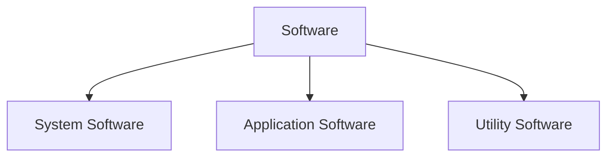
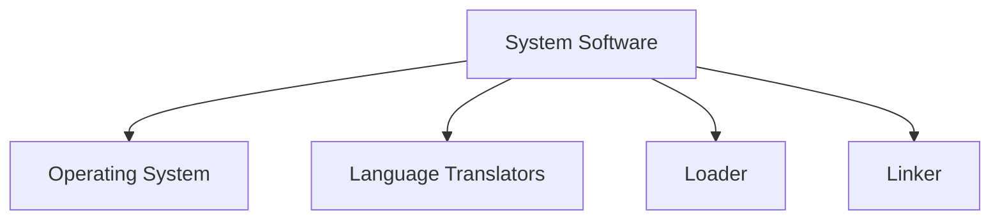
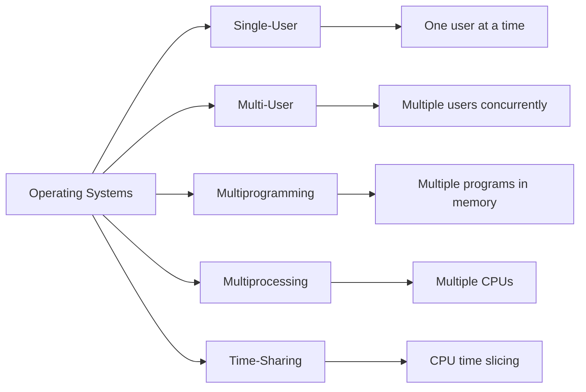
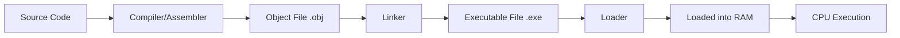

## 1. Definition of Software

**Software** is a collection of programs, data, and instructions that tell a computer how to perform specific tasks. It is the intangible part of a computer system (as opposed to hardware, which is physical).

> **Relationship**: Hardware + Software = Functional Computer System.

---

## 2. Types of Software

Software is broadly classified into three categories:



---

## 3. System Software

**System Software** is a set of programs that manage and control the hardware resources of a computer and provide a platform for running application software. It acts as an **interface** between the user/hardware and the application programs.

### 3.1 Components of System Software



---

### 3.2 Operating System (OS)

#### Definition

An **Operating System** is a system software that acts as an intermediary between the user and the computer hardware. It manages all hardware resources and provides services to application programs.

#### Functions of an Operating System

1. **Process Management** – Allocates CPU time to processes and handles multitasking.
2. **Memory Management** – Manages RAM allocation to programs.
3. **File Management** – Organizes, stores, retrieves, and manages files on storage devices.
4. **Device Management** – Controls I/O devices using device drivers.
5. **Security & Protection** – Provides user authentication, access controls, and data protection.
6. **User Interface** – Provides a way for users to interact (CUI or GUI).
7. **Error Detection & Handling** – Detects hardware/software errors and takes corrective actions.

---

#### Types of Operating Systems

| OS Type                 | Definition                                                                                                           | Example                                    |
| :---------------------- | :------------------------------------------------------------------------------------------------------------------- | :----------------------------------------- |
| **Single-User OS**      | Allows only one user to use the system at a time.                                                                    | MS-DOS, early Windows (95/98)              |
| **Multi-User OS**       | Allows multiple users to access the system simultaneously via terminals.                                             | UNIX, Linux, Windows Server                |
| **Multiprogramming OS** | Keeps multiple programs in memory simultaneously; CPU switches between them to keep busy (no idle time).             | Early IBM mainframe OS                     |
| **Multiprocessing OS**  | Supports two or more CPUs (processors) in a single system, executing multiple processes in parallel.                 | Windows NT, Linux (on multi-core), Solaris |
| **Time-Sharing OS**     | Extends multiprogramming; each user gets a small time slice (quantum) of CPU. Users feel they have dedicated system. | UNIX, Linux, Windows (terminal services)   |

**Visualizing OS Types:**



---

### 3.3 Language Translators (Translators)

A **translator** converts high-level language (HLL) programs or assembly code into machine code (binary) that the CPU can execute.

| Translator      | Definition                                                                               | Process                                                          | Output                          | Speed of Execution                                     |
| :-------------- | :--------------------------------------------------------------------------------------- | :--------------------------------------------------------------- | :------------------------------ | :----------------------------------------------------- |
| **Assembler**   | Translates **Assembly Language** (mnemonics) into machine code.                          | 1 step (source → object code).                                   | Machine code (specific to CPU). | Fast (direct translation).                             |
| **Interpreter** | Translates HLL code **line-by-line** and executes it immediately.                        | Translates → executes → next line.                               | No separate object code file.   | Slow (repeats translation each run).                   |
| **Compiler**    | Translates entire HLL program into machine code **in one go**, producing an object file. | Source code → Compiler → Object code (.obj) → Executable (.exe). | Standalone executable file.     | Fast (execution happens later without re-translation). |

> **Key Difference**: Compiler translates once; Interpreter translates every time the program runs.

---

### 3.4 Loader

- **Definition**: A system program that loads the executable program (object code) from secondary storage (hard disk) into the main memory (RAM) so that the CPU can execute it.
- **Types**: Absolute Loader, Relocating Loader, Dynamic Linker (sometimes combined).
- **Function**: Allocates memory space, resolves addresses, and hands control to the starting address of the program.

---

### 3.5 Linker

- **Definition**: A system program that combines multiple object files (generated by compiler/assembler) into a single executable file.
- **Function**: Resolves external references (e.g., linking library functions like `printf` in C to the main program).
- **Output**: Produces an executable file (`.exe`, `.out`) that can be loaded by the loader.

> **Relationship** (Compilation to Execution Flow):
> Source Code → **Compiler** → Object File(s) → **Linker** → Executable File → **Loader** → Memory → CPU executes.



---

## 4. Application Software

**Application Software** is designed to help users perform specific tasks (non-system tasks) such as word processing, calculations, browsing, gaming, etc.

- **Definition**: End-user software that runs on top of system software (OS).
- **Examples**:
  - Word Processors: MS Word, Google Docs
  - Spreadsheets: MS Excel, Google Sheets
  - Web Browsers: Chrome, Firefox
  - Graphics: Adobe Photoshop, CorelDRAW
  - Games, Media Players, Database Management (MySQL Workbench), etc.

---

## 5. Utility Software

**Utility Software** is a type of system software that helps to maintain, optimize, and secure the computer system. It is neither an OS nor an application—it fills the gap.

- **Definition**: Tools that assist in managing the computer's resources efficiently.
- **Examples**:
  - Antivirus (Norton, Kaspersky)
  - Disk Cleanup, Defragmentation tools
  - Backup software
  - File compression (WinRAR, 7-Zip)
  - System monitoring tools.

> **Difference from Application Software**: Utilities are system-oriented (maintenance), while applications are user-task-oriented.

---

## 6. User Interface: CUI vs GUI

### 6.1 CUI (Character User Interface) / CLI (Command Line Interface)

- **Definition**: User interacts with the computer by typing textual commands.
- **Characteristics**:
  - Requires knowledge of commands.
  - Low memory/processing overhead.
  - Faster for advanced users.
  - Less user-friendly for beginners.
- **Examples**: MS-DOS, **Linux Terminal (Bash)**, Windows Command Prompt, UNIX.

### 6.2 GUI (Graphical User Interface)

- **Definition**: User interacts with the computer using graphical elements like windows, icons, menus, and pointers (WIMP).
- **Characteristics**:
  - Intuitive and visual.
  - Uses mouse/touch for navigation.
  - Requires more system resources (RAM, GPU).
  - Easy for beginners.
- **Examples**: Windows (7/10/11), macOS, Linux desktop environments (GNOME, KDE), Android/iOS.

---

## 7. LINUX – Basic Commands (CUI Example)

Linux is an open-source, multi-user, multitasking OS. Its terminal uses a **CUI**. Below are essential commands:

| Command  | Syntax               | Description                                     | Example                  |
| :------- | :------------------- | :---------------------------------------------- | :----------------------- |
| `pwd`    | `pwd`                | Prints the current working directory path.      | `pwd` → `/home/user`     |
| `ls`     | `ls`                 | Lists files and directories in current folder.  | `ls` → `Documents Music` |
| `cd`     | `cd [dir]`           | Changes directory. `cd ..` goes back one level. | `cd Documents`           |
| `mkdir`  | `mkdir [name]`       | Creates a new directory.                        | `mkdir NewFolder`        |
| `rmdir`  | `rmdir [name]`       | Removes an empty directory.                     | `rmdir OldFolder`        |
| `touch`  | `touch [file]`       | Creates an empty file.                          | `touch notes.txt`        |
| `cp`     | `cp [source] [dest]` | Copies a file/directory.                        | `cp file1.txt file2.txt` |
| `mv`     | `mv [source] [dest]` | Moves or renames a file/directory.              | `mv old.txt new.txt`     |
| `rm`     | `rm [file]`          | Removes/deletes a file.                         | `rm notes.txt`           |
| `cat`    | `cat [file]`         | Displays content of a file.                     | `cat notes.txt`          |
| `man`    | `man [command]`      | Displays the manual/help for a command.         | `man ls`                 |
| `whoami` | `whoami`             | Displays the logged-in username.                | `whoami` → `student`     |
| `clear`  | `clear`              | Clears the terminal screen.                     | `clear`                  |

> **Example Flow in Linux Terminal (CUI)**:
>
> ```
> $ pwd
> /home/student
> $ mkdir Class11
> $ cd Class11
> $ touch notes.md
> $ ls
> notes.md
> $ cat notes.md
> (displays content)
> ```

---

## 8. MCQ

#### Q1. What is software?

A) Physical components of a computer
B) Collection of programs, data, and instructions that tell a computer how to perform specific tasks ✅
C) The monitor and keyboard
D) The CPU and memory

#### Q2. Which equation correctly represents a functional computer system?

A) Hardware + Software = Functional Computer System ✅
B) Hardware - Software = Functional Computer System
C) Hardware × Software = Functional Computer System
D) Hardware / Software = Functional Computer System

#### Q3. Which of the following is NOT a type of software?

A) System Software
B) Application Software
C) Utility Software
D) Hardware Software ✅

#### Q4. System Software acts as an interface between:

A) User and hardware only
B) Application programs and hardware ✅
C) User and application programs only
D) Two different computers

#### Q5. Which of the following is a component of System Software?

A) Microsoft Word
B) Operating System ✅
C) Adobe Photoshop
D) Chrome Browser

#### Q6. What is the primary function of an Operating System?

A) To create documents
B) To play games
C) To act as an intermediary between the user and computer hardware ✅
D) To design graphics

#### Q7. Which function of the OS allocates CPU time to processes?

A) Memory Management
B) File Management
C) Process Management ✅
D) Device Management

#### Q8. Memory Management in an OS refers to:

A) Organizing files on hard disk
B) Managing RAM allocation to programs ✅
C) Controlling I/O devices
D) User authentication

#### Q9. File Management in an OS involves:

A) Managing RAM
B) Organizing, storing, retrieving, and managing files on storage devices ✅
C) Allocating CPU time
D) Detecting errors

#### Q10. Which OS function uses device drivers?

A) Process Management
B) Memory Management
C) File Management
D) Device Management ✅

#### Q11. Security & Protection functions of an OS include:

A) Defragmentation
B) User authentication and access controls ✅
C) File compression
D) Disk cleanup

#### Q12. A GUI (Graphical User Interface) is an example of which OS function?

A) Process Management
B) Memory Management
C) User Interface ✅
D) Device Management

#### Q13. Which type of OS allows only one user to use the system at a time?

A) Multi-User OS
B) Multiprogramming OS
C) Single-User OS ✅
D) Multiprocessing OS

#### Q14. Which of the following is an example of a Single-User OS?

A) UNIX
B) Linux
C) MS-DOS ✅
D) Windows Server

#### Q15. A Multi-User OS allows:

A) Only one user at a time
B) Multiple users to access the system simultaneously ✅
C) Only administrators to use the system
D) No users to access the system

#### Q16. Which OS type keeps multiple programs in memory simultaneously and switches between them?

A) Single-User OS
B) Multiprogramming OS ✅
C) Multiprocessing OS
D) Time-Sharing OS

#### Q17. Which OS supports two or more CPUs executing processes in parallel?

A) Single-User OS
B) Multiprogramming OS
C) Multiprocessing OS ✅
D) Time-Sharing OS

#### Q18. In Time-Sharing OS, each user gets:

A) Unlimited CPU time
B) A small time slice (quantum) of CPU ✅
C) Dedicated CPU
D) No CPU time

#### Q19. Which OS type makes users feel they have a dedicated system?

A) Single-User OS
B) Multiprogramming OS
C) Multiprocessing OS
D) Time-Sharing OS ✅

#### Q20. Which of the following is an example of a Multi-User OS?

A) MS-DOS
B) Windows 95
C) UNIX ✅
D) Windows 98

#### Q21. Which translator converts Assembly Language to machine code?

A) Compiler
B) Interpreter
C) Assembler ✅
D) Loader

#### Q22. An Assembler translates mnemonics into:

A) High-level code
B) Machine code ✅
C) Assembly code
D) Byte code

#### Q23. Which translator converts HLL code line-by-line and executes it immediately?

A) Compiler
B) Interpreter ✅
C) Assembler
D) Linker

#### Q24. Which translator is described as "slow" because it repeats translation each time the program runs?

A) Compiler
B) Interpreter ✅
C) Assembler
D) Loader

#### Q25. A Compiler translates an entire HLL program:

A) Line-by-line
B) In one go ✅
C) Only at runtime
D) Never

#### Q26. Which translator produces a standalone executable file?

A) Interpreter
B) Assembler
C) Compiler ✅
D) Loader

#### Q27. The key difference between a Compiler and an Interpreter is:

A) Compiler is slower
B) Compiler translates once; Interpreter translates every time ✅
C) Interpreter produces an object file
D) Compiler executes line-by-line

#### Q28. A Loader loads the executable program from:

A) RAM into secondary storage
B) Secondary storage into RAM ✅
C) CPU into RAM
D) ROM into RAM

#### Q29. Which system program allocates memory space and hands control to the starting address of the program?

A) Linker
B) Compiler
C) Loader ✅
D) Interpreter

#### Q30. A Linker combines multiple object files into:

A) Object code
B) Source code
C) A single executable file ✅
D) Assembly code

#### Q31. Which system program resolves external references (like linking library functions)?

A) Loader
B) Linker ✅
C) Compiler
D) Interpreter

#### Q32. The correct flow from source code to execution is:

A) Source Code → Linker → Compiler → Loader → Execute
B) Source Code → Compiler → Linker → Loader → Execute ✅
C) Source Code → Loader → Compiler → Linker → Execute
D) Source Code → Interpreter → Linker → Loader → Execute

#### Q33. The Linker produces which type of file?

A) .obj file
B) .exe or .out file ✅
C) .txt file
D) .c file

#### Q34. The Loader loads the executable file into:

A) Secondary Storage
B) ROM
C) RAM ✅
D) Cache

#### Q35. Application Software is designed to:

A) Manage hardware resources
B) Help users perform specific non-system tasks ✅
C) Control I/O devices
D) Translate high-level code

#### Q36. Which of the following is Application Software?

A) Windows 10
B) Linux
C) MS Word ✅
D) UNIX

#### Q37. Which of the following is NOT Application Software?

A) Google Docs
B) Adobe Photoshop
C) MySQL Workbench
D) Windows Server ✅

#### Q38. Utility Software helps to:

A) Perform user tasks like word processing
B) Maintain, optimize, and secure the computer system ✅
C) Manage processes
D) Browse the internet

#### Q39. Which of the following is Utility Software?

A) Google Chrome
B) Antivirus (Norton, Kaspersky) ✅
C) MS Excel
D) VLC Media Player

#### Q40. Disk Cleanup and Defragmentation tools are examples of:

A) Application Software
B) System Software (Utility) ✅
C) Operating System
D) Language Translator

#### Q41. The difference between Utility Software and Application Software is:

A) Utilities are user-task-oriented; Applications are system-oriented
B) Utilities are system-oriented; Applications are user-task-oriented ✅
C) Both are the same
D) Utilities are hardware components

#### Q42. CUI stands for:

A) Computer User Interface
B) Character User Interface ✅
C) Command User Interface
D) Central User Interface

#### Q43. CLI stands for:

A) Command Line Interface ✅
B) Computer Line Interface
C) Central Language Interface
D) Character Language Interface

#### Q44. Which user interface requires knowledge of commands?

A) GUI
B) CUI/CLI ✅
C) Both require command knowledge
D) Neither requires command knowledge

#### Q45. Which user interface uses graphical elements like windows, icons, menus, and pointers?

A) CUI
B) CLI
C) GUI ✅
D) Text-based interface

#### Q46. WIMP in GUI stands for:

A) Windows, Icons, Menus, Pointers ✅
B) Web, Internet, Mouse, Programs
C) Windows, Input, Mouse, Programs
D) Work, Icons, Memory, Processors

#### Q47. Which user interface is more intuitive and visual?

A) CUI
B) CLI
C) GUI ✅
D) Command-based interface

#### Q48. Which of the following is an example of CUI?

A) Windows 10
B) macOS
C) Linux Terminal (Bash) ✅
D) Android

#### Q49. Which of the following is an example of GUI?

A) MS-DOS
B) Windows Command Prompt
C) Linux Terminal
D) Windows 7 ✅

#### Q50. GUI requires more:

A) Command knowledge
B) System resources (RAM, GPU) ✅
C) Text input
D) Keyboard shortcuts

#### Q51. What is the Linux command to print the current working directory path?

A) ls
B) pwd ✅
C) cd
D) mkdir

#### Q52. The 'ls' command in Linux is used to:

A) Change directory
B) List files and directories in current folder ✅
C) Create a new directory
D) Remove a file

#### Q53. Which command is used to change directory in Linux?

A) ls
B) pwd
C) cd ✅
D) mkdir

#### Q54. To go back one level in Linux directory structure, you use:

A) cd /
B) cd ..
C) cd ~
D) cd . ✅

#### Q55. Which command creates a new directory in Linux?

A) touch
B) mkdir ✅
C) rmdir
D) cp

#### Q56. The 'rmdir' command in Linux removes:

A) A file
B) An empty directory ✅
C) A non-empty directory
D) All files in a directory

#### Q57. Which command creates an empty file in Linux?

A) mkdir
B) touch ✅
C) cp
D) mv

#### Q58. The 'cp' command in Linux is used to:

A) Move a file
B) Copy a file ✅
C) Remove a file
D) Display file content

#### Q59. Which command is used to move or rename a file in Linux?

A) cp
B) rm
C) mv ✅
D) cat

#### Q60. The 'rm' command in Linux is used to:

A) Remove/delete a file ✅
B) Rename a file
C) Copy a file
D) Display file content

#### Q61. Which command displays the content of a file in Linux?

A) cat ✅
B) mv
C) cp
D) touch

#### Q62. The 'man' command in Linux displays:

A) The current directory
B) The manual/help for a command ✅
C) The username
D) The file content

#### Q63. Which command in Linux displays the logged-in username?

A) pwd
B) ls
C) whoami ✅
D) clear

#### Q64. The 'clear' command in Linux:

A) Deletes all files
B) Clears the terminal screen ✅
C) Removes a directory
D) Displays system information

#### Q65. Linux is described as:

A) Closed-source, single-user OS
B) Open-source, multi-user, multitasking OS ✅
C) Closed-source, multi-user OS
D) Open-source, single-user OS

#### Q66. In Linux, the terminal uses which type of interface?

A) GUI
B) CUI ✅
C) Both
D) Neither

#### Q67. Which of the following is NOT a function of an Operating System?

A) Process Management
B) File Management
C) Graphic Design ✅
D) Security & Protection

#### Q68. Early IBM mainframe OS is an example of which OS type?

A) Single-User OS
B) Multiprogramming OS ✅
C) Multiprocessing OS
D) Time-Sharing OS

#### Q69. Windows NT and Linux (on multi-core) are examples of which OS type?

A) Single-User OS
B) Multiprogramming OS
C) Multiprocessing OS ✅
D) Time-Sharing OS

#### Q70. Which OS type extends multiprogramming with CPU time slicing?

A) Single-User OS
B) Multiprogramming OS
C) Multiprocessing OS
D) Time-Sharing OS ✅

#### Q71. UNIX, Linux, and Windows Server are examples of which OS type?

A) Single-User OS
B) Multi-User OS ✅
C) Multiprogramming OS
D) Multiprocessing OS

#### Q72. Which of the following is NOT an example of System Software?

A) Loader
B) Linker
C) Operating System
D) Microsoft Word ✅

#### Q73. Which of the following is NOT a type of Language Translator?

A) Assembler
B) Interpreter
C) Compiler
D) Loader ✅

#### Q74. Which translator has a one-step process (source → object code)?

A) Compiler
B) Interpreter
C) Assembler ✅
D) Linker

#### Q75. Which translator does NOT produce a separate object code file?

A) Compiler
B) Interpreter ✅
C) Assembler
D) Linker

#### Q76. A Compiler produces which file as output?

A) .exe file
B) .obj file ✅
C) .txt file
D) .out file

#### Q77. Which translator's execution is described as "fast" because execution happens later without re-translation?

A) Compiler ✅
B) Interpreter
C) Assembler
D) Loader

#### Q78. A Loader can be of which types?

A) Absolute, Relocating, Dynamic Linker ✅
B) Simple, Complex, Hybrid
C) Static, Dynamic, Variable
D) Primary, Secondary, Tertiary

#### Q79. The Linker's output is fed directly to which system program?

A) Compiler
B) Assembler
C) Loader ✅
D) Interpreter

#### Q80. Which Linux command would you use to see the manual for the 'ls' command?

A) man ls ✅
B) help ls
C) ls --help
D) info ls

#### Q81. In Linux, the 'pwd' command output shows:

A) The list of files
B) The current working directory path ✅
C) The current username
D) The system date

#### Q82. Which Linux command sequence would create a directory called 'Projects' and then move into it?

A) mkdir Projects → cd Projects ✅
B) cd Projects → mkdir Projects
C) touch Projects → cd Projects
D) ls Projects → cd Projects

#### Q83. To copy a file 'data.txt' to 'backup.txt' in Linux, you would use:

A) mv data.txt backup.txt
B) cp data.txt backup.txt ✅
C) rm data.txt backup.txt
D) touch data.txt backup.txt

#### Q84. To rename 'oldfile.txt' to 'newfile.txt' in Linux, you would use:

A) cp oldfile.txt newfile.txt
B) rm oldfile.txt newfile.txt
C) mv oldfile.txt newfile.txt ✅
D) cat oldfile.txt newfile.txt

#### Q85. Which of the following statements about Linux commands is TRUE?

A) 'rm' deletes a directory by default
B) 'cat' creates a new file
C) 'pwd' shows the current directory path ✅
D) 'ls' changes the directory

#### Q86. Which feature is NOT associated with CUI/CLI?

A) Requires knowledge of commands
B) Low memory/processing overhead
C) Uses mouse for navigation ✅
D) Faster for advanced users

#### Q87. Which feature is NOT associated with GUI?

A) Intuitive and visual
B) Uses mouse/touch for navigation
C) Requires command knowledge ✅
D) Easy for beginners

#### Q88. Examples of GUI include:

A) Windows 10, macOS, Android ✅
B) MS-DOS, UNIX, Linux Terminal
C) Bash, Command Prompt, Terminal
D) All of the above

#### Q89. Examples of CUI include:

A) Windows 10, macOS
B) Linux Terminal (Bash), MS-DOS ✅
C) Android, iOS
D) GNOME, KDE

#### Q90. Which of the following is Application Software used for graphics?

A) MS Word
B) MS Excel
C) Adobe Photoshop ✅
D) MySQL Workbench

#### Q91. Which of the following is Utility Software used for file compression?

A) Norton Antivirus
B) WinRAR, 7-Zip ✅
C) Disk Cleanup
D) Backup software

#### Q92. What is the role of device drivers in an OS?

A) To manage files
B) To control I/O devices ✅
C) To manage memory
D) To handle user authentication

#### Q93. Error Detection & Handling in an OS involves:

A) Creating new files
B) Detecting hardware/software errors and taking corrective actions ✅
C) Allocating memory
D) Managing processes

#### Q94. The Linux command 'rmdir OldFolder' will:

A) Delete the file 'OldFolder'
B) Remove the empty directory 'OldFolder' ✅
C) Rename 'OldFolder'
D) Copy 'OldFolder'

#### Q95. The Linux command 'touch notes.md' will:

A) Display content of 'notes.md'
B) Create an empty file called 'notes.md' ✅
C) Delete 'notes.md'
D) Move 'notes.md'

#### Q96. Which system software is a set of programs that manage and control hardware resources and provide a platform for application software?

A) Application Software
B) Utility Software
C) System Software ✅
D) Firmware

#### Q97. Which of the following is TRUE about Multiprogramming OS?

A) It uses multiple CPUs
B) It keeps multiple programs in memory simultaneously ✅
C) It supports only one user
D) It has no memory management

#### Q98. Which of the following is TRUE about Multiprocessing OS?

A) It supports only one CPU
B) It executes multiple processes in parallel using multiple CPUs ✅
C) It is single-user
D) It has no process management

#### Q99. The components of System Software include:

A) OS, Language Translators, Loader, Linker ✅
B) OS, Word Processors, Spreadsheets
C) Antivirus, Games, Media Players
D) Compilers, Browsers, Graphics Software

#### Q100. The relationship between hardware, software, and a functional computer system is:

A) Hardware alone is sufficient
B) Software alone is sufficient
C) Hardware + Software = Functional Computer System ✅
D) Hardware and Software are unrelated
