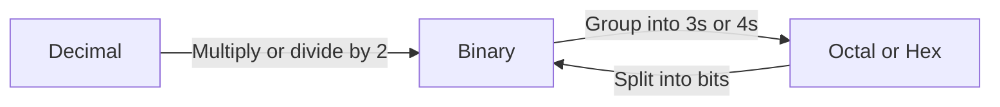

## 1. Introduction to Number Systems

A **number system** (or numeral system) defines a set of values used to represent quantities. It uses a **base** (or **radix**) which determines the number of unique digits used.

| Number System   | Base (Radix) | Digits Used                                   | Primary Use                                                             |
| :-------------- | :----------- | :-------------------------------------------- | :---------------------------------------------------------------------- |
| **Decimal**     | 10           | 0–9                                           | Everyday human calculations.                                            |
| **Binary**      | 2            | 0, 1                                          | Internal computer processing (logic gates).                             |
| **Octal**       | 8            | 0–7                                           | Compact representation of binary (obsolete now, but still in syllabus). |
| **Hexadecimal** | 16           | 0–9, A–F (A=10, B=11, C=12, D=13, E=14, F=15) | Compact representation for memory addresses and colors.                 |

> **General Representation**: Any number in base $r$ is written as $(N)_r$ or $N_r$.
> Example: $(1011)_2$ is binary; $(A3)_{16}$ is hexadecimal.

---

## 2. Number System Conversions

### 2.1 Conversion Flowchart

---

### 2.2 Decimal to Other Bases

**Method**: Repeated Division by the target base. Read the remainders from **bottom to top**.

**Example**: Convert $(25)_{10}$ to Binary (Base 2):

- 25 ÷ 2 → Quotient 12, Remainder 1
- 12 ÷ 2 → Q=6, R=0
- 6 ÷ 2 → Q=3, R=0
- 3 ÷ 2 → Q=1, R=1
- 1 ÷ 2 → Q=0, R=1
- Read bottom to top: $(11001)_2$

**Check**: $1 \times 2^4 + 1 \times 2^3 + 0 \times 2^2 + 0 \times 2^1 + 1 \times 2^0 = 16+8+0+0+1 = 25$

---

### 2.3 Other Bases to Decimal

**Method**: Expand the number using powers of its base: $(N)_r = \sum d_i \times r^i$

**Example**: Convert $(A2)_{16}$ to Decimal:

- $A = 10$
- $10 \times 16^1 + 2 \times 16^0 = 160 + 2 = 162$
- So $(A2)_{16} = (162)_{10}$

---

### 2.4 Binary ↔ Octal (Grouping by 3)

| Octal Digit | Binary Equivalent |
| :---------- | :---------------- |
| 0           | 000               |
| 1           | 001               |
| 2           | 010               |
| 3           | 011               |
| 4           | 100               |
| 5           | 101               |
| 6           | 110               |
| 7           | 111               |

- **Binary to Octal**: Group binary digits from **right to left** into sets of 3. Add leading zeros if needed.
  - Example: $(110101)_2$ → 110 | 101 → $(65)_8$

- **Octal to Binary**: Replace each octal digit with its 3-bit binary equivalent.
  - Example: $(72)_8$ → 111 | 010 → $(111010)_2$

---

### 2.5 Binary ↔ Hexadecimal (Grouping by 4)

| Hex Digit | Binary Equivalent |
| :-------- | :---------------- |
| 0         | 0000              |
| 1         | 0001              |
| 2         | 0010              |
| 3         | 0011              |
| 4         | 0100              |
| 5         | 0101              |
| 6         | 0110              |
| 7         | 0111              |
| 8         | 1000              |
| 9         | 1001              |
| A         | 1010              |
| B         | 1011              |
| C         | 1100              |
| D         | 1101              |
| E         | 1110              |
| F         | 1111              |

- **Binary to Hex**: Group binary digits from **right to left** into sets of 4.
  - Example: $(11010110)_2$ → 1101 | 0110 → $(D6)_{16}$

- **Hex to Binary**: Replace each hex digit with its 4-bit binary equivalent.
  - Example: $(3F)_{16}$ → 0011 | 1111 → $(00111111)_2$

---

## 3. Weighted Codes

In **weighted codes**, each position of a binary digit has a fixed weight (place value). The decimal value is the sum of the weights where the bit is 1.

### 3.1 Straight Binary (Natural Binary Code)

- Weights: $... 2^3, 2^2, 2^1, 2^0$ (i.e., 8, 4, 2, 1).
- Example: $(1011)_2 = 1 \times 8 + 0 \times 4 + 1 \times 2 + 1 \times 1 = 11$

---

### 3.2 Binary Coded Decimal (BCD) – 8421 Code

- **Definition**: Each decimal digit (0–9) is represented by its 4-bit binary equivalent.
- **Weights**: 8, 4, 2, 1.
- **Very Important**: Only digits 0 to 9 are valid. 1010 (10) to 1111 (15) are invalid in BCD.

| Decimal | BCD (8421) |
| :------ | :--------- |
| 5       | 0101       |
| 9       | 1001       |
| 12      | 0001 0010  |

**Example**: $(348)_{10}$ in BCD → 3 = 0011, 4 = 0100, 8 = 1000 → `0011 0100 1000`

---

### 3.3 84-2-1 Code

- **Weights**: 8, 4, -2, -1.
- **Note**: This is a **self-complementing** code (the 9's complement of a digit is obtained by complementing its bits).
- Weights: Position 3 = 8, Position 2 = 4, Position 1 = -2, Position 0 = -1.

**Example**: Represent 4 in 84-2-1:

- Find combination: $0 \times 8 + 1 \times 4 + 0 \times (-2) + 0 \times (-1) = 4$ → `0100`.
- Represent 7: $1 \times 8 + 0 \times 4 + 1 \times (-2) + 1 \times (-1) = 5$ ? Let's find: $1\times8 + 0\times4 + 1\times(-2) + 1\times(-1) = 5$ (wrong).
  Let's try $1\times8 + 0\times4 + 0\times(-2) + 1\times(-1) = 7$ → `1001`.
  So 7 = `1001`.

---

## 4. Non-Weighted Codes

In non-weighted codes, the positional weights have no fixed arithmetic value. The code is defined by a specific mapping rule.

### 4.1 Gray Code (Reflected Binary Code)

- **Definition**: A binary sequence where **two successive values differ in exactly one bit** (Hamming distance = 1).
- **Uses**: Shaft encoders, Karnaugh maps, error correction.

**Binary to Gray Code Conversion**:

1. MSB of Gray = MSB of Binary.
2. Next Gray bits = XOR of adjacent binary bits.

**Example**: Convert $(1011)_2$ to Gray:

- G3 = B3 = 1
- G2 = B3 ⊕ B2 = 1 ⊕ 0 = 1
- G1 = B2 ⊕ B1 = 0 ⊕ 1 = 1
- G0 = B1 ⊕ B0 = 1 ⊕ 1 = 0
- Result: $(1110)_{Gray}$

**Gray to Binary Code Conversion**:

1. MSB of Binary = MSB of Gray.
2. Next Binary bits = Previous Binary bit ⊕ Current Gray bit.

---

### 4.2 Excess-3 (XS-3) Code

- **Definition**: It is a non-weighted code derived from BCD by adding 3 to each decimal digit before converting to binary.
- **Self-complementing**: 9's complement of a decimal is obtained by complementing the bits.
- **Uses**: Used in old calculators and digital logic (BCD addition).

| Decimal | BCD  | Excess-3 (BCD + 3) |
| :------ | :--- | :----------------- |
| 0       | 0000 | 0011               |
| 1       | 0001 | 0100               |
| 2       | 0010 | 0101               |
| 5       | 0101 | 1000               |
| 9       | 1001 | 1100               |

**Example**: Represent $(59)_{10}$ in XS-3:

- 5 → 0101 + 0011 = 1000
- 9 → 1001 + 0011 = 1100
- Result: `1000 1100`

---

## 5. Encoding Schemes (Character Representation)

### 5.1 ASCII (American Standard Code for Information Interchange)

- **Bits**: Uses 7 bits to represent characters (128 codes: 0–127).
- **Extended ASCII**: Uses 8 bits (256 codes: 0–255) for additional symbols.
- **Examples**: 'A' = 65, 'a' = 97, '0' = 48, Space = 32.

### 5.2 ISCII (Indian Standard Code for Information Interchange)

- **Bits**: Uses 8 bits (256 codes).
- **Purpose**: Designed to support Indian scripts like Devanagari, Tamil, Telugu, etc.
- **Limitations**: It is an 8-bit code but can only support one script at a time using code pages (like Brahmi-based scripts).

### 5.3 UNICODE (Universal Character Encoding)

- **Purpose**: A universal standard that represents characters from **all languages** (scripts) across the world, including emojis and symbols.
- **Encoding Forms**:
  - **UTF-8**: Variable length (1 to 4 bytes). Backward compatible with ASCII.
  - **UTF-16**: Uses 2 or 4 bytes (most common for Java/Windows).
  - **UTF-32**: Fixed 4 bytes.
- **Examples**: U+0041 = 'A', U+0905 = 'अ' (Devanagari).

| Encoding        | Bits/Character | Standard           |
| :-------------- | :------------- | :----------------- |
| ASCII           | 7 bits         | American English   |
| ISCII           | 8 bits         | Indian Languages   |
| Unicode (UTF-8) | 8 to 32 bits   | Universal (Global) |

---

## 6. Complements of Binary Numbers

Complements are used in computers to perform **subtraction** by addition and to represent **signed numbers** (negative integers).

### 6.1 1's Complement

- **Method**: Flip (invert) all bits of the binary number (0 → 1, 1 → 0).
- **Range**: For an n-bit number, range is $-(2^{n-1} - 1)$ to $+(2^{n-1} - 1)$.
- **Drawback**: Has two representations for zero (`+0` and `-0`).

**Example**: Find 1's complement of $(1010)_2$:

- Flip bits → `0101`

---

### 6.2 2's Complement

- **Method**: Find the 1's complement and add 1 to the Least Significant Bit (LSB).
- **Formula**: $2$'s complement = $1$'s complement + 1.
- **Range**: For an n-bit number, range is $-2^{n-1}$ to $+(2^{n-1} - 1)$.
- **Advantage**: No separate representation for zero; used universally for signed integers in computers.

**Example**: Find 2's complement of $(1010)_2$:

- 1's complement = `0101`
- Add 1 → `0101 + 0001 = 0110`

**Representing Negative Numbers**: To represent $(-5)_{10}$ in 4-bit binary:

1. +5 in binary = `0101`.
2. 1's complement = `1010`.
3. Add 1 → `1011`.
4. So, `1011` represents -5 in 2's complement.

> **Important Rule**: To get the magnitude of a negative number stored in 2's complement, just take the 2's complement again.

## 7. MCQ

#### Q1. What is the base (radix) of the Binary number system?

A) 10
B) 2 ✅
C) 8
D) 16

#### Q2. Which digits are used in the Hexadecimal number system?

A) 0 and 1
B) 0 to 7
C) 0 to 9
D) 0 to 9 and A to F ✅

#### Q3. The Octal number system has a base of:

A) 2
B) 8 ✅
C) 10
D) 16

#### Q4. Which number system is primarily used for internal computer processing?

A) Decimal
B) Binary ✅
C) Octal
D) Hexadecimal

#### Q5. What is the general representation for a number in base r?

A) `(N)r or Nr` ✅
B) `[N]r`
C) `{N}r`
D) `<N>r`

#### Q6. The Decimal number system uses how many unique digits?

A) 2
B) 8
C) 10 ✅
D) 16

#### Q7. Which number system is used for compact representation of memory addresses?

A) Binary
B) Octal
C) Hexadecimal ✅
D) Decimal

#### Q8. In Hexadecimal, the letter 'A' represents which decimal value?

A) 10 ✅
B) 11
C) 12
D) 15

#### Q9. In Hexadecimal, the letter 'F' represents which decimal value?

A) 10
B) 12
C) 14
D) 15 ✅

#### Q10. Which number system uses digits from 0 to 7?

A) Binary
B) Octal ✅
C) Decimal
D) Hexadecimal

#### Q11. Convert (25)₁₀ to Binary using repeated division method:

A) (11001)₂ ✅
B) (10011)₂
C) (11100)₂
D) (10101)₂

#### Q12. In repeated division method for decimal to binary conversion, remainders are read from:

A) Top to bottom
B) Bottom to top ✅
C) Left to right
D) Right to left

#### Q13. What is the binary equivalent of (13)₁₀?

A) (1101)₂ ✅
B) (1011)₂
C) (1110)₂
D) (1001)₂

#### Q14. Convert (A2)₁₆ to decimal:

A) 160
B) 162 ✅
C) 164
D) 168

#### Q15. Convert (1011)₂ to decimal:

A) 9
B) 10
C) 11 ✅
D) 12

#### Q16. Convert (110101)₂ to Octal by grouping:

A) (65)₈ ✅
B) (56)₈
C) (66)₈
D) (55)₈

#### Q17. Convert (72)₈ to Binary:

A) (111010)₂ ✅
B) (110111)₂
C) (101110)₂
D) (111001)₂

#### Q18. Binary to Octal conversion groups bits into sets of:

A) 2
B) 3 ✅
C) 4
D) 8

#### Q19. Convert (11010110)₂ to Hexadecimal:

A) (D6)₁₆ ✅
B) (6D)₁₆
C) (D5)₁₆
D) (5D)₁₆

#### Q20. Convert (3F)₁₆ to Binary:

A) (00111111)₂ ✅
B) (11110000)₂
C) (00110011)₂
D) (11111100)₂

#### Q21. Binary to Hexadecimal conversion groups bits into sets of:

A) 2
B) 3
C) 4 ✅
D) 8

#### Q22. Which Octal digit corresponds to binary 101?

A) 4
B) 5 ✅
C) 6
D) 7

#### Q23. Which Octal digit corresponds to binary 111?

A) 5
B) 6
C) 7 ✅
D) 8

#### Q24. Which Hexadecimal digit corresponds to binary 1010?

A) A ✅
B) B
C) C
D) D

#### Q25. Which Hexadecimal digit corresponds to binary 1101?

A) B
B) C
C) D ✅
D) E

#### Q26. What is the Octal equivalent of (111100)₂?

A) (70)₈
B) (74)₈ ✅
C) (76)₈
D) (72)₈

#### Q27. What is the Hexadecimal equivalent of (11110000)₂?

A) (F0)₁₆ ✅
B) (0F)₁₆
C) (F1)₁₆
D) (1F)₁₆

#### Q28. In weighted codes, each position of a binary digit has:

A) A fixed weight (place value) ✅
B) Variable weight
C) No weight
D) Equal weight

#### Q29. Natural Binary Code uses which weights?

A) 8, 4, 2, 1 ✅
B) 8, 4, -2, -1
C) 16, 8, 4, 2
D) 4, 2, 1, 0

#### Q30. (1011)₂ in Natural Binary Code equals:

A) 9
B) 10
C) 11 ✅
D) 12

#### Q31. BCD stands for:

A) Binary Coded Decimal ✅
B) Bit Coded Decimal
C) Binary Coded Digit
D) Basic Coded Decimal

#### Q32. In BCD, each decimal digit is represented by how many bits?

A) 3
B) 4 ✅
C) 8
D) 16

#### Q33. What is the BCD representation of decimal 5?

A) 0101 ✅
B) 1010
C) 0110
D) 1001

#### Q34. What is the BCD representation of decimal 9?

A) 0101
B) 0110
C) 1001 ✅
D) 1010

#### Q35. Which of the following is an invalid BCD code?

A) 0001
B) 0100
C) 1010 ✅
D) 1001

#### Q36. What is the BCD representation of (348)₁₀?

A) 0011 0100 1000 ✅
B) 0100 0011 1000
C) 1000 0100 0011
D) 0011 1000 0100

#### Q37. BCD uses which weights?

A) 8, 4, -2, -1
B) 8, 4, 2, 1 ✅
C) 16, 8, 4, 2
D) 4, 2, 1, 0

#### Q38. The 84-2-1 code has weights:

A) 8, 4, 2, 1
B) 8, 4, -2, -1 ✅
C) 16, 8, 4, 2
D) 4, 2, 1, 0

#### Q39. The 84-2-1 code is an example of a:

A) Weighted code ✅
B) Non-weighted code
C) Error-correcting code
D) Character encoding

#### Q40. What is 4 represented as in 84-2-1 code?

A) 0100 ✅
B) 0010
C) 1000
D) 1100

#### Q41. What is 7 represented as in 84-2-1 code?

A) 0111
B) 1010
C) 1001 ✅
D) 1100

#### Q42. The 84-2-1 code is a self-complementing code. What does this mean?

A) It can correct errors
B) The 9's complement is obtained by complementing its bits ✅
C) It is used for subtraction
D) It has no redundancy

#### Q43. In non-weighted codes, the positional weights have:

A) Fixed arithmetic value
B) No fixed arithmetic value ✅
C) Equal value
D) Decimal value

#### Q44. Gray Code is also known as:

A) BCD Code
B) Reflected Binary Code ✅
C) ASCII Code
D) Excess-3 Code

#### Q45. In Gray Code, two successive values differ in exactly:

A) Two bits
B) One bit ✅
C) Three bits
D) Zero bits

#### Q46. Gray Code has a Hamming distance of:

A) 0
B) 1 ✅
C) 2
D) 3

#### Q47. What is the Gray Code equivalent of (1011)₂?

A) (1011)Gray
B) (1110)Gray ✅
C) (1101)Gray
D) (0111)Gray

#### Q48. In binary to Gray code conversion, the MSB of Gray is:

A) XOR of all bits
B) MSB of Binary ✅
C) LSB of Binary
D) Complement of MSB

#### Q49. In binary to Gray code conversion, the next Gray bits are obtained by:

A) AND of adjacent binary bits
B) OR of adjacent binary bits
C) XOR of adjacent binary bits ✅
D) Complement of adjacent binary bits

#### Q50. Gray Code is used in:

A) Banking applications
B) Shaft encoders and Karnaugh maps ✅
C) Text processing
D) Database management

#### Q51. Excess-3 (XS-3) code is derived from BCD by:

A) Adding 2
B) Adding 3 ✅
C) Subtracting 3
D) Multiplying by 3

#### Q52. Excess-3 code is an example of a:

A) Weighted code
B) Non-weighted code ✅
C) Binary code
D) Hexadecimal code

#### Q53. What is the Excess-3 code for decimal 0?

A) 0000
B) 0011 ✅
C) 0010
D) 0100

#### Q54. What is the Excess-3 code for decimal 5?

A) 0101
B) 1000 ✅
C) 1001
D) 1010

#### Q55. What is the Excess-3 code for decimal 9?

A) 1001
B) 1010
C) 1100 ✅
D) 1101

#### Q56. Excess-3 code is a self-complementing code. This means:

A) The 9's complement is obtained by complementing the bits ✅
B) It can detect errors
C) It is used for encryption
D) It has even parity

#### Q57. What is the Excess-3 representation of (59)₁₀?

A) 0101 1001
B) 1000 1100 ✅
C) 1100 1000
D) 1001 0101

#### Q58. ASCII stands for:

A) American Standard Code for Information Interchange ✅
B) American System Code for Information Interchange
C) Advanced Standard Code for Information Interchange
D) American Standard Character for Information

#### Q59. Standard ASCII uses how many bits?

A) 5 bits
B) 7 bits ✅
C) 8 bits
D) 16 bits

#### Q60. How many characters can standard ASCII represent?

A) 64
B) 128 ✅
C) 256
D) 512

#### Q61. Extended ASCII uses how many bits?

A) 7 bits
B) 8 bits ✅
C) 16 bits
D) 32 bits

#### Q62. What is the ASCII value of 'A'?

A) 41
B) 65 ✅
C) 97
D) 48

#### Q63. What is the ASCII value of 'a'?

A) 65
B) 97 ✅
C) 48
D) 32

#### Q64. What is the ASCII value of '0' (zero)?

A) 65
B) 97
C) 48 ✅
D) 32

#### Q65. What is the ASCII value of Space?

A) 65
B) 97
C) 48
D) 32 ✅

#### Q66. ISCII stands for:

A) Indian Standard Code for Information Interchange ✅
B) International Standard Code for Information Interchange
C) Indian System Code for Information Interchange
D) International System Code for Information

#### Q67. ISCII uses how many bits?

A) 7 bits
B) 8 bits ✅
C) 16 bits
D) 32 bits

#### Q68. ISCII was designed to support:

A) Only English
B) Indian scripts like Devanagari, Tamil, Telugu ✅
C) European languages
D) Chinese and Japanese

#### Q69. ISCII can support how many scripts at a time?

A) All scripts simultaneously
B) One script at a time using code pages ✅
C) Two scripts
D) No scripts

#### Q70. UNICODE is a universal standard that represents characters from:

A) Only English
B) Only European languages
C) All languages across the world ✅
D) Only Indian languages

#### Q71. UTF-8 uses how many bytes per character?

A) Fixed 1 byte
B) Variable 1 to 4 bytes ✅
C) Fixed 2 bytes
D) Variable 2 to 4 bytes

#### Q72. UTF-16 uses how many bytes per character?

A) 1 byte
B) 2 or 4 bytes ✅
C) 4 bytes
D) 1 to 4 bytes

#### Q73. UTF-32 uses how many bytes per character?

A) 1 byte
B) 2 bytes
C) 4 bytes ✅
D) 8 bytes

#### Q74. UTF-8 is backward compatible with which encoding?

A) ISCII
B) ASCII ✅
C) EBCDIC
D) BCD

#### Q75. What is the Unicode representation format for 'A'?

A) U+0041 ✅
B) U+0042
C) U+0043
D) U+0044

#### Q76. What is the Unicode representation for Devanagari 'अ'?

A) U+0905 ✅
B) U+0906
C) U+0907
D) U+0908

#### Q77. 1's complement of a binary number is obtained by:

A) Adding 1 to the number
B) Flipping all bits ✅
C) Subtracting 1 from the number
D) Dividing by 2

#### Q78. Find the 1's complement of (1010)₂:

A) 0101 ✅
B) 1011
C) 0110
D) 1100

#### Q79. 2's complement is obtained by:

A) Flipping all bits
B) 1's complement + 1 ✅
C) Subtracting 1 from 1's complement
D) Adding 2 to the number

#### Q80. Find the 2's complement of (1010)₂:

A) 0101
B) 1011
C) 0110 ✅
D) 1100

#### Q81. What is the 2's complement representation of (-5)₁₀ in 4 bits?

A) 0101
B) 1010
C) 1011 ✅
D) 1101

#### Q82. The range of an n-bit number in 1's complement is:

A) -(2ⁿ⁻¹) to +(2ⁿ⁻¹ - 1)
B) -(2ⁿ⁻¹ - 1) to +(2ⁿ⁻¹ - 1) ✅
C) -(2ⁿ⁻¹) to +(2ⁿ⁻¹)
D) 0 to (2ⁿ - 1)

#### Q83. The range of an n-bit number in 2's complement is:

A) -(2ⁿ⁻¹) to +(2ⁿ⁻¹ - 1) ✅
B) -(2ⁿ⁻¹ - 1) to +(2ⁿ⁻¹ - 1)
C) -(2ⁿ⁻¹) to +(2ⁿ⁻¹)
D) 0 to (2ⁿ - 1)

#### Q84. Which representation has two representations for zero?

A) 2's complement
B) 1's complement ✅
C) 84-2-1 code
D) Excess-3 code

#### Q85. Which representation is universally used for signed integers in computers?

A) 1's complement
B) 2's complement ✅
C) Sign-magnitude
D) Gray Code

#### Q86. To get the magnitude of a negative number stored in 2's complement, you:

A) Take the 1's complement
B) Take the 2's complement again ✅
C) Add 1 to it
D) Subtract 1 from it

#### Q87. Complements of binary numbers are used to perform:

A) Multiplication by addition
B) Subtraction by addition ✅
C) Addition by subtraction
D) Division by multiplication

#### Q88. What is the 1's complement of (1111)₂?

A) 0000 ✅
B) 1110
C) 1000
D) 0001

#### Q89. What is the 2's complement of (1111)₂?

A) 0000
B) 1110
C) 0001 ✅
D) 1001

#### Q90. In Excess-3 code, the decimal digit 7 is represented as:

A) 0111
B) 1000
C) 1010 ✅
D) 1100

#### Q91. In 84-2-1 code, the decimal digit 5 is represented as:

A) 0101
B) 1011 ✅
C) 0110
D) 1100

#### Q92. The main advantage of 2's complement over 1's complement is:

A) It is easier to compute
B) It has no separate representation for zero ✅
C) It uses fewer bits
D) It is faster

#### Q93. Which encoding scheme is universal and supports emojis and symbols?

A) ASCII
B) ISCII
C) UNICODE ✅
D) BCD

#### Q94. UTF-8 is variable length from:

A) 1 to 2 bytes
B) 1 to 4 bytes ✅
C) 2 to 4 bytes
D) 2 to 8 bytes

#### Q95. Which of the following is TRUE about Gray Code?

A) Two successive values differ in exactly two bits
B) It is used for decimal arithmetic
C) It is also called Reflected Binary Code ✅
D) It is a weighted code

#### Q96. The octal number (13)₈ converted to binary is:

A) (001011)₂ ✅
B) (001101)₂
C) (010011)₂
D) (011001)₂

#### Q97. The hexadecimal number (2B)₁₆ converted to decimal is:

A) 41
B) 42
C) 43 ✅
D) 44

#### Q98. The decimal number (15)₁₀ converted to hexadecimal is:

A) (F)₁₆ ✅
B) (E)₁₆
C) (10)₁₆
D) (15)₁₆

#### Q99. The binary number (1001)₂ in Gray Code is:

A) 1001
B) 1010
C) 1101 ✅
D) 1110

#### Q100. Which of the following is a self-complementing code?

A) BCD
B) Straight Binary
C) ASCII
D) Excess-3 and 84-2-1 ✅

