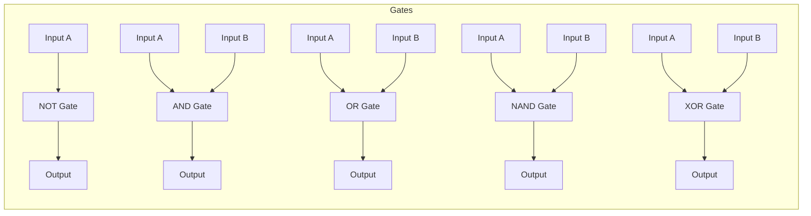
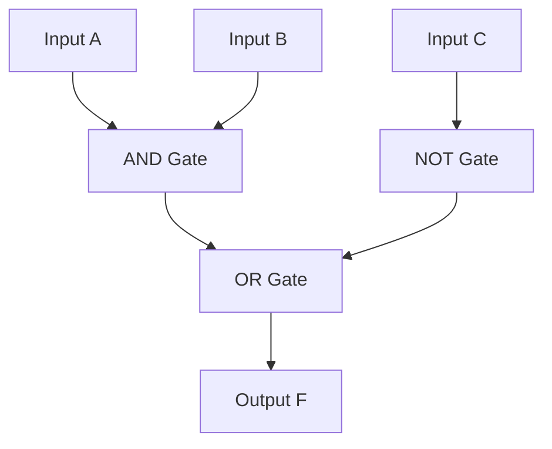

## 1. Introduction to Boolean Algebra

**Boolean Algebra** is a branch of mathematics that deals with binary variables (0 and 1) and logical operations. It was introduced by **George Boole** and is the foundation of digital electronics and computer logic circuits.

- **Variables**: Represented by letters (A, B, C, X, Y, etc.). Each can be either `0` (False) or `1` (True).
- **Operators**: `+` (OR), `·` or no sign (AND), `'` or `¬` (NOT).

---

## 2. Postulates and Laws of Boolean Algebra

These are the fundamental rules used to simplify boolean expressions.

| Law / Postulate                  | AND Form ( · )                                | OR Form ( + )                             |
| :------------------------------- | :-------------------------------------------- | :---------------------------------------- |
| **Identity Law**                 | $A \cdot 1 = A$                               | $A + 0 = A$                               |
| **Null / Dominance Law**         | $A \cdot 0 = 0$                               | $A + 1 = 1$                               |
| **Idempotent Law**               | $A \cdot A = A$                               | $A + A = A$                               |
| **Complement Law**               | $A \cdot A' = 0$                              | $A + A' = 1$                              |
| **Double Negation (Involution)** | $(A')' = A$                                   | $(A')' = A$                               |
| **Commutative Law**              | $A \cdot B = B \cdot A$                       | $A + B = B + A$                           |
| **Associative Law**              | $(A \cdot B) \cdot C = A \cdot (B \cdot C)$   | $(A + B) + C = A + (B + C)$               |
| **Distributive Law**             | $A \cdot (B + C) = (A \cdot B) + (A \cdot C)$ | $A + (B \cdot C) = (A + B) \cdot (A + C)$ |
| **Absorption Law**               | $A \cdot (A + B) = A$                         | $A + (A \cdot B) = A$                     |
| **Absorption Law (Variant)**     | $A \cdot (A' + B) = A \cdot B$                | $A + (A' \cdot B) = A + B$                |

---

## 3. Logic Gates and Truth Tables

Logic gates are the physical building blocks of digital circuits. They implement boolean functions.

| Gate Name                | Symbol Representation | Boolean Expression              | Truth Table (Inputs → Output)                                        |
| :----------------------- | :-------------------- | :------------------------------ | :------------------------------------------------------------------- |
| **NOT** (Inverter)       | Triangle with bubble  | $Y = A'$ or $\overline{A}$      | **A \| Y**   0 \| 1   1 \| 0                                   |
| **AND**                  | D-shaped              | $Y = A \cdot B$                 | **A B \| Y**   0 0 \| 0   0 1 \| 0   1 0 \| 0   1 1 \| 1 |
| **OR**                   | Shield-shaped         | $Y = A + B$                     | **A B \| Y**   0 0 \| 0   0 1 \| 1   1 0 \| 1   1 1 \| 1 |
| **NAND**                 | AND + bubble          | $Y = (A \cdot B)'$              | **A B \| Y**   0 0 \| 1   0 1 \| 1   1 0 \| 1   1 1 \| 0 |
| **NOR**                  | OR + bubble           | $Y = (A + B)'$                  | **A B \| Y**   0 0 \| 1   0 1 \| 0   1 0 \| 0   1 1 \| 0 |
| **XOR** (Exclusive OR)   | OR with extra curve   | $Y = A \oplus B = A'B + AB'$    | **A B \| Y**   0 0 \| 0   0 1 \| 1   1 0 \| 1   1 1 \| 0 |
| **XNOR** (Exclusive NOR) | XOR + bubble          | $Y = (A \oplus B)' = AB + A'B'$ | **A B \| Y**   0 0 \| 1   0 1 \| 0   1 0 \| 0   1 1 \| 1 |

**Mermaid Diagram (Logic Gate Symbols)**:

_(Note: Mermaid draws basic blocks; the actual shapes are standardized in textbooks)._

---

## 4. De Morgan's Theorem

This theorem is essential for simplifying expressions and converting between gate types (e.g., changing AND-OR to NAND-NAND).

- **Theorem 1**: The complement of a **product** is equal to the **sum** of the complements.

  $$(A \cdot B)' = A' + B'$$
  _(NAND = Bubbled OR)_

- **Theorem 2**: The complement of a **sum** is equal to the **product** of the complements.

  $$(A + B)' = A' \cdot B'$$
  _(NOR = Bubbled AND)_

**Generalization for n variables**:

- $(A \cdot B \cdot C ...)' = A' + B' + C' + ...$
- $(A + B + C ...)' = A' \cdot B' \cdot C' ...$

---

## 5. Standard Forms: SOP and POS

### 5.1 Minterms and Maxterms

For a function of _n_ variables:

- **Minterm (m)**: A product term where every variable appears exactly once (either uncomplemented or complemented). It yields `1` for exactly one combination.
- **Maxterm (M)**: A sum term where every variable appears exactly once. It yields `0` for exactly one combination.

| A   | B   | Minterm (m)  | Maxterm (M)     |
| :-- | :-- | :----------- | :-------------- |
| 0   | 0   | $m_0 = A'B'$ | $M_0 = A + B$   |
| 0   | 1   | $m_1 = A'B$  | $M_1 = A + B'$  |
| 1   | 0   | $m_2 = AB'$  | $M_2 = A' + B$  |
| 1   | 1   | $m_3 = AB$   | $M_3 = A' + B'$ |

_(Note: $m_i = M_i'$)_

### 5.2 SOP (Sum of Products)

- **Definition**: A boolean expression where several **product** terms (minterms) are **ORed** together.
- **Canonical SOP**: Sum of all minterms where the output is `1`. Denoted as $\sum m( \text{indices} )$.
- **Example**: If $F$ is 1 for inputs $00$ and $10$, then $F = \sum m(0, 2) = A'B' + AB'$.

### 5.3 POS (Product of Sums)

- **Definition**: A boolean expression where several **sum** terms (maxterms) are **ANDed** together.
- **Canonical POS**: Product of all maxterms where the output is `0`. Denoted as $\prod M( \text{indices} )$.
- **Example**: If $F$ is 0 for inputs $01$ and $11$, then $F = \prod M(1, 3) = (A + B') \cdot (A' + B')$.

> **Conversion Tip**: SOP and POS are duals. If $F = \sum m(0, 2)$, then $F' = \sum m(1, 3)$.

---

## 6. Simplification using Boolean Algebra

**Example**: Simplify $F = A'BC + A'BC' + AB'C' + AB'C$

- Combine $A'BC + A'BC' = A'B(C + C') = A'B$.
- Combine $AB'C' + AB'C = AB'(C' + C) = AB'$.
- Result: $F = A'B + AB'$ which is the **XOR** function $(A \oplus B)$.

**Another Example**: Simplify $F = (A + B)(A + B')$

- Using Distributive law: $F = A + (B \cdot B') = A + 0 = A$.

---

## 7. Simplification using Karnaugh Maps (K-Map)

A K-Map is a graphical method to minimize boolean expressions. It uses the concept of Gray code (adjacent cells differ by 1 bit).

### 7.1 Grouping Rules

1.  Groups must be in powers of 2 (1, 2, 4, 8, 16).
2.  Group must be rectangular (row/column) and can wrap around edges.
3.  Larger groups reduce the expression more.
4.  Every `1` must be covered at least once. Overlapping is allowed.

### 7.2 2-Variable K-Map

| AB \   | 0   | 1   |
| :----- | :-- | :-- |
| **00** | m0  | m1  |
| **10** | m2  | m3  |

_(Grid positions: Row1: A=0, Row2: A=1; Col1: B=0, Col2: B=1)_

### 7.3 3-Variable K-Map

_Order: 00, 01, 11, 10 (Gray Code)_

| AB\C   | 0   | 1   |
| :----- | :-- | :-- |
| **00** | m0  | m1  |
| **01** | m2  | m3  |
| **11** | m6  | m7  |
| **10** | m4  | m5  |

### 7.4 4-Variable K-Map

| AB\CD  | 00  | 01  | 11  | 10  |
| :----- | :-- | :-- | :-- | :-- |
| **00** | m0  | m1  | m3  | m2  |
| **01** | m4  | m5  | m7  | m6  |
| **11** | m12 | m13 | m15 | m14 |
| **10** | m8  | m9  | m11 | m10 |

### 7.5 K-Map Simplification Example

**Problem**: Minimize $F = \sum m(0, 1, 3, 7, 5)$ (3 variables).

1.  Plot 1s at positions 0,1,3,5,7 on the 3-var map.
2.  **Group 1**: m0, m1 (Row 0, Col 0 & 1) → Variables: $A'B'$ + $A'B$ = $A'$ (C cancels out).
3.  **Group 2**: m5, m7 (Row 1 & 3? Actually m5=101, m7=111. Row=10, Col=1 and Row=11, Col=1. Wait, Row=10 and 11 are adjacent? No, in 3-var, rows are 00, 01, 11, 10. Row 10 (A=1,B=0) and Row 11 (A=1,B=1) are adjacent). Group m5(101) and m7(111) → Variables: $A$ is 1, B varies (0 and 1), C is 1 → Removes B → $A C$.
4.  **Group 3**: m1, m3, m5, m7 (A 2x2 square at columns 1, row 0,1,3? Actually m1=001, m3=011, m5=101, m7=111 → This is a quads where A varies, B varies, C=1). Group m1,m3,m5,m7 → $C$.
5.  The optimized expression = **$A' + C$** (since Group 1 gives $A'$, Group 3 gives $C$). Wait, Group 1 was $A'$, Group 3 is $C$. So $F = A' + C$.

_(Double-check: The m0,m1 group cancels B, leaves A'. The m1,m3,m5,m7 group cancels A and B, leaves C)._

---

## 8. Logic Circuit Design

We can convert a simplified boolean expression into a logic gate circuit.

**Example**: Draw the circuit for $F = AB + C'$.

1.  **Term $AB$**: Pass A and B through an **AND** gate.
2.  **Term $C'$**: Pass C through a **NOT** gate.
3.  **Final $F$**: Pass outputs of step 1 and step 2 through an **OR** gate.

**Another Example (SOP to Circuit)**:
For $F = A'B + AB'$ (XOR).

- A goes to NOT (to get A') and AND2.
- B goes to NOT (to get B') and AND1.
- AND1 (A'B), AND2 (AB').
- OR combines both.

## 9. MCQ

#### Q1. Who introduced Boolean Algebra?

A) Alan Turing
B) George Boole ✅
C) Charles Babbage
D) John von Neumann

#### Q2. Boolean Algebra deals with variables that can have how many values?

A) 1
B) 2 ✅
C) 8
D) 10

#### Q3. In Boolean Algebra, the value '1' represents:

A) False
B) True ✅
C) Maybe
D) Undefined

#### Q4. In Boolean Algebra, the value '0' represents:

A) True
B) False ✅
C) Maybe
D) Undefined

#### Q5. Which operator represents the AND operation in Boolean Algebra?

A) +
B) · or no sign ✅
C) '
D) ¬

#### Q6. Which operator represents the OR operation in Boolean Algebra?

A) +
B) · or no sign
C) '
D) ¬

#### Q7. Which operator represents the NOT operation in Boolean Algebra?

A) +
B) ·
C) ' or ¬ ✅
D) ⊕

#### Q8. According to the Identity Law, what is A · 1 equal to?

A) 0
B) A ✅
C) 1
D) A'

#### Q9. According to the Identity Law, what is A + 0 equal to?

A) 0
B) 1
C) A ✅
D) A'

#### Q10. According to the Null or Dominance Law, what is A · 0 equal to?

A) 0 ✅
B) 1
C) A
D) A'

#### Q11. According to the Null or Dominance Law, what is A + 1 equal to?

A) 0
B) 1 ✅
C) A
D) A'

#### Q12. According to the Idempotent Law, what is A · A equal to?

A) 0
B) 1
C) A ✅
D) A'

#### Q13. According to the Idempotent Law, what is A + A equal to?

A) 0
B) 1
C) A ✅
D) A'

#### Q14. According to the Complement Law, what is A · A' equal to?

A) 0 ✅
B) 1
C) A
D) A'

#### Q15. According to the Complement Law, what is A + A' equal to?

A) 0
B) 1 ✅
C) A
D) A'

#### Q16. What is the Double Negation (Involution) Law?

A) (A')' = A ✅
B) (A')' = A'
C) (A')' = 1
D) (A')' = 0

#### Q17. The Commutative Law for AND states that:

A) A · B = B · A ✅
B) A · B = B + A
C) A · B = A + B
D) A · B = A · B'

#### Q18. The Commutative Law for OR states that:

A) A + B = B · A
B) A + B = B + A ✅
C) A + B = B'
D) A + B = A · B

#### Q19. According to the Associative Law, (A · B) · C equals:

A) A · (B + C)
B) A · (B · C) ✅
C) A + (B · C)
D) (A + B) · C

#### Q20. According to the Associative Law, (A + B) + C equals:

A) A + (B + C) ✅
B) A + (B · C)
C) A · (B + C)
D) (A · B) + C

#### Q21. The Distributive Law states that A · (B + C) equals:

A) (A · B) + C
B) (A + B) · (A + C)
C) (A · B) + (A · C) ✅
D) A + (B · C)

#### Q22. The Distributive Law states that A + (B · C) equals:

A) (A + B) · (A + C) ✅
B) (A · B) + (A · C)
C) (A + B) + C
D) A · B + A · C

#### Q23. According to the Absorption Law, what is A · (A + B) equal to?

A) A ✅
B) B
C) A · B
D) A + B

#### Q24. According to the Absorption Law, what is A + (A · B) equal to?

A) A ✅
B) B
C) A · B
D) A + B

#### Q25. According to Absorption Law (Variant), A · (A' + B) equals:

A) A
B) B
C) A · B ✅
D) A + B

#### Q26. According to Absorption Law (Variant), A + (A' · B) equals:

A) A
B) B
C) A · B
D) A + B ✅

#### Q27. The NOT gate is also called:

A) Inverter ✅
B) Amplifier
C) Buffer
D) Adder

#### Q28. The Boolean expression for the AND gate is:

A) Y = A + B
B) Y = A · B ✅
C) Y = (A · B)'
D) Y = A ⊕ B

#### Q29. The Boolean expression for the OR gate is:

A) Y = A · B
B) Y = A + B ✅
C) Y = (A + B)'
D) Y = A ⊕ B

#### Q30. The NAND gate is an AND gate followed by a:

A) AND gate
B) OR gate
C) NOT gate ✅
D) XOR gate

#### Q31. The Boolean expression for the NAND gate is:

A) Y = A · B
B) Y = A + B
C) Y = (A · B)' ✅
D) Y = (A + B)'

#### Q32. The NOR gate is an OR gate followed by a:

A) AND gate
B) OR gate
C) NOT gate ✅
D) XNOR gate

#### Q33. The Boolean expression for the NOR gate is:

A) Y = A · B
B) Y = A + B
C) Y = (A · B)'
D) Y = (A + B)' ✅

#### Q34. The Boolean expression for the XOR gate is:

A) Y = A + B
B) Y = A · B
C) Y = A'B + AB' ✅
D) Y = AB + A'B'

#### Q35. The XOR gate outputs 1 when:

A) Both inputs are 0
B) Both inputs are 1
C) Inputs are different ✅
D) Inputs are same

#### Q36. The Boolean expression for the XNOR gate is:

A) Y = A'B + AB'
B) Y = AB + A'B' ✅
C) Y = A + B
D) Y = (A · B)'

#### Q37. The XNOR gate outputs 1 when:

A) Both inputs are 0
B) Both inputs are 1
C) Inputs are same ✅
D) Inputs are different

#### Q38. What is the output of an AND gate when A=1 and B=1?

A) 0
B) 1 ✅
C) Invalid
D) Don't Care

#### Q39. What is the output of an OR gate when A=0 and B=0?

A) 0 ✅
B) 1
C) Invalid
D) Don't Care

#### Q40. What is the output of a NAND gate when A=1 and B=1?

A) 0 ✅
B) 1
C) Invalid
D) Don't Care

#### Q41. What is the output of a NOR gate when A=0 and B=0?

A) 0
B) 1 ✅
C) Invalid
D) Don't Care

#### Q42. What is the output of an XOR gate when A=1 and B=1?

A) 0 ✅
B) 1
C) Invalid
D) Don't Care

#### Q43. What is the output of an XNOR gate when A=1 and B=1?

A) 0
B) 1 ✅
C) Invalid
D) Don't Care

#### Q44. De Morgan's Theorem 1 states that (A · B)' equals:

A) A' + B' ✅
B) A' · B'
C) A + B
D) A · B

#### Q45. De Morgan's Theorem 2 states that (A + B)' equals:

A) A' + B'
B) A' · B' ✅
C) A + B
D) A · B

#### Q46. According to De Morgan's Theorem, NAND gate is equivalent to:

A) Bubbled AND
B) Bubbled OR ✅
C) Bubbled NOR
D) Bubbled XOR

#### Q47. According to De Morgan's Theorem, NOR gate is equivalent to:

A) Bubbled AND ✅
B) Bubbled OR
C) Bubbled NAND
D) Bubbled XOR

#### Q48. The generalization of De Morgan's Theorem for n variables states that (A · B · C ...)' equals:

A) A' + B' + C' + ... ✅
B) A' · B' · C' · ...
C) A + B + C + ...
D) A · B · C · ...

#### Q49. The generalization of De Morgan's Theorem for n variables states that (A + B + C ...)' equals:

A) A' + B' + C' + ...
B) A' · B' · C' · ... ✅
C) A + B + C + ...
D) A · B · C · ...

#### Q50. A minterm is a product term where every variable appears exactly once. It yields:

A) 0 for exactly one combination
B) 1 for exactly one combination ✅
C) 0 for all combinations
D) 1 for all combinations

#### Q51. A maxterm is a sum term where every variable appears exactly once. It yields:

A) 0 for exactly one combination ✅
B) 1 for exactly one combination
C) 0 for all combinations
D) 1 for all combinations

#### Q52. For two variables A and B, the minterm m0 is:

A) A'B'
B) A'B
C) AB'
D) AB ✅

#### Q53. For two variables A and B, the minterm m1 is:

A) A'B'
B) A'B ✅
C) AB'
D) AB

#### Q54. For two variables A and B, the maxterm M0 is:

A) A + B ✅
B) A + B'
C) A' + B
D) A' + B'

#### Q55. For two variables A and B, the maxterm M3 is:

A) A + B
B) A + B'
C) A' + B
D) A' + B' ✅

#### Q56. The relationship between a minterm and maxterm with the same index is:

A) mi = Mi
B) mi = Mi' ✅
C) mi = 1 + Mi
D) mi = 0 · Mi

#### Q57. SOP stands for:

A) Sum of Products ✅
B) Sum of Positives
C) Standard of Products
D) System of Products

#### Q58. In canonical SOP, product terms (minterms) are:

A) ANDed together
B) ORed together ✅
C) XORed together
D) NOTed together

#### Q59. In canonical SOP, the expression includes:

A) All minterms where output is 0
B) All minterms where output is 1 ✅
C) Only minterms with don't cares
D) Only the first minterm

#### Q60. Canonical SOP is denoted as:

A) ∑ m(indices) ✅
B) ∏ m(indices)
C) ∑ M(indices)
D) ∏ M(indices)

#### Q61. POS stands for:

A) Product of Sums ✅
B) Product of Systems
C) Power of Sums
D) Positive of Sums

#### Q62. In canonical POS, sum terms (maxterms) are:

A) ANDed together ✅
B) ORed together
C) XORed together
D) NOTed together

#### Q63. In canonical POS, the expression includes:

A) All maxterms where output is 1
B) All maxterms where output is 0 ✅
C) Only maxterms with don't cares
D) Only the first maxterm

#### Q64. Canonical POS is denoted as:

A) ∑ m(indices)
B) ∏ m(indices)
C) ∑ M(indices)
D) ∏ M(indices) ✅

#### Q65. If F = ∑ m(0, 2), then F' equals:

A) ∑ m(0, 2)
B) ∑ m(1, 3) ✅
C) ∏ m(0, 2)
D) ∏ m(1, 3)

#### Q66. Simplify: F = A'BC + A'BC' + AB'C' + AB'C

A) A + B
B) A'B + AB' ✅
C) AB + A'B'
D) A ⊕ B'

#### Q67. Simplify: F = (A + B)(A + B')

A) A ✅
B) B
C) 1
D) 0

#### Q68. Simplify: F = A + A'B

A) A
B) B
C) A + B ✅
D) A · B

#### Q69. Simplify: F = A(A' + B)

A) A
B) B
C) A · B ✅
D) A + B

#### Q70. Simplify: F = AB + AB'

A) A ✅
B) B
C) 1
D) 0

#### Q71. A K-Map is a graphical method to:

A) Convert binary to decimal
B) Minimize boolean expressions ✅
C) Generate truth tables
D) Design circuits

#### Q72. K-Map uses the concept of:

A) Binary code
B) Gray code ✅
C) ASCII code
D) BCD code

#### Q73. In a K-Map, adjacent cells differ by:

A) 2 bits
B) 1 bit ✅
C) 0 bits
D) 3 bits

#### Q74. In K-Map simplification, groups must be in powers of:

A) 2 ✅
B) 3
C) 4
D) 8

#### Q75. In K-Map, valid group sizes include:

A) 1, 2, 4, 8 ✅
B) 1, 3, 5, 7
C) 2, 4, 6, 8
D) 1, 2, 3, 4

#### Q76. In a 2-variable K-Map, how many cells are there?

A) 2
B) 4 ✅
C) 8
D) 16

#### Q77. In a 3-variable K-Map, how many cells are there?

A) 4
B) 8 ✅
C) 16
D) 32

#### Q78. In a 4-variable K-Map, how many cells are there?

A) 4
B) 8
C) 16 ✅
D) 32

#### Q79. In K-Map, the order of rows/columns follows:

A) Binary sequence (00, 01, 10, 11)
B) Gray code sequence (00, 01, 11, 10) ✅
C) Random sequence
D) Octal sequence

#### Q80. In K-Map, larger groups reduce the expression:

A) Less
B) More ✅
C) Not at all
D) By adding terms

#### Q81. In K-Map, every '1' must be covered at least once. Overlapping is:

A) Allowed ✅
B) Not allowed
C) Mandatory
D) Optional

#### Q82. In a 3-variable K-Map, what is the simplified expression for a group of 4 cells?

A) A single variable ✅
B) Two variables
C) Three variables
D) A constant

#### Q83. In a 4-variable K-Map, what is the simplified expression for a group of 8 cells?

A) A single variable ✅
B) Two variables
C) Three variables
D) Four variables

#### Q84. Simplify using K-Map: F = ∑ m(0, 1, 3, 7, 5) for 3 variables

A) A'B + C
B) A' + C ✅
C) A + C'
D) B' + C

#### Q85. In a K-Map, a group of 2 cells eliminates how many variables?

A) 0
B) 1 ✅
C) 2
D) 3

#### Q86. In a K-Map, a group of 4 cells eliminates how many variables?

A) 0
B) 1
C) 2 ✅
D) 3

#### Q87. In a K-Map, a group of 8 cells eliminates how many variables?

A) 1
B) 2
C) 3 ✅
D) 4

#### Q88. K-Map cells can wrap around:

A) Only horizontally
B) Only vertically
C) Both horizontally and vertically ✅
D) Diagonally

#### Q89. The logic circuit for F = AB + C' requires:

A) AND, NOT, OR gates ✅
B) AND, OR, NAND gates
C) OR, NOT, NOR gates
D) Only AND gates

#### Q90. The expression F = A'B + AB' is the:

A) AND function
B) OR function
C) XOR function ✅
D) XNOR function

#### Q91. The expression F = AB + A'B' is the:

A) AND function
B) OR function
C) XOR function
D) XNOR function ✅

#### Q92. Which gate is known as a "universal gate"?

A) AND and OR
B) NAND and NOR ✅
C) XOR and XNOR
D) NOT only

#### Q93. Which of the following is NOT a basic logic gate?

A) AND
B) OR
C) NOT
D) XOR (it's derived) ✅

#### Q94. SOP expressions are implemented using:

A) AND-OR logic ✅
B) OR-AND logic
C) NAND-NAND logic
D) NOR-NOR logic

#### Q95. POS expressions are implemented using:

A) AND-OR logic
B) OR-AND logic ✅
C) NAND-NAND logic
D) NOR-NOR logic

#### Q96. In a 2-variable K-Map, if F = ∑ m(0, 3), what is the simplified expression?

A) A
B) B
C) A ⊕ B ✅
D) A' + B'

#### Q97. In a 3-variable K-Map, a group of 2 cells eliminates:

A) 1 variable ✅
B) 2 variables
C) 3 variables
D) 0 variables

#### Q98. Which Boolean law states that A + 0 = A?

A) Null Law
B) Identity Law ✅
C) Complement Law
D) Idempotent Law

#### Q99. Which Boolean law states that A · A' = 0?

A) Null Law
B) Identity Law
C) Complement Law ✅
D) Idempotent Law

#### Q100. De Morgan's Theorem is used to:

A) Add binary numbers
B) Simplify expressions and convert between gate types ✅
C) Convert decimal to binary
D) Multiply binary numbers
