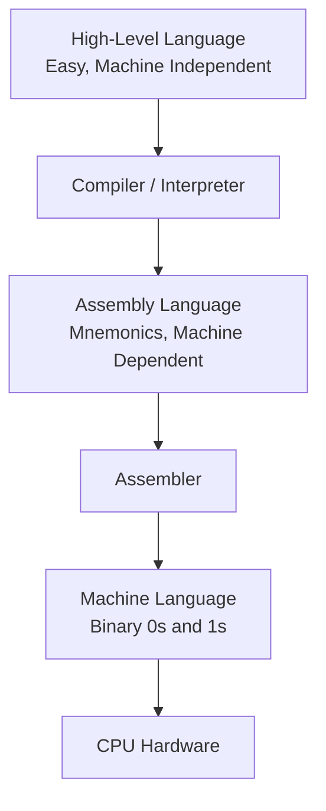
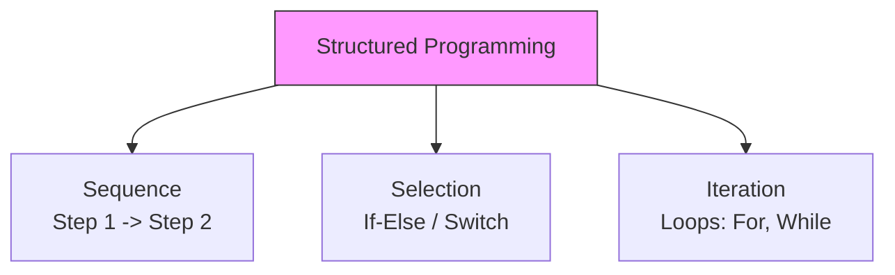

## 1. Introduction to Programming

**Programming** is the process of creating a set of instructions that tell a computer how to perform a specific task. It involves writing code in a programming language, which is then translated into machine-readable form.

---

## 2. Instruction

### Definition

An **instruction** is a single, basic command given to a computer's processor to perform a specific operation (like arithmetic, data movement, or control flow).

### Characteristics

- It consists of an **Opcode** (Operation Code – what to do) and an **Operand** (data/address – on what to do it).
- Instructions are executed sequentially unless a jump/branch instruction changes the flow.

### Examples

| Type          | Example (Assembly) | Meaning                                        |
| :------------ | :----------------- | :--------------------------------------------- |
| Data Transfer | `MOV A, 5`         | Move the value `5` into register `A`.          |
| Arithmetic    | `ADD B`            | Add the value in register `B` to register `A`. |
| Logical       | `AND C`            | Perform bitwise AND between `A` and `C`.       |
| Control       | `JUMP 100`         | Jump to instruction at memory address `100`.   |

---

## 3. Program

### Definition

A **program** is a collection of instructions written in a specific sequence to accomplish a particular task or solve a problem. It is the final output of programming.

### Example

A simple program in **C** (High-Level) to add two numbers:

```c
#include <stdio.h>
int main() {
    int a = 5, b = 10, sum;
    sum = a + b;       // Instruction 1
    printf("%d", sum); // Instruction 2
    return 0;
}
```

In **Assembly** (Low-Level) for the same task:

```assembly
MOV R1, #5     ; Move 5 into R1
MOV R2, #10    ; Move 10 into R2
ADD R3, R1, R2 ; Add R1 and R2, store in R3
```

---

## 4. Programming Languages

Based on their level of abstraction from hardware, languages are classified as:

| Feature         | Machine Language (1GL)        | Assembly Language (2GL)    | High-Level Language (3GL/4GL)               |
| :-------------- | :---------------------------- | :------------------------- | :------------------------------------------ |
| **Level**       | Lowest                        | Middle (Low-Level)         | High-Level                                  |
| **Format**      | Binary (0s and 1s)            | Mnemonics (e.g., MOV, ADD) | Natural Language-like (e.g., English words) |
| **Translation** | Executed directly by CPU.     | Needs an **Assembler**.    | Needs a **Compiler** or **Interpreter**.    |
| **Readability** | Almost impossible for humans. | Hard (machine-dependent).  | Easy (machine-independent).                 |
| **Examples**    | `10110000 01100001`           | `MOV AL, 61h`              | Python, C, Java, C++                        |

### Key Concepts

- **Low-Level Language**:
  - Closer to hardware. Faster execution, but complex to write.
  - Includes **Machine Language** (binary) and **Assembly Language**.

- **Assembly Language**:
  - Uses short mnemonic codes for machine instructions (e.g., `ADD`, `SUB`, `MOV`).
  - **Assembler**: A system software that translates assembly code into machine code.
  - It is machine-dependent (specific to a CPU architecture).

- **High-Level Language**:
  - Designed to be understood by humans. Uses variables, functions, loops, etc.
  - Platform independent (can run on different OS with proper compiler/interpreter).
  - **Examples**: Python (interpreter), C (compiler), Java (both compiler + JVM).

**Visualizing the Language Abstraction**:



---

## 5. Programming Paradigms

### 5.1 Procedural vs Non-Procedural Programming

| Aspect           | Procedural Programming                                     | Non-Procedural Programming                                             |
| :--------------- | :--------------------------------------------------------- | :--------------------------------------------------------------------- |
| **Also Called**  | Imperative Programming                                     | Declarative Programming                                                |
| **Focus**        | **How** to achieve the result (step-by-step instructions). | **What** result is required (logic and constraints).                   |
| **Approach**     | Tells the computer to perform a sequence of steps.         | Tells the computer what the outcome should be.                         |
| **Control Flow** | Explicit (loops, conditionals, function calls).            | Implicit (queries, rules).                                             |
| **Examples**     | C, Pascal, Fortran, Basic.                                 | SQL (Structured Query Language), Prolog, HTML (declarative structure). |

**Example**:

- **Procedural (C)**: Write a loop to calculate the sum of all numbers in a list.
- **Non-Procedural (SQL)**: `SELECT SUM(salary) FROM employees WHERE department = 'IT';`  
  *(Here, you specify *what* data to fetch, not *how* the database should find it).*

---

### 5.2 Structured Programming

**Concept**: A subset of procedural programming that imposes **discipline** on the use of control flow.

- **Goal**: Improve clarity, quality, and development time by using only specific control structures.
- **Key Elements**:
  1. **Sequence**: Instructions executed one after another.
  2. **Selection**: Conditional branching (if-else, switch-case).
  3. **Iteration**: Loops (for, while, do-while).

- **Golden Rule**: Strictly **avoid the `goto` statement** (unconditional jumps). This prevents "spaghetti code" (chaotic, hard-to-follow logic).
- **Modularity**: Programs are divided into smaller, reusable functions or procedures.

**Visualizing Structured Programming**:



---

### 5.3 Object Oriented Programming (OOP)

**Concept**: A paradigm based on **objects** that contain **data** (attributes) and **code** (methods). It models real-world entities.

| Fundamental Concept | Definition                                                                                                                               |
| :------------------ | :--------------------------------------------------------------------------------------------------------------------------------------- |
| **Class**           | A blueprint or template for creating objects. (e.g., `Car`).                                                                             |
| **Object**          | An instance of a class (e.g., `myCar` is a specific Car).                                                                                |
| **Encapsulation**   | Binding data and methods together; hiding internal details from the outside world (using access specifiers like private/public).         |
| **Inheritance**     | A new class (child) can inherit properties and methods from an existing class (parent). Promotes code reusability.                       |
| **Polymorphism**    | "Many forms". The same function name can behave differently in different contexts (e.g., `draw()` for a Circle vs Square).               |
| **Abstraction**     | Showing only essential features and hiding background details (e.g., using a car's steering wheel without knowing the engine mechanics). |

- **Examples of OOP Languages**: Java, C++, Python, C#.

**OOP vs Procedural Comparison**:

| Feature         | Procedural / Structured                     | Object Oriented                                      |
| :-------------- | :------------------------------------------ | :--------------------------------------------------- |
| **Data**        | Data is separate from functions.            | Data and functions are combined into objects.        |
| **Security**    | Low (data can be easily accessed globally). | High (encapsulation protects data).                  |
| **Reusability** | Moderate (functions).                       | High (inheritance and polymorphism).                 |
| **Complexity**  | Suitable for small/medium problems.         | Best for large, complex, and real-world simulations. |

## 6. MCQ

#### Q1. What is programming?

A) The process of creating hardware components
B) The process of creating a set of instructions to tell a computer how to perform a specific task ✅
C) The process of assembling computer parts
D) The process of designing computer networks

#### Q2. An instruction consists of which two parts?

A) Opcode and Operand ✅
B) Source and Destination
C) Input and Output
D) Register and Memory

#### Q3. The Opcode in an instruction specifies:

A) What to do ✅
B) On what to do it
C) Where to store the result
D) When to execute

#### Q4. The Operand in an instruction specifies:

A) The operation to perform
B) The data or address on which the operation is performed ✅
C) The next instruction to execute
D) The type of instruction

#### Q5. Which of the following is an example of a Data Transfer instruction in Assembly?

A) ADD B
B) AND C
C) MOV A, 5 ✅
D) JUMP 100

#### Q6. Which type of instruction changes the normal sequential flow of execution?

A) Arithmetic instructions
B) Logical instructions
C) Control instructions ✅
D) Data transfer instructions

#### Q7. A program is defined as:

A) A single instruction
B) A collection of instructions written in a specific sequence to accomplish a task ✅
C) A hardware component
D) An operating system

#### Q8. In the C program example provided, the instruction `sum = a + b;` is an example of:

A) Data transfer
B) Arithmetic operation ✅
C) Control flow
D) Logical operation

#### Q9. Machine Language instructions are written in:

A) Mnemonics
B) Binary (0s and 1s) ✅
C) English words
D) Decimal numbers

#### Q10. Which language is executed directly by the CPU without any translation?

A) Assembly Language
B) High-Level Language
C) Machine Language ✅
D) Python

#### Q11. Assembly Language uses:

A) Binary codes
B) Mnemonics like MOV, ADD ✅
C) Natural English sentences
D) Machine code

#### Q12. The system software that translates assembly language into machine code is called:

A) Compiler
B) Interpreter
C) Assembler ✅
D) Loader

#### Q13. Which language is machine-dependent?

A) Python
B) Java
C) Assembly Language ✅
D) C

#### Q14. High-Level Languages are designed to be:

A) Understood by humans and machine-independent ✅
B) Understood only by machines
C) Dependent on specific CPU
D) Written in binary

#### Q15. Which of the following is NOT an example of a High-Level Language?

A) Python
B) C
C) Assembly Language ✅
D) Java

#### Q16. A program written in a High-Level Language needs a:

A) Assembler only
B) Compiler or Interpreter ✅
C) Loader only
D) Linker only

#### Q17. According to the abstraction diagram, the correct order from High-Level to Machine Language is:

A) High-Level → Assembler → Assembly → Compiler → Machine
B) High-Level → Compiler → Assembly → Assembler → Machine ✅
C) High-Level → Interpreter → Machine → Assembly
D) High-Level → Assembly → Compiler → Machine

#### Q18. Which programming language is considered the lowest level?

A) Assembly
B) C
C) Machine Language ✅
D) Python

#### Q19. Which level of language is closest to hardware?

A) High-Level
B) Low-Level ✅
C) Middle-Level
D) All are equal

#### Q20. Which of the following is TRUE about Assembly Language?

A) It is machine-independent
B) It uses mnemonics and is machine-dependent ✅
C) It is executed directly by the CPU
D) It is the same as High-Level Language

#### Q21. Procedural Programming is also called:

A) Declarative Programming
B) Imperative Programming ✅
C) Object-Oriented Programming
D) Functional Programming

#### Q22. Non-Procedural Programming is also called:

A) Imperative Programming
B) Declarative Programming ✅
C) Structured Programming
D) Procedural Programming

#### Q23. Which paradigm focuses on _how_ to achieve the result?

A) Non-Procedural
B) Declarative
C) Procedural ✅
D) Object-Oriented

#### Q24. Which paradigm focuses on _what_ result is required?

A) Procedural
B) Imperative
C) Non-Procedural ✅
D) Structured

#### Q25. Which of the following is an example of a Non-Procedural language?

A) C
B) Pascal
C) SQL ✅
D) Fortran

#### Q26. Which of the following is an example of a Procedural language?

A) SQL
B) Prolog
C) C ✅
D) HTML

#### Q27. In Non-Procedural programming, control flow is:

A) Explicit
B) Implicit ✅
C) Always sequential
D) Managed by the programmer

#### Q28. The SQL query `SELECT SUM(salary) FROM employees WHERE department = 'IT';` is an example of:

A) Procedural approach
B) Non-Procedural (declarative) approach ✅
C) Assembly language
D) Machine code

#### Q29. Structured Programming is a subset of:

A) Non-Procedural Programming
B) Object-Oriented Programming
C) Procedural Programming ✅
D) Declarative Programming

#### Q30. The goal of Structured Programming is to:

A) Use `goto` statements freely
B) Improve clarity, quality, and development time by using specific control structures ✅
C) Eliminate all loops
D) Make code machine-dependent

#### Q31. Which of the following is a key element of Structured Programming?

A) Goto statements
B) Sequence, Selection, Iteration ✅
C) Objects and classes
D) Inheritance

#### Q32. In Structured Programming, the golden rule is to:

A) Use as many `goto` statements as possible
B) Avoid the `goto` statement ✅
C) Never use functions
D) Use only global variables

#### Q33. The use of `goto` leads to:

A) Modular code
B) Spaghetti code ✅
C) Structured code
D) Object-oriented code

#### Q34. Sequence in Structured Programming means:

A) Instructions are executed in random order
B) Instructions are executed one after another ✅
C) Instructions are skipped
D) Instructions are repeated

#### Q35. Selection in Structured Programming includes:

A) Loops (for, while)
B) Conditional branching (if-else, switch-case) ✅
C) Function calls
D) Jump instructions

#### Q36. Iteration in Structured Programming includes:

A) If-else
B) Loops (for, while) ✅
C) Switch-case
D) Goto

#### Q37. Modularity in Structured Programming refers to:

A) Writing the entire program in one block
B) Dividing the program into smaller, reusable functions or procedures ✅
C) Using only global variables
D) Avoiding functions

#### Q38. Object-Oriented Programming (OOP) is based on:

A) Functions and procedures
B) Objects containing data and methods ✅
C) SQL queries
D) Binary code

#### Q39. A Class in OOP is:

A) An instance of an object
B) A blueprint or template for creating objects ✅
C) A variable
D) A loop

#### Q40. An Object in OOP is:

A) A class definition
B) An instance of a class ✅
C) A function
D) A data type

#### Q41. Which OOP concept binds data and methods together and hides internal details?

A) Inheritance
B) Polymorphism
C) Encapsulation ✅
D) Abstraction

#### Q42. Encapsulation is achieved using:

A) Public variables only
B) Access specifiers like private/public ✅
C) Global functions
D) Goto statements

#### Q43. Inheritance in OOP allows:

A) A class to have multiple copies
B) A new class to inherit properties from an existing class ✅
C) One function to have many names
D) Data to be hidden

#### Q44. Inheritance promotes:

A) Code duplication
B) Code reusability ✅
C) Spaghetti code
D) Hard-to-read code

#### Q45. Polymorphism means:

A) One class inherits from another
B) Many forms; the same function name can behave differently in different contexts ✅
C) Data and methods are combined
D) Showing only essential features

#### Q46. An example of polymorphism is:

A) `Car` and `myCar`
B) `draw()` function for Circle vs Square ✅
C) Private variables
D) For loop

#### Q47. Abstraction in OOP means:

A) Hiding background details and showing only essential features ✅
B) Inheriting from a parent class
C) Having multiple forms of a function
D) Combining data and methods

#### Q48. Using a car's steering wheel without knowing the engine mechanics is an example of:

A) Encapsulation
B) Inheritance
C) Polymorphism
D) Abstraction ✅

#### Q49. Which of the following is an OOP language?

A) C
B) Pascal
C) Java ✅
D) Fortran

#### Q50. Which OOP concept is primarily about data security?

A) Abstraction
B) Inheritance
C) Polymorphism
D) Encapsulation ✅

#### Q51. In Procedural Programming, data is:

A) Combined with functions
B) Separate from functions ✅
C) Hidden from functions
D) Encapsulated inside objects

#### Q52. In OOP, data and functions are:

A) Separate
B) Combined into objects ✅
C) Stored in global memory
D) Not related

#### Q53. Which paradigm has higher security due to encapsulation?

A) Procedural
B) Structured
C) Object-Oriented ✅
D) Non-Procedural

#### Q54. Which paradigm is best for large, complex, real-world simulations?

A) Procedural
B) Structured
C) Non-Procedural
D) Object-Oriented ✅

#### Q55. Which paradigm is suitable for small to medium problems?

A) Object-Oriented
B) Procedural/Structured ✅
C) Declarative
D) Functional

#### Q56. In the language abstraction hierarchy, the assembler converts:

A) High-Level to Machine
B) Assembly to Machine ✅
C) Machine to Assembly
D) High-Level to Assembly

#### Q57. A High-Level Language program is typically:

A) Platform dependent
B) Platform independent ✅
C) Written in binary
D) Executed directly

#### Q58. Which of the following is a characteristic of Machine Language?

A) Easy to understand for humans
B) Machine-independent
C) Executed directly by the CPU ✅
D) Uses mnemonics

#### Q59. Which of the following is NOT a characteristic of High-Level Languages?

A) Human-readable
B) Machine-independent
C) Uses variables and functions
D) Needs an assembler for translation ✅

#### Q60. Which of the following is TRUE about Low-Level Languages?

A) They are easy to write
B) They are machine-independent
C) They have faster execution ✅
D) They are not used anymore

#### Q61. The instruction `ADD B` in Assembly is an example of:

A) Data Transfer
B) Arithmetic ✅
C) Logical
D) Control

#### Q62. The instruction `AND C` in Assembly is an example of:

A) Data Transfer
B) Arithmetic
C) Logical ✅
D) Control

#### Q63. The instruction `JUMP 100` in Assembly is an example of:

A) Data Transfer
B) Arithmetic
C) Logical
D) Control ✅

#### Q64. In the C program example, `printf("%d", sum);` is a:

A) Data transfer instruction
B) Arithmetic instruction
C) Function call (part of program) ✅
D) Jump instruction

#### Q65. A program in C is an example of a:

A) Low-Level Language
B) High-Level Language ✅
C) Machine Language
D) Assembly Language

#### Q66. Which of the following correctly represents an Assembly instruction?

A) `10110000 01100001`
B) `MOV AL, 61h` ✅
C) `sum = a + b;`
D) `SELECT * FROM table`

#### Q67. Which of the following correctly represents a Machine Language instruction?

A) `MOV R1, #5`
B) `a = 5;`
C) `10110000 01100001` ✅
D) `ADD R3, R1, R2`

#### Q68. In the abstraction diagram, what does the compiler/interpreter convert?

A) Machine to Assembly
B) High-Level to Assembly ✅
C) Assembly to High-Level
D) Machine to High-Level

#### Q69. SQL is an example of which paradigm?

A) Procedural
B) Object-Oriented
C) Non-Procedural ✅
D) Structured

#### Q70. Prolog is an example of:

A) Procedural
B) Non-Procedural ✅
C) Structured
D) OOP

#### Q71. HTML is considered a:

A) Procedural language
B) Declarative (non-procedural) structure ✅
C) Object-Oriented language
D) Low-Level language

#### Q72. Which of the following is NOT a key element of Structured Programming?

A) Sequence
B) Selection
C) Iteration
D) Inheritance ✅

#### Q73. The `if-else` statement in C represents which structured programming element?

A) Sequence
B) Selection ✅
C) Iteration
D) Jump

#### Q74. The `for` loop in C represents which structured programming element?

A) Sequence
B) Selection
C) Iteration ✅
D) Goto

#### Q75. Which of the following is an advantage of Structured Programming?

A) Code is chaotic
B) Code is easy to follow and maintain ✅
C) It uses many `goto` statements
D) It is machine-dependent

#### Q76. In OOP, a `Car` class and `myCar` object relationship illustrates:

A) Encapsulation
B) Class and Object ✅
C) Polymorphism
D) Abstraction

#### Q77. Which OOP concept allows a `Vehicle` class to be extended by a `Car` class?

A) Encapsulation
B) Inheritance ✅
C) Polymorphism
D) Abstraction

#### Q78. Which OOP concept allows the same method name `calculate()` to work differently for `Circle` and `Rectangle`?

A) Encapsulation
B) Inheritance
C) Polymorphism ✅
D) Abstraction

#### Q79. In OOP, hiding data inside a class and providing public methods to access it is:

A) Abstraction
B) Inheritance
C) Polymorphism
D) Encapsulation ✅

#### Q80. In OOP, exposing only necessary features and hiding implementation details is:

A) Encapsulation
B) Inheritance
C) Polymorphism
D) Abstraction ✅

#### Q81. Which of the following is NOT an OOP language?

A) Java
B) C++
C) C#
D) Fortran ✅

#### Q82. Which paradigm allows code reuse through inheritance?

A) Procedural
B) Structured
C) Object-Oriented ✅
D) Non-Procedural

#### Q83. Which paradigm models real-world entities?

A) Procedural
B) Object-Oriented ✅
C) Structured
D) Non-Procedural

#### Q84. In Procedural Programming, functions are:

A) Associated with data
B) Separate from data ✅
C) Hidden
D) Not used

#### Q85. Which of the following is TRUE about Non-Procedural languages?

A) They require step-by-step instructions
B) They specify the outcome rather than the procedure ✅
C) They use explicit loops and conditionals
D) They are also called Imperative

#### Q86. Which paradigm uses queries and rules rather than step-by-step instructions?

A) Procedural
B) Structured
C) Object-Oriented
D) Non-Procedural ✅

#### Q87. The process of writing code in a programming language is called:

A) Compiling
B) Interpreting
C) Programming ✅
D) Assembling

#### Q88. Which of the following is the correct sequence for converting a High-Level program to execution?

A) Source → Interpreter → Execute
B) Source → Compiler → Object → Linker → Executable → Loader → Execute ✅
C) Source → Assembler → Object → Execute
D) Source → Compiler → Execute (no linking)

#### Q89. Which component translates assembly mnemonics to machine code?

A) Compiler
B) Interpreter
C) Assembler ✅
D) Loader

#### Q90. Which of the following is NOT an example of a High-Level Language?

A) C
B) Java
C) Assembly ✅
D) Python

#### Q91. The control instruction `JUMP 100` causes the CPU to:

A) Add 100 to a register
B) Move 100 to memory
C) Jump to instruction at memory address 100 ✅
D) Compare 100 with a value

#### Q92. In structured programming, avoiding `goto` helps to:

A) Increase execution speed
B) Reduce "spaghetti code" ✅
C) Use more memory
D) Make code machine-dependent

#### Q93. Which of the following is TRUE about High-Level Languages?

A) They are machine-dependent
B) They are harder to read than assembly
C) They are platform independent ✅
D) They are executed directly by CPU

#### Q94. Which paradigm is also called Imperative Programming?

A) Declarative
B) Procedural ✅
C) Object-Oriented
D) Functional

#### Q95. Which paradigm is also called Declarative Programming?

A) Procedural
B) Structured
C) Non-Procedural ✅
D) Object-Oriented

#### Q96. The OOP concept that allows a child class to inherit from a parent class is:

A) Encapsulation
B) Inheritance ✅
C) Polymorphism
D) Abstraction

#### Q97. The OOP concept that allows one name to have multiple implementations is:

A) Encapsulation
B) Inheritance
C) Polymorphism ✅
D) Abstraction

#### Q98. Which of the following is an advantage of OOP over Procedural Programming?

A) Simpler for small problems
B) Higher security and reusability ✅
C) Faster execution
D) Requires less memory

#### Q99. In the abstraction diagram, the final output of the assembler is:

A) Assembly code
B) Machine code ✅
C) High-level code
D) Executable file

#### Q100. Which of the following best describes a program?

A) A single binary instruction
B) A set of instructions to accomplish a task ✅
C) A hardware component
D) An algorithm without implementation
