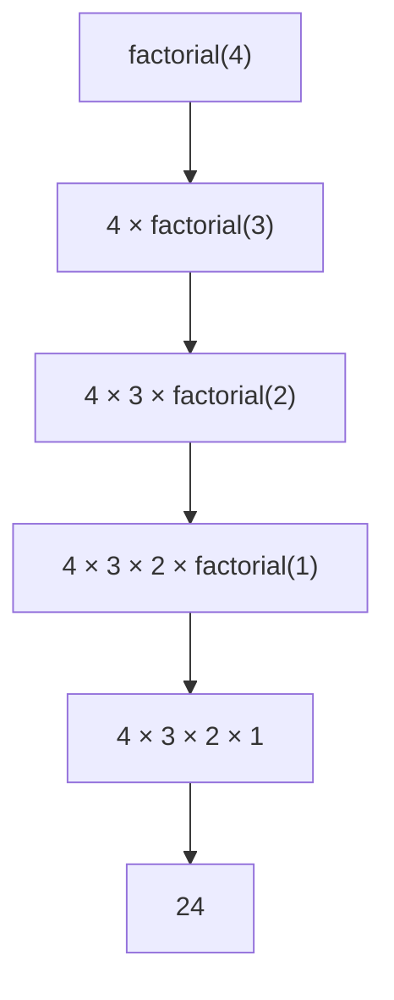
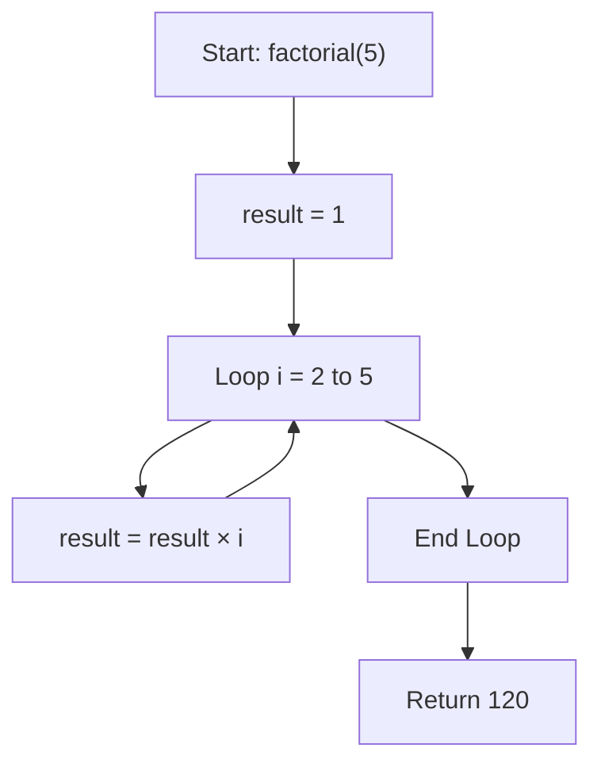
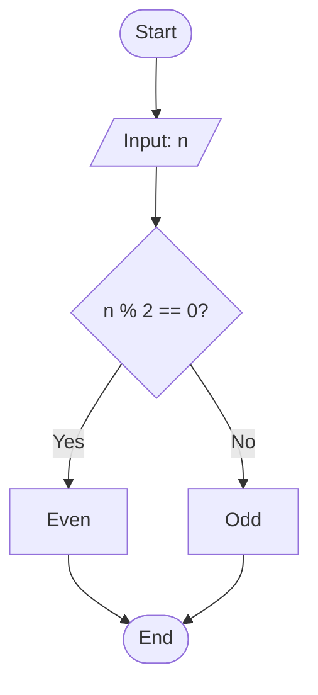
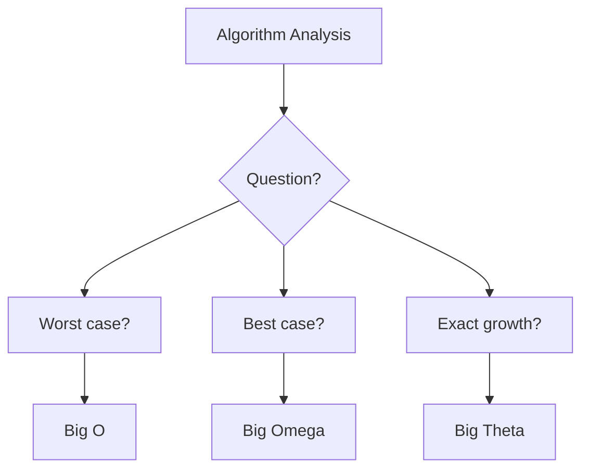
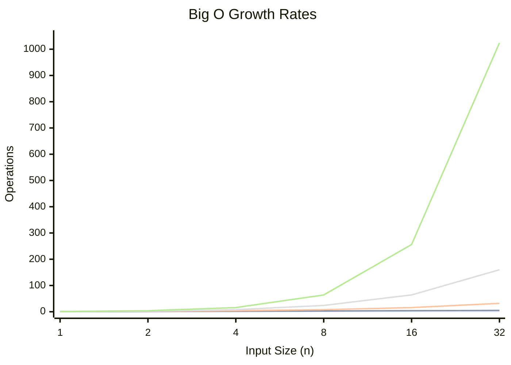

# Algorithm Fundamentals – Complete Study Guide

## 1. Definition

**Algorithm** = A step-by-step procedure to solve a problem (like a recipe).

**Real-Life Example – Finding the largest test score:**
1. Remember the first score as the "largest".
2. Check each score; update if a larger one is found.
3. Return the largest.

**Key Point:** An algorithm is **not** code. It is a language-independent blueprint.

**C Implementation – find_maximum:**

```c
#include <stdio.h>

int find_maximum(int numbers[], int size) {
    int max_value = numbers[0];

    for (int i = 0; i < size; i++) {
        if (numbers[i] > max_value) {
            max_value = numbers[i];
        }
    }
    return max_value;
}

int main() {
    int numbers[] = {3, 7, 2, 9, 5};
    int size = sizeof(numbers) / sizeof(numbers[0]);

    int max = find_maximum(numbers, size);
    printf("Maximum value: %d\n", max);
    return 0;
}
```

---

## 2. Characteristics of an Algorithm

**Mnemonic:** I Often Drink Fresh Eggnog (I-O-D-F-E)

| # | Characteristic | Description | Example |
|--|----------------|-------------|---------|
| 1 | Input | 0 or more values provided | add(a, b) has 2 inputs |
| 2 | Output | At least 1 result produced | return a + b |
| 3 | Definiteness | Each step is unambiguous | "Add 5 grams" vs "Add some" |
| 4 | Finiteness | Must terminate | while True: is not valid |
| 5 | Effectiveness | Steps are feasible | "Add numbers" vs "Solve everything" |

---

## 3. Types of Algorithms

### Recursive Algorithms

A function calls itself to solve smaller instances.

**Python Example – Factorial:**

```python
def factorial(n):
    if n <= 1:          # BASE CASE (stops recursion)
        return 1
    return n * factorial(n - 1)  # RECURSIVE CASE
```

**Recursion Stack for factorial(4):**

```
factorial(4)
├── 4 * factorial(3)
    ├── 3 * factorial(2)
        ├── 2 * factorial(1)
            └── Returns 1
        └── Returns 2
    └── Returns 6
└── Returns 24
```

**Mermaid Trace:**



**Pros:** Clean code for tree/graph problems.
**Cons:** Memory-heavy, risk of stack overflow.

---

### Iterative Algorithms

Use loops instead of self-calls. More memory-efficient.

**C Example – Sum 1 to n:**

```c
#include <stdio.h>

int main() {
    int n = 5, sum = 0;
    for (int i = 1; i <= n; i++) {
        sum += i;
    }
    printf("%d", sum);
    return 0;
}
```

**Mermaid Flow:**



**Comparison:**

| Aspect   | Recursive                 | Iterative    |
| -------- | ------------------------- | ------------ |
| Memory   | High (stack frames)       | Low          |
| Speed    | Slower                    | Faster       |
| Best For | Trees, divide-and-conquer | Simple loops |

---

## 4. Representation of Algorithms

### Flowchart

Visual diagram using standard symbols:
- Oval – Start / End
- Parallelogram – Input / Output
- Rectangle – Process
- Diamond – Decision

**Example – Even or Odd:**



```python
def check_even_odd(n):
    return "Even" if n % 2 == 0 else "Odd"
```

---

### Pseudo Code

Plain-text, language-independent logic.

**Example – Calculate Average:**

```
ALGORITHM CalculateAverage
INPUT: list of numbers, size
OUTPUT: average

BEGIN
    total <- 0
    FOR i <- 0 TO size - 1 DO
        total <- total + list[i]
    END FOR

    IF size = 0 THEN
        RETURN 0
    ELSE
        RETURN total / size
    END
END
```

**C Implementation:**

```c
#include <stdio.h>

float calculateAverage(int arr[], int size) {
    int total = 0;
    for (int i = 0; i < size; i++) {
        total += arr[i];
    }
    if (size == 0) return 0;
    return (float)total / size;
}

int main() {
    int arr[] = {10, 20, 30, 40, 50, 60};
    int size = sizeof(arr) / sizeof(arr[0]);
    float avg = calculateAverage(arr, size);
    printf("Average = %.2f\n", avg);
    return 0;
}
```

**Same logic in Python & JavaScript:**

```python
# Python
def average(numbers):
    return sum(numbers) / len(numbers) if numbers else 0
```

```javascript
// JavaScript
const average = (numbers) => 
    numbers.length ? numbers.reduce((a,b) => a+b) / numbers.length : 0;
```

---

## 5. Efficiency of an Algorithm

Measures time and space resource usage.

**Example – Sum 1 to n:**

```c
// O(n) – slow
int sum_slow(int n) {
    int total = 0;
    for (int i = 1; i <= n; i++) total += i;
    return total;
}

// O(1) – fast
int sum_fast(int n) {
    return n * (n + 1) / 2;
}
```

For n = 1,000,000:
- Slow: 1 million operations
- Fast: 1 operation (330,000 times faster)

**Three Performance Cases:**
- Best – Minimum resources (lucky input)
- Average – Typical usage
- Worst – Maximum resources (guaranteed bound)

---

## 6. Complexity of Algorithms

### Space Complexity – Memory usage vs input size

```c
// O(1) – Constant space
int sum_array(int arr[], int n) {
    int total = 0;
    for (int i = 0; i < n; i++) total += arr[i];
    return total;
}

// O(n) – Linear space
int* duplicate_array(int arr[], int n) {
    int* new_arr = (int*)malloc(n * sizeof(int));
    for (int i = 0; i < n; i++) new_arr[i] = arr[i];
    return new_arr;
}
```

### Time Complexity – Speed vs input size

| Complexity | Operations for n=100 | Example |
|------------|----------------------|---------|
| O(1) | 1 | Array access |
| O(log n) | ~7 | Binary search |
| O(n) | 100 | Linear search |
| O(n log n) | ~664 | Merge sort |
| O(n²) | 10,000 | Bubble sort |

---

## 7. Asymptotic Notation

Standard notation to describe growth rates.

### Big O – Upper Bound / Worst Case

"Won't be worse than this"

```python
def linear_search(arr, target):
    for i, element in enumerate(arr):
        if element == target:
            return i
    return -1

# Worst case: O(n) – target is last or absent
```

### Big Omega (Ω) – Lower Bound / Best Case

"Can't be better than this"

```python
# Best case: Ω(1) – target is the first element
linear_search([5, 12, 8, 3], 5)
```

### Big Theta (Θ) – Tight Bound / Exact

"Grows exactly as" (when best = worst)

```python
def sum_array(arr):
    # Always Θ(n) – must visit every element
    total = 0
    for num in arr:
        total += num
    return total
```

### Notation Summary

| Notation | Symbol | Meaning | Use When |
|----------|--------|---------|----------|
| Big O | O | Worst case | Performance guarantees |
| Big Omega | Ω | Best case | Proving minimums |
| Big Theta | Θ | Exact | All cases are the same |

**Mermaid Decision Tree:**



---

## 8. Complexity Hierarchy (Fastest to Slowest)

```
O(1) < O(log n) < O(n) < O(n log n) < O(n²) < O(2ⁿ) < O(n!)
```

**Growth Rate Chart:**




## 9. MCQ

#### Q1. What is an algorithm?

A) A programming language
B) A step-by-step procedure to solve a problem ✅
C) A type of computer hardware
D) An operating system

#### Q2. An algorithm is described as a:

A) Language-dependent code
B) Language-independent blueprint ✅
C) Hardware component
D) Data structure

#### Q3. In the real-life example of finding the largest test score, what is the first step?

A) Check each score
B) Return the largest
C) Remember the first score as the "largest" ✅
D) Sort all scores

#### Q4. Which of the following is TRUE about algorithms?

A) An algorithm is code written in a specific language
B) An algorithm is a language-independent blueprint ✅
C) An algorithm must always be written in Python
D) An algorithm cannot be represented visually

#### Q5. The C function `find_maximum` returns:

A) The minimum value in the array
B) The maximum value in the array ✅
C) The sum of all elements
D) The average of all elements

#### Q6. In `find_maximum`, `max_value` is initialized to:

A) 0
B) The first element of the array ✅
C) The last element of the array
D) The size of the array

#### Q7. The mnemonic for characteristics of an algorithm is:

A) I Often Drink Fresh Eggnog ✅
B) I Only Drink Fresh Espresso
C) Input Output Definite Finite Effective
D) All Algorithms Need Clear Steps

#### Q8. How many inputs can an algorithm have?

A) At least 1
B) 0 or more ✅
C) Exactly 2
D) Exactly 1

#### Q9. How many outputs must an algorithm produce?

A) 0 or more
B) At least 1 ✅
C) Exactly 1
D) At least 2

#### Q10. Definiteness in an algorithm means:

A) Each step is unambiguous ✅
B) The algorithm must be short
C) The algorithm must use numbers
D) The algorithm must have no loops

#### Q11. Finiteness in an algorithm means:

A) It must produce multiple outputs
B) It must terminate ✅
C) It must have no inputs
D) It must be written in C

#### Q12. Effectiveness in an algorithm means:

A) Steps are feasible to perform ✅
B) Steps are written in English
C) Steps are theoretical
D) Steps are not important

#### Q13. Which of the following violates the Finiteness characteristic?

A) `for (i = 0; i < 10; i++)`
B) `while (True)` ✅
C) `if (x > 5)`
D) `return sum`

#### Q14. "Add some salt" in a recipe violates which characteristic?

A) Input
B) Output
C) Definiteness ✅
D) Finiteness

#### Q15. `add(a, b)` has how many inputs?

A) 0
B) 1
C) 2 ✅
D) 3

#### Q16. A Recursive Algorithm is one where:

A) A function calls itself to solve smaller instances ✅
B) A function uses loops
C) A function has no return value
D) A function calls another function

#### Q17. The base case in a recursive function:

A) Makes the function run forever
B) Stops the recursion ✅
C) Increases the recursion depth
D) Causes an error

#### Q18. What is the base case in the factorial recursive function?

A) `n > 1`
B) `n <= 1` ✅
C) `n == 0`
D) `n < 0`

#### Q19. What is the result of `factorial(4)`?

A) 6
B) 12
C) 24 ✅
D) 120

#### Q20. In recursion, the recursive case:

A) Stops the recursion
B) Calls the function with a smaller input ✅
C) Increases the input size
D) Terminates the program

#### Q21. The recursion stack for `factorial(4)` shows:

A) 4 × 3 × 2 × 1 ✅
B) 4 + 3 + 2 + 1
C) 4 × 3 × 2
D) 1 × 2 × 3 × 4

#### Q22. Which of the following is a PRO of recursive algorithms?

A) Memory-efficient
B) Clean code for tree/graph problems ✅
C) No risk of stack overflow
D) Always faster than iterative

#### Q23. Which of the following is a CON of recursive algorithms?

A) Complex for tree problems
B) Memory-heavy, risk of stack overflow ✅
C) Always slower than iterative
D) Cannot be used for factorial

#### Q24. An Iterative Algorithm uses:

A) Self-calls
B) Loops instead of self-calls ✅
C) No loops
D) Only recursion

#### Q25. Which algorithm type is more memory-efficient?

A) Recursive
B) Iterative ✅
C) Both are equally efficient
D) Depends on the language

#### Q26. Iterative algorithms are generally:

A) Slower than recursive
B) Faster than recursive ✅
C) The same speed
D) Not comparable

#### Q27. Recursive algorithms are best for:

A) Simple loops
B) Trees and divide-and-conquer ✅
C) Array traversal
D) Basic arithmetic

#### Q28. Which of the following is TRUE about recursive vs iterative?

A) Recursive uses less memory
B) Iterative uses high memory
C) Recursive uses high memory (stack frames) ✅
D) Both use the same memory

#### Q29. In the C example for iterative sum, the loop runs from:

A) 0 to n
B) 1 to n ✅
C) n to 1
D) 1 to n-1

#### Q30. A Flowchart uses a diamond shape for:

A) Start/End
B) Input/Output
C) Process
D) Decision ✅

#### Q31. In a flowchart, a parallelogram represents:

A) Start/End
B) Input/Output ✅
C) Process
D) Decision

#### Q32. In a flowchart, a rectangle represents:

A) Start/End
B) Input/Output
C) Process ✅
D) Decision

#### Q33. In a flowchart, an oval represents:

A) Start/End ✅
B) Input/Output
C) Process
D) Decision

#### Q34. In the even/odd flowchart, the diamond checks:

A) `n > 0`
B) `n % 2 == 0` ✅
C) `n < 0`
D) `n == 0`

#### Q35. Pseudo code is:

A) Actual code in a programming language
B) Plain-text, language-independent logic ✅
C) Machine code
D) Assembly code

#### Q36. In pseudo code, `<-` is used for:

A) Comparison
B) Assignment ✅
C) Addition
D) Loop

#### Q37. The pseudo code `total <- 0` means:

A) Compare total with 0
B) Assign total the value 0 ✅
C) Add total to 0
D) Loop from total to 0

#### Q38. In the average calculation pseudo code, what is checked before division?

A) If total is 0
B) If size is 0 ✅
C) If list is empty
D) If total is negative

#### Q39. The C implementation of average uses which format specifier for float output?

A) `%d`
B) `%f`
C) `%.2f` ✅
D) `%c`

#### Q40. In Python, the average function returns:

A) Sum of numbers
B) Sum divided by length if numbers exist, else 0 ✅
C) Length of numbers
D) Maximum number

#### Q41. In JavaScript, the average function uses:

A) `forEach`
B) `reduce` ✅
C) `map`
D) `filter`

#### Q42. Efficiency of an algorithm measures:

A) Only time usage
B) Only space usage
C) Time and space resource usage ✅
D) Number of lines of code

#### Q43. `sum_slow(n)` has a complexity of:

A) O(1)
B) O(n) ✅
C) O(n²)
D) O(log n)

#### Q44. `sum_fast(n)` has a complexity of:

A) O(1) ✅
B) O(n)
C) O(n²)
D) O(log n)

#### Q45. For n = 1,000,000, `sum_fast` is approximately how many times faster than `sum_slow`?

A) 1,000 times
B) 10,000 times
C) 330,000 times ✅
D) 1,000,000 times

#### Q46. The three performance cases for algorithms are:

A) Fast, Medium, Slow
B) Best, Average, Worst ✅
C) Minimum, Typical, Maximum
D) Low, Medium, High

#### Q47. Worst case analysis provides:

A) Minimum resources needed
B) A guaranteed bound on resources ✅
C) Average resource usage
D) No useful information

#### Q48. Space Complexity measures:

A) Speed of execution
B) Memory usage vs input size ✅
C) Number of operations
D) Code readability

#### Q49. `sum_array` that uses only a `total` variable has space complexity of:

A) O(1) ✅
B) O(n)
C) O(n²)
D) O(log n)

#### Q50. `duplicate_array` that creates a new array of size n has space complexity of:

A) O(1)
B) O(n) ✅
C) O(n²)
D) O(log n)

#### Q51. Time Complexity measures:

A) Memory usage vs input size
B) Speed vs input size ✅
C) Number of variables
D) Code length

#### Q52. O(1) operations for n=100 is:

A) 1 ✅
B) 7
C) 100
D) 10,000

#### Q53. O(log n) operations for n=100 is approximately:

A) 1
B) 7 ✅
C) 100
D) 10,000

#### Q54. O(n) operations for n=100 is:

A) 1
B) 7
C) 100 ✅
D) 10,000

#### Q55. O(n log n) operations for n=100 is approximately:

A) 100
B) 200
C) 664 ✅
D) 1,000

#### Q56. O(n²) operations for n=100 is:

A) 100
B) 1,000
C) 10,000 ✅
D) 100,000

#### Q57. Asymptotic Notation is used to:

A) Write actual code
B) Describe growth rates of algorithms ✅
C) Debug programs
D) Design user interfaces

#### Q58. Big O notation describes:

A) Best case
B) Worst case (Upper Bound) ✅
C) Exact growth
D) Average case

#### Q59. Big O is used when:

A) Proving minimums
B) All cases are the same
C) Making performance guarantees ✅
D) Describing best case

#### Q60. Big Omega (Ω) notation describes:

A) Worst case
B) Best case (Lower Bound) ✅
C) Exact growth
D) Average case

#### Q61. Big Omega is used when:

A) Making performance guarantees
B) Proving minimums ✅
C) All cases are the same
D) Describing worst case

#### Q62. Big Theta (Θ) notation describes:

A) Worst case
B) Best case
C) Tight Bound (Exact growth) ✅
D) Average case

#### Q63. Big Theta is used when:

A) Best and worst cases are different
B) All cases are the same ✅
C) Only worst case matters
D) Only best case matters

#### Q64. In `linear_search`, the worst case complexity is:

A) O(1)
B) O(n) ✅
C) O(log n)
D) O(n²)

#### Q65. In `linear_search`, the best case complexity is:

A) Ω(1) ✅
B) Ω(n)
C) Ω(log n)
D) Ω(n²)

#### Q66. `sum_array` always visits every element, so its complexity is:

A) O(n)
B) Ω(n)
C) Θ(n) ✅
D) O(1)

#### Q67. The correct order from fastest to slowest is:

A) O(1) < O(n) < O(log n) < O(n²)
B) O(1) < O(log n) < O(n) < O(n log n) < O(n²) ✅
C) O(n) < O(1) < O(log n) < O(n²)
D) O(n²) < O(n log n) < O(n) < O(log n)

#### Q68. Binary search has a time complexity of:

A) O(1)
B) O(n)
C) O(log n) ✅
D) O(n²)

#### Q69. Linear search has a time complexity of:

A) O(1)
B) O(n) ✅
C) O(log n)
D) O(n²)

#### Q70. Merge sort has a time complexity of:

A) O(n)
B) O(n²)
C) O(n log n) ✅
D) O(log n)

#### Q71. Bubble sort has a time complexity of:

A) O(n)
B) O(log n)
C) O(n log n)
D) O(n²) ✅

#### Q72. Array access has a time complexity of:

A) O(1) ✅
B) O(n)
C) O(log n)
D) O(n²)

#### Q73. In Big O notation, O(n) is known as:

A) Constant time
B) Linear time ✅
C) Logarithmic time
D) Quadratic time

#### Q74. In Big O notation, O(1) is known as:

A) Constant time ✅
B) Linear time
C) Logarithmic time
D) Quadratic time

#### Q75. In Big O notation, O(log n) is known as:

A) Constant time
B) Linear time
C) Logarithmic time ✅
D) Quadratic time

#### Q76. In Big O notation, O(n²) is known as:

A) Constant time
B) Linear time
C) Logarithmic time
D) Quadratic time ✅

#### Q77. For an algorithm with O(2ⁿ), n=10 gives approximately:

A) 100 operations
B) 1,024 operations ✅
C) 10,000 operations
D) 20 operations

#### Q78. Which complexity grows the fastest?

A) O(n log n)
B) O(n²)
C) O(2ⁿ) ✅
D) O(n)

#### Q79. The `find_maximum` function has a time complexity of:

A) O(1)
B) O(n) ✅
C) O(n²)
D) O(log n)

#### Q80. The `find_maximum` function has a space complexity of:

A) O(1) ✅
B) O(n)
C) O(n²)
D) O(log n)

#### Q81. An algorithm with no `#include` or function definitions in the representation is:

A) C code
B) Pseudo code ✅
C) Machine code
D) Assembly

#### Q82. In recursion, the factorial function calls itself until:

A) n becomes 0
B) n becomes 1 or less ✅
C) n becomes negative
D) n becomes 10

#### Q83. The return value of `factorial(0)` would be:

A) 0
B) 1 ✅
C) -1
D) Undefined

#### Q84. Which of the following is NOT a valid flowchart symbol?

A) Oval for Start/End
B) Parallelogram for Input/Output
C) Rectangle for Process
D) Triangle for Decision ✅

#### Q85. In pseudo code, `FOR i <- 0 TO size - 1` means:

A) Loop while i is less than size ✅
B) Loop until i equals size
C) Loop forever
D) Loop while i is greater than size

#### Q86. The C implementation of average uses `(float)total / size` to:

A) Perform integer division
B) Perform floating-point division ✅
C) Convert size to float
D) Convert total to integer

#### Q87. The Python average function uses the expression:

A) `sum(numbers) / len(numbers) if numbers else 0` ✅
B) `sum(numbers) / len(numbers)`
C) `sum(numbers) if numbers else 0`
D) `sum(numbers) / 0`

#### Q88. The JavaScript average function uses:

A) `numbers.reduce((a,b) => a+b) / numbers.length`
B) `numbers.reduce((a,b) => a+b) / numbers.length || 0` ✅
C) `numbers.map((a,b) => a+b) / numbers.length`
D) `numbers.filter((a,b) => a+b) / numbers.length`

#### Q89. Which of the following is NOT a characteristic of an algorithm?

A) Input
B) Output
C) Randomness ✅
D) Finiteness

#### Q90. An algorithm that never terminates violates:

A) Input
B) Output
C) Definiteness
D) Finiteness ✅

#### Q91. The real-life example of finding the largest test score uses:

A) Recursion
B) Iteration ✅
C) Both recursion and iteration
D) Neither

#### Q92. A recursive algorithm's call stack grows with:

A) Each recursive call ✅
B) Each loop iteration
C) Each variable declaration
D) Each function return

#### Q93. Which is better for memory-constrained environments?

A) Recursive algorithms
B) Iterative algorithms ✅
C) Both are equal
D) Depends on the problem

#### Q94. O(n!) is considered:

A) Efficient
B) Very inefficient ✅
C) Constant time
D) Logarithmic time

#### Q95. Big O notation ignores:

A) Constant factors ✅
B) Input size
C) Worst case
D) Growth rate

#### Q96. The difference between O(n) and O(2n) is:

A) Significant
B) Ignored in Big O notation ✅
C) Always 2x
D) Always 1.5x

#### Q97. An algorithm with best=O(1) and worst=O(n) has which exact bound?

A) Θ(1)
B) Θ(n)
C) Cannot determine Θ ✅
D) Ω(1)

#### Q98. Which of the following algorithms has Θ(n) complexity?

A) Binary search
B) Linear search (worst case is O(n) but best is Ω(1))
C) Sum of array elements ✅
D) Bubble sort

#### Q99. The mermaid diagram for recursion shows:

A) A loop
B) Function calls unwinding ✅
C) A decision tree
D) A flowchart

#### Q100. Which complexity is considered the most efficient for large inputs?

A) O(1) ✅
B) O(log n)
C) O(n)
D) O(n²)
