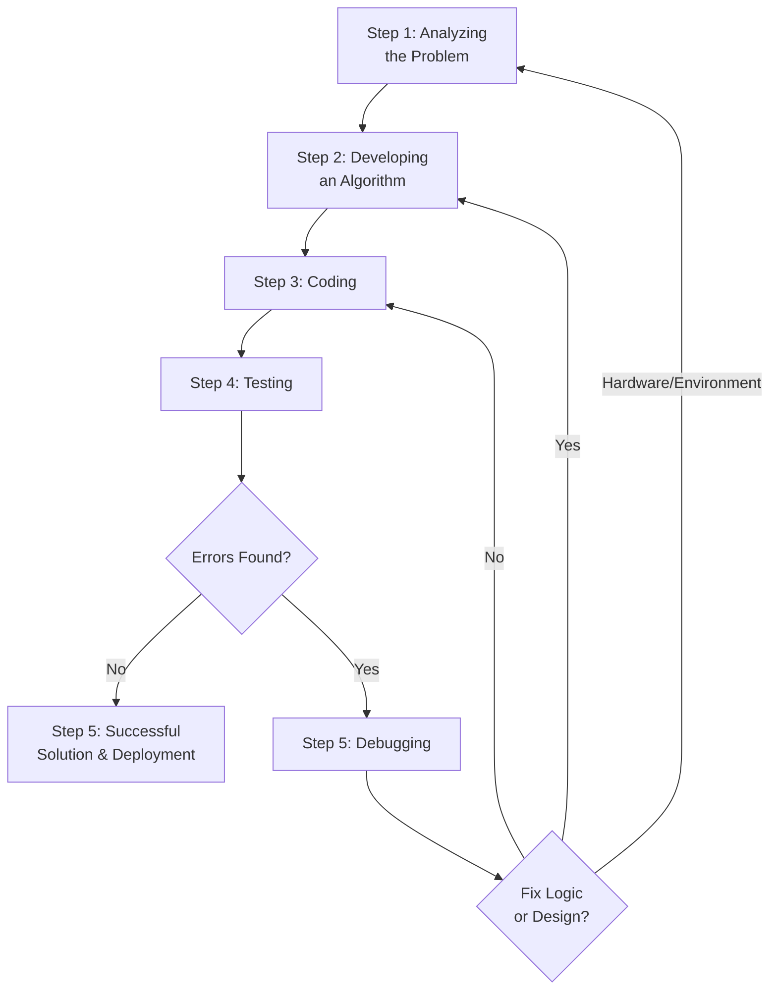

## 1. Introduction to Problem Solving

**Problem Solving** in computer science is the process of transforming a given problem (real-world or theoretical) into a working, efficient, and correct software solution. It is the most fundamental skill for a programmer and involves logical thinking, analysis, and systematic execution.

---

## 2. Steps for Problem Solving

The process of solving a problem using a computer follows a standard **5-step lifecycle**. This is an iterative process—meaning if a later step fails (e.g., testing), you must go back to a previous step.



---

### Step 1: Analyzing the Problem

**Definition**: This is the most crucial phase. It involves understanding the problem deeply before attempting to solve it. If you misunderstand the problem, the entire solution will be wrong.

**Key Activities**:
1.  **Read and Re-read**: Carefully read the problem statement multiple times.
2.  **Identify Inputs**: What data does the problem provide? (e.g., numbers, strings, files).
3.  **Identify Outputs**: What is the expected result? (e.g., sum, sorted list, a boolean true/false).
4.  **Identify Constraints**: Are there any limitations? (e.g., input size, time limits, memory limits, valid ranges).
5.  **Stakeholder Queries**: Ask "what if" questions to clarify ambiguous parts.

**Example**:
- **Problem**: Calculate the area of a rectangle.
- **Analysis**:
  - Inputs: Length ($L$) and Breadth ($B$). Must be positive real numbers.
  - Output: Area ($A = L \times B$).
  - Constraints: $L > 0$, $B > 0$.

---

### Step 2: Developing an Algorithm

**Definition**: Once the problem is understood, the next step is to design a step-by-step logical procedure (the algorithm) to solve it.

**Key Activities**:
1.  Break down the main problem into smaller, manageable sub-problems (Modularization).
2.  Write down the exact sequence of operations.
3.  Choose the appropriate control structures: **Sequence**, **Selection** (if-else), and **Iteration** (loops).
4.  Represent the algorithm using:
    - **Flowcharts** (graphical representation).
    - **Pseudo-code** (textual representation).

**Example** (Rectangle Area Algorithm in Pseudo-code):
```
BEGIN
    INPUT L, B
    AREA ← L * B
    OUTPUT AREA
END
```

---

### Step 3: Coding

**Definition**: Translating the algorithm (pseudo-code/flowchart) into a specific programming language (like C, C++, Python, Java) that the computer can understand and execute.

**Key Activities**:
1.  Choose an appropriate programming language based on the problem domain.
2.  Write the source code following strict **syntax rules** (grammar of the language).
3.  Use meaningful variable names and proper indentation to make the code readable (maintainability).
4.  **Integrate** the various modules (if the algorithm was broken into functions/procedures).

**Example** (Coding the Rectangle Area in Python):
```python
# Step 3: Coding
L = float(input("Enter length: "))
B = float(input("Enter breadth: "))
Area = L * B
print("Area is:", Area)
```

---

### Step 4: Testing

**Definition**: Running the program with various sets of input data (test cases) to verify that the algorithm/code produces the correct output.

**Key Activities**:
1.  **Unit Testing**: Testing individual components/functions of the program.
2.  **Integration Testing**: Testing the interaction between combined modules.
3.  **System Testing**: Testing the entire program as a whole.
4.  **Types of Test Cases**:
    - **Valid / Normal**: Standard expected inputs (e.g., $L=5, B=10$).
    - **Boundary / Edge**: Values at the extreme limits (e.g., $L=0$, $B=1$).
    - **Invalid / Erroneous**: Incorrect data types or out-of-range values (e.g., $L=\text{"abc"}$).
5.  **Expected vs Actual**: Compare the actual output of the program against the manually calculated expected output.

---

### Step 5: Debugging

**Definition**: The systematic process of finding, isolating, and correcting **errors (bugs)** in the program discovered during testing.

**Types of Errors (Bugs)**:

| Error Type | Description | Example | Detection Method |
| :--- | :--- | :--- | :--- |
| **Syntax Error** | Violates the grammatical rules of the language. | Writing `prnit` instead of `print` in Python. | Compiler / Interpreter |
| **Runtime Error** | Occurs during execution; crashes the program. | Dividing by zero (`10/0`), accessing a missing file. | During execution (crashes) |
| **Logical Error** | Program runs without crashing but gives wrong results. | Using `L + B` instead of `L * B` for area. | Dry-run, Manual testing, Print statements. (Hardest to find) |

**Debugging Techniques**:
1.  **Dry Run**: Manually execute the code on paper with sample inputs, tracking variable values.
2.  **Print Statements**: Insert temporary `print` commands to check variable states at various points.
3.  **Debugging Tools (Debuggers)**: Use tools like `pdb` (Python), GDB (C/C++), or IDE built-in debuggers. They allow you to set **breakpoints** and step through the code line-by-line.
4.  **Rubber Duck Debugging**: Explaining the code logic aloud to someone (or an inanimate object) often reveals the flaw.

---

## 3. Iterative Nature of Problem Solving

It is crucial to understand that problem-solving is **not linear**. It is a **feedback loop**.

- If **Testing** finds a logical error → you go back to **Coding**.
- If the algorithm design seems too complex or flawed → you go back to **Developing the Algorithm**.
- If the problem constraints change or were misunderstood → you go back to **Analyzing the Problem**.

## 4. MCQ

#### Q1. Problem Solving in computer science is the process of:

A) Writing code without planning
B) Transforming a problem into a working, efficient, and correct software solution ✅
C) Designing hardware components
D) Installing operating systems

#### Q2. What is the most fundamental skill for a programmer?

A) Typing speed
B) Problem Solving ✅
C) Hardware knowledge
D) Networking

#### Q3. The problem-solving process follows how many steps in the standard lifecycle?

A) 3
B) 4
C) 5 ✅
D) 6

#### Q4. The problem-solving lifecycle is described as:

A) Linear
B) Iterative ✅
C) Random
D) Unidirectional

#### Q5. If testing finds errors, the process goes back to which step?

A) Analyzing the Problem
B) Developing an Algorithm
C) Coding or Algorithm development ✅
D) Deployment

#### Q6. The first step in problem solving is:

A) Coding
B) Testing
C) Analyzing the Problem ✅
D) Developing an Algorithm

#### Q7. Which step is described as the most crucial phase?

A) Coding
B) Testing
C) Analyzing the Problem ✅
D) Debugging

#### Q8. If you misunderstand the problem, what will happen?

A) The entire solution will be wrong ✅
B) Only the output will be wrong
C) The code will not compile
D) Nothing will happen

#### Q9. Which of the following is NOT a key activity in problem analysis?

A) Read and re-read the problem
B) Identify inputs and outputs
C) Write the final code ✅
D) Identify constraints

#### Q10. In problem analysis, what should you identify about inputs?

A) Their color
B) Their data type and source ✅
C) Their location in memory
D) Their file size

#### Q11. In problem analysis, outputs refer to:

A) The error messages
B) The expected result ✅
C) The input data
D) The algorithm steps

#### Q12. Constraints in problem analysis refer to:

A) The programming language used
B) Limitations like input size, time limits, memory limits ✅
C) The output format
D) The number of developers

#### Q13. For the problem "Calculate the area of a rectangle", the inputs are:

A) Area only
B) Length and Breadth ✅
C) Length, Breadth, and Area
D) Only Length

#### Q14. For the problem "Calculate the area of a rectangle", what are the constraints?

A) L > 0, B > 0 ✅
B) L ≥ 0, B ≥ 0
C) L < 0, B < 0
D) No constraints

#### Q15. The second step in problem solving is:

A) Analyzing the Problem
B) Developing an Algorithm ✅
C) Coding
D) Testing

#### Q16. Breaking down the main problem into smaller sub-problems is called:

A) Coding
B) Debugging
C) Modularization ✅
D) Testing

#### Q17. Which control structures are used in algorithm development?

A) Sequence, Selection, Iteration ✅
B) Only Sequence
C) Only Selection
D) Only Iteration

#### Q18. Algorithms can be represented using:

A) Only Flowcharts
B) Only Pseudo-code
C) Flowcharts and Pseudo-code ✅
D) Only C code

#### Q19. The rectangle area algorithm in pseudo-code uses which steps?

A) INPUT, PROCESS, OUTPUT ✅
B) WRITE, READ, CALCULATE
C) START, MIDDLE, END
D) BEGIN, EXECUTE, FINISH

#### Q20. The third step in problem solving is:

A) Analyzing the Problem
B) Developing an Algorithm
C) Coding ✅
D) Testing

#### Q21. Coding is defined as:

A) Designing the algorithm
B) Translating the algorithm into a specific programming language ✅
C) Running the program
D) Finding errors

#### Q22. While coding, what syntax rules must be followed?

A) The grammar rules of the programming language ✅
B) The grammar rules of English
C) No rules
D) Only indentation rules

#### Q23. Using meaningful variable names and proper indentation improves:

A) Execution speed
B) Code readability and maintainability ✅
C) Memory usage
D) Compilation time

#### Q24. The fourth step in problem solving is:

A) Analyzing the Problem
B) Developing an Algorithm
C) Coding
D) Testing ✅

#### Q25. Testing involves running the program with:

A) Only one set of input data
B) Various sets of input data (test cases) ✅
C) No input data
D) Only invalid data

#### Q26. Testing individual components/functions is called:

A) System Testing
B) Integration Testing
C) Unit Testing ✅
D) Acceptance Testing

#### Q27. Testing the interaction between combined modules is called:

A) Unit Testing
B) Integration Testing ✅
C) System Testing
D) Alpha Testing

#### Q28. Testing the entire program as a whole is called:

A) Unit Testing
B) Integration Testing
C) System Testing ✅
D) Unit Testing

#### Q29. Valid/Normal test cases use:

A) Values at extreme limits
B) Standard expected inputs ✅
C) Incorrect data types
D) Out-of-range values

#### Q30. Boundary/Edge test cases use:

A) Standard expected inputs
B) Values at extreme limits ✅
C) Incorrect data types
D) Random values

#### Q31. Invalid/Erroneous test cases use:

A) Standard expected inputs
B) Values at extreme limits
C) Incorrect data types or out-of-range values ✅
D) Only positive numbers

#### Q32. In testing, expected output is compared with:

A) The algorithm
B) The actual output ✅
C) The input data
D) The pseudo-code

#### Q33. The fifth step in problem solving when errors are found is:

A) Coding
B) Testing
C) Debugging ✅
D) Deployment

#### Q34. Debugging is the process of:

A) Writing new code
B) Finding, isolating, and correcting errors ✅
C) Designing algorithms
D) Testing the program

#### Q35. Errors in programs are commonly called:

A) Features
B) Bugs ✅
C) Enhancements
D) Updates

#### Q36. Which type of error violates the grammatical rules of the language?

A) Logical Error
B) Runtime Error
C) Syntax Error ✅
D) Semantic Error

#### Q37. Writing `prnit` instead of `print` in Python is an example of:

A) Logical Error
B) Runtime Error
C) Syntax Error ✅
D) Design Error

#### Q38. Syntax errors are detected by:

A) The user
B) The compiler or interpreter ✅
C) Runtime execution
D) Test cases

#### Q39. Which type of error occurs during execution and crashes the program?

A) Syntax Error
B) Runtime Error ✅
C) Logical Error
D) Compilation Error

#### Q40. Dividing by zero (10/0) is an example of:

A) Syntax Error
B) Runtime Error ✅
C) Logical Error
D) Design Error

#### Q41. Which type of error causes the program to run without crashing but gives wrong results?

A) Syntax Error
B) Runtime Error
C) Logical Error ✅
D) Compilation Error

#### Q42. Using `L + B` instead of `L * B` for area calculation is an example of:

A) Syntax Error
B) Runtime Error
C) Logical Error ✅
D) Compilation Error

#### Q43. Which type of error is the hardest to find?

A) Syntax Error
B) Runtime Error
C) Logical Error ✅
D) Compilation Error

#### Q44. Logical errors are detected by:

A) The compiler
B) The interpreter
C) Dry-run and manual testing ✅
D) Automatic detection

#### Q45. Manually executing code on paper with sample inputs is called:

A) Compiling
B) Debugging
C) Dry Run ✅
D) Testing

#### Q46. Inserting temporary print commands to check variable states is a debugging technique called:

A) Breakpoints
B) Print Statements ✅
C) Rubber Duck Debugging
D) Dry Run

#### Q47. Debugging tools that allow setting breakpoints and stepping through code are called:

A) Compilers
B) Interpreters
C) Debuggers ✅
D) Linkers

#### Q48. Explaining code logic aloud to someone (or an inanimate object) is called:

A) Pair Programming
B) Code Review
C) Rubber Duck Debugging ✅
D) Dry Run

#### Q49. If testing finds a logical error, the process should go back to:

A) Analyzing the Problem
B) Developing the Algorithm
C) Coding ✅
D) Deployment

#### Q50. If the algorithm design seems too complex or flawed, the process goes back to:

A) Analyzing the Problem
B) Developing the Algorithm ✅
C) Coding
D) Testing

#### Q51. If problem constraints change or were misunderstood, the process goes back to:

A) Analyzing the Problem ✅
B) Developing the Algorithm
C) Coding
D) Testing

#### Q52. The problem-solving lifecycle is best described as:

A) A straight line
B) A feedback loop ✅
C) A circle with no exit
D) A random process

#### Q53. The 5-step problem-solving lifecycle includes:

A) Analysis, Algorithm, Coding, Testing, Debugging ✅
B) Planning, Design, Code, Execute, Maintain
C) Input, Process, Output, Store, Retrieve
D) Start, Middle, End, Loop, Stop

#### Q54. In the problem-solving flowchart, after Testing, if no errors are found, the next step is:

A) Debugging
B) Successful Solution & Deployment ✅
C) Coding
D) Algorithm Development

#### Q55. In the problem-solving flowchart, after Debugging, if the logic needs fixing, the process goes to:

A) Analyzing the Problem
B) Developing the Algorithm ✅
C) Coding
D) Testing

#### Q56. In the problem-solving flowchart, after Debugging, if the code needs fixing, the process goes to:

A) Analyzing the Problem
B) Developing the Algorithm
C) Coding ✅
D) Testing

#### Q57. In the problem-solving flowchart, after Debugging, if hardware/environment issues exist, the process goes to:

A) Analyzing the Problem ✅
B) Developing the Algorithm
C) Coding
D) Testing

#### Q58. The most crucial phase in problem solving is:

A) Coding
B) Testing
C) Analyzing the Problem ✅
D) Debugging

#### Q59. The phase where the algorithm is translated into a specific programming language is:

A) Analyzing the Problem
B) Developing an Algorithm
C) Coding ✅
D) Testing

#### Q60. The phase where the program is run with various input sets is:

A) Analyzing the Problem
B) Developing an Algorithm
C) Coding
D) Testing ✅

#### Q61. The phase where errors are found and corrected is:

A) Analyzing the Problem
B) Developing an Algorithm
C) Coding
D) Debugging ✅

#### Q62. Unit Testing, Integration Testing, and System Testing are part of which phase?

A) Analyzing the Problem
B) Developing an Algorithm
C) Coding
D) Testing ✅

#### Q63. Which of the following is an example of a normal test case for rectangle area?

A) L=0, B=10
B) L=-5, B=10
C) L=5, B=10 ✅
D) L="abc", B=10

#### Q64. Which of the following is an example of a boundary test case for rectangle area?

A) L=5, B=10
B) L=0, B=10 ✅
C) L=-5, B=10
D) L="abc", B=10

#### Q65. Which of the following is an example of an invalid test case for rectangle area?

A) L=5, B=10
B) L=0, B=10
C) L=-5, B=10 ✅
D) L=1, B=1

#### Q66. For an algorithm, the term "Iterative" in the context of problem solving means:

A) It uses loops
B) It repeats steps with feedback ✅
C) It is written in iterative language
D) It never ends

#### Q67. What is the output of the rectangle area algorithm if L=5 and B=10?

A) 15
B) 50 ✅
C) 2
D) 5

#### Q68. If the area algorithm uses `L + B` instead of `L * B`, this is a:

A) Syntax Error
B) Runtime Error
C) Logical Error ✅
D) Compilation Error

#### Q69. Which debugging technique involves tracking variable values on paper?

A) Print Statements
B) Using Debuggers
C) Dry Run ✅
D) Rubber Duck Debugging

#### Q70. GDB (GNU Debugger) is used for which programming language primarily?

A) Python
B) Java
C) C/C++ ✅
D) JavaScript

#### Q71. In the problem-solving process, what should you do first when given a problem?

A) Start coding immediately
B) Read and re-read the problem statement ✅
C) Draw a flowchart
D) Write test cases

#### Q72. Which of the following is NOT a type of error in programs?

A) Syntax Error
B) Runtime Error
C) Design Error ✅
D) Logical Error

#### Q73. Compilation errors are another name for:

A) Syntax Errors ✅
B) Runtime Errors
C) Logical Errors
D) Semantic Errors

#### Q74. Runtime errors are also called:

A) Compilation errors
B) Execution errors ✅
C) Logical errors
D) Design errors

#### Q75. Logical errors are also called:

A) Compilation errors
B) Execution errors
C) Semantic errors ✅
D) Syntax errors

#### Q76. The feedback loop in problem solving ensures:

A) The process is always linear
B) Issues can be fixed by revisiting earlier steps ✅
C) No changes are ever made
D) Only testing is important

#### Q77. Which step comes immediately after Developing an Algorithm?

A) Analyzing the Problem
B) Coding ✅
C) Testing
D) Debugging

#### Q78. Which step comes immediately after Coding?

A) Analyzing the Problem
B) Developing an Algorithm
C) Testing ✅
D) Debugging

#### Q79. Which step comes immediately after Testing if errors are found?

A) Analyzing the Problem
B) Developing an Algorithm
C) Coding
D) Debugging ✅

#### Q80. Successful Solution & Deployment happens after which step?

A) Analyzing the Problem
B) Developing an Algorithm
C) Coding
D) Testing (with no errors) ✅

#### Q81. In the analysis phase, "Stakeholder Queries" involve:

A) Asking the compiler
B) Asking "what if" questions to clarify ambiguous parts ✅
C) Asking the debugger
D) Asking for more time

#### Q82. The acronym for the types of test cases is:

A) VBI (Valid, Boundary, Invalid) ✅
B) VIB (Valid, Invalid, Boundary)
C) BVI (Boundary, Valid, Invalid)
D) IVB (Invalid, Valid, Boundary)

#### Q83. Which of the following is an example of a runtime error?

A) `printf("%d", x);` where x is undeclared
B) `10 / 0` ✅
C) `sum = a + b;` when it should be `sum = a - b;`
D) `prnit("Hello");`

#### Q84. Which of the following is an example of a syntax error?

A) `10 / 0`
B) `prnit("Hello");` ✅
C) `sum = a + b;` when it should be `sum = a - b;`
D) File not found

#### Q85. Which of the following is an example of a logical error?

A) `10 / 0`
B) `prnit("Hello");`
C) `sum = a + b;` when it should be `sum = a - b;` ✅
D) File not found

#### Q86. The process of finding the root cause of a bug is called:

A) Testing
B) Coding
C) Debugging ✅
D) Analyzing

#### Q87. Breakpoints are used in which debugging technique?

A) Print Statements
B) Dry Run
C) Debuggers ✅
D) Rubber Duck Debugging

#### Q88. Which of the following is NOT a debugging technique?

A) Dry Run
B) Print Statements
C) Using Debuggers
D) Compiling ✅

#### Q89. In the problem-solving flowchart, what does the diamond decision represent?

A) Start/End
B) Process
C) Errors Found? ✅
D) Input/Output

#### Q90. The rectangle area problem analysis identified constraints as:

A) L > 0, B > 0 ✅
B) L >= 0, B >= 0
C) L < 0, B < 0
D) No constraints

#### Q91. If the output of the program does not match the expected output, what should be done?

A) Ignore it
B) Run the program again
C) Debug the program ✅
D) Change the requirements

#### Q92. Which is the most time-consuming phase in problem solving?

A) Analyzing the Problem
B) Developing an Algorithm
C) Coding
D) Depends on the problem, often Debugging ✅

#### Q93. The problem-solving process requires:

A) Only technical skills
B) Only logical thinking
C) Logical thinking, analysis, and systematic execution ✅
D) Only coding skills

#### Q94. In the analysis phase, identifying inputs and outputs helps to:

A) Write the code directly
B) Understand what data is given and what result is expected ✅
C) Test the program
D) Deploy the solution

#### Q95. The term "Modularization" in algorithm development means:

A) Writing the entire algorithm in one block
B) Breaking the main problem into smaller, manageable sub-problems ✅
C) Using only one module
D) Avoiding functions

#### Q96. Which of the following is the correct order of the problem-solving steps?

A) Analysis → Algorithm → Coding → Testing → Debugging ✅
B) Algorithm → Analysis → Coding → Testing → Debugging
C) Coding → Analysis → Algorithm → Testing → Debugging
D) Testing → Analysis → Algorithm → Coding → Debugging

#### Q97. The expected output in testing is calculated by:

A) The computer
B) The compiler
C) Manual calculation based on the problem ✅
D) The debugger

#### Q98. What happens if a test case fails?

A) The program is deployed
B) Debugging is performed to find and fix the error ✅
C) The program is ignored
D) The test case is deleted

#### Q99. The purpose of using test cases is to:

A) Make the program run faster
B) Verify that the algorithm/code produces the correct output ✅
C) Increase memory usage
D) Add more features

#### Q100. Which of the following best describes the relationship between the 5 steps?

A) Each step is independent and does not affect others
B) They are part of an iterative feedback loop ✅
C) Only the first step matters
D) The steps must always be in reverse order
