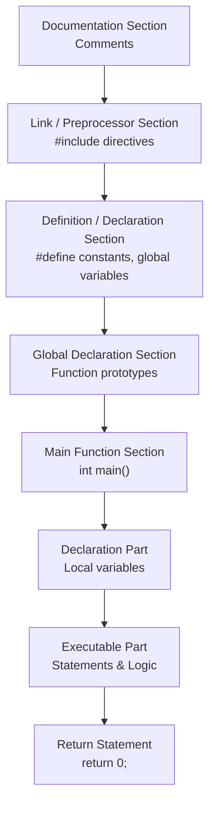

## 1. Basic Structure of a C Program

A C program follows a structured format. Understanding this skeleton is essential before writing any code.



**Detailed Breakdown of Sections**:

| Section | Description | Example |
| :--- | :--- | :--- |
| **Documentation** | Optional. Contains comments describing the program purpose/author. | `/* Program to add two numbers */` |
| **Link / Preprocessor** | Mandatory. Includes header files for standard I/O and library functions. | `#include <stdio.h>` |
| **Definition** | Defines constants (symbolic constants) using `#define`. | `#define PI 3.14` |
| **Global Declaration** | Declares variables/functions accessible by all functions. | `int globalVar;` |
| **`main()` Function** | Mandatory. The starting point of execution. Returns an integer. | `int main() { ... }` |
| **Declaration Part** | Declares local variables inside `main()`. | `int a, b, sum;` |
| **Executable Part** | Contains the logic (input, processing, output). | `printf`, `scanf`, arithmetic. |
| **Return Statement** | Returns 0 to the OS to indicate successful execution. | `return 0;` |

---

## 2. Character Set

The character set is the set of all valid characters that C recognizes. The C compiler supports the **ASCII** character set.

| Category            | Characters                                                      |
| :------------------ | :-------------------------------------------------------------- | ------------------------------------------------------------------------------------- |
| **Alphabets**       | Uppercase: `A` to `Z` <br> Lowercase: `a` to `z`                |
| **Digits**          | `0` to `9`                                                      |
| **Special Symbols** | `,` `.` `;` `:` `?` `'` `"` `!` `                               | ` `/` `\` `~` `$` `%` `^` `&` `*` `(` `)` `[` `]` `{` `}` `<` `>` `-` `+` `=` `#` `@` |
| **White Spaces**    | Blank space, Tab (`\t`), Newline (`\n`), Carriage return (`\r`) |

---

## 3. Keywords (Reserved Words)

**Keywords** are pre-defined, reserved words in C that have a special meaning to the compiler. They cannot be used as variable names, function names, or identifiers.

**List of 32 Keywords in C**:

| Group             | Keywords                                                                         |
| :---------------- | :------------------------------------------------------------------------------- |
| **Data Types**    | `int`, `char`, `float`, `double`, `void`, `short`, `long`, `signed`, `unsigned`  |
| **Control Flow**  | `if`, `else`, `switch`, `case`, `default`, `break`, `continue`, `goto`, `return` |
| **Loops**         | `for`, `while`, `do`                                                             |
| **Storage Class** | `auto`, `static`, `register`, `extern`                                           |
| **Miscellaneous** | `sizeof`, `typedef`, `const`, `union`, `struct`, `enum`, `volatile`              |

> **Exam Tip**: Keywords are always written in **lowercase**. In C, `Int` is NOT a keyword, but `int` is.

---

## 4. Identifiers

**Definition**: Identifiers are the names given to program elements such as variables, functions, arrays, structures, etc.

### Rules for Naming Identifiers (Valid Names)

1.  First character must be a letter (`A-Z`, `a-z`) or an underscore (`_`).
2.  Subsequent characters can be letters, digits (`0-9`), or underscores.
3.  No special symbols are allowed (except `_`). E.g., `$`, `@`, `#` are **not** allowed.
4.  C is **case-sensitive**. `Sum` and `sum` are different identifiers.
5.  Keywords **cannot** be used as identifiers.
6.  Length: ANSI standard guarantees up to 31 characters significant; modern compilers support longer.

**Valid Examples**: `roll_no`, `_temp`, `marks1`, `studentName`, `MAX_VALUE`.

**Invalid Examples**:

- `1stPlace` (starts with digit)
- `char` (keyword)
- `marks+` (special symbol `+`)

---

## 5. Constants

Constants are fixed values that do not change during the execution of a program. C supports two main types:

### 5.1 Literal Constants (Direct Values)

| Type                         | Description                                         | Example                                       |
| :--------------------------- | :-------------------------------------------------- | :-------------------------------------------- |
| **Integer Constant**         | Whole numbers (positive/negative/zero).             | `10`, `-5`, `0`, `1000`                       |
| **Floating / Real Constant** | Numbers with a decimal point or exponential form.   | `3.14`, `-0.5`, `1.2e3` ($1.2 \times 10^3$)   |
| **Character Constant**       | A single character enclosed in single quotes.       | `'A'`, `'5'`, `'$'`, `'\n'` (escape sequence) |
| **String Constant**          | A sequence of characters enclosed in double quotes. | `"Hello"`, `"C Programming"`                  |

### 5.2 Symbolic Constants (Named Constants)

Defined using `#define` preprocessor directive or `const` keyword.

- **Using `#define`**:
  ```c
  #define PI 3.14159
  #define MAX 100
  ```
- **Using `const`**:
  ```c
  const int DAYS = 7;
  const float GST = 0.18;
  ```

---

## 6. Variables and Type Declaration

### 6.1 Variables

A **variable** is a named memory location whose value can change during program execution. It holds data of a specific type.

### 6.2 Data Types and Type Declaration

Every variable must be declared with its **data type** before use. This tells the compiler how much memory to allocate and what operations are valid.

**Basic Primary Data Types**:

| Data Type | Size (Typical) | Range (Approx)                                  | Format Specifier | Use Case                                    |
| :-------- | :------------- | :---------------------------------------------- | :--------------- | :------------------------------------------ |
| `int`     | 2 or 4 bytes   | $-2^{31}$ to $2^{31}-1$                         | `%d`             | Whole numbers                               |
| `float`   | 4 bytes        | $3.4 \times 10^{-38}$ to $3.4 \times 10^{38}$   | `%f`             | Single-precision decimals                   |
| `double`  | 8 bytes        | $1.7 \times 10^{-308}$ to $1.7 \times 10^{308}$ | `%lf`            | Double-precision decimals                   |
| `char`    | 1 byte         | -128 to 127 (or 0 to 255)                       | `%c`             | Single character (ASCII)                    |
| `void`    | –              | No value                                        | –                | Represents "no value" (used for functions). |

**Type Declaration Syntax**:

```c
data_type variable_name;                // Declaration
data_type variable_name = initial_value; // Declaration + Initialization
```

**Example**:

```c
int age;                  // Declaration
float salary = 45000.50;  // Initialization
char grade = 'A';
double pi = 3.1415926535;
```

---

## 7. Pre-processor

**Definition**: The pre-processor is a program that processes the source code **before** it is passed to the compiler. All pre-processor directives begin with a `#` (hash) symbol and are executed at compile-time.

### Common Pre-processor Directives

| Directive                   | Purpose                                                                                    | Example                                                                           |
| :-------------------------- | :----------------------------------------------------------------------------------------- | :-------------------------------------------------------------------------------- |
| **`#include`**              | Includes the contents of a header file into the program.                                   | `#include <stdio.h>` (standard library) <br> `#include "myfile.h"` (user-defined) |
| **`#define`**               | Defines a macro (symbolic constant or function-like macro).                                | `#define MAX 100` <br> `#define SQUARE(x) ((x)*(x))`                              |
| **`#undef`**                | Undefines an existing macro.                                                               | `#undef MAX`                                                                      |
| **`#ifdef`** / **`#endif`** | Conditional compilation. Code inside is compiled only if macro is defined.                 | `#ifdef DEBUG` <br> `printf("Debug mode");` <br> `#endif`                         |
| **`#ifndef`**               | Compiles code if the macro is **not** defined (often used to prevent multiple inclusions). | `#ifndef HEADER_H`                                                                |
| **`#error`**                | Forces an error message and stops compilation.                                             | `#error "Version not supported"`                                                  |

**Example of Pre-processor Usage**:

```c
#include <stdio.h>        // Include standard I/O
#define PI 3.14159        // Define constant
#define AREA(r) (PI * r * r) // Function-like macro

int main() {
    float rad = 5.0;
    printf("Area = %f", AREA(rad)); // AREA(5) becomes PI * 5 * 5
    return 0;
}
```

> **Note**: Macros (`#define`) do **not** use semicolons at the end.

---

## 8. Sample Programs

### Program 1: Hello World (Basic Structure)

```c
#include <stdio.h>   // Pre-processor directive

int main() {         // Main function - execution starts here
    // Declaration and Executable Part
    printf("Hello, World!\n");
    return 0;        // Return statement
}
```

### Program 2: Addition of Two Numbers (Variables & Input)

```c
#include <stdio.h>

int main() {
    int a, b, sum;                 // Variable declaration

    printf("Enter two numbers: ");
    scanf("%d %d", &a, &b);        // Input using scanf (format specifier %d)

    sum = a + b;                   // Processing

    printf("Sum = %d\n", sum);     // Output
    return 0;
}
```

### Program 3: Using Symbolic Constants

```c
#include <stdio.h>
#define PI 3.14159

int main() {
    float radius, area;

    printf("Enter radius: ");
    scanf("%f", &radius);

    area = PI * radius * radius;

    printf("Area of circle = %.2f\n", area); // %.2f prints 2 decimal places
    return 0;
}
```


## 9. MCQ

#### Q1. Which section of a C program is optional and contains comments describing the program?

A) Link Section
B) Documentation Section ✅
C) Global Declaration Section
D) Main Function Section

#### Q2. The Link/Preprocessor section in a C program is:

A) Optional
B) Mandatory ✅
C) Only required for large programs
D) Only required for Windows programs

#### Q3. Which directive is used to include header files in a C program?

A) `#define`
B) `#include` ✅
C) `#undef`
D) `#ifdef`

#### Q4. What is the starting point of execution in a C program?

A) `#include` directive
B) `main()` function ✅
C) Global variable declaration
D) Macro definition

#### Q5. `main()` function in C returns an integer. What does `return 0;` indicate?

A) Program execution failed
B) Program execution was successful ✅
C) Program needs more input
D) Program has an error

#### Q6. Which section defines symbolic constants using `#define`?

A) Documentation Section
B) Link Section
C) Definition Section ✅
D) Declaration Part

#### Q7. The Declaration Part inside `main()` is used for:

A) Including header files
B) Declaring local variables ✅
C) Defining global variables
D) Writing comments

#### Q8. The Executable Part of `main()` contains:

A) Only variable declarations
B) Only return statements
C) Logic including input, processing, and output ✅
D) Preprocessor directives

#### Q9. Which of the following is NOT a valid character in the C character set?

A) `A`
B) `5`
C) `@` ✅
D) `\n`

#### Q10. White spaces in C include:

A) Only blank space
B) Only newline
C) Blank space, tab, newline, carriage return ✅
D) Only tab

#### Q11. How many keywords are there in C?

A) 16
B) 32 ✅
C) 64
D) 128

#### Q12. Which of the following is a keyword in C?

A) `Int`
B) `int` ✅
C) `integer`
D) `INT`

#### Q13. Which of the following is NOT a keyword in C?

A) `if`
B) `else`
C) `loop` ✅
D) `switch`

#### Q14. `sizeof` is a keyword in C. What does it do?

A) Returns the size of a variable or data type ✅
B) Creates a new variable
C) Deletes a variable
D) Copies a variable

#### Q15. Keywords in C are always written in:

A) Uppercase
B) Lowercase ✅
C) Title case
D) Any case is acceptable

#### Q16. Which of the following is a valid identifier in C?

A) `1stPlace`
B) `_temp` ✅
C) `marks+`
D) `char`

#### Q17. Which of the following is an INVALID identifier in C?

A) `roll_no`
B) `studentName`
C) `MAX_VALUE`
D) `1stPlace` ✅

#### Q18. C is case-sensitive. Which of the following statements is TRUE?

A) `Sum` and `sum` are the same identifier
B) `Sum` and `sum` are different identifiers ✅
C) `Sum` is not a valid identifier
D) Case does not matter in C

#### Q19. Which of the following identifiers is invalid because it uses a special symbol?

A) `_temp`
B) `marks1`
C) `marks+` ✅
D) `studentName`

#### Q20. What is the maximum number of characters significant in an identifier according to ANSI standard?

A) 8
B) 16
C) 31 ✅
D) 64

#### Q21. Which of the following is a valid identifier?

A) `float`
B) `_float` ✅
C) `float$`
D) `1float`

#### Q22. Which of the following is a literal constant?

A) `PI`
B) `MAX`
C) `3.14` ✅
D) `DAYS`

#### Q23. An integer constant in C can be:

A) Only positive
B) Only negative
C) Positive, negative, or zero ✅
D) Only zero

#### Q24. Which of the following is a floating/real constant?

A) `10`
B) `-5`
C) `1.2e3` ✅
D) `'A'`

#### Q25. A character constant in C is enclosed in:

A) Double quotes
B) Single quotes ✅
C) Angle brackets
D) Parentheses

#### Q26. Which of the following is a string constant?

A) `'A'`
B) `"Hello"` ✅
C) `5`
D) `3.14`

#### Q27. What is the correct way to define a symbolic constant using `#define`?

A) `#define PI 3.14159` ✅
B) `#define PI = 3.14159`
C) `#define PI; 3.14159`
D) `#define 3.14159 PI`

#### Q28. What is the correct way to define a constant using the `const` keyword?

A) `const int DAYS = 7;` ✅
B) `const int DAYS = 7`
C) `int const DAYS = 7;`
D) Both A and C are correct ✅

#### Q29. Which of the following is TRUE about variables in C?

A) Variables cannot change value
B) Variables are named memory locations whose value can change ✅
C) Variables must always be constants
D) Variables are only for integers

#### Q30. Before using a variable in C, it must be:

A) Initialized
B) Declared with its data type ✅
C) Assigned a value
D) Defined as a constant

#### Q31. What is the typical size of an `int` data type in C?

A) 1 byte
B) 2 or 4 bytes ✅
C) 8 bytes
D) 16 bytes

#### Q32. What is the format specifier for `int` in `printf`?

A) `%f`
B) `%c`
C) `%d` ✅
D) `%s`

#### Q33. What is the typical size of a `float` data type in C?

A) 1 byte
B) 2 bytes
C) 4 bytes ✅
D) 8 bytes

#### Q34. What is the format specifier for `float` in `printf`?

A) `%d`
B) `%f` ✅
C) `%c`
D) `%s`

#### Q35. What is the typical size of a `double` data type in C?

A) 2 bytes
B) 4 bytes
C) 6 bytes
D) 8 bytes ✅

#### Q36. What is the format specifier for `double` in `scanf`?

A) `%f`
B) `%lf` ✅
C) `%d`
D) `%c`

#### Q37. What is the typical size of a `char` data type in C?

A) 1 byte ✅
B) 2 bytes
C) 4 bytes
D) 8 bytes

#### Q38. What is the format specifier for `char` in `printf`?

A) `%d`
B) `%f`
C) `%c` ✅
D) `%s`

#### Q39. The `void` data type represents:

A) An integer
B) A character
C) No value ✅
D) A floating point number

#### Q40. Which of the following is the correct syntax for declaring a variable?

A) `data_type variable_name;` ✅
B) `variable_name data_type;`
C) `data_type = variable_name;`
D) `variable_name = data_type;`

#### Q41. Which of the following declares and initializes a variable?

A) `int age;`
B) `float salary = 45000.50;` ✅
C) `char grade;`
D) `double pi;`

#### Q42. The pre-processor processes source code:

A) After compilation
B) Before compilation ✅
C) During execution
D) Only on runtime errors

#### Q43. All pre-processor directives begin with which symbol?

A) `%`
B) `$`
C) `#` ✅
D) `&`

#### Q44. Which pre-processor directive includes the contents of a header file?

A) `#define`
B) `#include` ✅
C) `#undef`
D) `#ifdef`

#### Q45. Which pre-processor directive is used to define a macro?

A) `#include`
B) `#undef`
C) `#define` ✅
D) `#endif`

#### Q46. Macros defined with `#define` do NOT use:

A) Parentheses
B) Semicolons at the end ✅
C) Spaces
D) Keywords

#### Q47. Which pre-processor directive is used to undefine an existing macro?

A) `#define`
B) `#include`
C) `#undef` ✅
D) `#ifdef`

#### Q48. What does `#ifdef` do?

A) Includes a header file
B) Defines a constant
C) Compiles code only if a macro is defined ✅
D) Undefines a macro

#### Q49. What does `#ifndef` do?

A) Includes a header file
B) Defines a constant
C) Compiles code only if a macro is NOT defined ✅
D) Forces an error message

#### Q50. What does `#error` do?

A) Includes a header file
B) Defines a constant
C) Compiles code conditionally
D) Forces an error message and stops compilation ✅

#### Q51. Which of the following is a function-like macro in C?

A) `#define PI 3.14159`
B) `#define AREA(r) (PI * r * r)` ✅
C) `#include <stdio.h>`
D) `#undef MAX`

#### Q52. In `#include <stdio.h>`, the angle brackets indicate:

A) The file is user-defined
B) The file is a standard library header ✅
C) The file is optional
D) The file is not required

#### Q53. In `#include "myfile.h"`, the double quotes indicate:

A) The file is a standard library header
B) The file is user-defined ✅
C) The file is not required
D) The file contains only comments

#### Q54. Which section of a C program contains function prototypes?

A) Link Section
B) Definition Section
C) Global Declaration Section ✅
D) Declaration Part

#### Q55. Which of the following is an invalid character in an identifier?

A) `_`
B) `$` ✅
C) `A`
D) `5` (after first character)

#### Q56. Which of the following is NOT a control flow keyword in C?

A) `if`
B) `else`
C) `for`
D) `int` ✅

#### Q57. Which of the following is a storage class keyword in C?

A) `int`
B) `char`
C) `static` ✅
D) `double`

#### Q58. Which of the following is a loop keyword in C?

A) `if`
B) `switch`
C) `do` ✅
D) `break`

#### Q59. Which of the following is a data type keyword in C?

A) `if`
B) `else`
C) `short` ✅
D) `for`

#### Q60. Which of the following is a valid way to declare a symbolic constant?

A) `const float GST = 0.18;` ✅
B) `const float GST = 0.18`
C) `float const GST = 0.18;`
D) Both A and C are correct ✅

#### Q61. What is the correct output of `printf("Hello, World!\n");`?

A) Hello, World!
B) Hello, World! (followed by a newline) ✅
C) Hello, World!\n
D) Hello, World (without comma)

#### Q62. In a C program, the `#include <stdio.h>` line is an example of:

A) A comment
B) A pre-processor directive ✅
C) A function call
D) A variable declaration

#### Q63. Which of the following is NOT a valid identifier?

A) `_123`
B) `name_1`
C) `2name` ✅
D) `Name2`

#### Q64. Which of the following is a valid character constant?

A) `'AB'`
B) `"A"`
C) `'A'` ✅
D) `A`

#### Q65. Which of the following is a valid string constant?

A) `'Hello'`
B) `"Hello"` ✅
C) `Hello`
D) `'H'`

#### Q66. What is the range of values for a `char` data type?

A) 0 to 255 only
B) -128 to 127 (or 0 to 255) ✅
C) 0 to 65535
D) -32768 to 32767

#### Q67. The `int` data type is used for:

A) Single characters
B) Whole numbers ✅
C) Decimal numbers
D) No value

#### Q68. The `float` data type is used for:

A) Whole numbers
B) Single characters
C) Single-precision decimal numbers ✅
D) No value

#### Q69. The `double` data type is used for:

A) Whole numbers
B) Single characters
C) Double-precision decimal numbers ✅
D) No value

#### Q70. Which data type has the highest precision among these?

A) `int`
B) `float`
C) `double` ✅
D) `char`

#### Q71. What is the typical size of a `long int`?

A) 2 bytes
B) 4 bytes ✅
C) 8 bytes
D) 1 byte

#### Q72. Which of the following is NOT a valid way to represent a floating-point constant?

A) `3.14`
B) `-0.5`
C) `1.2e3`
D) `1,2.3` ✅

#### Q73. The escape sequence `\n` represents:

A) Tab
B) Newline ✅
C) Carriage return
D) Null character

#### Q74. The escape sequence `\t` represents:

A) Newline
B) Horizontal tab ✅
C) Carriage return
D) Null character

#### Q75. Which of the following is a correct C program structure?

A) `main()` → `#include` → `return 0;`
B) `#include` → `main()` → `return 0;` ✅
C) `return 0;` → `#include` → `main()`
D) `main()` → `return 0;` → `#include`

#### Q76. What does the `return` statement do in `main()`?

A) It declares a variable
B) It includes a header file
C) It returns a value to the operating system ✅
D) It prints output

#### Q77. In the program `int main() { ... }`, the `int` before `main` indicates:

A) `main` returns an integer ✅
B) `main` takes an integer parameter
C) `main` has no return value
D) `main` is a keyword

#### Q78. Which of the following is a correct example of a comment in C?

A) `// This is a comment` ✅
B) `/* This is a comment */` ✅
C) `# This is a comment`
D) Both A and B are correct ✅

#### Q79. Which of the following is a valid macro definition?

A) `#define SQUARE(x) (x*x)` ✅
B) `#define SQUARE(x) = (x*x)`
C) `#define SQUARE(x) (x*x);`
D) `#define SQUARE (x) (x*x)`

#### Q80. What is the output of the macro `SQUARE(5)` if defined as `#define SQUARE(x) ((x)*(x))`?

A) 10
B) 20
C) 25 ✅
D) 5

#### Q81. Which of the following is a valid variable declaration in C?

A) `int $age;`
B) `int age;` ✅
C) `int age?;`
D) `int 1age;`

#### Q82. Which of the following is a valid array declaration?

A) `int arr[10];` ✅
B) `int 10arr;`
C) `int arr[10.5];`
D) `int arr@10;`

#### Q83. The pre-processor directive `#ifdef DEBUG` is used for:

A) Including a file
B) Defining a constant
C) Conditional compilation ✅
D) Error handling

#### Q84. Which of the following is NOT a valid constant in C?

A) `'A'`
B) `"Hello"`
C) `10`
D) `1,000` ✅

#### Q85. What is the size of `void` in C?

A) 1 byte
B) 2 bytes
C) 4 bytes
D) No size (no value) ✅

#### Q86. Which of the following is a valid statement in C?

A) `int a = b = c = 10;` ✅
B) `int a = b;`
C) `int a + b;`
D) `int a, b = ;`

#### Q87. The `#undef` directive is used to:

A) Define a macro
B) Undefine a macro ✅
C) Include a file
D) Compile conditionally

#### Q88. Which of the following is TRUE about constants in C?

A) Constants can change during program execution
B) Constants are fixed values that do not change ✅
C) Constants are only for integers
D) Constants cannot be defined by the programmer

#### Q89. Which of the following is a valid identifier according to C rules?

A) `int`
B) `_int` ✅
C) `int$`
D) `1int`

#### Q90. In C, which of the following is NOT a valid data type?

A) `int`
B) `float`
C) `string` ✅
D) `double`

#### Q91. Which of the following is a valid way to declare multiple variables of the same type?

A) `int a, b, c;` ✅
B) `int a, b, c`
C) `int a; int b; int c;`
D) Both A and C are correct ✅

#### Q92. What is the purpose of the `#include` directive?

A) To define a constant
B) To include the contents of a header file ✅
C) To declare a variable
D) To return a value

#### Q93. Which of the following is a valid way to define a constant using `#define`?

A) `#define MAX 100` ✅
B) `#define MAX = 100`
C) `#define MAX; 100`
D) `#define 100 MAX`

#### Q94. In the program `#include <stdio.h>`, `stdio.h` is a:

A) User-defined header file
B) Standard library header file ✅
C) Executable file
D) Object file

#### Q95. Which of the following is the correct order of sections in a C program?

A) Documentation → Link → Definition → Global Declaration → main() ✅
B) main() → Link → Definition → Global Declaration → Documentation
C) Definition → Documentation → Link → Global Declaration → main()
D) Global Declaration → Link → Definition → Documentation → main()

#### Q96. Which of the following is a valid character set element in C?

A) `~` ✅
B) `€`
C) `£`
D) `¥`

#### Q97. Which of the following is NOT a special symbol in C?

A) `;`
B) `{`
C) `&`
D) `©` ✅

#### Q98. Which of the following is a valid statement about identifiers?

A) Identifiers can start with a digit
B) Identifiers can contain special symbols like `@`
C) Identifiers can start with an underscore ✅
D) Identifiers can be the same as keywords

#### Q99. Which of the following is a valid declaration of a floating-point variable?

A) `float x = 5;`
B) `float y = 5.5;` ✅
C) `float z = 'A';`
D) Both A and B are valid ✅

#### Q100. Which of the following is NOT a pre-processor directive?

A) `#include`
B) `#define`
C) `#undef`
D) `#return` ✅
