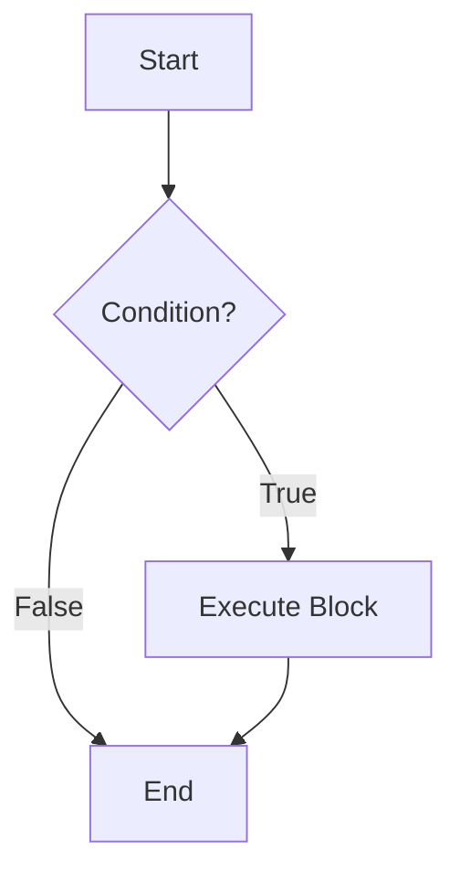
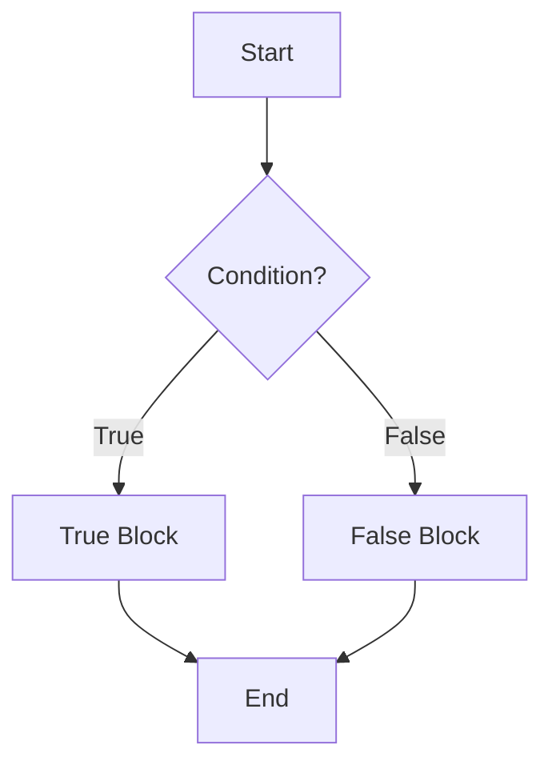
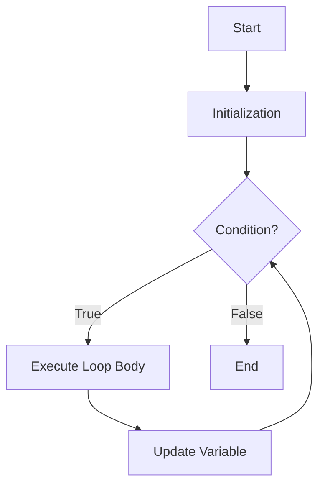
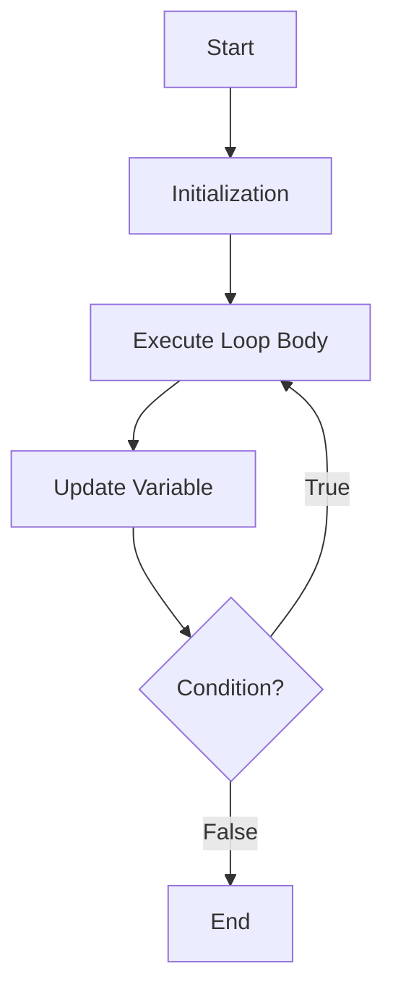
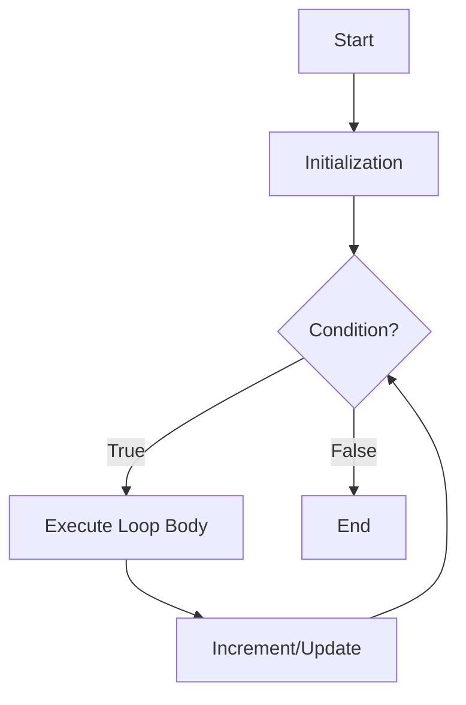

## 1. Introduction to Control Flow

By default, a C program executes statements **sequentially** (line by line). However, to solve real-world problems, we need to:

1.  **Make decisions** – Execute certain statements only if a condition is met (Branching).
2.  **Repeat tasks** – Execute a block of code multiple times (Looping).

C provides powerful constructs for both. The building block for all decisions is the **condition** (an expression that evaluates to `0` for False, or non-zero for True).

---

## 2. Branching (Decision Making)

Branching statements alter the flow of execution based on a condition.

### 2.1 The `if` Statement

Executes a block of code **only if** the given condition is true.

**Syntax**:

```c
if (condition) {
    // Block of code executes if condition is true (non-zero)
}
```

**Flowchart**:



**Example**:

```c
int age = 18;
if (age >= 18) {
    printf("Eligible to vote.\n");
}
```

---

### 2.2 The `if-else` Statement

Executes one block if the condition is true, and a different block if the condition is false.

**Syntax**:

```c
if (condition) {
    // Executes if condition is true
} else {
    // Executes if condition is false
}
```

**Flowchart**:



**Example**:

```c
int num = 7;
if (num % 2 == 0) {
    printf("Even");
} else {
    printf("Odd");
}
// Output: Odd
```

---

### 2.3 The `else if` Ladder

Used when there are **multiple mutually exclusive conditions** to check.

**Syntax**:

```c
if (condition1) {
    // Block 1
} else if (condition2) {
    // Block 2
} else if (condition3) {
    // Block 3
} else {
    // Default block (if none of the above are true)
}
```

**Example** (Grading System):

```c
int marks = 85;
if (marks >= 90) {
    printf("Grade A");
} else if (marks >= 75) {
    printf("Grade B");
} else if (marks >= 60) {
    printf("Grade C");
} else {
    printf("Fail");
}
// Output: Grade B
```

---

### 2.4 Nested `if-else`

An `if` or `if-else` inside another `if` or `if-else`. Used for checking a condition inside another condition.

**Syntax & Example**:

```c
int age = 25;
int citizen = 1; // 1 = Yes, 0 = No

if (age >= 18) {
    if (citizen == 1) {
        printf("Eligible to vote.");
    } else {
        printf("Not a citizen.");
    }
} else {
    printf("Too young.");
}
// Output: Eligible to vote.
```

---

## 3. Looping (Iteration)

Loops allow the execution of a block of statements repeatedly as long as a condition holds true.

### 3.1 The `while` Loop (Entry-Controlled)

- **Condition is checked first**. If true, the loop body executes. This repeats until the condition becomes false.
- If the condition is initially false, the body **never executes** (Zero iterations possible).

**Syntax**:

```c
initialization;
while (condition) {
    // Loop body
    increment/update; // Critical to avoid infinite loop
}
```

**Flowchart**:



**Example** (Print 1 to 5):

```c
int i = 1;
while (i <= 5) {
    printf("%d ", i);
    i++; // Update
}
// Output: 1 2 3 4 5
```

---

### 3.2 The `do-while` Loop (Exit-Controlled)

- **Executes the loop body first**, then checks the condition.
- Guarantees that the loop body executes **at least once**, even if the condition is false.

**Syntax**:

```c
initialization;
do {
    // Loop body
    increment/update;
} while (condition); // Note the semicolon!
```

**Flowchart**:



**Example** (Menu-driven program to accept input at least once):

```c
int choice;
do {
    printf("1. Start\n2. Exit\nEnter choice: ");
    scanf("%d", &choice);
} while (choice != 2);
// Runs at least once, always shows the menu.
```

---

### 3.3 The `for` Loop (Entry-Controlled)

- The most compact and commonly used loop.
- It combines **initialization**, **condition**, and **increment/update** in a single line.

**Syntax**:

```c
for (initialization; condition; increment/update) {
    // Loop body
}
```

**Execution Flow**:

1.  **Initialization** executes once (at the start).
2.  **Condition** is checked.
3.  If true, the **Body** executes.
4.  **Increment/Update** executes.
5.  Go back to Step 2.

**Flowchart**:



**Example** (Sum of first 10 natural numbers):

```c
int sum = 0, i;
for (i = 1; i <= 10; i++) {
    sum += i; // sum = sum + i
}
printf("Sum = %d", sum); // Output: 55
```

> **Exam Tip**: All three loops (`for`, `while`, `do-while`) are interchangeable. The `for` loop is preferred when the number of iterations is known beforehand (counting loops).

---

## 4. Nested Loops

A loop inside another loop. For each iteration of the outer loop, the inner loop runs completely.

**Example** (Multiplication Table from 1 to 2):

```c
int i, j;
for (i = 1; i <= 2; i++) {      // Outer loop
    for (j = 1; j <= 5; j++) {  // Inner loop
        printf("%d x %d = %d\t", i, j, i * j);
    }
    printf("\n"); // Newline after each outer iteration
}
// Output:
// 1x1=1 1x2=2 1x3=3 1x4=4 1x5=5
// 2x1=2 2x2=4 2x3=6 2x4=8 2x5=10
```

**Complexity**: Time complexity $O(n \times m)$.

---

## 5. Comparison Table

| Feature              | `if` / `if-else`                | `while`                                      | `do-while`                                | `for`                                        |
| :------------------- | :------------------------------ | :------------------------------------------- | :---------------------------------------- | :------------------------------------------- |
| **Purpose**          | Decision / Branching            | Iteration / Repetition                       | Iteration / Repetition                    | Iteration / Repetition                       |
| **Control Type**     | Conditional jump                | Entry-Controlled                             | Exit-Controlled                           | Entry-Controlled                             |
| **Min Executions**   | 0 or 1 (runs once at most)      | 0 (if condition false initially)             | 1 (always runs at least once)             | 0 (if condition false initially)             |
| **Update Statement** | Not required                    | Inside body                                  | Inside body                               | In header (easy to forget bug)               |
| **Use Case**         | Testing logic, single decisions | Unknown iterations, reading files until EOF. | Menu-driven programs (must execute once). | Fixed/known number of iterations (counting). |

---

## 6. Infinite Loops and Common Pitfalls

- **Infinite Loop**: The condition never becomes false.
  - `while (1) { ... }` (Runs forever, needs `break` to stop).
  - `for (;;) { ... }` (Same as infinite).
  - _Common Mistake_: `for(i=0; i<10; i--);` (Decrement instead of increment).
- **Missing Braces**: Without `{}`, only the **immediate next statement** belongs to the loop/if.
  ```c
  if (a > b)
      printf("A is bigger"); // This is inside 'if'
      printf("This is always printed!"); // This is outside 'if'! (Indentation trick)
  ```
- **Semicolon after condition**:
  ```c
  while (i <= 5); { // The semicolon creates an empty infinite loop!
      printf("%d", i);
      i++;
  }
  ```
- **Using `=` (Assignment) instead of `==` (Equality)**:
  ```c
  if (x = 5) { ... } // Assigns 5 to x. Condition is always TRUE (non-zero).
  ```

---

## 7. Sample Exam Programs

**Program 1: Find factorial using `for`**

```c
#include <stdio.h>
int main() {
    int n, i, fact = 1;
    printf("Enter number: ");
    scanf("%d", &n);
    for (i = 1; i <= n; i++) {
        fact *= i;
    }
    printf("Factorial = %d", fact);
    return 0;
}
```

**Program 2: Check Prime using `while`**

```c
#include <stdio.h>
int main() {
    int n, i = 2, flag = 1;
    printf("Enter number: ");
    scanf("%d", &n);
    while (i <= n / 2) {
        if (n % i == 0) {
            flag = 0;
            break;
        }
        i++;
    }
    if (flag) printf("Prime");
    else printf("Not Prime");
    return 0;
}
```


## 8. MCQ

#### Q1. By default, a C program executes statements in which order?

A) Random order
B) Sequential (line by line) ✅
C) Reverse order
D) Only the first statement

#### Q2. In C, a condition evaluates to:

A) 0 for True, 1 for False
B) 0 for False, non-zero for True ✅
C) 1 for True, 0 for False
D) Only 0 or 1

#### Q3. Which statement executes a block of code only if the given condition is true?

A) `if` ✅
B) `while`
C) `for`
D) `do-while`

#### Q4. What is the syntax of the `if` statement in C?

A) `if condition { }`
B) `if (condition) { }` ✅
C) `if [condition] { }`
D) `if condition then { }`

#### Q5. In the `if` statement, the block executes when the condition is:

A) Zero
B) Non-zero ✅
C) Negative only
D) Positive only

#### Q6. In the example `if (age >= 18)`, what is printed if age = 18?

A) Nothing
B) "Eligible to vote." ✅
C) "Not eligible"
D) Error

#### Q7. Which statement executes one block if condition is true and another if condition is false?

A) `if`
B) `if-else` ✅
C) `else if`
D) `while`

#### Q8. What is the output of `int num = 7; if (num % 2 == 0) { printf("Even"); } else { printf("Odd"); }`?

A) Even
B) Odd ✅
C) Error
D) Nothing

#### Q9. The `else if` ladder is used when:

A) Only one condition needs checking
B) There are multiple mutually exclusive conditions ✅
C) No conditions need checking
D) Only false conditions exist

#### Q10. In the grading example, if marks = 85, what is the output?

A) Grade A
B) Grade B ✅
C) Grade C
D) Fail

#### Q11. In the grading example, if marks = 92, what is the output?

A) Grade A ✅
B) Grade B
C) Grade C
D) Fail

#### Q12. In the grading example, if marks = 65, what is the output?

A) Grade A
B) Grade B
C) Grade C ✅
D) Fail

#### Q13. A Nested `if-else` is:

A) An `if` statement inside a loop
B) An `if` or `if-else` inside another `if` or `if-else` ✅
C) An `if` statement with multiple conditions
D) An `if` statement without braces

#### Q14. In the nested `if-else` example, if age = 25 and citizen = 1, what is the output?

A) Too young
B) Not a citizen
C) Eligible to vote ✅
D) Nothing

#### Q15. In the nested `if-else` example, if age = 16 and citizen = 1, what is the output?

A) Too young ✅
B) Not a citizen
C) Eligible to vote
D) Nothing

#### Q16. In the nested `if-else` example, if age = 25 and citizen = 0, what is the output?

A) Too young
B) Not a citizen ✅
C) Eligible to vote
D) Nothing

#### Q17. Which loop checks the condition first before executing the body?

A) `do-while`
B) `while` ✅
C) Both `while` and `do-while`
D) Neither

#### Q18. A `while` loop is called:

A) Exit-Controlled
B) Entry-Controlled ✅
C) Condition-Controlled
D) Counter-Controlled

#### Q19. If the condition in a `while` loop is initially false, how many times does the body execute?

A) 0 ✅
B) 1
C) Infinite
D) Depends on the update

#### Q20. In a `while` loop, the update statement is:

A) In the header
B) Inside the body ✅
C) Not required
D) Before the condition

#### Q21. What is the output of `int i = 1; while (i <= 5) { printf("%d ", i); i++; }`?

A) 1 2 3 4 5 ✅
B) 0 1 2 3 4
C) 1 2 3 4 5 6
D) Infinite loop

#### Q22. Which loop guarantees execution of the body at least once?

A) `while`
B) `for`
C) `do-while` ✅
D) Both `while` and `for`

#### Q23. A `do-while` loop is called:

A) Entry-Controlled
B) Exit-Controlled ✅
C) Condition-Controlled
D) Counter-Controlled

#### Q24. In a `do-while` loop, the condition is checked:

A) Before the body executes
B) After the body executes ✅
C) Only once
D) Never

#### Q25. The `do-while` loop syntax ends with:

A) No semicolon
B) A semicolon after while (condition); ✅
C) A semicolon after do
D) A comma

#### Q26. The `do-while` loop is best used for:

A) Fixed number of iterations
B) Menu-driven programs that must execute once ✅
C) Infinite loops
D) Array traversal

#### Q27. Which loop combines initialization, condition, and increment in a single line?

A) `while`
B) `do-while`
C) `for` ✅
D) None of the above

#### Q28. The `for` loop is:

A) Exit-Controlled
B) Entry-Controlled ✅
C) Both Entry and Exit Controlled
D) Neither

#### Q29. In a `for` loop, the initialization executes:

A) Every iteration
B) Once at the start ✅
C) After the body
D) Only if condition is true

#### Q30. In a `for` loop, the increment executes:

A) Before the body
B) After the body ✅
C) Before the condition
D) Only if condition is true

#### Q31. What is the output of `for (i = 1; i <= 10; i++) { sum += i; }` for sum starting from 0?

A) 45
B) 50
C) 55 ✅
D) 60

#### Q32. Which loop is preferred when the number of iterations is known beforehand?

A) `while`
B) `do-while`
C) `for` ✅
D) Any loop is equally preferred

#### Q33. All three loops (`for`, `while`, `do-while`) are:

A) Not interchangeable
B) Interchangeable ✅
C) Only used for different data types
D) Only `for` and `while` are interchangeable

#### Q34. A Nested Loop is:

A) A loop inside another loop ✅
B) Two loops running parallel
C) A loop with no body
D) A loop with multiple conditions

#### Q35. In nested loops, for each iteration of the outer loop:

A) The inner loop runs once
B) The inner loop runs completely ✅
C) Both loops run simultaneously
D) Only the outer loop runs

#### Q36. In the multiplication table example with `i` from 1 to 2 and `j` from 1 to 5, how many total iterations?

A) 5
B) 7
C) 10 ✅
D) 2

#### Q37. The time complexity of nested loops is:

A) O(n + m)
B) O(n × m) ✅
C) O(n/m)
D) O(n - m)

#### Q38. An `if` statement can execute how many times maximum?

A) 0
B) 1 ✅
C) Infinite
D) Depends on condition

#### Q39. An `if-else` statement can execute how many times maximum?

A) 0
B) 1 ✅
C) Infinite
D) Depends on condition

#### Q40. A `while` loop can execute how many times minimum?

A) 0 ✅
B) 1
C) Infinite
D) Depends on condition

#### Q41. A `do-while` loop can execute how many times minimum?

A) 0
B) 1 ✅
C) Infinite
D) Depends on condition

#### Q42. A `for` loop can execute how many times minimum?

A) 0 ✅
B) 1
C) Infinite
D) Depends on condition

#### Q43. Which of the following creates an infinite loop?

A) `while (i <= 5)`
B) `while (1)` ✅
C) `for (i=0; i<10; i++)`
D) `do { } while (i < 5);`

#### Q44. `for (;;)` in C creates:

A) A loop that never executes
B) An infinite loop ✅
C) A syntax error
D) A loop that executes once

#### Q45. What is the common mistake in `for(i=0; i<10; i--);`?

A) Syntax error
B) Infinite loop due to decrement instead of increment ✅
C) Logical error only
D) No error

#### Q46. Without braces `{}`, how many statements belong to the `if` condition?

A) All statements
B) Only the immediate next statement ✅
C) None
D) The statement before the condition

#### Q47. What does the following code print? `if (a > b) printf("A is bigger"); printf("This is always printed!");`

A) Only "A is bigger"
B) Only "This is always printed!"
C) Both statements (conditionally) ✅
D) Error

#### Q48. What is the issue with `while (i <= 5); { printf("%d", i); i++; }`?

A) Syntax error
B) The semicolon creates an empty infinite loop ✅
C) Logical error only
D) No issue

#### Q49. What is the issue with `if (x = 5) { ... }`?

A) Syntax error
B) Assignment instead of equality; condition always true ✅
C) Logical error only
D) No issue

#### Q50. Which operator should be used for equality comparison in C?

A) `=`
B) `==` ✅
C) `!=`
D) `===`

#### Q51. The `if` statement is used for:

A) Looping
B) Decision / Branching ✅
C) Function definition
D) Variable declaration

#### Q52. The `while` loop is used for:

A) Decision / Branching
B) Iteration / Repetition ✅
C) Function definition
D) Variable declaration

#### Q53. The `do-while` loop is used for:

A) Decision / Branching
B) Iteration / Repetition ✅
C) Function definition
D) Variable declaration

#### Q54. The `for` loop is used for:

A) Decision / Branching
B) Iteration / Repetition ✅
C) Function definition
D) Variable declaration

#### Q55. Which loop type is Entry-Controlled?

A) `do-while` only
B) `while` and `for` ✅
C) `do-while` and `while`
D) Only `for`

#### Q56. Which loop type is Exit-Controlled?

A) `while`
B) `for`
C) `do-while` ✅
D) All of the above

#### Q57. What is the factorial of 5 from the factorial program?

A) 60
B) 120 ✅
C) 24
D) 720

#### Q58. In the factorial program, `fact *= i` is equivalent to:

A) `fact = fact * i` ✅
B) `fact = fact + i`
C) `fact = i`
D) `fact = fact / i`

#### Q59. In the prime checking program, the loop runs until:

A) `i <= n`
B) `i <= n/2` ✅
C) `i < n`
D) `i <= sqrt(n)`

#### Q60. In the prime checking program, `flag = 0` indicates:

A) Number is prime
B) Number is not prime ✅
C) Number is even
D) Number is odd

#### Q61. In the prime checking program, `break` is used to:

A) Continue the loop
B) Exit the loop early ✅
C) Restart the loop
D) Skip the iteration

#### Q62. If the input to the prime program is 7, what is the output?

A) Prime ✅
B) Not Prime
C) Error
D) Nothing

#### Q63. If the input to the prime program is 9, what is the output?

A) Prime
B) Not Prime ✅
C) Error
D) Nothing

#### Q64. What is the minimum number of times a `while` loop body can execute?

A) 0 ✅
B) 1
C) Infinite
D) Depends on initialization

#### Q65. What is the minimum number of times a `do-while` loop body can execute?

A) 0
B) 1 ✅
C) Infinite
D) Depends on condition

#### Q66. In the flowchart for `if` statement, the condition leads to:

A) Only True path
B) True path and False path (but False goes to End) ✅
C) Only False path
D) Both paths execute

#### Q67. In the flowchart for `if-else`, the condition leads to:

A) Only one path
B) True path and False path ✅
C) No paths
D) Both paths merge immediately

#### Q68. In the flowchart for `while` loop, after executing the body, the flow goes to:

A) End
B) Update, then Condition ✅
C) Directly to Condition
D) Directly to End

#### Q69. In the flowchart for `do-while` loop, after executing the body, the flow goes to:

A) Condition ✅
B) End
C) Start
D) Update only

#### Q70. In the flowchart for `for` loop, after executing the body, the flow goes to:

A) End
B) Increment/Update, then Condition ✅
C) Directly to Condition
D) Initialization

#### Q71. Which loop body will execute at least once regardless of condition?

A) `while`
B) `for`
C) `do-while` ✅
D) All of the above

#### Q72. The `if` statement can be used without `else`:

A) True ✅
B) False
C) Only in C
D) Never

#### Q73. The `else` clause is optional in `if-else`:

A) True, but `else` requires `if` ✅
B) False
C) Only in loops
D) Never

#### Q74. The condition `(age >= 18)` evaluates to:

A) 0 if true
B) Non-zero if true ✅
C) Only 1 if true
D) Only 0 if false

#### Q75. In C, the value 0 represents:

A) True
B) False ✅
C) Both True and False
D) Neither

#### Q76. In C, any non-zero value represents:

A) True ✅
B) False
C) Both True and False
D) Neither

#### Q77. The `else if` ladder is also called:

A) Nested if
B) Multi-way if ✅
C) Switch statement
D) Ternary operator

#### Q78. In the grading example, what is printed for marks = 58?

A) Grade A
B) Grade B
C) Grade C
D) Fail ✅

#### Q79. In the grading example, what is printed for marks = 75?

A) Grade A
B) Grade B ✅
C) Grade C
D) Fail

#### Q80. Which loop is most suitable when the number of iterations is unknown but a condition must be checked before each iteration?

A) `for`
B) `while` ✅
C) `do-while`
D) All are equally suitable

#### Q81. Which loop is most suitable when the number of iterations is known and counting is involved?

A) `for` ✅
B) `while`
C) `do-while`
D) All are equally suitable

#### Q82. Which loop is most suitable for menu-driven programs?

A) `for`
B) `while`
C) `do-while` ✅
D) None

#### Q83. The statement `break` in a loop causes:

A) The loop to continue
B) The loop to exit immediately ✅
C) The program to crash
D) The condition to be rechecked

#### Q84. In the prime program, if `n = 2`, what is the output?

A) Prime ✅
B) Not Prime
C) Error
D) Nothing

#### Q85. In the prime program, if `n = 1`, what is the output?

A) Prime ✅ (flag remains 1)
B) Not Prime
C) Error
D) Nothing

#### Q86. In the prime program, if `n = 4`, what is the output?

A) Prime
B) Not Prime ✅
C) Error
D) Nothing

#### Q87. The `for` loop initialization can include multiple variables using:

A) Semicolon
B) Comma operator ✅
C) And operator
D) Or operator

#### Q88. The `for (i = 0, j = 10; i < 5; i++, j--)` is an example of:

A) Syntax error
B) Multiple initializations and updates ✅
C) Nested loop
D) Infinite loop

#### Q89. In the `do-while` loop, the condition is evaluated:

A) Before each iteration
B) After each iteration ✅
C) Only at the start
D) Only at the end of the program

#### Q90. In the `while` loop, the condition is evaluated:

A) Before each iteration ✅
B) After each iteration
C) Only at the start
D) Only at the end

#### Q91. In the `for` loop, the condition is evaluated:

A) Before each iteration ✅
B) After each iteration
C) Only at the start
D) Only at the end

#### Q92. What happens if the update statement is missing in a `while` loop?

A) The loop executes once
B) Infinite loop ✅
C) Syntax error
D) The loop never executes

#### Q93. What happens if the condition is missing in a `for` loop?

A) Syntax error
B) Infinite loop (assumed true) ✅
C) The loop never executes
D) The loop executes once

#### Q94. The `if` statement can be nested inside another `if`:

A) True ✅
B) False
C) Only in C++
D) Never

#### Q95. The `else` clause in an `if-else` is:

A) Mandatory
B) Optional ✅
C) Only for loops
D) Only for functions

#### Q96. In the factorial program, if n = 0, what is the output?

A) 0
B) 1 ✅ (loop doesn't execute, fact remains 1)
C) -1
D) Error

#### Q97. In the factorial program, if n = 3, what is the output?

A) 3
B) 6 ✅
C) 9
D) 12

#### Q98. Which of the following is a valid `for` loop syntax?

A) `for (i = 0; i < 10; i++)` ✅
B) `for i = 0 to 10`
C) `for (i < 10; i++)`
D) `for (i = 0; i < 10)`

#### Q99. Which of the following is a valid `while` loop syntax?

A) `while i < 10 { }`
B) `while (i < 10) { }` ✅
C) `while [i < 10] { }`
D) `while (i < 10); { }`

#### Q100. Which of the following is a valid `do-while` loop syntax?

A) `do { } while (i < 10);` ✅
B) `do { } while (i < 10)`
C) `do { } while i < 10;`
D) `do (i < 10) { }`

