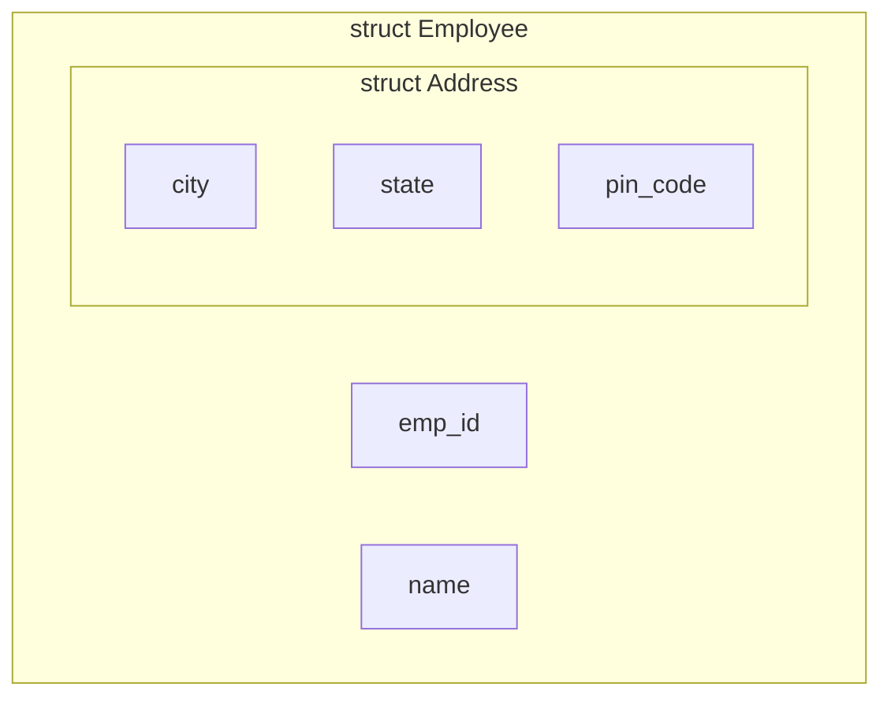

## 1. Introduction to Arrays

An **array** is a collection of similar data elements stored in contiguous memory locations under a single variable name. It allows us to store and manipulate a fixed number of elements efficiently.

**Why Arrays?**
Instead of creating 100 separate variables (e.g., `marks1`, `marks2` ... `marks100`), we create a single array `marks[100]`.

**Key Properties**:

- All elements are of the **same data type** (homogeneous).
- Indexing starts from `0`. So `arr[0]` is the first element.
- Elements are stored in contiguous (adjacent) memory locations, allowing fast random access.

---

## 2. One-Dimensional Arrays (1D)

### 2.1 Declaration

**Syntax**: `data_type array_name[size];`

**Example**:

```c
int marks[5];     // Array of 5 integers (indices 0 to 4)
float prices[10]; // Array of 10 floats
char name[50];    // Array of 50 characters (also a string)
```

### 2.2 Initialization

We can initialize arrays at the time of declaration.

```c
int arr1[5] = {10, 20, 30, 40, 50};     // Complete initialization.
int arr2[5] = {1, 2, 3};                // Partial: arr2[0]=1, arr2[1]=2, arr2[2]=3, rest = 0.
int arr3[] = {1, 2, 3};                 // Size automatically set to 3.
int arr4[5] = {0};                      // Sets all elements to 0.
```

### 2.3 Accessing and Reading/Writing

- **Access**: `array_name[index]` (e.g., `marks[2]`).
- **Read (Input)**: Using loops.

**Example: Read and Print 1D Array**:

```c
#include <stdio.h>
int main() {
    int arr[5], i;

    // Reading
    printf("Enter 5 elements: ");
    for (i = 0; i < 5; i++) {
        scanf("%d", &arr[i]);
    }

    // Writing / Printing
    printf("Array elements: ");
    for (i = 0; i < 5; i++) {
        printf("%d ", arr[i]);
    }
    return 0;
}
```

### 2.4 Uses of 1D Arrays

1. Storing a list of values (e.g., marks, ages, IDs).
2. Implementing mathematical vectors.
3. Sorting algorithms (Bubble Sort, Selection Sort).
4. Searching algorithms (Linear Search, Binary Search).
5. Handling strings (character arrays).

---

## 3. Two-Dimensional Arrays (2D)

A 2D array is like a **table** (matrix) consisting of rows and columns.

### 3.1 Declaration

**Syntax**: `data_type array_name[row_size][column_size];`

**Example**:

```c
int matrix[3][4];  // 3 rows, 4 columns (total 12 integers).
```

### 3.2 Initialization

```c
int arr[2][3] = { {1, 2, 3}, {4, 5, 6} }; // Row-wise initialization.
int arr[2][3] = {1, 2, 3, 4, 5, 6};      // Compiler fills row-wise (row 0: 1,2,3; row 1: 4,5,6).
int arr[][3] = { {1,2}, {4,5} };          // Column size is mandatory; row size can be omitted.
```

> **Note**: In C, the second dimension (column count) must always be specified.

### 3.3 Memory Representation (Row-Major Order)

C stores 2D arrays in **Row-Major Order** (row by row). All elements of Row 0 come first, then Row 1, etc.

**Example**: `arr[2][3] = { {1, 2, 3}, {4, 5, 6} }`

```mermaid
graph LR
    subgraph Memory Layout [Row-Major Order in RAM]
        direction LR
        A[Address: 1000] --> B[arr[0][0] = 1]
        A2[Address: 1004] --> C[arr[0][1] = 2]
        A3[Address: 1008] --> D[arr[0][2] = 3]
        A4[Address: 1012] --> E[arr[1][0] = 4]
        A5[Address: 1016] --> F[arr[1][1] = 5]
        A6[Address: 1020] --> G[arr[1][2] = 6]
    end
```

### 3.4 Accessing and Read/Write

Nested loops are used:

- Outer loop for rows.
- Inner loop for columns.

**Example: Read and Print a 2D Matrix**:

```c
#include <stdio.h>
int main() {
    int arr[2][3], i, j;

    // Reading
    printf("Enter 6 elements (row-wise): ");
    for (i = 0; i < 2; i++) {
        for (j = 0; j < 3; j++) {
            scanf("%d", &arr[i][j]);
        }
    }

    // Writing (Printing Matrix)
    printf("Matrix:\n");
    for (i = 0; i < 2; i++) {
        for (j = 0; j < 3; j++) {
            printf("%d ", arr[i][j]);
        }
        printf("\n"); // Newline after each row
    }
    return 0;
}
```

### 3.5 Uses of 2D Arrays

1. **Matrix Operations**: Addition, subtraction, multiplication, transposition.
2. **Tabular Data**: Storing student marks across multiple subjects.
3. **Games**: Chessboards, Tic-Tac-Toe (grid representation).
4. **Image Processing**: Representing pixel values in grayscale/RGB images.

---

## 4. Strings and String Handling with Arrays

A **string** in C is a sequence of characters stored in a `char` array, terminated by a **null character** (`'\0'`). This null character marks the end of the string.

**Declaration**:

```c
char str[20];                // Can hold up to 19 characters + '\0'
char name[5] = "John";       // Stored as: J, o, h, n, \0
```

### 4.1 Reading and Writing Strings

| Function                  | Purpose                                  | Example                  | Caveat                            |
| :------------------------ | :--------------------------------------- | :----------------------- | :-------------------------------- |
| `scanf("%s", str)`        | Reads a string (stops at space/newline). | `scanf("%s", name);`     | Cannot read multi-word strings.   |
| `gets(str)` (deprecated)  | Reads a line including spaces.           | `gets(sentence);`        | Unsafe (buffer overflow) – avoid. |
| `fgets(str, size, stdin)` | Safe reading of a line with spaces.      | `fgets(str, 20, stdin);` | Reads `\n` as well.               |
| `printf("%s", str)`       | Prints the string until `\0`.            | `printf("%s", name);`    | Standard output.                  |
| `puts(str)`               | Prints the string and adds a newline.    | `puts(name);`            | Fast and simple.                  |

**Example (Read/Write with spaces)**:

```c
#include <stdio.h>
int main() {
    char fullname[50];
    printf("Enter full name: ");
    fgets(fullname, 50, stdin); // Reads "John Doe"
    printf("Hello, %s", fullname); // Note: fgets retains newline, so output has an extra line break.
    return 0;
}
```

### 4.2 String Concatenation and Comparison (Manual & Library)

String functions are defined in the header file `<string.h>`.

| Function     | Prototype                 | Description                                                                            | Example                            |
| :----------- | :------------------------ | :------------------------------------------------------------------------------------- | :--------------------------------- |
| **`strlen`** | `int strlen(str);`        | Returns the length (excluding `\0`).                                                   | `int len = strlen("Hello");` → `5` |
| **`strcat`** | `strcat(dest, src);`      | Concatenates `src` at the end of `dest`.                                               | `strcat(s1, s2);`                  |
| **`strcmp`** | `int strcmp(str1, str2);` | Compares lexicographically. Returns `0` if equal, `<0` if str1 < str2, `>0` otherwise. | `if(strcmp(s1, s2)==0) { ... }`    |
| **`strcpy`** | `strcpy(dest, src);`      | Copies `src` into `dest`.                                                              | `strcpy(copy, original);`          |
| **`strlwr`** | `strlwr(str);`            | Converts all characters to lowercase (non-standard, but common).                       | `strlwr(str);`                     |
| **`strupr`** | `strupr(str);`            | Converts all characters to uppercase (non-standard).                                   | `strupr(str);`                     |

**Manual Concatenation (Logic)**:

```c
int i, j;
char s1[100] = "Hello", s2[] = "World";

// Find end of s1
i = 0;
while (s1[i] != '\0') i++;

// Copy s2 to end of s1
j = 0;
while (s2[j] != '\0') {
    s1[i] = s2[j];
    i++;
    j++;
}
s1[i] = '\0'; // Null terminate the result
printf("%s", s1); // Output: HelloWorld
```

**Manual Comparison (Logic)**:

```c
int flag = 1; // assume equal
for (i = 0; s1[i] != '\0' || s2[i] != '\0'; i++) {
    if (s1[i] != s2[i]) {
        flag = 0;
        break;
    }
}
```

---

## 5. Structures

A **structure** is a user-defined data type that allows grouping of logically related variables of **different data types** under a single name.

### 5.1 Defining and Declaring a Structure

**Syntax**:

```c
struct struct_name {
    data_type member1;
    data_type member2;
    ...
};
```

**Example** (Student Record):

```c
struct Student {
    int roll_no;
    char name[50];
    float marks;
};
```

### 5.2 Declaring Structure Variables

```c
struct Student s1;                // Local variable
struct Student s2, s3;            // Multiple variables
struct Student s4 = {101, "Alice", 85.5}; // Initialization at declaration
```

**Accessing Members**: Use the **dot (`.`) operator**.

```c
s1.roll_no = 102;
strcpy(s1.name, "Bob");
s1.marks = 92.0;
printf("Roll: %d, Name: %s", s1.roll_no, s1.name);
```

### 5.3 Alternative `typedef` (Optional but useful)

```c
typedef struct {
    int roll;
    char name[50];
} Student;

Student s1, s2; // No need to write 'struct' keyword repeatedly.
```

---

## 6. Arrays of Structures

We can create an array of structures to store data of multiple entities (e.g., a class of 50 students).

**Declaration**:

```c
struct Student class[50]; // Array of 50 Student structures
```

**Example** (Reading and Printing 3 Students):

```c
#include <stdio.h>
struct Student {
    int roll;
    char name[30];
    float marks;
};

int main() {
    struct Student s[3]; // Array of 3 structures
    int i;

    // Input
    for (i = 0; i < 3; i++) {
        printf("Enter roll, name, marks for student %d: ", i+1);
        scanf("%d %s %f", &s[i].roll, s[i].name, &s[i].marks);
    }

    // Output
    printf("\nStudent Details:\n");
    for (i = 0; i < 3; i++) {
        printf("%d\t%s\t%.2f\n", s[i].roll, s[i].name, s[i].marks);
    }
    return 0;
}
```

**Use Case**: Employee database, library book catalog, student result management.

---

## 7. Arrays within Structures

A structure can contain an array as one of its members. This is very common for storing multiple related data points for a single entity.

**Example** (Storing marks of 5 subjects for a student):

```c
struct Student {
    int roll;
    char name[50];
    int marks[5];     // Array within structure
};

int main() {
    struct Student s1;
    s1.roll = 101;
    strcpy(s1.name, "Alice");
    s1.marks[0] = 85;
    s1.marks[1] = 90;
    // ... and so on
    return 0;
}
```

---

## 8. Nested Structures (Structure within Structure)

A structure can contain another structure as a member. This is used to represent complex relationships (e.g., a student has an address, which has city, state, and pin).

**Example**:

```c
struct Address {
    char city[30];
    char state[30];
    int pin_code;
};

struct Employee {
    int emp_id;
    char name[50];
    struct Address addr;   // Nested structure
};

int main() {
    struct Employee emp1;
    emp1.emp_id = 1001;
    strcpy(emp1.name, "John Doe");

    // Accessing nested structure members
    strcpy(emp1.addr.city, "New York");
    strcpy(emp1.addr.state, "NY");
    emp1.addr.pin_code = 10001;

    printf("City: %s, State: %s", emp1.addr.city, emp1.addr.state);
    return 0;
}
```

**Memory Representation (Nested Structure)**:



## 9. MCQ

#### Q1. An array is a collection of:

A) Different data elements stored randomly
B) Similar data elements stored in contiguous memory locations under a single variable name ✅
C) Different data elements stored in contiguous memory locations
D) Similar data elements stored in non-contiguous memory locations

#### Q2. Why are arrays used?

A) To create separate variables for each element
B) To store and manipulate a fixed number of elements efficiently under one name ✅
C) To store only characters
D) To avoid using loops

#### Q3. All elements in an array must be of:

A) Different data types
B) The same data type (homogeneous) ✅
C) Character data type only
D) Integer data type only

#### Q4. In C, array indexing starts from:

A) 1
B) 0 ✅
C) -1
D) Depends on the compiler

#### Q5. Elements of an array are stored in:

A) Random memory locations
B) Contiguous (adjacent) memory locations ✅
C) Only in cache memory
D) Non-contiguous memory locations

#### Q6. What is the correct syntax to declare an array of 5 integers?

A) `int marks(5);`
B) `int marks[5];` ✅
C) `int 5marks;`
D) `array int marks[5];`

#### Q7. What is the valid declaration for an array of 10 floats?

A) `float prices(10);`
B) `float[10] prices;`
C) `float prices[10];` ✅
D) `prices float[10];`

#### Q8. How many elements can the array `char name[50]` hold excluding the null terminator?

A) 50
B) 49 ✅
C) 51
D) 48

#### Q9. What is the output of `int arr1[5] = {10, 20, 30, 40, 50}; arr1[2]`?

A) 10
B) 20
C) 30 ✅
D) 40

#### Q10. If `int arr2[5] = {1, 2, 3};`, what is the value of `arr2[3]`?

A) 0 ✅
B) 3
C) Garbage value
D) 4

#### Q11. If `int arr3[] = {1, 2, 3};`, what is the size of the array?

A) 2
B) 3 ✅
C) 4
D) 5

#### Q12. How do you set all elements of `int arr4[5]` to 0?

A) `int arr4[5] = {};`
B) `int arr4[5] = {0};` ✅
C) `int arr4[5] = {0, 0, 0, 0, 0};`
D) Both B and C are correct

#### Q13. Which loop is commonly used to read and print array elements?

A) `do-while` loop
B) `for` loop ✅
C) `if-else` statement
D) `switch` statement

#### Q14. In `scanf("%d", &arr[i]);`, why is `&` used?

A) To print the value
B) To pass the address of the array element ✅
C) To increment the value
D) To decrement the value

#### Q15. Which of the following is a use of 1D arrays?

A) Storing a list of values ✅
B) Storing chessboards
C) Representing images
D) Matrix multiplication

#### Q16. A 2D array is like a:

A) Single row of values
B) Table (matrix) with rows and columns ✅
C) List of characters
D) Stack

#### Q17. What is the syntax to declare a 2D array with 3 rows and 4 columns?

A) `int matrix[4][3];`
B) `int matrix[3][4];` ✅
C) `int matrix(3,4);`
D) `int matrix[3,4];`

#### Q18. How many total elements are in `int matrix[3][4]`?

A) 7
B) 12 ✅
C) 24
D) 10

#### Q19. What is the correct initialization for a 2D array with 2 rows and 3 columns?

A) `int arr[2][3] = { {1, 2, 3}, {4, 5, 6} };` ✅
B) `int arr[2][3] = {1, 2, 3, 4, 5, 6};` ✅
C) `int arr[2][3] = {1, 2, 3, 4, 5};`
D) Both A and B are correct

#### Q20. In C, for a 2D array, which dimension is mandatory to specify?

A) Row size
B) Column size ✅
C) Both row and column size
D) Neither

#### Q21. What is the correct declaration if row size is omitted in a 2D array?

A) `int arr[][3] = { {1,2}, {4,5} };` ✅
B) `int arr[2][] = { {1,2}, {4,5} };`
C) `int arr[][] = { {1,2}, {4,5} };`
D) `int arr[][ ] = { {1,2}, {4,5} };`

#### Q22. C stores 2D arrays in which memory order?

A) Column-Major Order
B) Row-Major Order ✅
C) Diagonal-Major Order
D) Random Order

#### Q23. In Row-Major Order for `arr[2][3]`, which element comes first in memory?

A) `arr[1][0]`
B) `arr[0][0]` ✅
C) `arr[0][1]`
D) `arr[1][2]`

#### Q24. In Row-Major Order for `arr[2][3]`, which element comes last in memory?

A) `arr[0][2]`
B) `arr[1][0]`
C) `arr[1][2]` ✅
D) `arr[1][1]`

#### Q25. Which type of loop is used to access elements of a 2D array?

A) Single loop
B) Nested loops ✅
C) Infinite loop
D) do-while loop

#### Q26. In nested loops for a 2D array, the outer loop iterates over:

A) Columns
B) Rows ✅
C) Elements
D) Memory addresses

#### Q27. In nested loops for a 2D array, the inner loop iterates over:

A) Rows
B) Columns ✅
C) Elements
D) Memory addresses

#### Q28. A string in C is a sequence of characters stored in a `char` array terminated by:

A) A semicolon (;)
B) A null character ('\0') ✅
C) A newline character
D) A space

#### Q29. The null character `'\0'` marks:

A) The start of the string
B) The end of the string ✅
C) The middle of the string
D) A tab space

#### Q30. If `char name[5] = "John";`, how is it stored in memory?

A) J, o, h, n
B) J, o, h, n, \0 ✅
C) J, o, h, n, space
D) J, o, h, n, \n

#### Q31. How many characters can `char str[20]` hold including the null terminator?

A) 20
B) 19 ✅
C) 21
D) 18

#### Q32. Which function safely reads a line including spaces in C?

A) `scanf("%s", str)`
B) `gets(str)`
C) `fgets(str, size, stdin)` ✅
D) `read(str)`

#### Q33. Which function is deprecated and unsafe due to buffer overflow?

A) `fgets`
B) `gets` ✅
C) `scanf`
D) `printf`

#### Q34. Which function prints a string and adds a newline?

A) `printf("%s", str)`
B) `puts(str)` ✅
C) `fputs(str)`
D) `scanf`

#### Q35. `scanf("%s", str)` cannot read:

A) Single characters
B) Multi-word strings with spaces ✅
C) Integers
D) Floating point numbers

#### Q36. The header file for string functions is:

A) `<stdio.h>`
B) `<string.h>` ✅
C) `<stdlib.h>`
D) `<math.h>`

#### Q37. `strlen("Hello")` returns:

A) 6
B) 5 ✅
C) 4
D) 7

#### Q38. `strlen` returns the length of the string excluding:

A) The first character
B) The null character '\0' ✅
C) The last character
D) All vowels

#### Q39. `strcat(dest, src)` does what?

A) Copies src into dest
B) Compares dest and src
C) Concatenates src at the end of dest ✅
D) Returns the length of dest

#### Q40. `strcmp(str1, str2)` returns 0 when:

A) str1 is greater than str2
B) str1 is less than str2
C) str1 and str2 are equal ✅
D) str2 is greater than str1

#### Q41. `strcmp(str1, str2)` returns a negative value when:

A) str1 is greater than str2
B) str1 is less than str2 ✅
C) str1 and str2 are equal
D) Both are empty

#### Q42. `strcpy(dest, src)` does what?

A) Copies src into dest ✅
B) Concatenates src at end of dest
C) Compares dest and src
D) Returns the length of src

#### Q43. Which function converts a string to lowercase?

A) `strupr`
B) `strlwr` ✅
C) `strcmp`
D) `strcat`

#### Q44. Which function converts a string to uppercase?

A) `strupr` ✅
B) `strlwr`
C) `strcmp`
D) `strcat`

#### Q45. In manual string concatenation, the first step is to:

A) Copy s2 into s1
B) Find the end of s1 ✅
C) Compare s1 and s2
D) Find the length of s2

#### Q46. In manual string concatenation, after copying s2 to s1, the result must be:

A) Printed immediately
B) Null terminated with '\0' ✅
C) Converted to lowercase
D) Compared with s2

#### Q47. A structure is a user-defined data type that allows grouping of:

A) Variables of the same data type
B) Variables of different data types under a single name ✅
C) Only integer variables
D) Only character variables

#### Q48. What is the correct syntax to define a structure?

A) `struct Student { int roll; char name[50]; float marks; };` ✅
B) `struct Student { int roll, char name[50], float marks; }`
C) `struct { int roll; char name[50]; float marks; } Student;`
D) `Student struct { int roll; char name[50]; float marks; };`

#### Q49. Which operator is used to access structure members?

A) `->` (arrow)
B) `.` (dot) ✅
C) `::` (scope resolution)
D) `*` (asterisk)

#### Q50. How do you set the roll number of structure variable `s1` to 102?

A) `s1.roll_no = 102;` ✅
B) `s1->roll_no = 102;`
C) `roll_no.s1 = 102;`
D) `s1(roll_no) = 102;`

#### Q51. How do you copy a name to a structure member using string functions?

A) `s1.name = "Bob";`
B) `s1.name = 'Bob';`
C) `strcpy(s1.name, "Bob");` ✅
D) `s1->name = "Bob";`

#### Q52. What is the purpose of `typedef` in structures?

A) To create multiple structures
B) To avoid writing the keyword 'struct' repeatedly ✅
C) To delete a structure
D) To copy a structure

#### Q53. With `typedef struct { int roll; char name[50]; } Student;`, how do you declare a variable?

A) `struct Student s1;`
B) `Student s1;` ✅
C) `typedef Student s1;`
D) `s1 Student;`

#### Q54. An array of structures is used to store:

A) A single entity's data
B) Data of multiple entities of the same structure type ✅
C) Data of different structure types
D) Only integer data

#### Q55. What is the declaration for an array of 50 Student structures?

A) `struct Student class[50];` ✅
B) `struct Student[50] class;`
C) `Student class(50);`
D) `struct class[50] Student;`

#### Q56. How do you access the name of the second student in an array of structures `s`?

A) `s[1].name` ✅
B) `s.name[1]`
C) `s[2].name`
D) `s.name(2)`

#### Q57. How do you access the marks of the third student in an array of structures `s`?

A) `s.marks[3]`
B) `s[2].marks` ✅
C) `s[3].marks`
D) `s.marks(3)`

#### Q58. An array within a structure means:

A) The structure is inside an array
B) The structure contains an array as one of its members ✅
C) Both structure and array are same
D) The array contains structures

#### Q59. In `struct Student { int roll; char name[50]; int marks[5]; };`, `marks` is:

A) A structure member that is an array ✅
B) A separate array
C) A pointer
D) A nested structure

#### Q60. How do you access the second subject marks of `s1` in `struct Student` with `marks[5]`?

A) `s1.marks[1]` ✅
B) `s1.marks(1)`
C) `s1[1].marks`
D) `marks[1].s1`

#### Q61. A nested structure means:

A) A structure inside a function
B) A structure containing another structure as a member ✅
C) An array inside a structure
D) A pointer to a structure

#### Q62. In the nested structure example, `struct Employee` contains:

A) Only basic data types
B) A nested `struct Address` ✅
C) An array of addresses
D) Another Employee structure

#### Q63. How do you access the city of an employee `emp1` in nested structures?

A) `emp1.addr.city` ✅
B) `emp1.city`
C) `addr.emp1.city`
D) `city.emp1.addr`

#### Q64. How do you access the pin code of an employee `emp1` in nested structures?

A) `emp1.addr.pin_code` ✅
B) `emp1.pin_code`
C) `addr.emp1.pin_code`
D) `pin_code.emp1.addr`

#### Q65. In the manual string comparison logic, the loop condition is:

A) `s1[i] != '\0' || s2[i] != '\0'` ✅
B) `s1[i] == '\0' && s2[i] == '\0'`
C) `s1[i] != '\0' && s2[i] != '\0'`
D) `s1[i] == '\0' || s2[i] == '\0'`

#### Q66. What is the output of `strcmp("apple", "banana")`?

A) 0
B) Negative ✅
C) Positive
D) Undefined

#### Q67. What is the output of `strcmp("banana", "apple")`?

A) 0
B) Negative
C) Positive ✅
D) Undefined

#### Q68. Which of the following is TRUE about structures?

A) They store homogeneous data
B) They store heterogeneous data ✅
C) They cannot contain arrays
D) They cannot contain other structures

#### Q69. The dot operator `.` is used to access structure members for:

A) Structure variables ✅
B) Structure pointers
C) Both structure variables and pointers
D) Neither

#### Q70. In `scanf("%d %s %f", &s[i].roll, s[i].name, &s[i].marks);`, why is `&` not used for `s[i].name`?

A) Because name is a string (array), already an address ✅
B) Because name is an integer
C) Because name is a structure
D) Because name is a float

#### Q71. What is the output of the following? `char str[] = "Hello"; printf("%lu", sizeof(str));`

A) 5
B) 6 ✅
C) 4
D) 7

#### Q72. What is the output of `strlen("")`?

A) 0 ✅
B) 1
C) -1
D) Undefined

#### Q73. Which function can read multi-word strings safely?

A) `scanf("%s", str)`
B) `fgets(str, size, stdin)` ✅
C) `gets(str)`
D) `getchar()`

#### Q74. In manual string concatenation, `s1[i] = '\0';` is used to:

A) Start the string
B) Null terminate the result ✅
C) End the program
D) Clear the string

#### Q75. A 2D array can be used to represent:

A) A list of numbers
B) A matrix (table) with rows and columns ✅
C) A single character
D) A string

#### Q76. In `int arr[2][3] = { {1,2,3}, {4,5,6} };`, `arr[1][2]` is:

A) 3
B) 4
C) 5
D) 6 ✅

#### Q77. In `int arr[2][3] = {1, 2, 3, 4, 5, 6};`, `arr[0][2]` is:

A) 1
B) 2
C) 3 ✅
D) 4

#### Q78. For `int arr[2][3]`, what is the size of the array in bytes (assuming int is 4 bytes)?

A) 6 bytes
B) 12 bytes
C) 24 bytes ✅
D) 48 bytes

#### Q79. Strings in C are terminated by:

A) Newline
B) Null character ✅
C) Space
D) Tab

#### Q80. The `strcat` function requires the destination to have:

A) Less space
B) Enough space to hold the concatenated result ✅
C) Same size as source
D) Null character at start

#### Q81. In the memory representation of Row-Major Order, the address of `arr[1][0]` comes after:

A) `arr[0][2]` ✅
B) `arr[1][1]`
C) `arr[2][0]`
D) `arr[0][0]`

#### Q82. What is the use of `fgets` over `scanf("%s")`?

A) `fgets` is faster
B) `fgets` can read strings with spaces ✅
C) `fgets` only reads integers
D) `fgets` is deprecated

#### Q83. The `strcmp` function returns 0 when:

A) Strings are equal ✅
B) Strings are different
C) First string is larger
D) Second string is larger

#### Q84. A structure can contain:

A) Only basic data types
B) Arrays and other structures as members ✅
C) Only arrays
D) Only other structures

#### Q85. The `strupr` and `strlwr` functions are:

A) Part of standard C library
B) Non-standard but common ✅
C) Not available in any compiler
D) Only for Windows

#### Q86. Which of the following correctly initializes a string?

A) `char str[] = "Hello";` ✅
B) `char str[5] = "Hello";`
C) `char str = "Hello";`
D) `char str(6) = "Hello";`

#### Q87. `char str[5] = "Hello";` causes:

A) No error, stores "Hello"
B) Error because no space for '\0' ✅
C) Stores "Hell"
D) Stores "Hello\0"

#### Q88. In a 2D array declaration `int arr[][3] = { {1,2}, {4,5} };`, what is the value of `arr[1][2]`?

A) 0 ✅
B) 5
C) Garbage value
D) 4

#### Q89. In a 2D array declaration `int arr[2][3] = { {1,2}, {4,5} };`, what is the value of `arr[0][2]`?

A) 0 ✅
B) 3
C) Garbage value
D) 2

#### Q90. The `strcpy` function copies the string including:

A) Only the characters
B) The null character '\0' ✅
C) Only the first character
D) A newline

#### Q91. Which of the following is NOT a use of 2D arrays?

A) Matrix operations
B) Storing tabular data
C) Representing images
D) Storing a list of names ✅

#### Q92. In nested structures, the outer structure is accessed first, then:

A) The inner structure name, then its members ✅
B) Only the inner structure members directly
C) The outer structure members only
D) Both structures are accessed simultaneously

#### Q93. An array of structures is useful for:

A) Storing a single student's data
B) Storing multiple students' data ✅
C) Storing only integer data
D) Storing only string data

#### Q94. Which of the following correctly creates a structure variable and initializes it?

A) `struct Student s1 = {101, "Alice", 85.5};` ✅
B) `struct Student s1 = 101, "Alice", 85.5;`
C) `struct Student s1(101, "Alice", 85.5);`
D) `Student s1 = (101, "Alice", 85.5);`

#### Q95. How do you access the state in nested structures for `emp1`?

A) `emp1.state`
B) `emp1.addr.state` ✅
C) `addr.emp1.state`
D) `state.emp1.addr`

#### Q96. The `fgets` function reads the newline character as well, which means:

A) It must be removed manually if not wanted ✅
B) It is automatically removed
C) It causes an error
D) It is ignored

#### Q97. In the manual string comparison logic, `flag` is used to:

A) Store the result of comparison ✅
B) Store the length of strings
C) Store the index
D) Store the address

#### Q98. If `flag = 1` after string comparison, it means:

A) Strings are equal ✅
B) Strings are different
C) Strings are empty
D) Strings are same length

#### Q99. In the row-major order memory layout diagram, consecutive memory addresses contain:

A) Alternate rows
B) Elements of the same row consecutively ✅
C) Elements of the same column consecutively
D) Random elements

#### Q100. Which of the following is TRUE about structures and arrays?

A) Arrays store homogeneous data; structures store heterogeneous data ✅
B) Arrays store heterogeneous data; structures store homogeneous data
C) Both store only homogeneous data
D) Both store only heterogeneous data
