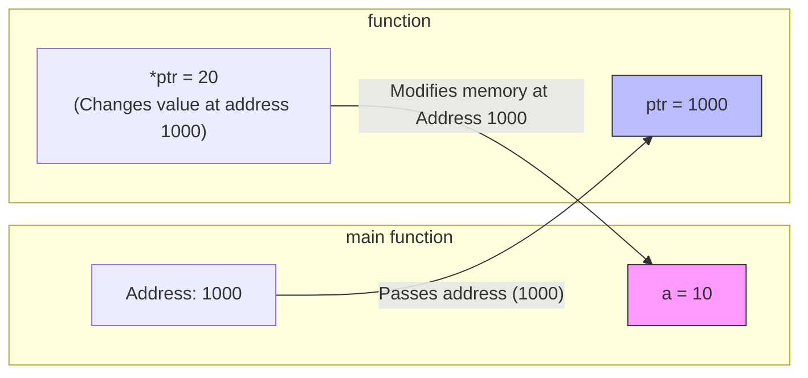

## 1. Introduction and Need for Functions

A **function** is a self-contained block of code that performs a specific task. In C, functions can be broadly classified into:

1. **Library Functions**: Pre-defined functions provided by C (e.g., `printf()`, `scanf()`, `strlen()`).
2. **User-Defined Functions**: Functions created by the programmer to perform custom tasks.

### The Need for Functions (Advantages)

1. **Modularity**: Breaks a large program into smaller, manageable, and logical modules.
2. **Reusability (DRY Principle)**: Once defined, a function can be called multiple times from different parts of the program, reducing code duplication.
3. **Readability**: The `main()` function becomes concise and reads like a high-level solution.
4. **Ease of Debugging**: Errors are localized to specific functions, making testing and debugging easier.
5. **Team Development**: Different programmers can work on different functions simultaneously.
6. **Memory Efficiency**: Saves memory by executing shared code without duplicating it.

---

## 2. Components of a Function

A function typically has three parts:

1. **Declaration (Prototype)**: Tells the compiler about the function's name, return type, and parameters (optional, but required before calling).
2. **Definition**: Contains the actual body/logic of the function.
3. **Call**: Invoking the function from `main()` or another function.

### Syntax of Function Definition

```c
return_type function_name(parameter_list) {
    // Body of the function
    // ... statements ...
    return value; // If return_type is not 'void'
}
```

### Example

```c
#include <stdio.h>

// 1. Declaration (Prototype)
int add(int a, int b);

int main() {
    int result;
    // 3. Function Call
    result = add(5, 3);
    printf("Sum = %d", result);
    return 0;
}

// 2. Definition
int add(int a, int b) {
    return a + b; // Return value
}
```

---

## 3. Parameter Passing: Call by Value vs Call by Reference

### 3.1 Call by Value

- **Mechanism**: A copy of the actual argument's value is passed to the formal parameter.
- **Effect**: Changes made inside the function **do not** affect the original variable in the calling function.
- **Default Behavior**: C uses Call by Value by default for all data types (except arrays, which decay to pointers).

```mermaid
graph LR
    subgraph main [main function]
        M_A[a = 10]
    end
    subgraph function [function]
        F_A[x = 10 (copy)]
    end
    M_A -- "Passes value (10)" --> F_A
    F_A -- "Changes x to 20 (copy changes)" --> M_A
    style M_A fill:#f9f,stroke:#333
    style F_A fill:#bbf,stroke:#333
```

_(Note: `a` in main remains 10 because the function only changed the copy)._

**Example**:

```c
void changeValue(int x) {
    x = 20; // Modifies the local copy only
}

int main() {
    int a = 10;
    changeValue(a);
    printf("%d", a); // Output: 10 (unchanged)
    return 0;
}
```

---

### 3.2 Call by Reference (Simulated using Pointers)

- **Mechanism**: The **address** of the actual variable is passed to the formal parameter (which must be a pointer).
- **Effect**: The function can directly access and modify the original variable using the dereference operator (`*`).
- **Crucial Rule**: C does not have a native "pass by reference" for variables; we _simulate_ it by passing addresses via pointers.



_(Note: Changes affect the original `a` because the function writes directly to its memory address)._

**Example** (Swapping Two Numbers):

```c
#include <stdio.h>

// Pass by Reference (using pointers)
void swap(int *x, int *y) {
    int temp;
    temp = *x;  // Dereference x to get its value
    *x = *y;
    *y = temp;
}

int main() {
    int a = 5, b = 10;
    printf("Before: a=%d, b=%d\n", a, b); // 5, 10
    swap(&a, &b); // Pass addresses of a and b
    printf("After: a=%d, b=%d\n", a, b);  // 10, 5 (Swapped!)
    return 0;
}
```

### Comparison Table

| Feature                | Call by Value                                             | Call by Reference (using pointers)                            |
| :--------------------- | :-------------------------------------------------------- | :------------------------------------------------------------ |
| **Passed to function** | Value (copy)                                              | Address (pointer)                                             |
| **Memory**             | Separate memory allocated for parameter.                  | Pointer variable stores address (no duplicate data).          |
| **Original Variable**  | Protected (cannot be modified).                           | Can be modified directly.                                     |
| **Performance**        | Slower for large structures (due to copying).             | Faster (only address is passed, ~4/8 bytes).                  |
| **Syntax**             | Standard variable.                                        | `*` in declaration, `&` while calling.                        |
| **Use Case**           | Simple calculations where original data shouldn't change. | Modifying large arrays/structures, returning multiple values. |

---

## 4. Return Values and Types

A function can return a value to the caller using the `return` statement.

### 4.1 Return Types

| Return Type        | Description                                                                     | Example Function                           |
| :----------------- | :------------------------------------------------------------------------------ | :----------------------------------------- |
| `void`             | Returns nothing. Used for functions that just perform actions (e.g., printing). | `void printHello() { ... }`                |
| `int`              | Returns an integer value.                                                       | `int add(int a, int b) { return a+b; }`    |
| `float` / `double` | Returns floating-point numbers.                                                 | `float area(float r) { return 3.14*r*r; }` |
| `char *`           | Returns a character pointer (string).                                           | `char* getName() { return "John"; }`       |
| `struct`           | Can return an entire structure (by value).                                      | `Student getStudent() { ... }`             |
| `int*`             | Returns a pointer (e.g., dynamically allocated memory).                         | (Use with caution for local variables).    |

### 4.2 The `return` Statement

- It can appear anywhere in the function.
- As soon as `return` is executed, the function exits immediately.
- A function can have only one return value, but we can return multiple values indirectly using **Call by Reference** (pointers) or by returning a **structure**.

**Example** (Returning Multiple Values using Pointers):

```c
void calculate(int a, int b, int *sum, int *diff) {
    *sum = a + b;
    *diff = a - b;
}
// In main: calculate(5, 3, &s, &d);
```

---

## 5. Nesting of Functions

C does **not** allow defining a function inside another function (nested definitions). However, it allows **nested function calls**—calling one function from inside another function.

### Concept

- Function `A` can call Function `B`.
- Function `B` can call Function `C`.
- This creates a call hierarchy.

**Example** (Nested Calls):

```c
#include <stdio.h>

int add(int a, int b) {
    return a + b;
}

int multiply(int a, int b) {
    return a * b;
}

int calculate(int x, int y) {
    int sum = add(x, y);          // Nested call: calculate calls add
    int prod = multiply(sum, y);  // Nested call: calculate calls multiply
    return prod;
}

int main() {
    int result = calculate(3, 2); // main calls calculate
    // calculate -> add -> (returns) -> multiply -> (returns) -> main
    printf("%d", result); // (3+2) * 2 = 10
    return 0;
}
```

**Call Stack Flow (Nesting)**:

```mermaid
graph TD
    A[main()] --> B[calculate(3,2)]
    B --> C[add(3,2)]
    C -- returns 5 --> B
    B --> D[multiply(5,2)]
    D -- returns 10 --> B
    B -- returns 10 --> A
```

---

## 6. Recursion

**Definition**: Recursion is a programming technique where a function calls **itself** to solve a smaller instance of the same problem.

### Structure of a Recursive Function

1. **Base Case**: The simplest condition that stops the recursion and returns a direct answer (prevents infinite calls).
2. **Recursive Case**: The function calls itself with a modified input, moving toward the base case.

### Memory Management (Stack)

Each recursive call creates a new activation record (stack frame) on the call stack, storing local variables and the return address. Excessive recursion can lead to **Stack Overflow**.

---

### 6.1 Example: Factorial using Recursion

_Mathematical Formula_: $n! = n \times (n-1)!$ with base case $0! = 1$.

```c
#include <stdio.h>

int factorial(int n) {
    // Base Case
    if (n == 0 || n == 1) {
        return 1;
    }
    // Recursive Case
    else {
        return n * factorial(n - 1);
    }
}

int main() {
    int num = 5;
    printf("Factorial of %d is %d", num, factorial(num));
    // factorial(5) -> 5 * factorial(4) -> 4 * factorial(3) -> 3 * factorial(2) -> 2 * factorial(1)
    // factorial(1) returns 1.
    // Results in 5 * 4 * 3 * 2 * 1 = 120
    return 0;
}
```

**Recursive Call Stack Visualization**:

```mermaid
graph TD
    subgraph Stack [Function Call Stack]
        F1[factorial(1) returns 1] --> F2[factorial(2) returns 2 * 1]
        F2 --> F3[factorial(3) returns 3 * 2]
        F3 --> F4[factorial(4) returns 4 * 6]
        F4 --> F5[factorial(5) returns 5 * 24 = 120]
    end
```

**Time Complexity**:
The recurrence relation is $T(n) = T(n-1) + O(1)$, which solves to **$O(n)$**.

---

### 6.2 Example: Fibonacci Series using Recursion

_Formula_: $F(n) = F(n-1) + F(n-2)$ with base cases $F(0) = 0$, $F(1) = 1$.

```c
int fibonacci(int n) {
    if (n == 0) return 0;      // Base Case
    if (n == 1) return 1;      // Base Case
    return fibonacci(n - 1) + fibonacci(n - 2); // Recursive Case
}
// fibonacci(5) = fibonacci(4) + fibonacci(3) ... leads to 5
```

**Time Complexity**: $T(n) = T(n-1) + T(n-2) + O(1)$, which solves to **$O(2^n)$** (Exponential).

---

### 6.3 Recursion vs Iteration (Non-Recursive)

| Aspect                 | Recursion                                                         | Iteration (Loops)                                           |
| :--------------------- | :---------------------------------------------------------------- | :---------------------------------------------------------- |
| **Code Length**        | Shorter, cleaner, elegant.                                        | Longer, more verbose.                                       |
| **Memory Usage**       | High (uses stack for each call).                                  | Low (constant memory).                                      |
| **Speed**              | Slower (function call overhead).                                  | Faster.                                                     |
| **Infinite Loop Risk** | Risk of Stack Overflow if base case missing.                      | Can run indefinitely if condition false, but uses CPU only. |
| **Best For**           | Tree/Graph traversals, Divide-and-Conquer (QuickSort, MergeSort). | Simple repetitions, mathematical computations.              |

## 7. MCQ

#### Q1. A function is defined as:

A) A collection of variables
B) A self-contained block of code that performs a specific task ✅
C) A data structure
D) A type of loop

#### Q2. Which of the following is a Library Function in C?

A) `add()`
B) `subtract()`
C) `printf()` ✅
D) `swap()`

#### Q3. User-Defined Functions are:

A) Functions provided by C
B) Functions created by the programmer ✅
C) Functions that cannot be called
D) Functions without a return type

#### Q4. Which of the following is NOT an advantage of functions?

A) Modularity
B) Reusability
C) Increased code duplication ✅
D) Ease of debugging

#### Q5. The DRY Principle in functions stands for:

A) Don't Run Yourself
B) Don't Repeat Yourself ✅
C) Do Repeat Yourself
D) Don't Return Yourself

#### Q6. Functions help in modularity by:

A) Making the program longer
B) Breaking a large program into smaller, manageable modules ✅
C) Combining all code into one block
D) Removing all loops

#### Q7. Which advantage of functions allows different programmers to work on different parts simultaneously?

A) Reusability
B) Readability
C) Team Development ✅
D) Memory Efficiency

#### Q8. Functions save memory by:

A) Duplicating code
B) Executing shared code without duplicating it ✅
C) Using more variables
D) Creating multiple copies

#### Q9. The three parts of a function are:

A) Declaration, Definition, Call ✅
B) Declaration, Initialization, Execution
C) Definition, Execution, Return
D) Call, Return, Print

#### Q10. The function prototype tells the compiler about:

A) The function's body
B) The function's name, return type, and parameters ✅
C) The function's local variables
D) The function's memory address

#### Q11. What is the syntax of a function definition?

A) `return_type function_name(parameter_list) { body }` ✅
B) `function_name(parameter_list) return_type { body }`
C) `{ body } function_name(parameter_list) return_type`
D) `return_type { body } function_name(parameter_list)`

#### Q12. In the function `int add(int a, int b)`, what is the return type?

A) `void`
B) `int` ✅
C) `float`
D) `char`

#### Q13. In the function `int add(int a, int b)`, what are `a` and `b` called?

A) Return values
B) Local variables
C) Parameters ✅
D) Global variables

#### Q14. In Call by Value, what is passed to the formal parameter?

A) The address of the variable
B) A copy of the actual argument's value ✅
C) The variable itself
D) A pointer

#### Q15. In Call by Value, changes made inside the function:

A) Affect the original variable
B) Do not affect the original variable ✅
C) Cause a compilation error
D) Affect all variables

#### Q16. What is the default parameter passing mechanism in C?

A) Call by Reference
B) Call by Value ✅
C) Call by Address
D) Call by Pointer

#### Q17. In the example `void changeValue(int x) { x = 20; }`, if `a = 10` and `changeValue(a)` is called, what is the output of `printf("%d", a);`?

A) 10 ✅
B) 20
C) 0
D) Garbage value

#### Q18. Call by Reference in C is simulated using:

A) Arrays
B) Pointers ✅
C) Structures
D) Global variables

#### Q19. In Call by Reference, what is passed to the function?

A) The value of the variable
B) The address of the variable ✅
C) A copy of the variable
D) The variable name

#### Q20. To modify the original variable in a function, the parameter must be:

A) An integer
B) A float
C) A pointer ✅
D) A character

#### Q21. In the swap function `void swap(int *x, int *y)`, `*x` is used to:

A) Get the address of x
B) Dereference x to get its value ✅
C) Assign a new address to x
D) Increment x

#### Q22. In the swap function, `swap(&a, &b)` passes:

A) The values of a and b
B) The addresses of a and b ✅
C) Copies of a and b
D) The size of a and b

#### Q23. What is the output of the swap program if `a = 5` and `b = 10` before the swap?

A) a=5, b=10
B) a=10, b=5 ✅
C) a=0, b=0
D) a=5, b=5

#### Q24. Which parameter passing method protects the original variable from modification?

A) Call by Reference
B) Call by Value ✅
C) Call by Address
D) Call by Pointer

#### Q25. Which parameter passing method is faster for large structures?

A) Call by Value
B) Call by Reference ✅
C) Both are equally fast
D) Depends on the data type

#### Q26. In Call by Value, memory is:

A) Shared between actual and formal parameters
B) Separately allocated for the formal parameter ✅
C) Not allocated
D) Freed immediately

#### Q27. In Call by Reference, the pointer variable stores:

A) The value of the variable
B) The address of the variable ✅
C) A copy of the variable
D) The size of the variable

#### Q28. The `return` statement in a function:

A) Continues the function execution
B) Exits the function immediately ✅
C) Restarts the function
D) Skips the next statement

#### Q29. A function with return type `void`:

A) Returns an integer
B) Returns a float
C) Returns nothing ✅
D) Returns a character

#### Q30. Which of the following is a valid function with `void` return type?

A) `int add(int a, int b) { return a+b; }`
B) `void printHello() { printf("Hello"); }` ✅
C) `float area(float r) { return 3.14*r*r; }`
D) `char* getName() { return "John"; }`

#### Q31. A function can return how many values directly?

A) 0
B) 1 ✅
C) 2
D) Multiple

#### Q32. How can a function return multiple values indirectly?

A) Using global variables
B) Using pointers (Call by Reference) ✅
C) Using multiple return statements
D) Using void functions

#### Q33. In `void calculate(int a, int b, int *sum, int *diff)`, `sum` and `diff` are:

A) Return values
B) Pointers used to return multiple values ✅
C) Local variables
D) Global variables

#### Q34. C allows:

A) Nested function definitions
B) Nested function calls ✅
C) Both nested definitions and calls
D) Neither

#### Q35. Nested function calls means:

A) Defining one function inside another
B) Calling one function from inside another function ✅
C) A function calling itself
D) Two functions calling each other

#### Q36. In `calculate(3, 2)` calling `add(3, 2)` and then `multiply(5, 2)`, this is an example of:

A) Recursion
B) Nested function calls ✅
C) Infinite loop
D) Call by Reference

#### Q37. What is the output of the nested call example: `calculate(3, 2)` where `calculate` does `add(x, y)` then `multiply(sum, y)`?

A) 5
B) 6
C) 10 ✅
D) 12

#### Q38. Recursion is a technique where a function:

A) Calls another function
B) Calls itself ✅
C) Is defined inside another function
D) Has no return statement

#### Q39. A recursive function must have:

A) Only a recursive case
B) Only a base case
C) Both a base case and a recursive case ✅
D) No cases

#### Q40. The base case in recursion:

A) Calls the function again
B) Stops the recursion and returns a direct answer ✅
C) Increases the recursion depth
D) Causes infinite recursion

#### Q41. The recursive case in recursion:

A) Stops the recursion
B) Calls the function with a modified input toward the base case ✅
C) Returns immediately
D) Has no effect

#### Q42. What is the base case for the factorial recursive function?

A) `n == 1` ✅
B) `n == 0` ✅
C) `n < 0`
D) Both A and B are correct

#### Q43. What is the factorial of 5 using recursion?

A) 60
B) 120 ✅
C) 24
D) 720

#### Q44. In recursive factorial, `factorial(5)` calls:

A) `factorial(6)`
B) `factorial(4)` ✅
C) `factorial(3)`
D) `factorial(2)`

#### Q45. The time complexity of recursive factorial is:

A) O(1)
B) O(n) ✅
C) O(n²)
D) O(2ⁿ)

#### Q46. Each recursive call creates a new:

A) Variable
B) Activation record (stack frame) ✅
C) Function
D) Loop

#### Q47. Excessive recursion can lead to:

A) Faster execution
B) Stack Overflow ✅
C) Memory optimization
D) Infinite loop

#### Q48. What is the Fibonacci series base case for `n == 0`?

A) 0 ✅
B) 1
C) -1
D) Undefined

#### Q49. What is the Fibonacci series base case for `n == 1`?

A) 0
B) 1 ✅
C) -1
D) Undefined

#### Q50. What is `fibonacci(5)`?

A) 3
B) 5 ✅
C) 8
D) 13

#### Q51. The time complexity of recursive Fibonacci is:

A) O(n)
B) O(n²)
C) O(2ⁿ) ✅
D) O(log n)

#### Q52. Recursive code is generally:

A) Longer and more verbose than iterative
B) Shorter and cleaner than iterative ✅
C) The same length as iterative
D) Not comparable

#### Q53. Iterative code uses:

A) High memory (stack frames)
B) Low memory (constant memory) ✅
C) No memory
D) Only recursion

#### Q54. Recursive code has higher memory usage because:

A) It uses more variables
B) Each call creates a stack frame ✅
C) It uses global memory
D) It uses heap memory

#### Q55. Recursive code is generally:

A) Faster than iterative
B) Slower than iterative (due to function call overhead) ✅
C) The same speed as iterative
D) Not comparable

#### Q56. Recursion is best for:

A) Simple repetitions
B) Tree/Graph traversals and Divide-and-Conquer ✅
C) Mathematical computations only
D) All problems equally

#### Q57. Iteration is best for:

A) Tree traversals
B) Simple repetitions and mathematical computations ✅
C) Recursive problems only
D) Graph problems

#### Q58. What happens if the base case is missing in a recursive function?

A) The function runs once
B) Infinite recursion leading to stack overflow ✅
C) The function returns 0
D) Compilation error

#### Q59. In the factorial recursion, the call stack unwinds:

A) From the base case back to the original call ✅
B) From the original call to the base case
C) In a random order
D) Only once

#### Q60. In the mermaid diagram for factorial recursion, `factorial(5)` returns:

A) 5 \* factorial(4) ✅
B) 5 + factorial(4)
C) 5 / factorial(4)
D) 5 - factorial(4)

#### Q61. The function declaration is also called:

A) Function definition
B) Function prototype ✅
C) Function call
D) Function body

#### Q62. Which of the following is a function prototype for `add`?

A) `int add(int a, int b) { return a+b; }`
B) `int add(int a, int b);` ✅
C) `add(5, 3);`
D) `void add(int a, int b);`

#### Q63. If a function is defined before it is called, the prototype is:

A) Mandatory
B) Optional ✅
C) Not allowed
D) Always required

#### Q64. Which of the following is TRUE about the `return` statement?

A) A function can have multiple return statements ✅
B) A function cannot have multiple return statements
C) The return statement is optional for all functions
D) The return statement must be the last line

#### Q65. In `int* getAddress()`, the function returns:

A) An integer
B) A pointer to an integer ✅
C) A float
D) A character

#### Q66. Returning a pointer to a local variable is:

A) Safe
B) Dangerous (local variable goes out of scope) ✅
C) Recommended
D) Not possible

#### Q67. The call stack in recursion stores:

A) Only the return values
B) Local variables and return addresses for each call ✅
C) Only the function names
D) Only the parameters

#### Q68. What is the output of `factorial(0)` in the recursive factorial function?

A) 0
B) 1 ✅
C) -1
D) Undefined

#### Q69. What is the output of `factorial(3)`?

A) 3
B) 6 ✅
C) 9
D) 12

#### Q70. In the recursive factorial, the expression `n * factorial(n - 1)` is:

A) The base case
B) The recursive case ✅
C) The return statement
D) The function call

#### Q71. Which of the following is an advantage of recursion?

A) Lower memory usage
B) Faster execution
C) Elegant solution for problems with recursive structure ✅
D) No risk of stack overflow

#### Q72. Which of the following is a disadvantage of recursion?

A) Code becomes longer
B) Risk of stack overflow ✅
C) Cannot solve complex problems
D) Not suitable for any problem

#### Q73. In the Fibonacci recursion, `fibonacci(4)` calls:

A) `fibonacci(3)` and `fibonacci(2)` ✅
B) `fibonacci(5)` and `fibonacci(3)`
C) `fibonacci(3)` only
D) `fibonacci(2)` only

#### Q74. The recurrence relation for recursive factorial is:

A) T(n) = T(n-1) + O(n)
B) T(n) = T(n-1) + O(1) ✅
C) T(n) = T(n/2) + O(1)
D) T(n) = 2T(n-1) + O(1)

#### Q75. The recurrence relation for recursive Fibonacci is:

A) T(n) = T(n-1) + O(1)
B) T(n) = T(n-1) + T(n-2) + O(1) ✅
C) T(n) = T(n/2) + O(1)
D) T(n) = 2T(n-1) + O(1)

#### Q76. A function can be called from:

A) Only main()
B) Only other functions
C) Any function including main() and itself ✅
D) Only from global scope

#### Q77. In Call by Value, the formal parameter is:

A) A pointer
B) A separate memory location holding a copy ✅
C) The actual variable
D) A global variable

#### Q78. In Call by Reference, the formal parameter is:

A) An integer
B) A pointer ✅
C) A float
D) A character

#### Q79. The `&` operator in `swap(&a, &b)` is used to:

A) Get the value of a
B) Get the address of a ✅
C) Dereference a
D) Increment a

#### Q80. The `*` operator in `*x = *y` is used to:

A) Get the address of x
B) Dereference x to get its value ✅
C) Assign a new address to x
D) Increment x

#### Q81. Which of the following is NOT a valid return type for a function in C?

A) `void`
B) `int`
C) `string` ✅
D) `float`

#### Q82. In C, `char*` is used to return:

A) A single character
B) A string (character pointer) ✅
C) An integer
D) A float

#### Q83. A function with return type `struct Student`:

A) Returns a pointer to a structure
B) Returns an entire structure by value ✅
C) Returns an integer
D) Returns nothing

#### Q84. The `return` statement can appear:

A) Only at the end of the function
B) Anywhere in the function ✅
C) Only in main()
D) Only in loops

#### Q85. What is the purpose of the function prototype?

A) To define the function body
B) To inform the compiler about the function before it is called ✅
C) To call the function
D) To return a value

#### Q86. In nested calls, the call stack grows:

A) With each function call ✅
B) With each return
C) In a random order
D) Only with recursive calls

#### Q87. The call stack in nested calls unwinds:

A) From the first call to the last
B) From the last call back to the first ✅
C) In a random order
D) Only with recursive calls

#### Q88. Recursion is a type of:

A) Iteration
B) Function calling itself ✅
C) Array manipulation
D) Structure definition

#### Q89. Which of the following problems is best solved using recursion?

A) Sum of array elements
B) Factorial ✅
C) Finding maximum in array
D) Simple addition

#### Q90. Which of the following problems is best solved using iteration?

A) Tree traversal
B) Graph traversal
C) Sum of first n numbers ✅
D) Fibonacci

#### Q91. The term "activation record" refers to:

A) A file on disk
B) A stack frame created for each function call ✅
C) A global variable
D) A loop iteration

#### Q92. In the factorial recursion, the multiplication happens:

A) Before the recursive call
B) After the recursive call returns ✅
C) During the recursive call
D) At the base case

#### Q93. In the Fibonacci recursion, the addition happens:

A) Before the recursive calls
B) After the recursive calls return ✅
C) During the recursive calls
D) At the base case

#### Q94. A function with no return statement and return type `void`:

A) Causes a compilation error
B) Executes and returns automatically ✅
C) Returns garbage value
D) Returns 0

#### Q95. Which of the following is TRUE about function parameters in C?

A) All parameters are passed by reference
B) All parameters are passed by value (by default) ✅
C) Parameters cannot be modified
D) Parameters are global

#### Q96. In the swap function, after `swap(&a, &b)`, the values of a and b:

A) Remain unchanged
B) Are swapped ✅
C) Become 0
D) Become garbage

#### Q97. Which of the following would NOT cause infinite recursion?

A) Missing base case
B) Base case never reached
C) Proper base case with decreasing input ✅
D) Recursive case that doesn't change the input

#### Q98. The `fibonacci(2)` using recursion returns:

A) 0
B) 1 ✅
C) 2
D) 3

#### Q99. The `fibonacci(3)` using recursion returns:

A) 1
B) 2 ✅
C) 3
D) 5

#### Q100. Which of the following is a valid recursive function structure?

A) `if (base_condition) return base_value; else return recursive_call;` ✅
B) `while (condition) recursive_call;`
C) `for (i=0; i<n; i++) recursive_call;`
D) `return recursive_call;` (without base case)
