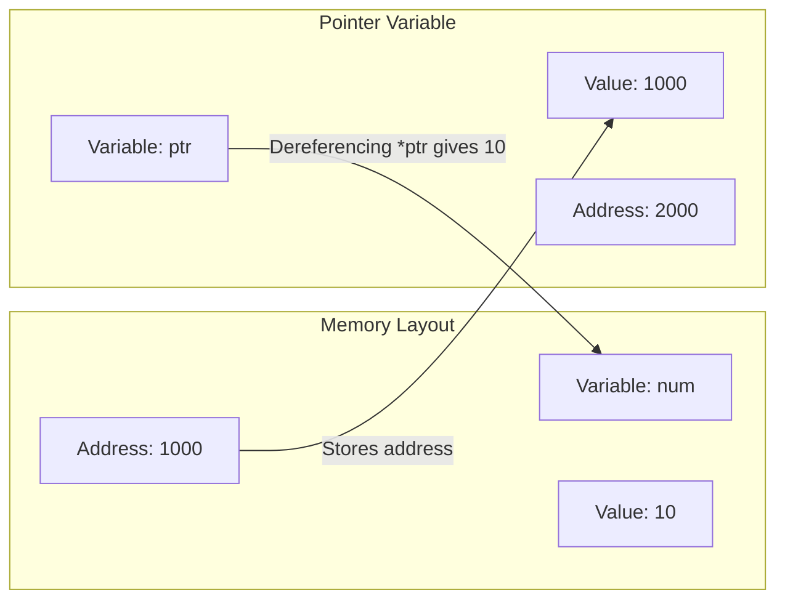

## 1. Introduction to Pointers

A **pointer** is a variable that stores the memory address of another variable (or function) instead of storing a direct value.

- **Why use pointers?**
  1. **Efficiency**: Pass large data structures (arrays, structs) without copying them.
  2. **Dynamic Memory**: Allocate memory at runtime using `malloc()`/`calloc()`.
  3. **Modification**: Change variables passed to functions (Call by Reference).
  4. **Data Structures**: Essential for building linked lists, trees, and graphs.

> **Think of it like this**: If a variable is a house, its address is a pointer. Instead of moving the house, you just tell someone the address. The `&` operator gives you the address; the `*` operator lets you look inside the house.

---

## 2. Declaration and Initialization

### 2.1 Declaration

When declaring a pointer, you must specify the **data type** of the variable it will point to. This tells the compiler how many bytes to read when dereferencing.

**Syntax**: `data_type *pointer_name;`

**Examples**:

```c
int *ptr;        // Pointer to an integer
float *fptr;     // Pointer to a float
char *cptr;      // Pointer to a character (string)
```

### 2.2 Initialization

A pointer should be initialized with a valid memory address before it is dereferenced.

1. **Using the Address-of Operator (`&`)**:

   ```c
   int num = 10;
   int *ptr = &num; // ptr stores the address of num
   ```

2. **Using Arrays (Base Address)**:

   ```c
   int arr[5] = {1,2,3,4,5};
   int *ptr = arr; // arr already gives the address of arr[0]; &arr[0] is also correct.
   ```

3. **Using `NULL` (Safety)**:
   A pointer that is not assigned to any valid memory address should be set to `NULL` (defined in `<stdio.h>` or `<stdlib.h>`).
   ```c
   int *ptr = NULL;
   // Always check if(ptr != NULL) before using it to avoid crashes.
   ```

**Mermaid Diagram (Pointer pointing to variable)**:



---

## 3. Pointer Operators

| Operator | Name                      | Description                                                  | Example                      |
| :------- | :------------------------ | :----------------------------------------------------------- | :--------------------------- |
| `&`      | Address-of                | Returns the memory address of its operand.                   | `&num` → address like `1000` |
| `*`      | Indirection (Dereference) | Returns the value stored at the address held by the pointer. | `*ptr` → value `10`          |

**Example**:

```c
#include <stdio.h>
int main() {
    int num = 25;
    int *ptr = &num;

    printf("Address of num: %p\n", &num);   // Prints address (e.g., 0x7fff)
    printf("Value of ptr: %p\n", ptr);      // Same address
    printf("Value at ptr: %d\n", *ptr);     // Prints 25
    printf("Address of ptr: %p\n", &ptr);   // Address where pointer itself is stored

    *ptr = 100; // Changing num indirectly
    printf("New num: %d", num);             // Prints 100
    return 0;
}
```

---

## 4. Accessing Variables

Pointers allow us to read and write values at specific memory locations using the dereference operator (`*`).

**Reading**:

```c
int a = 5;
int *p = &a;
int b = *p; // b = 5
```

**Writing (Modifying)**:

```c
*p = 20; // a now becomes 20
```

**Swapping two numbers (Classic Use Case)**:

```c
void swap(int *x, int *y) {
    int temp = *x; // Read value at x
    *x = *y;       // Write value at x
    *y = temp;     // Write value at y
}
// In main: swap(&a, &b);
```

---

## 5. Pointer Arithmetic

Pointer arithmetic is performed relative to the **size of the data type** the pointer points to.

- If `ptr` points to an `int` (size 4 bytes), `ptr + 1` moves the address forward by **4 bytes**.
- If `ptr` points to a `char` (size 1 byte), `ptr + 1` moves the address forward by **1 byte**.

| Operation | Description                                                      | Example (int \*p at address 1000)       |
| :-------- | :--------------------------------------------------------------- | :-------------------------------------- |
| `p + n`   | Adds `n * sizeof(type)` to the address.                          | `p + 2` → Address `1000 + (2*4) = 1008` |
| `p - n`   | Subtracts `n * sizeof(type)` from the address.                   | `p - 1` → Address `1000 - 4 = 996`      |
| `p++`     | Increments pointer to next element.                              | Moves to `1004`                         |
| `p--`     | Decrements pointer to previous element.                          | Moves to `996`                          |
| `p - q`   | Returns the number of elements between two pointers (not bytes). | If `p=1000`, `q=1008`, `p-q = -2`       |

**Visualizing Pointer Arithmetic (int array)**:

```mermaid
graph LR
    subgraph Memory [Memory Layout]
        direction LR
        A[Address 1000] --> B[arr[0] = 10]
        C[Address 1004] --> D[arr[1] = 20]
        E[Address 1008] --> F[arr[2] = 30]
    end
    P[ptr = 1000] --> A
    P1["ptr + 1 = 1004"] --> C
    P2["ptr + 2 = 1008"] --> E
```

**Code Example**:

```c
int arr[3] = {10, 20, 30};
int *p = arr; // p points to arr[0]

printf("%d\n", *p);     // 10
printf("%d\n", *(p+1)); // 20
printf("%d\n", *(p+2)); // 30
```

---

## 6. Pointers and Arrays

In C, the name of an array **acts as a constant pointer** to the first element.

- `arr` is equivalent to `&arr[0]`.
- `arr[i]` is equivalent to `*(arr + i)`.

### 6.1 Traversing Array using Pointer

```c
int arr[5] = {11, 22, 33, 44, 55};
int *ptr = arr; // or &arr[0]

for(int i = 0; i < 5; i++) {
    printf("%d ", *(ptr + i)); // Prints all elements
}
```

### 6.2 Difference between `arr` and `ptr`

- `arr` is a **constant pointer**. You cannot do `arr++` or `arr = something`.
- `ptr` is a **variable pointer**. You can do `ptr++` to move to the next element.

### 6.3 Array of Pointers

We can have an array where each element is a pointer.

**Example**:

```c
int a = 1, b = 2, c = 3;
int *arr[3] = {&a, &b, &c};
for(int i = 0; i < 3; i++) {
    printf("%d ", *arr[i]); // Prints 1 2 3
}
```

---

## 7. Pointers and Strings

In C, strings are represented as arrays of characters terminated by a `\0`. There are two main ways to handle strings using pointers:

### 7.1 String as a Character Array (`char str[]`)

Memory is allocated in the stack (or global). The string is modifiable.

```c
char str[] = "Hello";
char *ptr = str; // ptr points to str[0]
printf("%c", *ptr); // 'H'
printf("%s", ptr);  // "Hello"
```

### 7.2 String as a Pointer to a Character (`char *str`)

Memory is allocated in the **read-only** section (string literal). It cannot be modified directly (undefined behavior).

```c
char *str = "World";
printf("%s", str);  // Outputs "World"
// str[0] = 'A'; // CRASH! Do not modify string literals.
```

To modify it safely, use an array `char str[] = "World";`.

### 7.3 Traversing a String using Pointer

```c
char str[20] = "Pointer";
char *p = str;
while(*p != '\0') {
    printf("%c", *p);
    p++; // Move to next character
}
// Output: Pointer
```

---

## 8. Pointers and Functions

Pointers and functions interact in three major ways: passing arguments, returning values, and function pointers.

### 8.1 Pointers as Function Arguments (Call by Reference)

Already covered in the "Functions" chapter. Allows modification of original variables.

```c
void addTen(int *val) {
    *val = *val + 10;
}
int main() {
    int num = 5;
    addTen(&num);
    printf("%d", num); // 15
    return 0;
}
```

### 8.2 Pointers as Return Values

A function can return a pointer. However, **never return a pointer to a local variable** (as it goes out of scope). Return pointers to:

- Static variables.
- Dynamically allocated memory (using `malloc`).

**Correct Example (Static)**:

```c
int* getStaticValue() {
    static int x = 100; // Static variable persists beyond function scope
    return &x;
}
```

**Correct Example (Dynamic)**:

```c
#include <stdlib.h>
int* createArray(int size) {
    int *arr = (int*)malloc(size * sizeof(int)); // Allocated in Heap
    return arr; // Valid
}
```

**Wrong Example (Causes Undefined Behavior)**:

```c
int* invalid() {
    int local = 10;
    return &local; // WARNING! local is destroyed when function exits.
}
```

### 8.3 Function Pointers (Advanced Concept)

Functions themselves have addresses. We can store the address of a function in a pointer and call it later.

**Syntax**: `return_type (*ptr_name)(parameter_types) = function_name;`

**Example**:

```c
#include <stdio.h>

int add(int a, int b) {
    return a + b;
}

int main() {
    int (*funcPtr)(int, int) = add; // funcPtr stores address of add
    int result = funcPtr(5, 3);     // Calling add via pointer
    printf("%d", result);           // 8
    return 0;
}
```

**Use Case**: Used in callback functions (e.g., `qsort()` sorting function) and event-driven programming.


## 9. MCQ

#### Q1. A pointer is a variable that stores:

A) A direct value
B) The memory address of another variable ✅
C) A character
D) A floating point number

#### Q2. Which of the following is a reason to use pointers?

A) To make code longer
B) To pass large data structures without copying them ✅
C) To avoid using arrays
D) To slow down execution

#### Q3. Pointers allow:

A) Only reading values
B) Dynamic memory allocation at runtime ✅
C) Only static memory allocation
D) No memory allocation

#### Q4. In the house analogy, a pointer is like:

A) The house itself
B) The address of the house ✅
C) The people in the house
D) The furniture in the house

#### Q5. The `&` operator in C is called:

A) Dereference operator
B) Address-of operator ✅
C) Indirection operator
D) Assignment operator

#### Q6. The `*` operator in C (when used with pointers) is called:

A) Address-of operator
B) Multiplication operator
C) Indirection or Dereference operator ✅
D) Assignment operator

#### Q7. What is the syntax to declare a pointer to an integer?

A) `int ptr;`
B) `int *ptr;` ✅
C) `*int ptr;`
D) `ptr int *;`

#### Q8. Which of the following is a valid pointer declaration?

A) `float *fptr;` ✅
B) `float fptr*;`
C) `*float fptr;`
D) `fptr float*;`

#### Q9. A pointer to a character is declared as:

A) `char *cptr;` ✅
B) `char cptr*;`
C) `*char cptr;`
D) `cptr char*;`

#### Q10. What does `int num = 10; int *ptr = &num;` do?

A) ptr stores the value 10
B) ptr stores the address of num ✅
C) ptr stores the value of num
D) ptr stores nothing

#### Q11. A pointer should be initialized with a valid memory address before it is:

A) Declared
B) Dereferenced ✅
C) Allocated
D) Assigned

#### Q12. What is the value of `ptr` in `int arr[5] = {1,2,3,4,5}; int *ptr = arr;`?

A) The value of arr[0]
B) The address of arr[0] ✅
C) The value of arr[5]
D) The address of arr[5]

#### Q13. `int *ptr = NULL;` sets the pointer to:

A) A random address
B) Zero address (null pointer) ✅
C) The address of variable
D) The value 0

#### Q14. Which header file typically defines NULL?

A) `<string.h>`
B) `<stdio.h>` or `<stdlib.h>` ✅
C) `<math.h>`
D) `<ctype.h>`

#### Q15. Before dereferencing a pointer, it is good practice to check:

A) If the pointer is NULL ✅
B) If the pointer is negative
C) If the pointer is positive
D) If the pointer is zero

#### Q16. In the example, `*ptr = 100;` does what?

A) Changes the address stored in ptr
B) Changes the value at the address stored in ptr ✅
C) Deletes the variable
D) Creates a new variable

#### Q17. What is the output of `printf("%d", *ptr);` if `int num = 25; int *ptr = &num;`?

A) 25 ✅
B) Address of num
C) Address of ptr
D) Garbage value

#### Q18. The address of the pointer variable itself is obtained using:

A) `ptr`
B) `*ptr`
C) `&ptr` ✅
D) `&*ptr`

#### Q19. In `int a = 5; int *p = &a; int b = *p;`, what is the value of b?

A) Address of a
B) 5 ✅
C) Address of p
D) Garbage

#### Q20. In `int a = 5; int *p = &a; *p = 20;`, what is the new value of a?

A) 5
B) 20 ✅
C) 0
D) Garbage

#### Q21. Pointer arithmetic is performed relative to:

A) The size of the pointer variable
B) The size of the data type the pointer points to ✅
C) The size of memory
D) A fixed byte value

#### Q22. If `ptr` points to an `int` (4 bytes) at address 1000, what is the address of `ptr + 1`?

A) 1001
B) 1004 ✅
C) 1008
D) 1016

#### Q23. If `ptr` points to a `char` (1 byte) at address 1000, what is the address of `ptr + 1`?

A) 1000
B) 1001 ✅
C) 1004
D) 1008

#### Q24. If `p` points to a `double` (8 bytes) at address 2000, what is the address of `p + 2`?

A) 2002
B) 2008
C) 2016 ✅
D) 2024

#### Q25. If `p = 1000` and `q = 1008` for an `int*` (4 bytes), what is `q - p`?

A) 8
B) 2 ✅
C) 4
D) 1

#### Q26. Pointer subtraction returns:

A) The number of bytes between pointers
B) The number of elements between pointers ✅
C) The sum of addresses
D) The product of addresses

#### Q27. What is the output of `printf("%d", *(p+1));` for `int arr[3] = {10, 20, 30}; int *p = arr;`?

A) 10
B) 20 ✅
C) 30
D) Garbage

#### Q28. In C, the name of an array acts as:

A) A variable pointer
B) A constant pointer to the first element ✅
C) A pointer to the last element
D) A pointer to the size

#### Q29. `arr[i]` is equivalent to:

A) `*(arr + i)` ✅
B) `arr + i`
C) `&arr[i]`
D) `*arr + i`

#### Q30. Which of the following is TRUE about `arr` (array name) and `ptr` (pointer)?

A) Both are constant pointers
B) Both are variable pointers
C) `arr` is constant, `ptr` is variable ✅
D) `arr` is variable, `ptr` is constant

#### Q31. You cannot do `arr++` because:

A) arr is a variable pointer
B) arr is a constant pointer ✅
C) arr is not a pointer
D) arr has no address

#### Q32. Which of the following correctly traverses an array using a pointer?

A) `for(i=0; i<5; i++) printf("%d", *(ptr + i));` ✅
B) `for(i=0; i<5; i++) printf("%d", ptr + i);`
C) `for(i=0; i<5; i++) printf("%d", *ptr + i);`
D) `for(i=0; i<5; i++) printf("%d", ptr[i]);` ✅

#### Q33. An array of pointers is declared as:

A) `int *arr[3];` ✅
B) `int arr*[3];`
C) `*int arr[3];`
D) `int arr[3]*;`

#### Q34. In `int *arr[3] = {&a, &b, &c};`, `arr[1]` stores:

A) The value of a
B) The address of b ✅
C) The value of b
D) The address of a

#### Q35. To print the value pointed to by `arr[1]` in the above, you use:

A) `printf("%d", arr[1]);`
B) `printf("%d", *arr[1]);` ✅
C) `printf("%d", &arr[1]);`
D) `printf("%d", arr);`

#### Q36. A string in C is:

A) A character array terminated by '\0' ✅
B) A character array terminated by '\n'
C) An integer array
D) A pointer to a double

#### Q37. Which of the following creates a modifiable string?

A) `char *str = "Hello";`
B) `char str[] = "Hello";` ✅
C) Both A and B are equally modifiable
D) Neither is modifiable

#### Q38. `char *str = "World";` stores the string in:

A) Stack memory (modifiable)
B) Read-only memory (string literal) ✅
C) Heap memory
D) Global memory

#### Q39. `str[0] = 'A';` on `char *str = "World";` causes:

A) No effect
B) Undefined behavior (often crash) ✅
C) The string to become "Aorld"
D) A compilation error

#### Q40. To safely modify a string, use:

A) `char *str = "Hello";`
B) `char str[] = "Hello";` ✅
C) Both are safe
D) Neither is safe

#### Q41. What is the output of traversing `char str[20] = "Pointer"; char *p = str; while(*p != '\0') { printf("%c", *p); p++; }`?

A) Pointer ✅
B) P
C) r
D) Infinite loop

#### Q42. In the string traversal, `p++` moves the pointer to:

A) The previous character
B) The next character ✅
C) The end of string
D) The beginning of string

#### Q43. Pointers as function arguments allow:

A) Call by Value
B) Call by Reference (modifying original variables) ✅
C) No modification of variables
D) Only reading variables

#### Q44. In `void addTen(int *val) { *val = *val + 10; }`, the function modifies:

A) A local copy
B) The original variable in the caller ✅
C) Nothing
D) A global variable

#### Q45. To call `addTen` with `num = 5`, you write:

A) `addTen(num);`
B) `addTen(&num);` ✅
C) `addTen(*num);`
D) `addTen(num);`

#### Q46. After calling `addTen(&num)`, the value of num becomes:

A) 5
B) 10
C) 15 ✅
D) 0

#### Q47. A function can return a pointer to:

A) A local variable (always safe)
B) A static variable ✅
C) A local variable (never safe)
D) A parameter

#### Q48. Returning a pointer to a local variable causes:

A) Correct behavior
B) Undefined behavior (dangling pointer) ✅
C) Compilation error
D) Memory leak

#### Q49. To return a pointer that remains valid, use:

A) A local variable
B) A static variable or dynamically allocated memory ✅
C) A parameter
D) A global variable (also valid but not ideal)

#### Q50. In `int* invalid() { int local = 10; return &local; }`, the returned pointer:

A) Is valid and safe
B) Points to memory that goes out of scope ✅
C) Points to a static variable
D) Points to heap memory

#### Q51. `static int x = 100; return &x;` is safe because:

A) x is local
B) x persists beyond function scope ✅
C) x is on the heap
D) x is a parameter

#### Q52. Dynamically allocated memory using `malloc` persists until:

A) The function returns
B) It is freed using `free()` ✅
C) The program ends automatically
D) It goes out of scope

#### Q53. A function pointer stores:

A) The address of a variable
B) The address of a function ✅
C) The value of a function
D) The size of a function

#### Q54. What is the syntax for declaring a function pointer `funcPtr` that points to a function taking two ints and returning int?

A) `int *funcPtr(int, int);`
B) `int (*funcPtr)(int, int);` ✅
C) `int funcPtr*(int, int);`
D) `(*int funcPtr)(int, int);`

#### Q55. If `int add(int a, int b) { return a+b; }`, how do you store its address in `funcPtr`?

A) `funcPtr = &add;` ✅
B) `funcPtr = add;` ✅
C) `funcPtr = *add;`
D) Both A and B are correct

#### Q56. To call a function using a function pointer, you write:

A) `funcPtr(5, 3);` ✅
B) `*funcPtr(5, 3);`
C) `&funcPtr(5, 3);`
D) `funcPtr = 5, 3;`

#### Q57. Function pointers are commonly used for:

A) Storing data
B) Callback functions (e.g., in `qsort`) ✅
C) Arithmetic operations
D) Variable declaration

#### Q58. Which of the following is NOT a valid use of pointers?

A) Dynamic memory allocation
B) Passing large structures efficiently
C) Returning multiple values from a function
D) Storing values directly without indirection ✅

#### Q59. The `NULL` pointer is:

A) A pointer pointing to address 0 ✅
B) A pointer pointing to garbage
C) A pointer pointing to a variable
D) A pointer pointing to itself

#### Q60. Dereferencing a NULL pointer causes:

A) No effect
B) Segmentation fault (crash) ✅
C) The program to continue
D) A warning

#### Q61. `int *p;` (uninitialized) points to:

A) Address 0
B) Garbage address ✅
C) A valid variable
D) The stack

#### Q62. Which of the following is a correct way to declare a pointer to a float?

A) `float *p;` ✅
B) `float p*;`
C) `*float p;`
D) `p float*;`

#### Q63. If `ptr` is an `int*` at address 2000, `ptr - 2` moves the address by how many bytes (assuming int is 4 bytes)?

A) 2 bytes
B) 4 bytes
C) 8 bytes ✅
D) 16 bytes

#### Q64. If `ptr` is a `char*` at address 3000, `ptr + 5` gives address:

A) 3005 ✅
B) 3020
C) 3004
D) 3010

#### Q65. In the pointer arithmetic visualization, `ptr + 1` for an int array points to:

A) The next byte
B) The next integer element ✅
C) The previous element
D) The end of the array

#### Q66. Which of the following correctly swaps two integers using pointers?

A) `void swap(int *x, int *y) { int *temp = x; x = y; y = temp; }`
B) `void swap(int *x, int *y) { int temp = *x; *x = *y; *y = temp; }` ✅
C) `void swap(int x, int y) { int temp = x; x = y; y = temp; }`
D) `void swap(int *x, int *y) { *x = *y; *y = *x; }`

#### Q67. In the correct swap function, `temp` stores:

A) The address of x
B) The value pointed to by x ✅
C) The address of y
D) The value pointed to by y

#### Q68. Why is `*x = *y; *y = *x;` wrong for swapping?

A) It uses wrong syntax
B) It loses the original value of x ✅
C) It swaps addresses
D) It does nothing

#### Q69. A pointer to an array element can be used to:

A) Access that element only
B) Traverse the array using pointer arithmetic ✅
C) Change the array size
D) Delete the array

#### Q70. `char *str = "Hello";` and `char str2[] = "Hello";` differ in:

A) Only syntax
B) Mutability (str2 is modifiable, str literal is not) ✅
C) Memory location (both in same place)
D) Both are identical

#### Q71. Which of the following is NOT a pointer operator?

A) `&`
B) `*`
C) `->` (for structures, but still pointer-related)
D) `#` ✅

#### Q72. The `->` operator is used with pointers to structures as a shorthand for:

A) `(*ptr).member`
B) `ptr.member`
C) `&ptr.member`
D) `ptr->*member` ✅

#### Q73. If `struct Student *s;`, how do you access the `roll` member?

A) `s.roll`
B) `s->roll` ✅
C) `*s.roll`
D) `&s.roll`

#### Q74. Pointers are essential for building:

A) Only arrays
B) Linked lists, trees, and graphs ✅
C) Only strings
D) Only functions

#### Q75. In a linked list, each node contains:

A) Only data
B) Only a pointer
C) Data and a pointer to the next node ✅
D) Data and an array

#### Q76. `malloc()` returns:

A) An integer
B) A pointer to the allocated memory ✅
C) A float
D) A character

#### Q77. The memory allocated by `malloc()` is in:

A) Stack
B) Heap ✅
C) Read-only section
D) Global section

#### Q78. To free dynamically allocated memory, use:

A) `delete()`
B) `free()` ✅
C) `release()`
D) `clear()`

#### Q79. Not freeing dynamically allocated memory causes:

A) Stack overflow
B) Memory leak ✅
C) No issue
D) Compilation error

#### Q80. In `int *arr = (int*)malloc(5 * sizeof(int));`, what does `(int*)` do?

A) Allocates memory
B) Type casts the pointer returned by malloc ✅
C) Frees memory
D) Initializes memory

#### Q81. Which of the following is a valid pointer declaration and initialization?

A) `int *p = &num;` ✅
B) `int *p = num;`
C) `int p = &num;`
D) `*int p = &num;`

#### Q82. The address of a variable can be printed using:

A) `%d` format specifier
B) `%p` format specifier ✅
C) `%s` format specifier
D) `%c` format specifier

#### Q83. `printf("%p", ptr);` prints:

A) The value of ptr
B) The address stored in ptr ✅
C) The value at ptr
D) The size of ptr

#### Q84. If `int *p;` and `int a = 10; p = &a;`, then `&*p` is equivalent to:

A) `p` ✅
B) `&a` ✅
C) `a`
D) Both A and B are correct

#### Q85. `*&a` is equivalent to:

A) `a` ✅
B) `&a`
C) `*a`
D) Address of a

#### Q86. Which of the following operations is NOT allowed on a `void*` pointer?

A) Assignment
B) Dereferencing without casting ✅
C) Comparison with other pointers
D) Passing to functions

#### Q87. A `void*` pointer can store:

A) Only integer addresses
B) Any type of address ✅
C) Only character addresses
D) Only float addresses

#### Q88. To dereference a `void*` pointer, you must:

A) Use the `*` operator directly
B) Cast it to the appropriate type first ✅
C) Use `->` operator
D) Use `&` operator

#### Q89. Which of the following is a valid use of pointer arithmetic?

A) Adding two pointers
B) Subtracting two pointers to get element difference ✅
C) Multiplying two pointers
D) Dividing two pointers

#### Q90. Adding two pointers is:

A) Allowed and useful
B) Not allowed in C ✅
C) Allowed but meaningless
D) Used for pointer arithmetic

#### Q91. In C, the size of a pointer depends on:

A) The data type it points to
B) The architecture (e.g., 32-bit or 64-bit) ✅
C) The value it stores
D) The operating system

#### Q92. On a 32-bit system, the size of a pointer is typically:

A) 2 bytes
B) 4 bytes ✅
C) 8 bytes
D) 16 bytes

#### Q93. On a 64-bit system, the size of a pointer is typically:

A) 2 bytes
B) 4 bytes
C) 8 bytes ✅
D) 16 bytes

#### Q94. All pointers on a given system occupy:

A) Different sizes depending on type
B) The same size ✅
C) No size
D) Variable size

#### Q95. Which of the following is TRUE about the `&` operator?

A) It can be applied to any expression
B) It can be applied to variables only ✅
C) It can be applied to constants
D) It can be applied to literals

#### Q96. Which of the following is TRUE about the `*` operator in declarations vs expressions?

A) Same meaning in both
B) In declarations, it creates a pointer; in expressions, it dereferences ✅
C) In declarations, it dereferences; in expressions, it creates a pointer
D) It is only used in declarations

#### Q97. In `int *p = &a;`, the `*` is:

A) Dereference operator
B) Part of the declaration indicating p is a pointer ✅
C) Multiplication operator
D) Address operator

#### Q98. In `printf("%d", *p);`, the `*` is:

A) Part of declaration
B) Dereference operator ✅
C) Multiplication operator
D) Address operator

#### Q99. A pointer to a constant is declared as:

A) `int *const ptr;`
B) `const int *ptr;` ✅
C) `int const *ptr;` ✅
D) Both B and C are valid

#### Q100. A constant pointer is declared as:

A) `const int *ptr;`
B) `int *const ptr;` ✅
C) `int const *ptr;`
D) `const *int ptr;`

