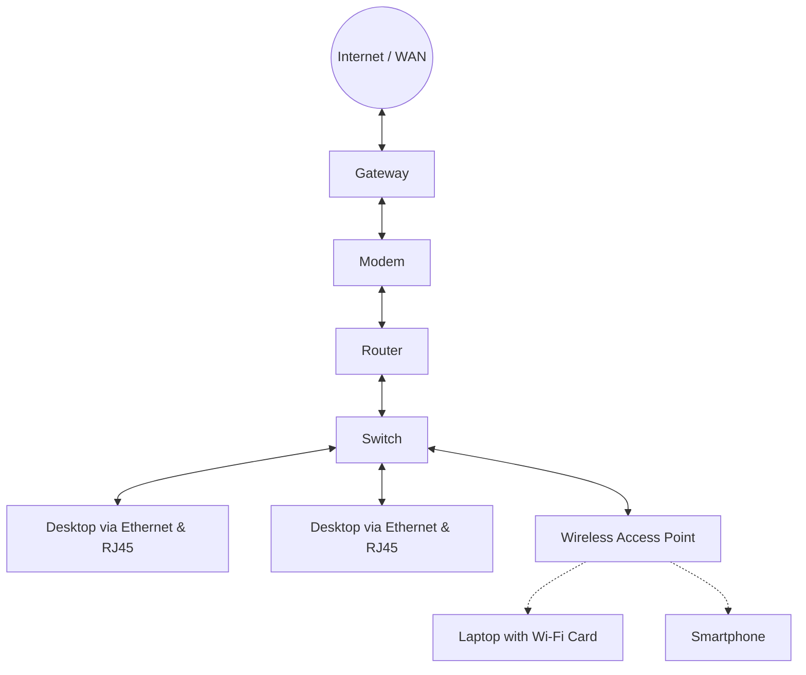
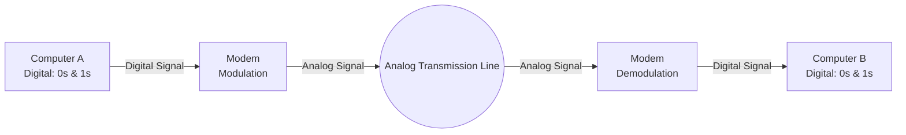
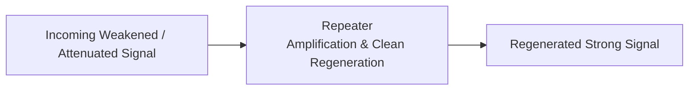
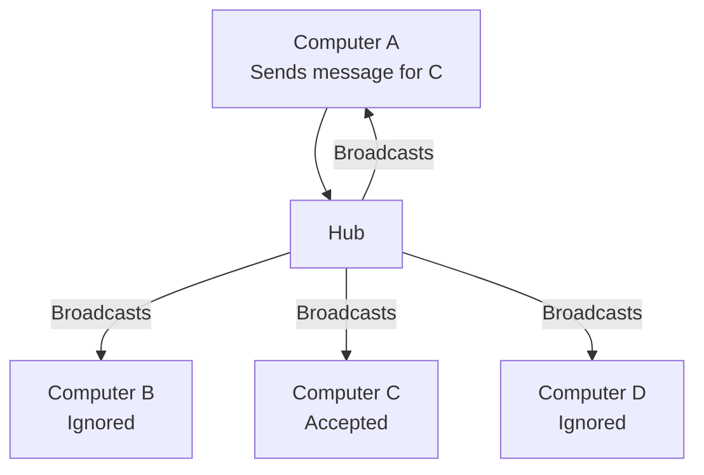
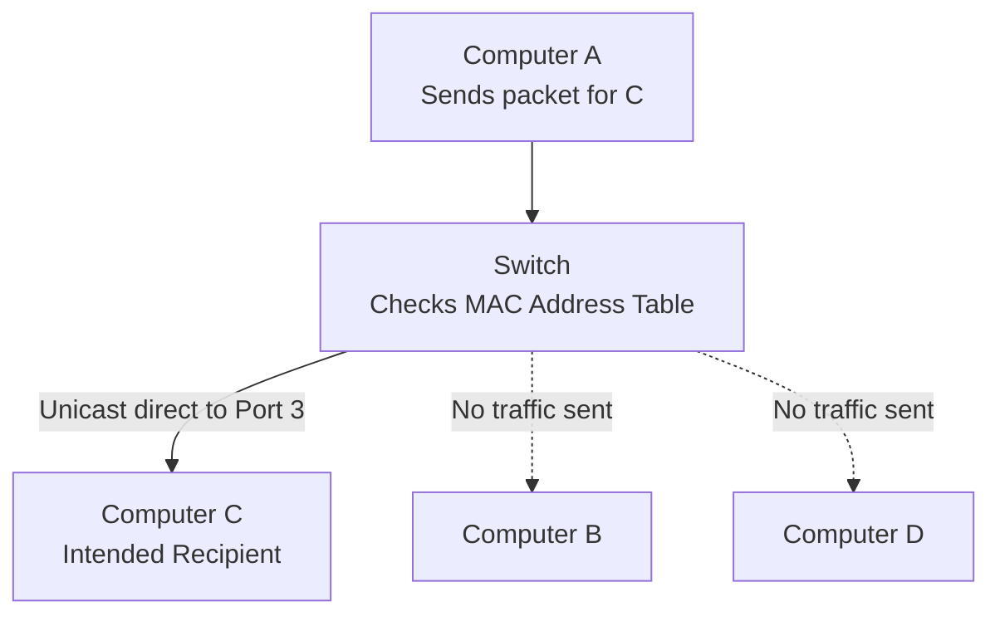
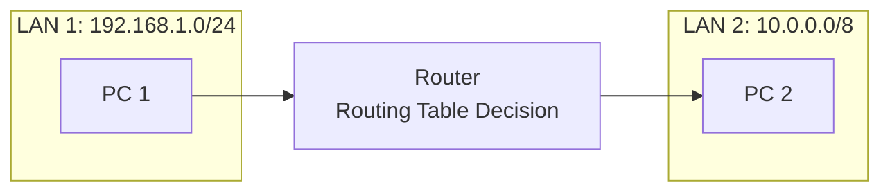
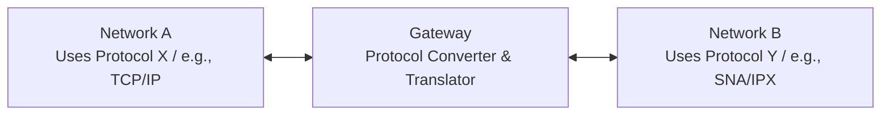

# Network Connecting Devices

## 1. Introduction to Network Connecting Devices

In computer networks, **Network Connecting Devices** (also called *hardware networking components*) are physical or electronic devices required for communication, data transfer, signal regeneration, and interaction between hardware units across a network.

---

## 2. Detailed Study of Connecting Devices

---

### 2.1 Modem (Modulator–Demodulator)

* **Full Form:** **Mo**dulator–**Dem**odulator
* **Purpose:** Enables digital devices (like computers) to communicate over analog transmission media (like telephone lines or coaxial cable lines).

#### Working Mechanism:
1. **Modulation:** Converts outgoing digital signals ($\text{0s}$ and $\text{1s}$) from a computer into analog signals suitable for transmission over telephone or cable lines.
2. **Demodulation:** Converts incoming analog signals from the line back into digital signals that the receiving computer can understand.

#### Common Types:
* **Dial-up Modem:** Uses traditional telephone lines; very slow ($\le 56\text{ kbps}$).
* **DSL Modem (Digital Subscriber Line):** Operates over copper telephone wires at much higher frequencies, allowing simultaneous voice and broadband data.
* **Cable Modem:** Uses coaxial television cables for high-speed broadband.

---

### 2.2 Ethernet Card (NIC - Network Interface Card)

* **Also Known As:** Network Interface Card (NIC), LAN Card, Network Adapter.
* **Purpose:** A circuit board or chip installed in a computer that physically connects the machine to a Local Area Network (LAN).

#### Key Characteristics:
* **Physical Hardware Address (MAC Address):** 
  Every Ethernet card is hardcoded at the manufacturing factory with a globally unique 48-bit identifier called the **MAC (Media Access Control) Address**.
  $$\text{MAC Address Format: } \text{XX : XX : XX : XX : XX : XX} \quad (\text{6 bytes / 48 bits in hexadecimal})$$
  *Example:* `00:1A:2B:3C:4D:5E`
* **Data Transmission:** Operates primarily at **Layer 2 (Data Link Layer)** and **Layer 1 (Physical Layer)** of the OSI reference model.
* Provides a female **RJ-45 port** to receive an Ethernet network cable.

---

### 2.3 RJ-45 Connector (Registered Jack-45)

* **Full Form:** Registered Jack - 45
* **Purpose:** A standardized physical connector (an 8-pin modular plug) used for terminating twisted-pair Ethernet cables (such as Cat5, Cat5e, Cat6).

#### Key Features:
* **Pins:** Has **8 pins** (8P8C configuration: 8 positions, 8 contacts) corresponding to the 8 colored wires inside standard twisted-pair cables.
* **Locking Clip:** Features a small plastic tab to lock the cable firmly inside the Ethernet port to prevent accidental disconnections.
* **Comparison with RJ-11:** RJ-11 is smaller with only 4 or 6 pins, used primarily for traditional landline telephone connections.

---

### 2.4 Repeater

* **Operating Layer:** Layer 1 (Physical Layer).
* **Purpose:** Overcomes the problem of **signal attenuation** (loss of signal strength as it travels long distances through a medium).

#### Key Points:
* A repeater receives a weak/distorted signal, **cleans out noise**, regenerates the signal to its original strength and waveform, and retransmits it.
* **Note:** Unlike an analog amplifier (which amplifies both the signal and the noise), a digital repeater regenerates a clean copy of the original bits.
* It operates as a non-intelligent device (does not read MAC addresses, IP addresses, or data contents).

---

### 2.5 Hub

* **Operating Layer:** Layer 1 (Physical Layer).
* **Purpose:** A multiport repeater used to connect multiple computers in a star topology network.

#### Key Characteristics:
* **Broadcast Mechanism:** When a data packet arrives at one port, the hub replicates and retransmits it to **all other connected ports**, regardless of the intended recipient.
* **"Dumb" Device:** It does not maintain an address table and cannot identify destination MAC addresses.
* **Bandwidth Sharing:** The available bandwidth is shared among all connected devices.
* **Types of Hubs:**
  * **Passive Hub:** Simply forwards the electrical signal without regeneration.
  * **Active Hub:** Functions as a multiport repeater; regenerates and amplifies the signal before broadcasting.

---

### 2.6 Switch

* **Operating Layer:** Layer 2 (Data Link Layer).
* **Purpose:** An intelligent multi-port network device that connects devices in a LAN and transmits data packets **directly** to the intended destination port.

#### Key Characteristics:
* **MAC Address Table (CAM Table):** The switch learns the MAC addresses of devices connected to each port and stores them in memory:
  $$\text{Port 1} \leftrightarrow \text{MAC}_A, \quad \text{Port 2} \leftrightarrow \text{MAC}_B, \quad \text{Port 3} \leftrightarrow \text{MAC}_C$$
* **Unicast Communication:** Instead of broadcasting to all ports (like a hub), it forwards data frames strictly to the destination port, eliminating unnecessary traffic.
* **Collision Domain:** Each port on a switch forms its own separate collision domain, significantly boosting network performance.

#### Difference: Hub vs. Switch

| Parameter | Hub | Switch |
| :--- | :--- | :--- |
| **OSI Layer** | Layer 1 (Physical) | Layer 2 (Data Link) |
| **Device Intelligence** | Dumb (No address storage) | Intelligent (Maintains MAC table) |
| **Transmission Type** | Broadcast (One-to-All) | Unicast (One-to-One), Multicast |
| **Collision Domain** | Single collision domain for all ports | Separate collision domain for each port |
| **Bandwidth** | Shared among all ports | Dedicated per port |

---

### 2.7 Router

* **Operating Layer:** Layer 3 (Network Layer).
* **Purpose:** Connects **two or more distinct networks** (e.g., connecting your home LAN to the Internet/WAN) and finds the most optimal path for data packets.

#### Key Characteristics:
* **Works with Logical Addresses (IP Addresses):** Inspects the destination IP address of each packet.
* **Routing Table:** Maintains dynamic or static tables containing network topologies to determine the best/shortest path (using routing algorithms like RIP, OSPF).
* Filters broadcasts: Routers do not forward broadcast packets across network boundaries, keeping local traffic confined to the LAN.

---

### 2.8 Gateway

* **Operating Layer:** Works across multiple layers (Layer 4 to Layer 7 of the OSI Model).
* **Purpose:** A network point that acts as an entrance to another network, especially when the two networks use **different network architectures, protocols, or data formats**.

#### Key Characteristics:
* **Protocol Translation:** While a router connects networks that use the same basic protocols (like IP), a gateway acts as a **protocol converter/translator**.
* **Proxy / Security:** Often serves as a firewall and proxy server at the boundary of an enterprise network.

---

### 2.9 Wi-Fi Card (Wireless NIC)

* **Purpose:** An internal or external network adapter that allows a device to connect to a local area network wirelessly using radio waves.
* **Standard:** Based on the **IEEE 802.11** family of standards ($802.11\text{b/g/n/ac/ax}$).

#### Forms & Interfaces:
* **PCIe / M.2 Internal Card:** Installed directly onto the motherboard of desktop PCs or laptops, usually with external antennas.
* **USB Wi-Fi Dongle:** Plug-and-play adapter that inserts into any standard USB port.

#### Key Functions:
* Converts digital data into radio frequency (RF) signals ($2.4\text{ GHz}$ or $5\text{ GHz}$) and transmits them to a Wireless Access Point (WAP) or Wi-Fi Router.
* Receives RF signals from the wireless network and demodulates them back into digital data for the host machine.

---

## 3. Quick Reference Summary Table

| Device | Primary OSI Layer | Operates On | Primary Role / Function |
| :--- | :--- | :--- | :--- |
| **Modem** | Physical / Data Link | Signals (Analog/Digital) | Converts digital signals to analog and vice versa. |
| **Ethernet Card** | Physical & Data Link | Bits & Frames (MAC) | Provides a physical interface and hardware MAC address. |
| **RJ-45** | Physical (Connector) | Mechanical Contact | 8-pin connector for Ethernet twisted-pair cables. |
| **Repeater** | Layer 1 (Physical) | Bits / Electrical Signals | Regenerates weakened signals over long cable runs. |
| **Hub** | Layer 1 (Physical) | Bits | Multiport signal retransmitter (broadcasts to all ports). |
| **Switch** | Layer 2 (Data Link) | Frames (MAC Address) | Intelligent LAN switch; unicasts data to target ports. |
| **Router** | Layer 3 (Network) | Packets (IP Address) | Connects disparate networks; determines optimal paths. |
| **Gateway** | Layers 4–7 (Transport to App) | Packets / Data Formats | Translates between networks using different protocols. |
| **Wi-Fi Card** | Physical & Data Link | Radio Waves (802.11) | Enables wireless network connectivity via RF signals. |

---

## 4. Key Exam Questions to Review

1. **Why is a switch called an intelligent hub?**
   * *Answer:* A switch learns and stores device MAC addresses in an internal table, allowing it to send data directly to the intended recipient (unicasting), whereas a hub blindly broadcasts data to all ports.
2. **What is the difference between a Router and a Gateway?**
   * *Answer:* A router joins two networks running identical protocol suites (e.g., IP routing), whereas a gateway connects and translates data between two networks using completely different protocol standards.
3. **What is a MAC address and which device is it associated with?**
   * *Answer:* A MAC address is a 48-bit (6-byte) unique hardware identifier hardcoded onto the ROM of an Ethernet Card (NIC).