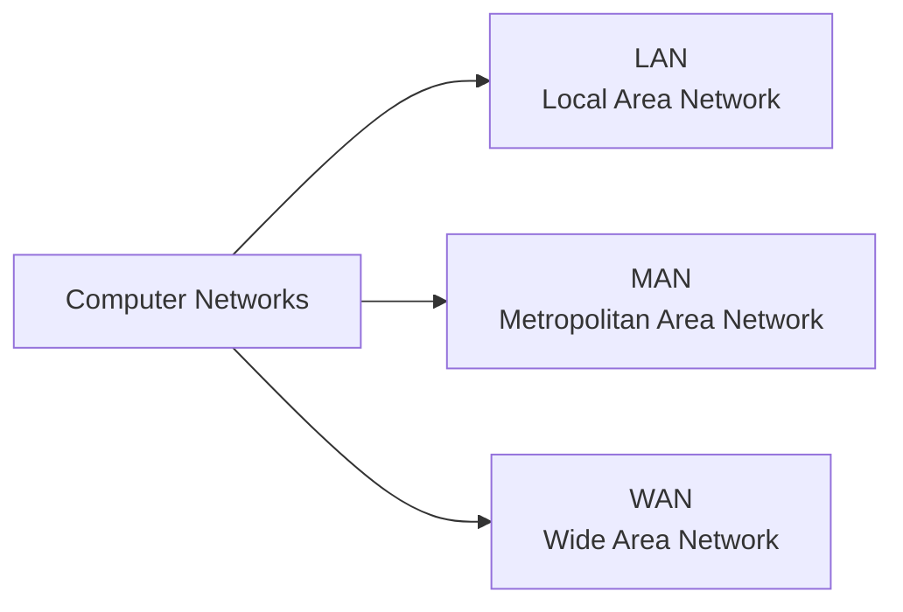
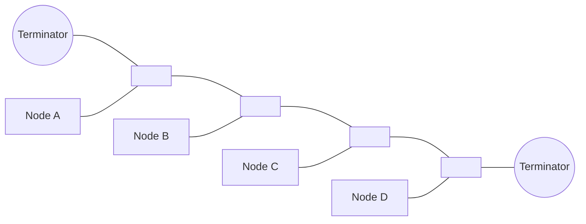
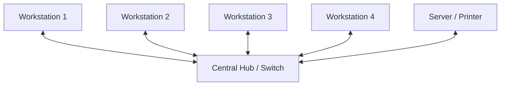
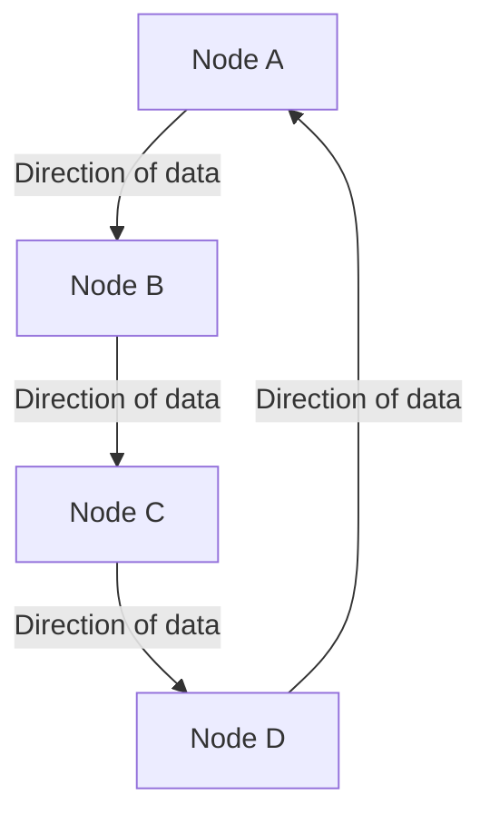
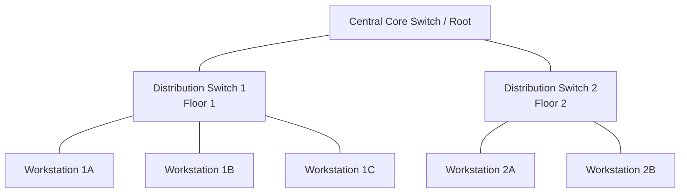

# Network Types and Topologies

## 1. Types of Computer Networks

Computer networks are primarily classified based on their **geographical span** (coverage area), scale, and ownership.

---

### 1.1 Local Area Network (LAN)

* **Definition:** A network connecting computers and peripheral devices within a limited, localized geographical boundary such as a single room, office, home, school laboratory, or university campus.
* **Geographical Range:** Typically spans from a few meters up to **$1\text{ km}$** (or within a single building cluster).
* **Ownership:** Privately owned and controlled by an individual, school, or single organization.
* **Data Transmission Rate:** Very high speed, typically ranging from:
  $$\text{Data Rates: } 100\text{ Mbps to } 10\text{ Gbps } (10^8 \text{ to } 10^{10} \text{ bps})$$
* **Error Rate:** Very low error rate and propagation delay because the physical cable distances are short and usually unexposed to external electrical interference.
* **Media Used:** Twisted-pair cables (Cat5e/Cat6), Coaxial cables, Fiber optic cables, or Wi-Fi (WLAN).
* **Examples:** A school computer lab, home Wi-Fi network, office intranet.

---

### 1.2 Metropolitan Area Network (MAN)

* **Definition:** A larger network that connects multiple LANs across an entire city or a large metropolitan region.
* **Geographical Range:** Spans an entire town or city, typically between:
  $$\text{Coverage Area: } 5\text{ km to } 50\text{ km}$$
* **Ownership:** Can be owned by a single large consortium, a public utility, a local government, or an ISP (Internet Service Provider).
* **Data Transmission Rate:** Moderate-to-high speed, typically ranging from $100\text{ Mbps to } 1\text{ Gbps}$.
* **Error Rate:** Moderate (higher than a LAN due to larger physical distance).
* **Media Used:** High-bandwidth optical fiber backbones, wireless radio links, and microwave transmissions.
* **Examples:** Cable television networks in a city, municipal government branches linked across town, free citywide public Wi-Fi.

---

### 1.3 Wide Area Network (WAN)

* **Definition:** A telecommunications network that spans vast geographical distances, connecting cities, states, countries, or even continents.
* **Geographical Range:** Over **$50\text{ km}$**, extending globally without physical boundaries.
* **Ownership:** Distributed ownership; maintained collectively by multiple telecom operators, governments, and internet consortiums.
* **Data Transmission Rate:** Variable, traditionally lower than LANs due to extensive routing infrastructure, though modern high-speed undersea fiber links provide multi-terabit backbones.
* **Error Rate:** Highest error rate and propagation delay due to immense transmission distances, satellite delays, and complex multi-hop routing.
* **Media Used:** Undersea fiber-optic cables, microwave radio relays, and communication satellites.
* **Examples:** **The Internet** (the largest WAN in existence), banking ATM networks across a nation.

---

### 1.4 Comparative Summary: LAN vs. MAN vs. WAN

| Parameter | LAN (Local Area Network) | MAN (Metropolitan Area Network) | WAN (Wide Area Network) |
| :--- | :--- | :--- | :--- |
| **Geographical Area** | Small ($\le 1\text{ km}$); single room/building | Medium ($5\text{ to } 50\text{ km}$); citywide | Vast ($> 50\text{ km}$); country/global |
| **Data Transfer Rate** | Highest ($100\text{ Mbps} - 10\text{ Gbps}$) | Moderate ($100\text{ Mbps} - 1\text{ Gbps}$) | Variable / Lower than LAN |
| **Propagation Delay** | Very low (almost instantaneous) | Moderate | High (due to routing and distance) |
| **Bit Error Rate** | Lowest | Moderate | Highest |
| **Ownership** | Private | Private or Public (ISP/Govt) | Distributed / Public |
| **Setup & Maintenance Cost** | Low | Medium | High |
| **Typical Example** | School Computer Lab | City Cable TV Network | The Internet |

---

## 2. Network Topologies

### What is a Network Topology?
A **network topology** defines the geometric arrangement or physical and logical layout in which computers, communication devices, and transmission links are interconnected.

---

### 2.1 Bus Topology

* **Architecture:** All devices (nodes) are directly connected to a single central transmission line called the **backbone cable** (or bus).
* **Terminators:** Absorbers called **terminators** are attached to both physical ends of the central cable to absorb signal pulses and prevent signal bounce/echo.

#### Cable Requirement:
* For $N$ connected nodes, the minimum number of central trunk lines required is $1$ main backbone plus $N$ drop cables:
  $$\text{Total drop lines} = N$$

#### Advantages:
1. **Low Cable Cost:** Requires the minimum amount of physical cabling among standard topologies.
2. **Easy Installation:** Straightforward and inexpensive to set up in small networks.
3. **Easy Expansion:** A new node can be added simply by tapping into the backbone using a drop cable and a connector (BNC/T-connector).

#### Disadvantages:
1. **Single Point of Failure:** If the central backbone cable breaks or a terminator fails, the **entire network collapses**.
2. **Difficult Fault Isolation:** Identifying a cable fault along the trunk line is tedious.
3. **Packet Collisions:** Because all nodes share one line, heavy traffic leads to frequent packet collisions and degraded speed.

---

### 2.2 Star Topology

* **Architecture:** Every individual workstation or node connects directly to a central networking device (such as a **Switch** or **Hub**) via a dedicated point-to-point link.
* **Working:** Nodes communicate with each other exclusively through the central device.

#### Cable and Port Requirement:
* To connect $N$ nodes:
  $$\text{Dedicated Cable Links} = N$$
  $$\text{Ports required on central device} = N$$

#### Advantages:
1. **High Fault Tolerance:** If an individual cable or workstation fails, **only that specific device goes down**; the rest of the network operates unaffected.
2. **Simple Fault Detection:** Cable cuts and disconnected nodes are immediately localized to a specific port.
3. **No Collision with Switches:** When a switch is used at the center, communication is direct (unicast), eliminating shared-medium collisions.

#### Disadvantages:
1. **Central Point of Failure:** If the central hub/switch malfunctions or loses power, the **entire network stops functioning**.
2. **Higher Cabling Cost:** Requires significantly more cable length than a bus topology since every computer must have its own run back to the central unit.

---

### 2.3 Ring Topology

* **Architecture:** Every node is connected to exactly two neighboring nodes, forming a continuous, closed circular loop of data transmission.
* **Data Flow:** Data travels in one direction (**unidirectional**) or, in dual-ring setups, in both directions (**bidirectional**). A control frame called a **Token** is passed around the loop to grant transmission rights (Token Ring).

#### Cable Requirement:
* For $N$ devices arranged in a single ring:
  $$\text{Number of Cable Segments} = N$$
  $$\text{Physical Ports per Node} = 2 \quad (\text{1 Receiver, 1 Transmitter})$$

#### Advantages:
1. **Equal Access:** Every node has equal opportunity to transmit by capturing the token; no single node can monopolize the link.
2. **Orderly Traffic:** Signals travel in a defined sequential direction, preventing packet collisions.

#### Disadvantages:
1. **Unidirectional Vulnerability:** In a standard single-ring setup, a break in any single cable segment or the failure of any one node **breaks the entire ring**.
2. **Complex Reconfiguration:** Adding or removing a device interrupts communication across the whole network during the change.

---

### 2.4 Tree Topology (Hierarchical Topology)

* **Architecture:** A hybrid topology that combines the features of **Star** and **Bus** topologies. Devices are arranged in a hierarchical, multi-tiered branching tree structure.
* **Structure:** A central root device (usually a central switch or router) connects to secondary distribution hubs/switches, which in turn connect to individual end workstations.

#### Cable Requirement:
* For a tree network consisting of $N$ total hardware devices (including all nodes and intermediary switches/hubs):
  $$\text{Total Interconnecting Links} = N - 1$$

#### Advantages:
1. **High Scalability:** Well-suited for large, multi-department networks (e.g., universities, corporate campuses). Sub-branches can expand without disturbing other segments.
2. **Hierarchical Management:** Network traffic can be isolated by department, building, or floor.
3. **Segmented Fault Isolation:** If an individual branch switch fails, only devices on that sub-branch go offline; other branches continue running normally.

#### Disadvantages:
1. **Root Dependency:** If the core root switch fails, communication between different sub-branches is completely severed.
2. **Expensive and Complex:** Involves substantial cabling runs and multiple intelligent networking switches, making setup and maintenance costly.

---

## 3. Comparison of Network Topologies

| Feature | Bus | Star | Ring | Tree |
| :--- | :--- | :--- | :--- | :--- |
| **Structure** | Single central trunk line | Point-to-point to central hub | Closed continuous loop | Hierarchical branching tree |
| **Number of Links ($N$ nodes)** | $1\text{ backbone} + N\text{ drops}$ | $N$ | $N$ | $N - 1$ |
| **Fault Tolerance** | Low (Backbone break halts all) | High (Single node failure has no impact) | Low (Single node break halts single ring) | High (Only affected sub-branch halts) |
| **Failure Point** | Central backbone cable | Central hub / switch | Any intermediate node/link | Root core switch / backbone |
| **Ease of Troubleshooting** | Difficult | Very Easy | Moderate | Moderate to Easy |
| **Cabling Cost** | Lowest | Moderate | Low to Moderate | High |

---

## 4. Key Exam Questions to Review

1. **Which network topology is best suited for setting up a computer laboratory in a school, and why?**
   * *Answer:* **Star Topology**. It is reliable because if one workstation's cable fails, only that computer is disconnected; the rest of the lab continues working. It is also the easiest to install, manage, and troubleshoot using an Ethernet switch.
2. **What happens if a terminator is removed in a Bus topology?**
   * *Answer:* Signals reaching the ends of the cable will not be absorbed; they will bounce back (signal reflection), creating interference and collisions that corrupt data transmission across the entire network.
3. **What is the primary difference between a LAN and a WAN?**
   * *Answer:* A LAN covers a small geographic area (like a building or lab) with high data speeds and low error rates under private ownership. A WAN spans across cities, countries, or the globe (e.g., the Internet), with higher latency and distributed ownership.