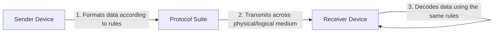
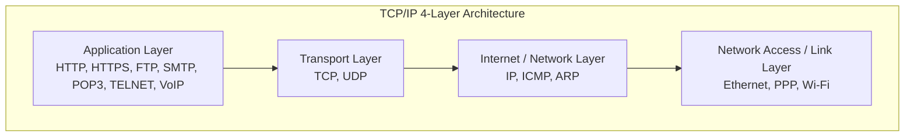
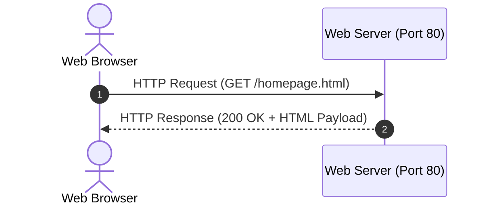
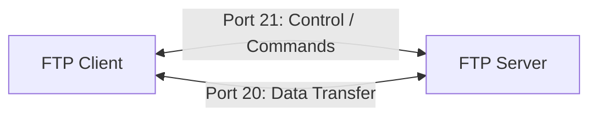
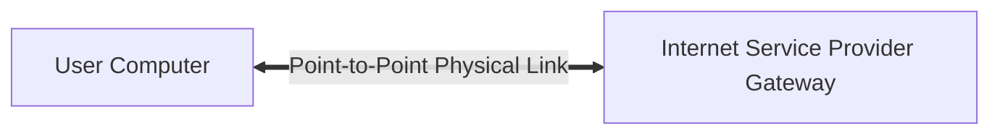
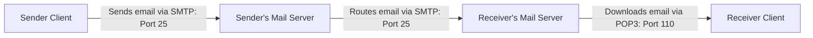
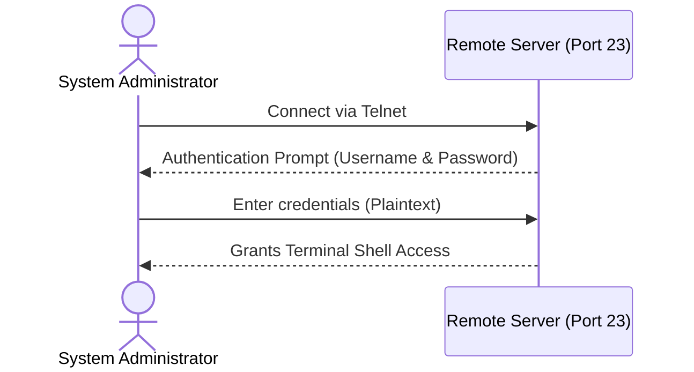
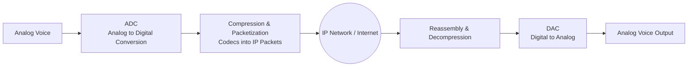

# Network Protocols

## 1. Introduction to Network Protocols

* **Definition:** A **protocol** is a formal set of rules, standards, and procedures that govern how data is formatted, transmitted, received, and processed across a computer network.
* **Why are protocols required?**
  * Without uniform rules, different computers running distinct operating systems (e.g., Windows, Linux, macOS) and hardware architectures would not be able to understand each other.

---

## 2. Foundational Suite: TCP/IP

The **TCP/IP model** (Transmission Control Protocol / Internet Protocol) is the foundational protocol suite on which the entire Internet operates.

### 2.1 TCP (Transmission Control Protocol)
* **Layer:** Transport Layer.
* **Role:** Divides user data into manageable chunks called **packets** (or segments) at the sending end and reassembles them in the correct sequential order at the receiving end.
* **Key Characteristics:**
  * **Connection-Oriented:** A dedicated logical connection is established before data is transmitted using a **3-Way Handshake**:
    $$\text{Host A} \xrightarrow{\text{SYN}} \text{Host B} \xrightarrow{\text{SYN-ACK}} \text{Host A} \xrightarrow{\text{ACK}} \text{Host B}$$
  * **Reliable Delivery:** Ensures error checking and issues acknowledgments ($\text{ACK}$). If a packet is dropped or corrupted, TCP retransmits it.

### 2.2 IP (Internet Protocol)
* **Layer:** Internet / Network Layer.
* **Role:** Responsible for the logical addressing and routing of packets from the source host to the destination host across interconnected networks.
* **Key Characteristics:**
  * **Connectionless & Best-Effort:** Transmits individual packets (called IP Datagrams) independently; it does not guarantee delivery, packet order, or error correction (which is handled by TCP).
  * **Addressing:** Handles logical identification using **IPv4** (32-bit: $4\text{ bytes}$) or **IPv6** (128-bit: $16\text{ bytes}$).

---

## 3. Web Browsing Protocols: HTTP and HTTPS

### 3.1 HTTP (HyperText Transfer Protocol)
* **Layer:** Application Layer.
* **Default Port:** Port **$80$**.
* **Purpose:** The communication standard used by web browsers to fetch hypermedia documents (HTML pages, graphics, multimedia) from web servers.
* **Working Principle:**
  * It follows a stateless **Request–Response** model.
  * The browser (client) sends an HTTP Request (e.g., `GET /index.html`); the server processes it and sends an HTTP Response along with a status code (e.g., `200 OK`, `404 Not Found`).
* **Limitation:** Data is transmitted in **plaintext**, leaving it vulnerable to eavesdropping and packet sniffing.

---

### 3.2 HTTPS (HyperText Transfer Protocol Secure)
* **Layer:** Application Layer.
* **Default Port:** Port **$443$**.
* **Purpose:** An encrypted, secure extension of HTTP used for safe internet browsing (such as online banking, e-commerce, and password submissions).
* **Mechanism:**
  * Wraps HTTP requests and responses inside an encrypted security layer: **TLS (Transport Layer Security)** or its predecessor **SSL (Secure Sockets Layer)**.
  $$\text{HTTPS} = \text{HTTP} + \text{TLS/SSL}$$
* **Key Security Pillars:**
  1. **Confidentiality (Encryption):** Prevents third parties from reading transmitted data.
  2. **Integrity:** Guarantees that data packets cannot be modified in transit without detection.
  3. **Authentication:** Uses digital certificates (SSL Certificates) to confirm the legitimate identity of the server.

---

## 4. File Management: FTP (File Transfer Protocol)

* **Layer:** Application Layer.
* **Default Ports:** Port **$20$** (Data Transfer) and Port **$21$** (Control Connection).
* **Purpose:** A standard network protocol used for uploading and downloading files between a client computer and a remote host server.

### Working Mechanism:
* Uses two distinct, simultaneous TCP connections:
  1. **Control Connection (Port 21):** Transmits administrative commands and responses (e.g., login credentials, directory navigation commands like `USER`, `PASS`, `LIST`). Remains open throughout the session.
  2. **Data Connection (Port 20):** Opens dynamically specifically to stream data files and closes immediately after the file transmission completes.

---

## 5. Direct Link Connection: PPP (Point-to-Point Protocol)

* **Layer:** Data Link Layer (Layer 2).
* **Purpose:** A direct data communication protocol used to connect two network nodes directly over a single physical link (e.g., a direct serial cable, phone line, or dial-up/broadband connection between a user and an ISP).

### Key Functions:
* **Framing:** Encapsulates higher-layer network packets (like IP) within Point-to-Point frames.
* **Link Control Protocol (LCP):** Establishes, tests, configures, and terminates the physical link connection.
* **Authentication:** Supports secure identity verification mechanisms such as **PAP** (Password Authentication Protocol) and **CHAP** (Challenge Handshake Authentication Protocol).

---

## 6. Email Protocols: SMTP vs. POP3

Electronic mail uses different protocols for **sending** and **retrieving** messages.

### 6.1 SMTP (Simple Mail Transfer Protocol)
* **Layer:** Application Layer.
* **Default Port:** Port **$25$** (or secure ports $587$ / $465$).
* **Role:** A **push protocol** used exclusively to send (push) outbound mail from:
  * A client's email application to the local outgoing mail server.
  * Between intermediate mail servers across the internet.
* **Limitation:** Cannot be used to pull/download messages from a remote mailbox down to a client computer.

---

### 6.2 POP3 (Post Office Protocol version 3)
* **Layer:** Application Layer.
* **Default Port:** Port **$110$** (Plaintext) or **$995$** (Encrypted over SSL/TLS).
* **Role:** A **pull protocol** used by client email applications (e.g., Outlook, Thunderbird) to retrieve (download) emails stored on a remote server.
* **Working Principle:**
  * By default, it follows a **Store-and-Forward** download-and-delete policy:
    $$\text{Remote Mail Server} \xrightarrow{\text{Download}} \text{Local Hard Disk} \xrightarrow{\text{Delete original from server}} \emptyset$$
  * Once messages are downloaded, they can be viewed offline, but they are typically no longer accessible from other devices.

---

## 7. Remote Administration: TELNET (Teletype Network)

* **Layer:** Application Layer.
* **Default Port:** Port **$23$**.
* **Purpose:** A terminal emulation protocol that provides a text-based, two-way interactive command-line interface (CLI) to remotely log in to and control another computer or network switch/router across a network.

### Limitation:
* TELNET sends all data—including administrative passwords—as **unencrypted plaintext**. Because of this vulnerability to eavesdropping, it has largely been replaced in modern networking by **SSH (Secure Shell)**, which runs securely over Port $22$.

---

## 8. Voice Communication: VoIP (Voice over Internet Protocol)

* **Layer:** Application Layer (supported by Transport protocols UDP and RTP).
* **Purpose:** A collection of transmission technologies that allow voice telephone calls, audio conferences, and multimedia sessions to be conducted over standard IP/Internet networks instead of legacy analog landline networks (PSTN - Public Switched Telephone Network).

### Key Technical Aspects:
* **Audio Sampling & Compression:** Converts continuous human voice into digital packets using codecs (e.g., G.711).
* **Transport via UDP/RTP:** Utilizes **UDP** (User Datagram Protocol) and **RTP** (Real-Time Transport Protocol) rather than TCP. Because voice conversations require real-time transmission, retransmitting late, dropped audio packets is unnecessary; lower latency is prioritized over retransmission.
* **Examples:** Skype, WhatsApp voice calling, Zoom audio, Discord, Google Meet.

---

## 9. Comprehensive Protocol Reference Table

| Protocol | Full Form | Default Port | Primary Layer | Key Function / Exam Keyword |
| :--- | :--- | :--- | :--- | :--- |
| **TCP** | Transmission Control Protocol | — | Transport | Reliable, connection-oriented packet sequencing. |
| **IP** | Internet Protocol | — | Internet / Network | Addressing and non-guaranteed routing of packets. |
| **HTTP** | HyperText Transfer Protocol | **$80$** | Application | Transfers hypermedia/web pages in plaintext. |
| **HTTPS** | HyperText Transfer Protocol Secure | **$443$** | Application | Encrypted, secure web transfers using SSL/TLS. |
| **FTP** | File Transfer Protocol | **$20$** (Data), **$21$** (Control) | Application | Uploads and downloads files across systems. |
| **PPP** | Point-to-Point Protocol | — | Data Link | Connects two direct network nodes (e.g., PC to ISP). |
| **SMTP** | Simple Mail Transfer Protocol | **$25$** | Application | Pushes/sends outbound email between systems. |
| **POP3** | Post Office Protocol version 3 | **$110$** | Application | Pulls/downloads emails from a mail server to a client. |
| **TELNET**| Teletype Network | **$23$** | Application | Remote command-line terminal login (unencrypted). |
| **VoIP** | Voice over Internet Protocol | Varies (e.g., $5060$) | Application | Delivers real-time voice calls over IP data networks. |

---

## 10. Key Exam Questions to Review

1. **Why is HTTPS preferred over HTTP for financial transactions?**
   * *Answer:* HTTP sends credit card numbers and passwords in readable plaintext. HTTPS encrypts all communication end-to-end using SSL/TLS, preventing packet sniffing, unauthorized tampering, and impersonation.
2. **What is the key functional difference between SMTP and POP3?**
   * *Answer:* **SMTP** is an email *push* protocol used to send messages from a client to a server or between servers. **POP3** is an email *pull* protocol used by a client to retrieve and download received messages from a server mailbox.
3. **Why does VoIP use UDP instead of TCP?**
   * *Answer:* Real-time human conversations are sensitive to latency and delays. UDP provides fast, lightweight streaming without connection delays or packet retransmissions; dropping a split-second voice frame is preferable to introducing audio lag.