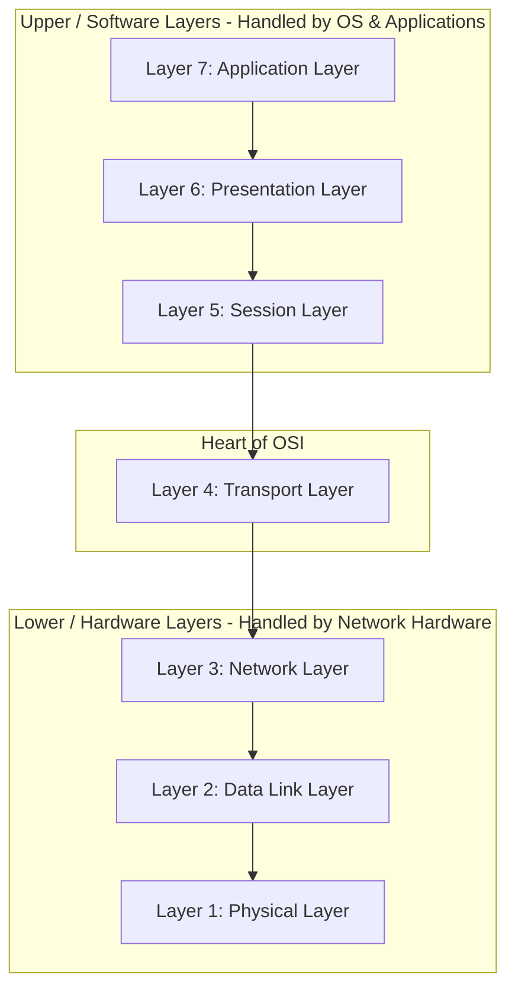

# The OSI Reference Model

## 1. Introduction to the OSI Model

* **Full Form:** **O**pen **S**ystems **I**nterconnection Reference Model.
* **Developed By:** The **ISO** (International Organization for Standardization) in **1984**.
* **Concept:** It is a theoretical, conceptual framework of **7 distinct layers** that standardizes and explains how network hardware and software interact to transmit data across a network.
* **Why Layering?** 
  * Modularity: Changes in one layer do not require redesigning the other layers.
  * Interoperability: Devices and software from different vendors can communicate seamlessly.
  * Troubleshooting: Simplifies problem isolation by narrowing issues down to a specific layer.

### Helpful Mnemonics to Memorize the 7 Layers:
* **From Layer 7 down to Layer 1:** 
  $$\text{“\textbf{A}ll \textbf{P}eople \textbf{S}eem \textbf{T}o \textbf{N}eed \textbf{D}ata \textbf{P}rocessing”}$$
* **From Layer 1 up to Layer 7:** 
  $$\text{“\textbf{P}lease \textbf{D}o \textbf{N}ot \textbf{T}hrow \textbf{S}ausage \textbf{P}izza \textbf{A}way”}$$

---

## 2. Data Encapsulation & Protocol Data Units (PDUs)

As data moves down the stack on the sender's device, each layer attaches its own control information in the form of a **Header** ($H$) and sometimes a **Trailer** ($T$). This is called **Encapsulation**. 

On the receiver's machine, each layer strips off its corresponding header as data moves upward. This reverse process is called **Decapsulation**.

```mermaid
flowchart LR
    subgraph Sender [Sender: Encapsulation ↓]
        direction TB
        S7[Data] --> S4[Header 4 + Data = Segment]
        S4 --> S3[Header 3 + Segment = Packet]
        S3 --> S2[Header 2 + Packet + Trailer 2 = Frame]
        S2 --> S1[Binary Bitstream: 1011001...]
    end

    subgraph Medium [Transmission Medium]
        S1 ==> R1
    end

    subgraph Receiver [Receiver: Decapsulation ↑]
        direction BT
        R1[Binary Bitstream] --> R2[Frame → Strip L2 Header/Trailer]
        R2 --> R3[Packet → Strip L3 Header]
        R3 --> R4[Segment → Strip L4 Header]
        R4 --> R7[Data to Application]
    end
```

### Mathematical Representation of PDUs:
$$\text{PDU}_{\text{Layer 4 (Transport)}} = H_4 + \text{Data} = \mathbf{Segment}$$
$$\text{PDU}_{\text{Layer 3 (Network)}} = H_3 + \text{Segment} = \mathbf{Packet}$$
$$\text{PDU}_{\text{Layer 2 (Data Link)}} = H_2 + \text{Packet} + T_2 = \mathbf{Frame}$$
$$\text{PDU}_{\text{Layer 1 (Physical)}} = \mathbf{Raw\ Bits}\ (0\text{s and } 1\text{s})$$

---

## 3. Deep-Dive into the 7 Layers

---

### Layer 1: Physical Layer
* **PDU:** **Bits** ($0$s and $1$s).
* **Primary Role:** Transmits unstructured raw bitstreams over a physical transmission medium.
* **Key Functions:**
  1. **Signal Representation:** Determines whether bits are transmitted as electrical voltages, optical light pulses, or radio waves.
  2. **Data Rate (Bit Rate):** Defines the transmission speed:
     $$\text{Bit Rate} = \frac{\text{Number of bits transmitted}}{\text{Time (seconds)}}$$
  3. **Physical Topologies & Media:** Governs physical layouts (Bus, Star, Ring) and connectors/cables.
* **Devices Operating Here:** **Hubs, Repeaters, Cables (Twisted-pair, Coaxial, Fiber), RJ-45 Connectors.**
* **Protocols / Standards:** IEEE 802.3 (Ethernet Physical), DSL, RS-232.

---

### Layer 2: Data Link Layer (DLL)
* **PDU:** **Frame**.
* **Primary Role:** Provides node-to-node (hop-to-hop) error-free data transfer across the physical link.
* **Sub-layers:**
  * **LLC (Logical Link Control):** Manages flow control and multiplexing protocols.
  * **MAC (Media Access Control):** Manages access to the physical transmission medium.
* **Key Functions:**
  1. **Framing:** Groups bits received from the physical layer into distinct logical containers called *frames*.
  2. **Physical Addressing:** Adds source and destination **MAC Addresses** ($48\text{ bits} / 6\text{ bytes}$).
  3. **Error Detection:** Appends a Frame Check Sequence (FCS) / **CRC (Cyclic Redundancy Check)** trailer to detect corrupted bits.
* **Devices Operating Here:** **Network Switches (Layer 2), Bridges, Ethernet Cards (NICs), Wi-Fi Cards.**
* **Protocols:** **PPP (Point-to-Point Protocol), Ethernet (802.3), Wi-Fi (802.11 MAC), ARP.**

---

### Layer 3: Network Layer
* **PDU:** **Packet**.
* **Primary Role:** Handles end-to-end host addressing and routes packets across multiple interconnected networks.
* **Key Functions:**
  1. **Logical Addressing:** Adds source and destination **IP addresses** (IPv4: 32 bits; IPv6: 128 bits) to every packet.
  2. **Routing:** Determines the optimal, shortest path for data using routing algorithms and tables:
     $$\text{Path Cost} = f(\text{Hop Count, Bandwidth, Delay})$$
  3. **Packet Forwarding:** Moves packets from an incoming interface to an outgoing interface toward their destination.
* **Devices Operating Here:** **Routers, Layer 3 Switches.**
* **Protocols:** **IP (IPv4, IPv6), ICMP (used by ping), OSPF, RIP, BGP.**

---

### Layer 4: Transport Layer
* **PDU:** **Segment** (for TCP) or **Datagram** (for UDP).
* **Primary Role:** Ensures reliable or best-effort end-to-end (process-to-process) communication between applications. Called the **"Heart of the OSI Model"**.
* **Key Functions:**
  1. **Service Point (Port) Addressing:** Ensures packets reach the correct specific program on a computer by appending a **Port Number** ($16\text{ bits}$, values from $0$ to $65,535$).
  2. **Segmentation & Reassembly:** Splits large messages into ordered segments at the sender side and reassembles them at the receiver side.
  3. **Flow & Error Control:** Uses sliding window mechanisms to prevent a fast sender from overwhelming a slow receiver, and handles retransmissions for lost segments.
* **Devices Operating Here:** Layer 4 Firewalls, Gateways.
* **Protocols:** **TCP (Transmission Control Protocol), UDP (User Datagram Protocol).**

---

### Layer 5: Session Layer
* **PDU:** **Data**.
* **Primary Role:** Establishes, manages, synchronizes, and terminates interactive sessions/connections between cooperating applications.
* **Key Functions:**
  1. **Dialog Control:** Determines which device transmits first and whether transmission is simplex, half-duplex, or full-duplex.
  2. **Synchronization & Checkpointing:** Inserts check marks (synchronization points) into lengthy data streams. If a connection drops during a $100\text{ MB}$ file transfer at $70\text{ MB}$, transfer can resume from the last checkpoint rather than starting from $0\text{ MB}$.
* **Protocols / APIs:** NetBIOS, RPC (Remote Procedure Call), PPTP.

---

### Layer 6: Presentation Layer
* **PDU:** **Data**.
* **Primary Role:** Formats, structures, and transforms data so that heterogeneous systems can interpret it correctly. Known as the **"Translator of the Network"**.
* **Key Functions:**
  1. **Translation:** Converts between different character encoding systems (e.g., ASCII to EBCDIC, or Unicode).
  2. **Encryption / Decryption:** Secures sensitive data before transmission (e.g., SSL/TLS operations).
  3. **Compression:** Reduces data payload size to optimize bandwidth usage (e.g., JPEG, MPEG, MP3, ZIP).
* **Protocols / Standards:** TLS/SSL, JPEG, MPEG, GIF, ASCII.

---

### Layer 7: Application Layer
* **PDU:** **Data**.
* **Primary Role:** The topmost layer that directly interfaces with user software applications (like web browsers and email clients) to provide network communication services.
* **Key Functions:**
  1. Facilitates human-to-network application communication.
  2. Provides high-level protocols for web access, remote administration, and file transfers.
* **Devices Operating Here:** **Application Gateways, Proxies, Firewalls, End-user hosts (PCs, Servers).**
* **Protocols:** **HTTP, HTTPS, FTP, SMTP, POP3, TELNET, DNS, DHCP, VoIP (SIP).**

---

## 4. Master OSI Reference Table

| Layer # | Layer Name | PDU | Primary Responsibility | Addressing Used | Devices | Key Protocols |
| :---: | :--- | :--- | :--- | :--- | :--- | :--- |
| **7** | **Application** | Data | User interface & network services | None | Application Gateway | HTTP, HTTPS, FTP, SMTP, POP3, TELNET, VoIP |
| **6** | **Presentation** | Data | Encryption, compression, translation | None | Gateway | SSL, TLS, ASCII, JPEG |
| **5** | **Session** | Data | Session establishment & checkpoints | None | Gateway | NetBIOS, RPC, PPTP |
| **4** | **Transport** | Segment / Datagram | End-to-end delivery & reliability | **Port Numbers** (16-bit) | Gateway, L4 Firewall | TCP, UDP |
| **3** | **Network** | Packet | Routing & path selection across nets | **IP Addresses** (32/128-bit) | Router, Layer 3 Switch | IPv4, IPv6, ICMP, ARP |
| **2** | **Data Link** | Frame | Node-to-node hop delivery & CRC | **MAC Addresses** (48-bit) | Switch, Bridge, NIC, Wi-Fi Card | Ethernet (802.3), PPP, 802.11 |
| **1** | **Physical** | Bits | Transmission of raw electrical bits | Physical Pins / Signals | Hub, Repeater, RJ-45, Cables | 100BASE-T, RS-232, DSL |

---
