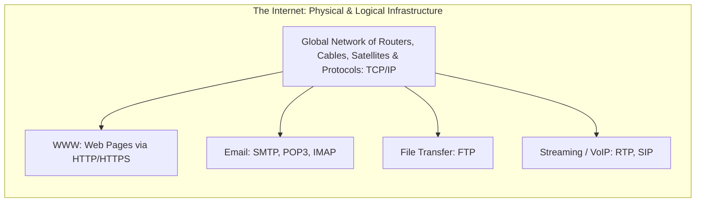
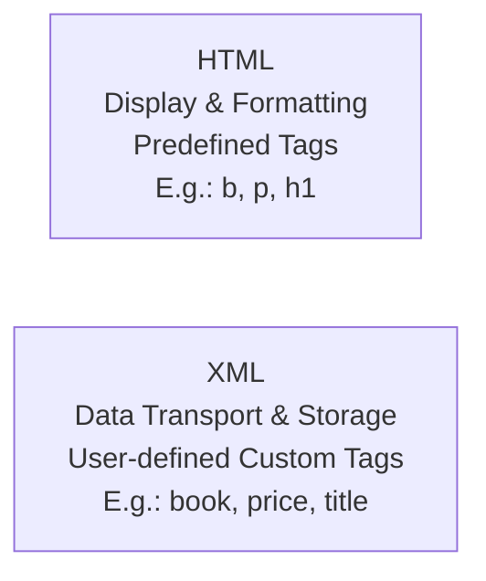
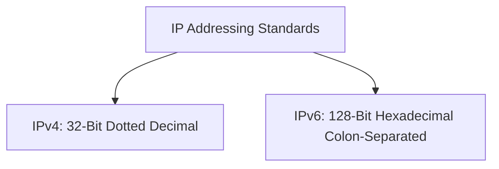
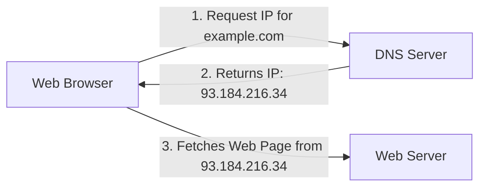
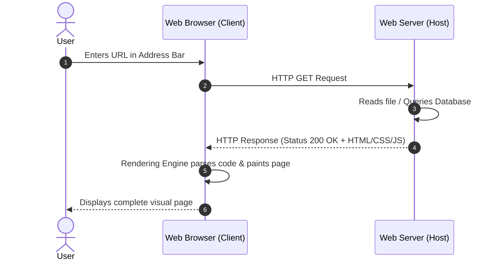
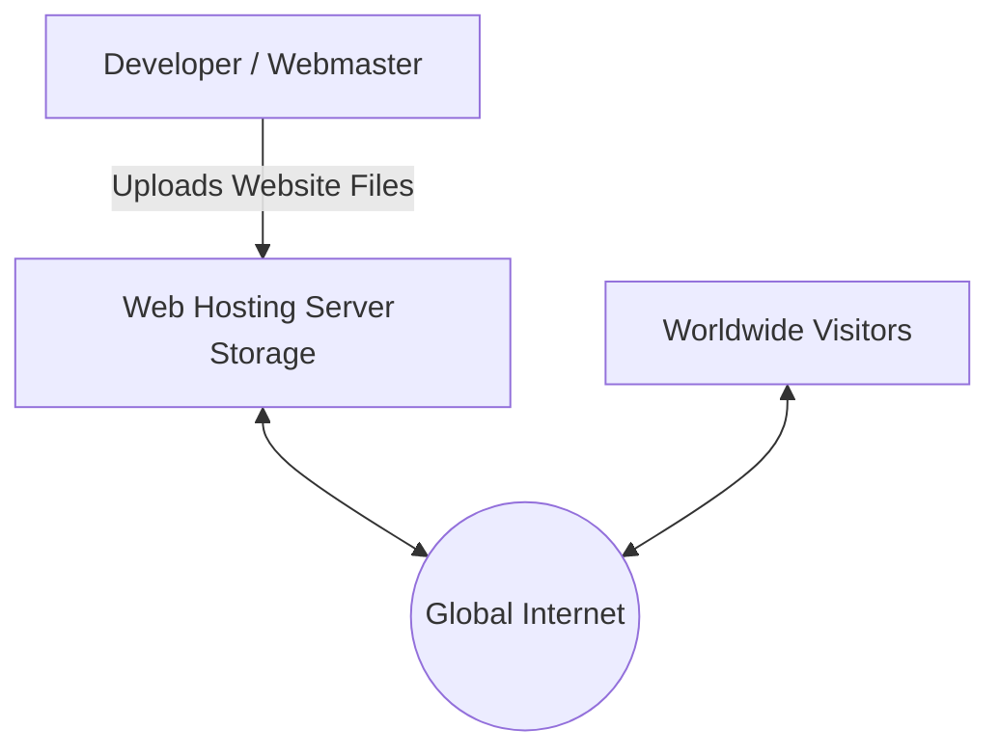
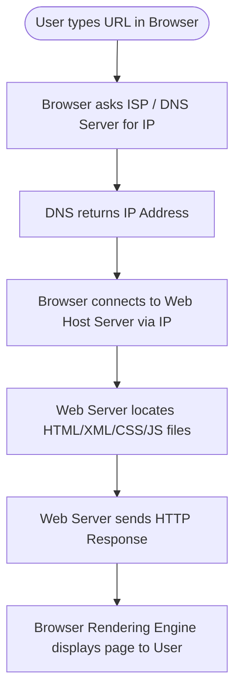

# Introduction to Web Services

## 1. The World Wide Web (WWW)

* **Definition:** The **World Wide Web** (commonly known as the **Web** or **WWW**) is a massive, globally distributed repository of interlinked hypertext documents and multimedia resources accessible via the Internet.
* **Inventor:** Invented by British computer scientist **Sir Tim Berners-Lee** in **1989** at CERN (European Organization for Nuclear Research).
* **Key Mechanism:** It operates on a client–server architecture where web browsers fetch hypermedia documents from web servers using protocols like **HTTP/HTTPS**.

### Internet vs. World Wide Web (A Crucial Distinction)

| Parameter | The Internet | The World Wide Web (WWW) |
| :--- | :--- | :--- |
| **Nature** | The global physical and logical networking infrastructure. | A service/software application operating *on top* of the Internet. |
| **Composition** | Interconnected computers, routers, fiber optics, switches, and TCP/IP. | Interconnected collections of HTML files, media, and hyperlinks. |
| **Origin** | Originated as ARPANET (late 1960s). | Proposed by Tim Berners-Lee in 1989. |
| **Analogy** | The network of highways and roads. | The cars, buses, and cargo trucks traveling on those roads. |

---

## 2. Web Markup Languages: HTML vs. XML

### 2.1 HTML (HyperText Markup Language)
* **Purpose:** The standard markup language used to design, structure, and format the **visual display** of web pages.
* **Characteristics:**
  * Uses **predefined tags** (e.g., `<h1>`, `
`, `<a>`, `<table>`).
  * Not case-sensitive (`<HTML>` is treated the same as `<html>`).
  * Forgiving syntax: Minor syntax errors usually do not crash the page rendering.
  * **Primary Goal:** *How data looks on screen* (Presentation).

### 2.2 XML (eXtensible Markup Language)
* **Purpose:** A markup language designed specifically to **store, carry, and exchange structured data** between disparate platforms.
* **Characteristics:**
  * Uses **custom, user-defined tags** (extensible): A developer can invent tags such as `<student>`, `<rollno>`, `<marks>`.
  * **Strictly case-sensitive** (`<Name>` $\neq$ `<name>`).
  * Rigid grammar: Documents must be well-formed; tags must close properly and follow nesting hierarchies.
  * **Primary Goal:** *What data is and what it means* (Data Description & Transport).

#### Direct Comparison

| Feature | HTML | XML |
| :--- | :--- | :--- |
| **Primary Focus** | Presenting and displaying data. | Storing and transporting data. |
| **Tags** | Predefined and fixed in standard libraries. | User-defined / Extensible. |
| **Case Sensitivity**| Case-insensitive. | Strictly case-sensitive. |
| **Closing Tags** | Optional in certain legacy tags (` `, ``). | Strictly required for every opened element. |
| **Dynamic Nature** | Static layout language (without JS). | Platform-independent data format. |

---

## 3. Addressing Systems: IP Address, Domain Names, & URL

---

### 3.1 IP Address (Internet Protocol Address)

An **IP address** is a unique numerical identifier assigned to every device connected to a computer network that uses the Internet Protocol for communication.

#### A. IPv4 (Internet Protocol Version 4)
* **Length:** $32\text{ bits}$ ($4\text{ bytes}$).
* **Format:** Written as four decimal numbers separated by dots (dotted-decimal notation), where each decimal number is an **octet** ($8\text{ bits}$):
  $$\text{Value range per octet: } [0, 2^8 - 1] = [0, 255]$$
  $$\text{Total theoretical addresses: } 2^{32} \approx 4,294,967,296 \ (4.29 \times 10^9)$$
  *Example:* `192.168.1.1`

#### B. IPv6 (Internet Protocol Version 6)
* **Length:** $128\text{ bits}$ ($16\text{ bytes}$).
* **Why introduced?** Developed to prevent the global exhaustion of IPv4 addresses.
* **Format:** Written as 8 groups of four hexadecimal digits separated by colons:
  $$\text{Total theoretical addresses: } 2^{128} \approx 3.4 \times 10^{38}$$
  *Example:* `2001:0db8:85a3:0000:0000:8a2e:0370:7334`

---

### 3.2 Domain Names and the DNS

* **Domain Name:** A human-friendly, alphabetical alias for a numerical IP address (e.g., `www.google.com` instead of `142.250.190.46`).
* **DNS (Domain Name System):** The internet's distributed database or "phonebook" that resolves human-readable domain names into machine-readable IP addresses.

#### Hierarchy of Domain Names:
$$\underbrace{\text{blog}}_{\text{Subdomain}} \ . \ \underbrace{\text{example}}_{\text{Second-Level Domain}} \ . \ \underbrace{\text{com}}_{\text{Top-Level Domain (TLD)}}$$

* **Top-Level Domains (TLD):**
  * **Generic TLDs (gTLDs):** `.com` (Commercial), `.org` (Organization), `.edu` (Education), `.gov` (Government).
  * **Country-Code TLDs (ccTLDs):** `.in` (India), `.us` (United States), `.uk` (United Kingdom), `.au` (Australia).

---

### 3.3 URL (Uniform Resource Locator)

* **Definition:** A complete web address specifying the global location of a specific resource (webpage, image, document) on the World Wide Web and the protocol used to access it.

#### Anatomy of a URL:

$$\mathbf{\underbrace{https}_{\text{Protocol}}://\underbrace{www}_{\text{Subdomain}}.\underbrace{example.com}_{\text{Domain Name}}:\underbrace{443}_{\text{Port}}/\underbrace{students/notes.html}_{\text{File Path}}?\underbrace{id=101\&sem=1}_{\text{Query String}}}$$

1. **Protocol / Scheme (`https`):** Specifies how data should be transferred.
2. **Domain Name (`www.example.com`):** Identifies the specific host computer.
3. **Port Number (`:443` or `:80`):** The logical communication port (often omitted because default ports are implied).
4. **Path (`/students/notes.html`):** The exact directory path pointing to the file stored on the server's hard disk.
5. **Query String (`?id=101&sem=1`):** Key-value parameter pairs sent to the server for processing dynamic pages.

---

## 4. Internet Infrastructure & Delivery

---

### 4.1 ISP (Internet Service Provider)
* **Definition:** A commercial or government organization that provides subscribers with paid access to the Internet.
* **Services Provided:** High-speed internet connectivity (Fiber, Broadband, 4G/5G, Satellite), web hosting, domain name registration, and email accounts.
* **Tier Architecture:**
  * **Tier 1 ISPs:** Global backbone providers that peer without transit fees (e.g., Tata Communications, AT&T, Lumen).
  * **Tier 2/3 ISPs:** Regional providers and local cable/telecom operators selling direct access to end-users (e.g., Jio, Airtel, Vodafone Idea, BSNL).

---

### 4.2 Website vs. Webpage
* **Webpage:** A single, individual document written in HTML/CSS/JavaScript accessible by a specific URL.
* **Website:** A cohesive collection of related, interlinked web pages hosted under a single common domain name.
  * **Homepage:** The default main landing page of a website (typically named `index.html`).

#### Static vs. Dynamic Websites:
* **Static Website:** Displays pre-stored, identical content to every visitor. Written directly in pure HTML and CSS.
* **Dynamic Website:** Generates customized content in real time based on user interactions, database queries, and session state (built using server-side languages like Python, PHP, or Node.js).

---

### 4.3 Web Browser vs. Web Server

| Parameter | Web Browser | Web Server |
| :--- | :--- | :--- |
| **Role** | **Client** application. | **Server** system (hardware + software). |
| **Function** | Requests, downloads, and renders web pages for humans. | Stores, processes, and serves web files to requesting browsers. |
| **Key Component** | **Rendering Engine** (Blink, WebKit, Gecko). | **HTTP Daemon / Service** daemon listening on ports $80/443$. |
| **Examples** | Google Chrome, Mozilla Firefox, Apple Safari, Microsoft Edge. | Apache HTTP Server, Nginx, Microsoft IIS, LiteSpeed. |

---

### 4.4 Web Hosting

* **Definition:** An online service that provisions physical storage space, computational resources, and internet connectivity on a continuously running web server, making a website accessible $24/7/365$ across the globe.

#### Common Types of Web Hosting:
1. **Shared Hosting:** Multiple websites share the CPU, RAM, and disk space of a single physical server. Inexpensive, but heavy traffic on one site can slow down all the others.
2. **VPS (Virtual Private Server) Hosting:** A single physical server is partitioned into isolated virtual environments using virtualization. Provides dedicated resources to each user at moderate cost.
3. **Dedicated Hosting:** An entire physical server machine is leased and dedicated exclusively to a single website or client. Expensive; ideal for high-traffic enterprises.
4. **Cloud Hosting:** A website is hosted across a clustered network of interconnected virtual and physical cloud servers (e.g., AWS, Microsoft Azure, Google Cloud). Offers high availability, fault tolerance, and automatic scaling.

---

## 5. End-to-End Conceptual Synthesis

