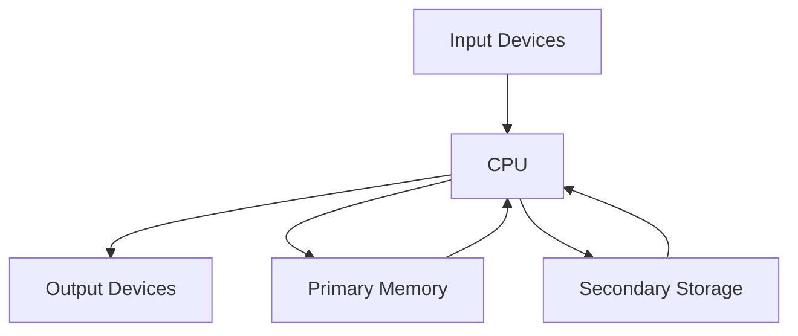
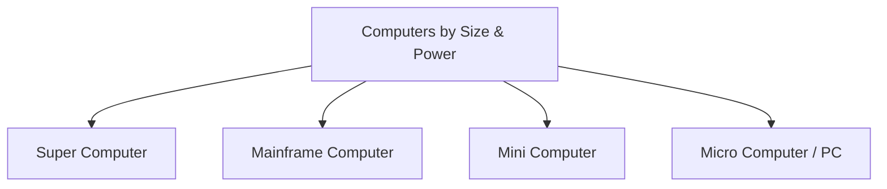

# Computer System And Organization (EN)

## 1. Basic Computer Organization

### 1.1 Block Diagram

**Function of each block**:

- **Input**: Feeds data and instructions.
- **CPU**: Processes data.
- **Primary Memory**: Holds active data/programs.
- **Secondary Storage**: Permanent backup.
- **Output**: Displays results.

---

### 1.2 Central Processing Unit (CPU) – _Deep Dive_

The CPU has **three main internal parts**:

1. **Arithmetic Logic Unit (ALU)**
   - Performs **Arithmetic** operations: `+`, `-`, `×`, `÷`.
   - Performs **Logical** operations: `AND`, `OR`, `NOT`, comparisons (`>`, `<`, `=`).

2. **Control Unit (CU)**
   - Fetches instructions from memory.
   - Decodes them to understand what needs to be done.
   - Generates control signals to coordinate all other components (like a traffic police).

3. **Registers**
   - Smallest, fastest memory inside the CPU.
   - Hold data immediately required for processing (e.g., Accumulator, Program Counter, Instruction Register).

> **Speed Hierarchy**: Registers > Cache > RAM > Secondary Storage.

---

### 1.3 Primary Memory – _Deep Dive_

| Feature       | RAM (Random Access Memory)           | ROM (Read Only Memory)                             | Cache Memory                                           |
| :------------ | :----------------------------------- | :------------------------------------------------- | :----------------------------------------------------- |
| **Nature**    | Volatile (data lost on power off)    | Non-Volatile (retains data)                        | Volatile                                               |
| **Operation** | Read / Write                         | Read Only                                          | Read / Write                                           |
| **Speed**     | Slower than Cache                    | Slower than RAM                                    | Fastest among primary (Level 1, 2, 3)                  |
| **Usage**     | Stores running programs and OS data. | Stores BIOS/UEFI and firmware (boot instructions). | Stores frequently accessed data to reduce access time. |
| **Types**     | SRAM (Static) & DRAM (Dynamic)       | PROM, EPROM, EEPROM                                | L1, L2, L3 (L1 is fastest, inside CPU chip)            |

---

### 1.4 Secondary Storage Devices

Non-volatile permanent storage. Examples:

- **Magnetic**: Hard Disk Drive (HDD) – large capacity, mechanical.
- **Solid State**: Solid State Drive (SSD) – no moving parts, faster.
- **Optical**: CD, DVD, Blu-ray.
- **Flash**: Pen drives, Memory cards.

---

### 1.5 Input / Output (I/O) Devices

- **Input**: Keyboard, Mouse, Scanner, Joystick, Microphone, Webcam, Barcode reader.
- **Output**: Monitor (VDU), Printer (Laser/Inkjet), Plotter, Speakers, Projector.

---

### 1.6 Units of Memory (Exact Binary Standards)

| Unit         | Abbrev. | Exact Size (Binary)     | Decimal Equivalent (approx) |
| :----------- | :------ | :---------------------- | :-------------------------- |
| **Bit**      | b       | 1 binary digit (0 or 1) | -                           |
| **Byte**     | B       | 8 bits                  | -                           |
| **Kilobyte** | KB      | $2^{10}$ Bytes          | 1024 Bytes                  |
| **Megabyte** | MB      | $2^{20}$ Bytes          | 1024 KB                     |
| **Gigabyte** | GB      | $2^{30}$ Bytes          | 1024 MB                     |
| **Terabyte** | TB      | $2^{40}$ Bytes          | 1024 GB                     |
| **Petabyte** | PB      | $2^{50}$ Bytes          | 1024 TB                     |

> _Exam Tip_: Be careful—storage manufacturers sometimes use decimal (1000), but for Computer Science exams, use **binary multiples** ($2^{10}$).

---

## 2. Classification of Computers

### 2.1 Hierarchy Diagram

### 2.2 Detailed Comparison Table (All 4 Types)

| Feature        | **Super Computer**                               | **Mainframe Computer**                   | **Mini Computer**          | **Personal Computer (PC)**           |
| :------------- | :----------------------------------------------- | :--------------------------------------- | :------------------------- | :----------------------------------- |
| **Size**       | Largest (fills a room/building)                  | Large (cabinet size)                     | Medium (refrigerator size) | Small (desk/lap size)                |
| **Speed**      | Fastest (Petaflops/Exaflops)                     | Very High (millions of transactions/sec) | Moderate                   | Slowest among these                  |
| **Processing** | Parallel processing (thousands of CPUs)          | Massive I/O & transaction processing     | Multi-user, time-sharing   | Single-user                          |
| **Users**      | Only specific researchers (single/multi limited) | Thousands of concurrent users            | Tens to hundreds of users  | Single user                          |
| **Cost**       | Extremely Expensive ($ millions)                 | Very Expensive                           | Moderate                   | Cheap / Affordable                   |
| **OS**         | Custom Linux/UNIX                                | z/OS, IBM Linux                          | UNIX, VMS                  | Windows, macOS, Linux                |
| **Examples**   | Fugaku, Summit, Param (India)                    | IBM Z-series, Unisys                     | DEC VAX, PDP-11            | Dell, HP, Apple MacBook, Smartphones |

---

### 2.3 Additional Key Points for Exams

- **Supercomputers** are used for **Weather Forecasting**, **Nuclear Simulations**, **Aerospace**, and **Cryptography**.
- **Mainframes** are used in **Banking**, **Railway/Airline Reservations**, and **Insurance** due to high reliability.
- **Mini Computers** were popular in the 1960s–80s for departmental systems; now largely replaced by powerful servers.
- **PCs** are further divided into **Desktops**, **Laptops**, **Tablets**, and **Smartphones** (Microcomputers).

---

### Summary of Volatility (Memory types)

- **Volatile**: RAM, Cache, Registers. (Lost when power is off).
- **Non-Volatile**: ROM, Secondary Storage (HDD/SSD), Pen drives. (Retained when power is off).
