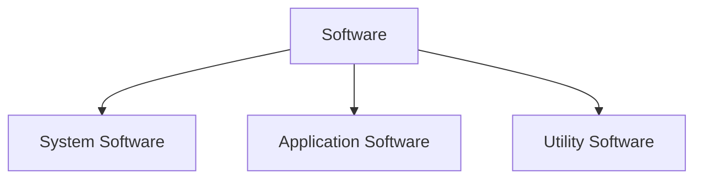
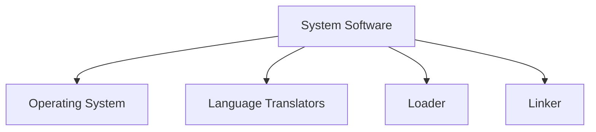
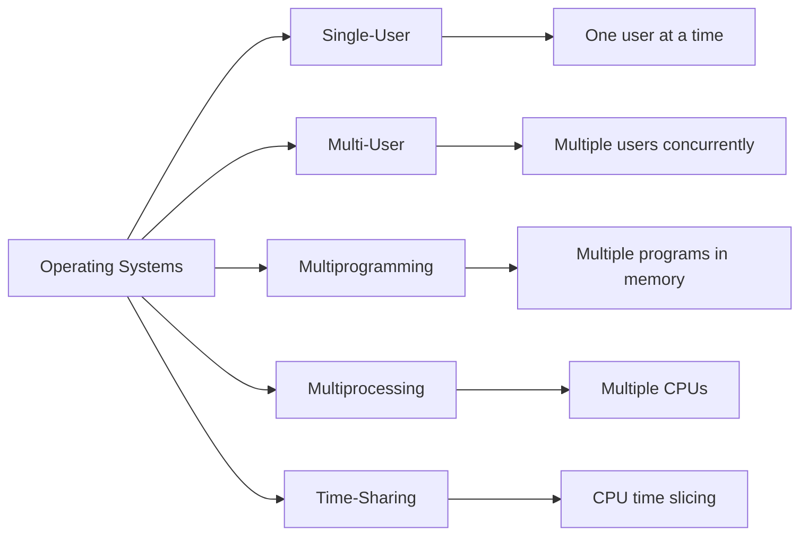
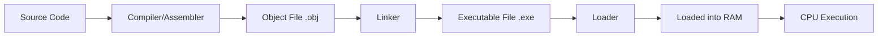

# Concepts Of Software (EN)

## 1. Definition of Software

**Software** is a collection of programs, data, and instructions that tell a computer how to perform specific tasks. It is the intangible part of a computer system (as opposed to hardware, which is physical).

> **Relationship**: Hardware + Software = Functional Computer System.

---

## 2. Types of Software

Software is broadly classified into three categories:



---

## 3. System Software

**System Software** is a set of programs that manage and control the hardware resources of a computer and provide a platform for running application software. It acts as an **interface** between the user/hardware and the application programs.

### 3.1 Components of System Software



---

### 3.2 Operating System (OS)

#### Definition

An **Operating System** is a system software that acts as an intermediary between the user and the computer hardware. It manages all hardware resources and provides services to application programs.

#### Functions of an Operating System

1. **Process Management** – Allocates CPU time to processes and handles multitasking.
2. **Memory Management** – Manages RAM allocation to programs.
3. **File Management** – Organizes, stores, retrieves, and manages files on storage devices.
4. **Device Management** – Controls I/O devices using device drivers.
5. **Security & Protection** – Provides user authentication, access controls, and data protection.
6. **User Interface** – Provides a way for users to interact (CUI or GUI).
7. **Error Detection & Handling** – Detects hardware/software errors and takes corrective actions.

---

#### Types of Operating Systems

| OS Type                 | Definition                                                                                                           | Example                                    |
| :---------------------- | :------------------------------------------------------------------------------------------------------------------- | :----------------------------------------- |
| **Single-User OS**      | Allows only one user to use the system at a time.                                                                    | MS-DOS, early Windows (95/98)              |
| **Multi-User OS**       | Allows multiple users to access the system simultaneously via terminals.                                             | UNIX, Linux, Windows Server                |
| **Multiprogramming OS** | Keeps multiple programs in memory simultaneously; CPU switches between them to keep busy (no idle time).             | Early IBM mainframe OS                     |
| **Multiprocessing OS**  | Supports two or more CPUs (processors) in a single system, executing multiple processes in parallel.                 | Windows NT, Linux (on multi-core), Solaris |
| **Time-Sharing OS**     | Extends multiprogramming; each user gets a small time slice (quantum) of CPU. Users feel they have dedicated system. | UNIX, Linux, Windows (terminal services)   |

**Visualizing OS Types:**



---

### 3.3 Language Translators (Translators)

A **translator** converts high-level language (HLL) programs or assembly code into machine code (binary) that the CPU can execute.

| Translator      | Definition                                                                               | Process                                                          | Output                          | Speed of Execution                                     |
| :-------------- | :--------------------------------------------------------------------------------------- | :--------------------------------------------------------------- | :------------------------------ | :----------------------------------------------------- |
| **Assembler**   | Translates **Assembly Language** (mnemonics) into machine code.                          | 1 step (source → object code).                                   | Machine code (specific to CPU). | Fast (direct translation).                             |
| **Interpreter** | Translates HLL code **line-by-line** and executes it immediately.                        | Translates → executes → next line.                               | No separate object code file.   | Slow (repeats translation each run).                   |
| **Compiler**    | Translates entire HLL program into machine code **in one go**, producing an object file. | Source code → Compiler → Object code (.obj) → Executable (.exe). | Standalone executable file.     | Fast (execution happens later without re-translation). |

> **Key Difference**: Compiler translates once; Interpreter translates every time the program runs.

---

### 3.4 Loader

- **Definition**: A system program that loads the executable program (object code) from secondary storage (hard disk) into the main memory (RAM) so that the CPU can execute it.
- **Types**: Absolute Loader, Relocating Loader, Dynamic Linker (sometimes combined).
- **Function**: Allocates memory space, resolves addresses, and hands control to the starting address of the program.

---

### 3.5 Linker

- **Definition**: A system program that combines multiple object files (generated by compiler/assembler) into a single executable file.
- **Function**: Resolves external references (e.g., linking library functions like `printf` in C to the main program).
- **Output**: Produces an executable file (`.exe`, `.out`) that can be loaded by the loader.

> **Relationship** (Compilation to Execution Flow):
> Source Code → **Compiler** → Object File(s) → **Linker** → Executable File → **Loader** → Memory → CPU executes.



---

## 4. Application Software

**Application Software** is designed to help users perform specific tasks (non-system tasks) such as word processing, calculations, browsing, gaming, etc.

- **Definition**: End-user software that runs on top of system software (OS).
- **Examples**:
  - Word Processors: MS Word, Google Docs
  - Spreadsheets: MS Excel, Google Sheets
  - Web Browsers: Chrome, Firefox
  - Graphics: Adobe Photoshop, CorelDRAW
  - Games, Media Players, Database Management (MySQL Workbench), etc.

---

## 5. Utility Software

**Utility Software** is a type of system software that helps to maintain, optimize, and secure the computer system. It is neither an OS nor an application—it fills the gap.

- **Definition**: Tools that assist in managing the computer's resources efficiently.
- **Examples**:
  - Antivirus (Norton, Kaspersky)
  - Disk Cleanup, Defragmentation tools
  - Backup software
  - File compression (WinRAR, 7-Zip)
  - System monitoring tools.

> **Difference from Application Software**: Utilities are system-oriented (maintenance), while applications are user-task-oriented.

---

## 6. User Interface: CUI vs GUI

### 6.1 CUI (Character User Interface) / CLI (Command Line Interface)

- **Definition**: User interacts with the computer by typing textual commands.
- **Characteristics**:
  - Requires knowledge of commands.
  - Low memory/processing overhead.
  - Faster for advanced users.
  - Less user-friendly for beginners.
- **Examples**: MS-DOS, **Linux Terminal (Bash)**, Windows Command Prompt, UNIX.

### 6.2 GUI (Graphical User Interface)

- **Definition**: User interacts with the computer using graphical elements like windows, icons, menus, and pointers (WIMP).
- **Characteristics**:
  - Intuitive and visual.
  - Uses mouse/touch for navigation.
  - Requires more system resources (RAM, GPU).
  - Easy for beginners.
- **Examples**: Windows (7/10/11), macOS, Linux desktop environments (GNOME, KDE), Android/iOS.

---

## 7. LINUX – Basic Commands (CUI Example)

Linux is an open-source, multi-user, multitasking OS. Its terminal uses a **CUI**. Below are essential commands:

| Command  | Syntax               | Description                                     | Example                  |
| :------- | :------------------- | :---------------------------------------------- | :----------------------- |
| `pwd`    | `pwd`                | Prints the current working directory path.      | `pwd` → `/home/user`     |
| `ls`     | `ls`                 | Lists files and directories in current folder.  | `ls` → `Documents Music` |
| `cd`     | `cd [dir]`           | Changes directory. `cd ..` goes back one level. | `cd Documents`           |
| `mkdir`  | `mkdir [name]`       | Creates a new directory.                        | `mkdir NewFolder`        |
| `rmdir`  | `rmdir [name]`       | Removes an empty directory.                     | `rmdir OldFolder`        |
| `touch`  | `touch [file]`       | Creates an empty file.                          | `touch notes.txt`        |
| `cp`     | `cp [source] [dest]` | Copies a file/directory.                        | `cp file1.txt file2.txt` |
| `mv`     | `mv [source] [dest]` | Moves or renames a file/directory.              | `mv old.txt new.txt`     |
| `rm`     | `rm [file]`          | Removes/deletes a file.                         | `rm notes.txt`           |
| `cat`    | `cat [file]`         | Displays content of a file.                     | `cat notes.txt`          |
| `man`    | `man [command]`      | Displays the manual/help for a command.         | `man ls`                 |
| `whoami` | `whoami`             | Displays the logged-in username.                | `whoami` → `student`     |
| `clear`  | `clear`              | Clears the terminal screen.                     | `clear`                  |

> **Example Flow in Linux Terminal (CUI)**:
>
> ```
> $ pwd
> /home/student
> $ mkdir Class11
> $ cd Class11
> $ touch notes.md
> $ ls
> notes.md
> $ cat notes.md
> (displays content)
> ```

---
