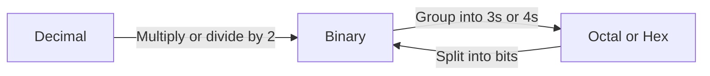

# Number System (EN)

## 1. Introduction to Number Systems

A **number system** (or numeral system) defines a set of values used to represent quantities. It uses a **base** (or **radix**) which determines the number of unique digits used.

| Number System   | Base (Radix) | Digits Used                                   | Primary Use                                                             |
| :-------------- | :----------- | :-------------------------------------------- | :---------------------------------------------------------------------- |
| **Decimal**     | 10           | 0–9                                           | Everyday human calculations.                                            |
| **Binary**      | 2            | 0, 1                                          | Internal computer processing (logic gates).                             |
| **Octal**       | 8            | 0–7                                           | Compact representation of binary (obsolete now, but still in syllabus). |
| **Hexadecimal** | 16           | 0–9, A–F (A=10, B=11, C=12, D=13, E=14, F=15) | Compact representation for memory addresses and colors.                 |

> **General Representation**: Any number in base $r$ is written as $(N)_r$ or $N_r$.
> Example: $(1011)_2$ is binary; $(A3)_{16}$ is hexadecimal.

---

## 2. Number System Conversions

### 2.1 Conversion Flowchart

---

### 2.2 Decimal to Other Bases

**Method**: Repeated Division by the target base. Read the remainders from **bottom to top**.

**Example**: Convert $(25)_{10}$ to Binary (Base 2):

- 25 ÷ 2 → Quotient 12, Remainder 1
- 12 ÷ 2 → Q=6, R=0
- 6 ÷ 2 → Q=3, R=0
- 3 ÷ 2 → Q=1, R=1
- 1 ÷ 2 → Q=0, R=1
- Read bottom to top: $(11001)_2$

**Check**: $1 \times 2^4 + 1 \times 2^3 + 0 \times 2^2 + 0 \times 2^1 + 1 \times 2^0 = 16+8+0+0+1 = 25$

---

### 2.3 Other Bases to Decimal

**Method**: Expand the number using powers of its base: $(N)_r = \sum d_i \times r^i$

**Example**: Convert $(A2)_{16}$ to Decimal:

- $A = 10$
- $10 \times 16^1 + 2 \times 16^0 = 160 + 2 = 162$
- So $(A2)_{16} = (162)_{10}$

---

### 2.4 Binary ↔ Octal (Grouping by 3)

| Octal Digit | Binary Equivalent |
| :---------- | :---------------- |
| 0           | 000               |
| 1           | 001               |
| 2           | 010               |
| 3           | 011               |
| 4           | 100               |
| 5           | 101               |
| 6           | 110               |
| 7           | 111               |

- **Binary to Octal**: Group binary digits from **right to left** into sets of 3. Add leading zeros if needed.
  - Example: $(110101)_2$ → 110 | 101 → $(65)_8$

- **Octal to Binary**: Replace each octal digit with its 3-bit binary equivalent.
  - Example: $(72)_8$ → 111 | 010 → $(111010)_2$

---

### 2.5 Binary ↔ Hexadecimal (Grouping by 4)

| Hex Digit | Binary Equivalent |
| :-------- | :---------------- |
| 0         | 0000              |
| 1         | 0001              |
| 2         | 0010              |
| 3         | 0011              |
| 4         | 0100              |
| 5         | 0101              |
| 6         | 0110              |
| 7         | 0111              |
| 8         | 1000              |
| 9         | 1001              |
| A         | 1010              |
| B         | 1011              |
| C         | 1100              |
| D         | 1101              |
| E         | 1110              |
| F         | 1111              |

- **Binary to Hex**: Group binary digits from **right to left** into sets of 4.
  - Example: $(11010110)_2$ → 1101 | 0110 → $(D6)_{16}$

- **Hex to Binary**: Replace each hex digit with its 4-bit binary equivalent.
  - Example: $(3F)_{16}$ → 0011 | 1111 → $(00111111)_2$

---

## 3. Weighted Codes

In **weighted codes**, each position of a binary digit has a fixed weight (place value). The decimal value is the sum of the weights where the bit is 1.

### 3.1 Straight Binary (Natural Binary Code)

- Weights: $... 2^3, 2^2, 2^1, 2^0$ (i.e., 8, 4, 2, 1).
- Example: $(1011)_2 = 1 \times 8 + 0 \times 4 + 1 \times 2 + 1 \times 1 = 11$

---

### 3.2 Binary Coded Decimal (BCD) – 8421 Code

- **Definition**: Each decimal digit (0–9) is represented by its 4-bit binary equivalent.
- **Weights**: 8, 4, 2, 1.
- **Very Important**: Only digits 0 to 9 are valid. 1010 (10) to 1111 (15) are invalid in BCD.

| Decimal | BCD (8421) |
| :------ | :--------- |
| 5       | 0101       |
| 9       | 1001       |
| 12      | 0001 0010  |

**Example**: $(348)_{10}$ in BCD → 3 = 0011, 4 = 0100, 8 = 1000 → `0011 0100 1000`

---

### 3.3 84-2-1 Code

- **Weights**: 8, 4, -2, -1.
- **Note**: This is a **self-complementing** code (the 9's complement of a digit is obtained by complementing its bits).
- Weights: Position 3 = 8, Position 2 = 4, Position 1 = -2, Position 0 = -1.

**Example**: Represent 4 in 84-2-1:

- Find combination: $0 \times 8 + 1 \times 4 + 0 \times (-2) + 0 \times (-1) = 4$ → `0100`.
- Represent 7: $1 \times 8 + 0 \times 4 + 1 \times (-2) + 1 \times (-1) = 5$ ? Let's find: $1\times8 + 0\times4 + 1\times(-2) + 1\times(-1) = 5$ (wrong).
  Let's try $1\times8 + 0\times4 + 0\times(-2) + 1\times(-1) = 7$ → `1001`.
  So 7 = `1001`.

---

## 4. Non-Weighted Codes

In non-weighted codes, the positional weights have no fixed arithmetic value. The code is defined by a specific mapping rule.

### 4.1 Gray Code (Reflected Binary Code)

- **Definition**: A binary sequence where **two successive values differ in exactly one bit** (Hamming distance = 1).
- **Uses**: Shaft encoders, Karnaugh maps, error correction.

**Binary to Gray Code Conversion**:

1. MSB of Gray = MSB of Binary.
2. Next Gray bits = XOR of adjacent binary bits.

**Example**: Convert $(1011)_2$ to Gray:

- G3 = B3 = 1
- G2 = B3 ⊕ B2 = 1 ⊕ 0 = 1
- G1 = B2 ⊕ B1 = 0 ⊕ 1 = 1
- G0 = B1 ⊕ B0 = 1 ⊕ 1 = 0
- Result: $(1110)_{Gray}$

**Gray to Binary Code Conversion**:

1. MSB of Binary = MSB of Gray.
2. Next Binary bits = Previous Binary bit ⊕ Current Gray bit.

---

### 4.2 Excess-3 (XS-3) Code

- **Definition**: It is a non-weighted code derived from BCD by adding 3 to each decimal digit before converting to binary.
- **Self-complementing**: 9's complement of a decimal is obtained by complementing the bits.
- **Uses**: Used in old calculators and digital logic (BCD addition).

| Decimal | BCD  | Excess-3 (BCD + 3) |
| :------ | :--- | :----------------- |
| 0       | 0000 | 0011               |
| 1       | 0001 | 0100               |
| 2       | 0010 | 0101               |
| 5       | 0101 | 1000               |
| 9       | 1001 | 1100               |

**Example**: Represent $(59)_{10}$ in XS-3:

- 5 → 0101 + 0011 = 1000
- 9 → 1001 + 0011 = 1100
- Result: `1000 1100`

---

## 5. Encoding Schemes (Character Representation)

### 5.1 ASCII (American Standard Code for Information Interchange)

- **Bits**: Uses 7 bits to represent characters (128 codes: 0–127).
- **Extended ASCII**: Uses 8 bits (256 codes: 0–255) for additional symbols.
- **Examples**: 'A' = 65, 'a' = 97, '0' = 48, Space = 32.

### 5.2 ISCII (Indian Standard Code for Information Interchange)

- **Bits**: Uses 8 bits (256 codes).
- **Purpose**: Designed to support Indian scripts like Devanagari, Tamil, Telugu, etc.
- **Limitations**: It is an 8-bit code but can only support one script at a time using code pages (like Brahmi-based scripts).

### 5.3 UNICODE (Universal Character Encoding)

- **Purpose**: A universal standard that represents characters from **all languages** (scripts) across the world, including emojis and symbols.
- **Encoding Forms**:
  - **UTF-8**: Variable length (1 to 4 bytes). Backward compatible with ASCII.
  - **UTF-16**: Uses 2 or 4 bytes (most common for Java/Windows).
  - **UTF-32**: Fixed 4 bytes.
- **Examples**: U+0041 = 'A', U+0905 = 'अ' (Devanagari).

| Encoding        | Bits/Character | Standard           |
| :-------------- | :------------- | :----------------- |
| ASCII           | 7 bits         | American English   |
| ISCII           | 8 bits         | Indian Languages   |
| Unicode (UTF-8) | 8 to 32 bits   | Universal (Global) |

---

## 6. Complements of Binary Numbers

Complements are used in computers to perform **subtraction** by addition and to represent **signed numbers** (negative integers).

### 6.1 1's Complement

- **Method**: Flip (invert) all bits of the binary number (0 → 1, 1 → 0).
- **Range**: For an n-bit number, range is $-(2^{n-1} - 1)$ to $+(2^{n-1} - 1)$.
- **Drawback**: Has two representations for zero (`+0` and `-0`).

**Example**: Find 1's complement of $(1010)_2$:

- Flip bits → `0101`

---

### 6.2 2's Complement

- **Method**: Find the 1's complement and add 1 to the Least Significant Bit (LSB).
- **Formula**: $2$'s complement = $1$'s complement + 1.
- **Range**: For an n-bit number, range is $-2^{n-1}$ to $+(2^{n-1} - 1)$.
- **Advantage**: No separate representation for zero; used universally for signed integers in computers.

**Example**: Find 2's complement of $(1010)_2$:

- 1's complement = `0101`
- Add 1 → `0101 + 0001 = 0110`

**Representing Negative Numbers**: To represent $(-5)_{10}$ in 4-bit binary:

1. +5 in binary = `0101`.
2. 1's complement = `1010`.
3. Add 1 → `1011`.
4. So, `1011` represents -5 in 2's complement.

> **Important Rule**: To get the magnitude of a negative number stored in 2's complement, just take the 2's complement again.
