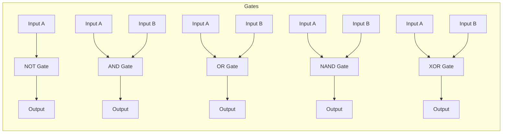
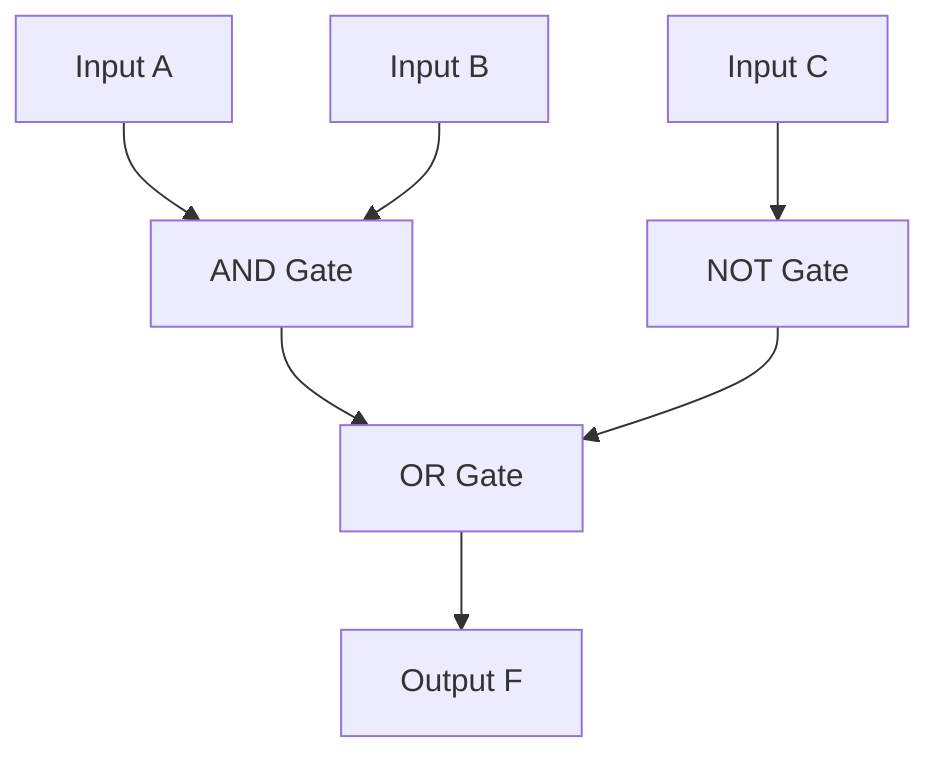

# Boolean Algebra (EN)

## 1. Introduction to Boolean Algebra

**Boolean Algebra** is a branch of mathematics that deals with binary variables (0 and 1) and logical operations. It was introduced by **George Boole** and is the foundation of digital electronics and computer logic circuits.

- **Variables**: Represented by letters (A, B, C, X, Y, etc.). Each can be either `0` (False) or `1` (True).
- **Operators**: `+` (OR), `·` or no sign (AND), `'` or `¬` (NOT).

---

## 2. Postulates and Laws of Boolean Algebra

These are the fundamental rules used to simplify boolean expressions.

| Law / Postulate                  | AND Form ( · )                                | OR Form ( + )                             |
| :------------------------------- | :-------------------------------------------- | :---------------------------------------- |
| **Identity Law**                 | $A \cdot 1 = A$                               | $A + 0 = A$                               |
| **Null / Dominance Law**         | $A \cdot 0 = 0$                               | $A + 1 = 1$                               |
| **Idempotent Law**               | $A \cdot A = A$                               | $A + A = A$                               |
| **Complement Law**               | $A \cdot A' = 0$                              | $A + A' = 1$                              |
| **Double Negation (Involution)** | $(A')' = A$                                   | $(A')' = A$                               |
| **Commutative Law**              | $A \cdot B = B \cdot A$                       | $A + B = B + A$                           |
| **Associative Law**              | $(A \cdot B) \cdot C = A \cdot (B \cdot C)$   | $(A + B) + C = A + (B + C)$               |
| **Distributive Law**             | $A \cdot (B + C) = (A \cdot B) + (A \cdot C)$ | $A + (B \cdot C) = (A + B) \cdot (A + C)$ |
| **Absorption Law**               | $A \cdot (A + B) = A$                         | $A + (A \cdot B) = A$                     |
| **Absorption Law (Variant)**     | $A \cdot (A' + B) = A \cdot B$                | $A + (A' \cdot B) = A + B$                |

---

## 3. Logic Gates and Truth Tables

Logic gates are the physical building blocks of digital circuits. They implement boolean functions.

| Gate Name                | Symbol Representation | Boolean Expression              | Truth Table (Inputs → Output)                                        |
| :----------------------- | :-------------------- | :------------------------------ | :------------------------------------------------------------------- |
| **NOT** (Inverter)       | Triangle with bubble  | $Y = A'$ or $\overline{A}$      | **A \| Y**   0 \| 1   1 \| 0                                   |
| **AND**                  | D-shaped              | $Y = A \cdot B$                 | **A B \| Y**   0 0 \| 0   0 1 \| 0   1 0 \| 0   1 1 \| 1 |
| **OR**                   | Shield-shaped         | $Y = A + B$                     | **A B \| Y**   0 0 \| 0   0 1 \| 1   1 0 \| 1   1 1 \| 1 |
| **NAND**                 | AND + bubble          | $Y = (A \cdot B)'$              | **A B \| Y**   0 0 \| 1   0 1 \| 1   1 0 \| 1   1 1 \| 0 |
| **NOR**                  | OR + bubble           | $Y = (A + B)'$                  | **A B \| Y**   0 0 \| 1   0 1 \| 0   1 0 \| 0   1 1 \| 0 |
| **XOR** (Exclusive OR)   | OR with extra curve   | $Y = A \oplus B = A'B + AB'$    | **A B \| Y**   0 0 \| 0   0 1 \| 1   1 0 \| 1   1 1 \| 0 |
| **XNOR** (Exclusive NOR) | XOR + bubble          | $Y = (A \oplus B)' = AB + A'B'$ | **A B \| Y**   0 0 \| 1   0 1 \| 0   1 0 \| 0   1 1 \| 1 |

**Mermaid Diagram (Logic Gate Symbols)**:

_(Note: Mermaid draws basic blocks; the actual shapes are standardized in textbooks)._

---

## 4. De Morgan's Theorem

This theorem is essential for simplifying expressions and converting between gate types (e.g., changing AND-OR to NAND-NAND).

- **Theorem 1**: The complement of a **product** is equal to the **sum** of the complements.

  $$(A \cdot B)' = A' + B'$$
  _(NAND = Bubbled OR)_

- **Theorem 2**: The complement of a **sum** is equal to the **product** of the complements.

  $$(A + B)' = A' \cdot B'$$
  _(NOR = Bubbled AND)_

**Generalization for n variables**:

- $(A \cdot B \cdot C ...)' = A' + B' + C' + ...$
- $(A + B + C ...)' = A' \cdot B' \cdot C' ...$

---

## 5. Standard Forms: SOP and POS

### 5.1 Minterms and Maxterms

For a function of _n_ variables:

- **Minterm (m)**: A product term where every variable appears exactly once (either uncomplemented or complemented). It yields `1` for exactly one combination.
- **Maxterm (M)**: A sum term where every variable appears exactly once. It yields `0` for exactly one combination.

| A   | B   | Minterm (m)  | Maxterm (M)     |
| :-- | :-- | :----------- | :-------------- |
| 0   | 0   | $m_0 = A'B'$ | $M_0 = A + B$   |
| 0   | 1   | $m_1 = A'B$  | $M_1 = A + B'$  |
| 1   | 0   | $m_2 = AB'$  | $M_2 = A' + B$  |
| 1   | 1   | $m_3 = AB$   | $M_3 = A' + B'$ |

_(Note: $m_i = M_i'$)_

### 5.2 SOP (Sum of Products)

- **Definition**: A boolean expression where several **product** terms (minterms) are **ORed** together.
- **Canonical SOP**: Sum of all minterms where the output is `1`. Denoted as $\sum m( \text{indices} )$.
- **Example**: If $F$ is 1 for inputs $00$ and $10$, then $F = \sum m(0, 2) = A'B' + AB'$.

### 5.3 POS (Product of Sums)

- **Definition**: A boolean expression where several **sum** terms (maxterms) are **ANDed** together.
- **Canonical POS**: Product of all maxterms where the output is `0`. Denoted as $\prod M( \text{indices} )$.
- **Example**: If $F$ is 0 for inputs $01$ and $11$, then $F = \prod M(1, 3) = (A + B') \cdot (A' + B')$.

> **Conversion Tip**: SOP and POS are duals. If $F = \sum m(0, 2)$, then $F' = \sum m(1, 3)$.

---

## 6. Simplification using Boolean Algebra

**Example**: Simplify $F = A'BC + A'BC' + AB'C' + AB'C$

- Combine $A'BC + A'BC' = A'B(C + C') = A'B$.
- Combine $AB'C' + AB'C = AB'(C' + C) = AB'$.
- Result: $F = A'B + AB'$ which is the **XOR** function $(A \oplus B)$.

**Another Example**: Simplify $F = (A + B)(A + B')$

- Using Distributive law: $F = A + (B \cdot B') = A + 0 = A$.

---

## 7. Simplification using Karnaugh Maps (K-Map)

A K-Map is a graphical method to minimize boolean expressions. It uses the concept of Gray code (adjacent cells differ by 1 bit).

### 7.1 Grouping Rules

1.  Groups must be in powers of 2 (1, 2, 4, 8, 16).
2.  Group must be rectangular (row/column) and can wrap around edges.
3.  Larger groups reduce the expression more.
4.  Every `1` must be covered at least once. Overlapping is allowed.

### 7.2 2-Variable K-Map

| AB \   | 0   | 1   |
| :----- | :-- | :-- |
| **00** | m0  | m1  |
| **10** | m2  | m3  |

_(Grid positions: Row1: A=0, Row2: A=1; Col1: B=0, Col2: B=1)_

### 7.3 3-Variable K-Map

_Order: 00, 01, 11, 10 (Gray Code)_

| AB\C   | 0   | 1   |
| :----- | :-- | :-- |
| **00** | m0  | m1  |
| **01** | m2  | m3  |
| **11** | m6  | m7  |
| **10** | m4  | m5  |

### 7.4 4-Variable K-Map

| AB\CD  | 00  | 01  | 11  | 10  |
| :----- | :-- | :-- | :-- | :-- |
| **00** | m0  | m1  | m3  | m2  |
| **01** | m4  | m5  | m7  | m6  |
| **11** | m12 | m13 | m15 | m14 |
| **10** | m8  | m9  | m11 | m10 |

### 7.5 K-Map Simplification Example

**Problem**: Minimize $F = \sum m(0, 1, 3, 7, 5)$ (3 variables).

1.  Plot 1s at positions 0,1,3,5,7 on the 3-var map.
2.  **Group 1**: m0, m1 (Row 0, Col 0 & 1) → Variables: $A'B'$ + $A'B$ = $A'$ (C cancels out).
3.  **Group 2**: m5, m7 (Row 1 & 3? Actually m5=101, m7=111. Row=10, Col=1 and Row=11, Col=1. Wait, Row=10 and 11 are adjacent? No, in 3-var, rows are 00, 01, 11, 10. Row 10 (A=1,B=0) and Row 11 (A=1,B=1) are adjacent). Group m5(101) and m7(111) → Variables: $A$ is 1, B varies (0 and 1), C is 1 → Removes B → $A C$.
4.  **Group 3**: m1, m3, m5, m7 (A 2x2 square at columns 1, row 0,1,3? Actually m1=001, m3=011, m5=101, m7=111 → This is a quads where A varies, B varies, C=1). Group m1,m3,m5,m7 → $C$.
5.  The optimized expression = **$A' + C$** (since Group 1 gives $A'$, Group 3 gives $C$). Wait, Group 1 was $A'$, Group 3 is $C$. So $F = A' + C$.

_(Double-check: The m0,m1 group cancels B, leaves A'. The m1,m3,m5,m7 group cancels A and B, leaves C)._

---

## 8. Logic Circuit Design

We can convert a simplified boolean expression into a logic gate circuit.

**Example**: Draw the circuit for $F = AB + C'$.

1.  **Term $AB$**: Pass A and B through an **AND** gate.
2.  **Term $C'$**: Pass C through a **NOT** gate.
3.  **Final $F$**: Pass outputs of step 1 and step 2 through an **OR** gate.

**Another Example (SOP to Circuit)**:
For $F = A'B + AB'$ (XOR).

- A goes to NOT (to get A') and AND2.
- B goes to NOT (to get B') and AND1.
- AND1 (A'B), AND2 (AB').
- OR combines both.
