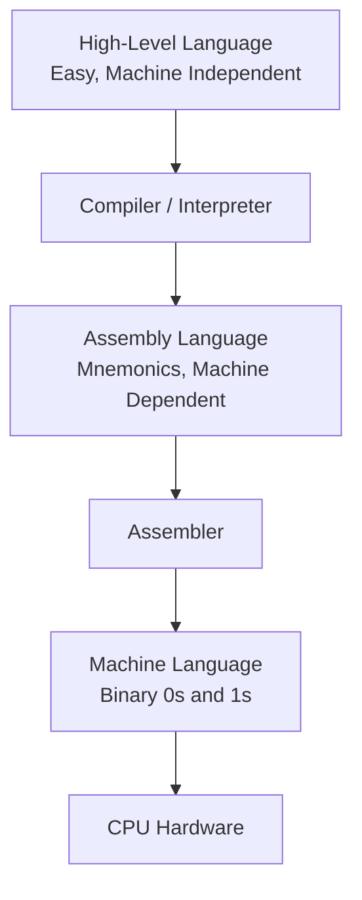
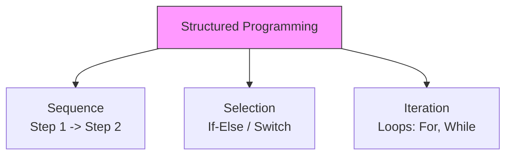

# Concept Of Programming (EN)

## 1. Introduction to Programming

**Programming** is the process of creating a set of instructions that tell a computer how to perform a specific task. It involves writing code in a programming language, which is then translated into machine-readable form.

---

## 2. Instruction

### Definition

An **instruction** is a single, basic command given to a computer's processor to perform a specific operation (like arithmetic, data movement, or control flow).

### Characteristics

- It consists of an **Opcode** (Operation Code – what to do) and an **Operand** (data/address – on what to do it).
- Instructions are executed sequentially unless a jump/branch instruction changes the flow.

### Examples

| Type          | Example (Assembly) | Meaning                                        |
| :------------ | :----------------- | :--------------------------------------------- |
| Data Transfer | `MOV A, 5`         | Move the value `5` into register `A`.          |
| Arithmetic    | `ADD B`            | Add the value in register `B` to register `A`. |
| Logical       | `AND C`            | Perform bitwise AND between `A` and `C`.       |
| Control       | `JUMP 100`         | Jump to instruction at memory address `100`.   |

---

## 3. Program

### Definition

A **program** is a collection of instructions written in a specific sequence to accomplish a particular task or solve a problem. It is the final output of programming.

### Example

A simple program in **C** (High-Level) to add two numbers:

```c
#include <stdio.h>
int main() {
    int a = 5, b = 10, sum;
    sum = a + b;       // Instruction 1
    printf("%d", sum); // Instruction 2
    return 0;
}
```

In **Assembly** (Low-Level) for the same task:

```assembly
MOV R1, #5     ; Move 5 into R1
MOV R2, #10    ; Move 10 into R2
ADD R3, R1, R2 ; Add R1 and R2, store in R3
```

---

## 4. Programming Languages

Based on their level of abstraction from hardware, languages are classified as:

| Feature         | Machine Language (1GL)        | Assembly Language (2GL)    | High-Level Language (3GL/4GL)               |
| :-------------- | :---------------------------- | :------------------------- | :------------------------------------------ |
| **Level**       | Lowest                        | Middle (Low-Level)         | High-Level                                  |
| **Format**      | Binary (0s and 1s)            | Mnemonics (e.g., MOV, ADD) | Natural Language-like (e.g., English words) |
| **Translation** | Executed directly by CPU.     | Needs an **Assembler**.    | Needs a **Compiler** or **Interpreter**.    |
| **Readability** | Almost impossible for humans. | Hard (machine-dependent).  | Easy (machine-independent).                 |
| **Examples**    | `10110000 01100001`           | `MOV AL, 61h`              | Python, C, Java, C++                        |

### Key Concepts

- **Low-Level Language**:
  - Closer to hardware. Faster execution, but complex to write.
  - Includes **Machine Language** (binary) and **Assembly Language**.

- **Assembly Language**:
  - Uses short mnemonic codes for machine instructions (e.g., `ADD`, `SUB`, `MOV`).
  - **Assembler**: A system software that translates assembly code into machine code.
  - It is machine-dependent (specific to a CPU architecture).

- **High-Level Language**:
  - Designed to be understood by humans. Uses variables, functions, loops, etc.
  - Platform independent (can run on different OS with proper compiler/interpreter).
  - **Examples**: Python (interpreter), C (compiler), Java (both compiler + JVM).

**Visualizing the Language Abstraction**:



---

## 5. Programming Paradigms

### 5.1 Procedural vs Non-Procedural Programming

| Aspect           | Procedural Programming                                     | Non-Procedural Programming                                             |
| :--------------- | :--------------------------------------------------------- | :--------------------------------------------------------------------- |
| **Also Called**  | Imperative Programming                                     | Declarative Programming                                                |
| **Focus**        | **How** to achieve the result (step-by-step instructions). | **What** result is required (logic and constraints).                   |
| **Approach**     | Tells the computer to perform a sequence of steps.         | Tells the computer what the outcome should be.                         |
| **Control Flow** | Explicit (loops, conditionals, function calls).            | Implicit (queries, rules).                                             |
| **Examples**     | C, Pascal, Fortran, Basic.                                 | SQL (Structured Query Language), Prolog, HTML (declarative structure). |

**Example**:

- **Procedural (C)**: Write a loop to calculate the sum of all numbers in a list.
- **Non-Procedural (SQL)**: `SELECT SUM(salary) FROM employees WHERE department = 'IT';`  
  *(Here, you specify *what* data to fetch, not *how* the database should find it).*

---

### 5.2 Structured Programming

**Concept**: A subset of procedural programming that imposes **discipline** on the use of control flow.

- **Goal**: Improve clarity, quality, and development time by using only specific control structures.
- **Key Elements**:
  1. **Sequence**: Instructions executed one after another.
  2. **Selection**: Conditional branching (if-else, switch-case).
  3. **Iteration**: Loops (for, while, do-while).

- **Golden Rule**: Strictly **avoid the `goto` statement** (unconditional jumps). This prevents "spaghetti code" (chaotic, hard-to-follow logic).
- **Modularity**: Programs are divided into smaller, reusable functions or procedures.

**Visualizing Structured Programming**:



---

### 5.3 Object Oriented Programming (OOP)

**Concept**: A paradigm based on **objects** that contain **data** (attributes) and **code** (methods). It models real-world entities.

| Fundamental Concept | Definition                                                                                                                               |
| :------------------ | :--------------------------------------------------------------------------------------------------------------------------------------- |
| **Class**           | A blueprint or template for creating objects. (e.g., `Car`).                                                                             |
| **Object**          | An instance of a class (e.g., `myCar` is a specific Car).                                                                                |
| **Encapsulation**   | Binding data and methods together; hiding internal details from the outside world (using access specifiers like private/public).         |
| **Inheritance**     | A new class (child) can inherit properties and methods from an existing class (parent). Promotes code reusability.                       |
| **Polymorphism**    | "Many forms". The same function name can behave differently in different contexts (e.g., `draw()` for a Circle vs Square).               |
| **Abstraction**     | Showing only essential features and hiding background details (e.g., using a car's steering wheel without knowing the engine mechanics). |

- **Examples of OOP Languages**: Java, C++, Python, C#.

**OOP vs Procedural Comparison**:

| Feature         | Procedural / Structured                     | Object Oriented                                      |
| :-------------- | :------------------------------------------ | :--------------------------------------------------- |
| **Data**        | Data is separate from functions.            | Data and functions are combined into objects.        |
| **Security**    | Low (data can be easily accessed globally). | High (encapsulation protects data).                  |
| **Reusability** | Moderate (functions).                       | High (inheritance and polymorphism).                 |
| **Complexity**  | Suitable for small/medium problems.         | Best for large, complex, and real-world simulations. |
