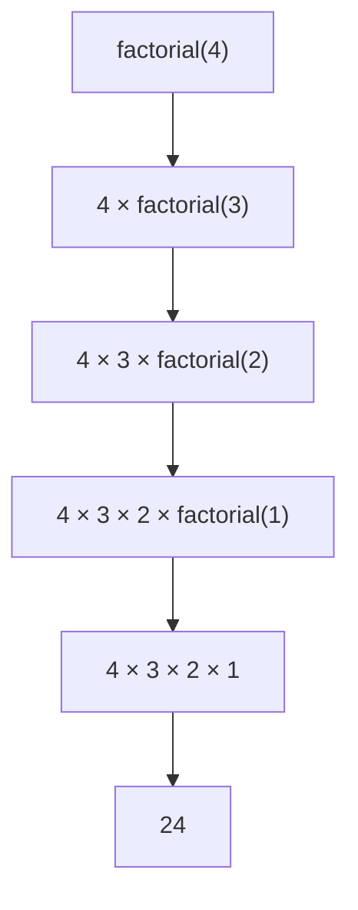
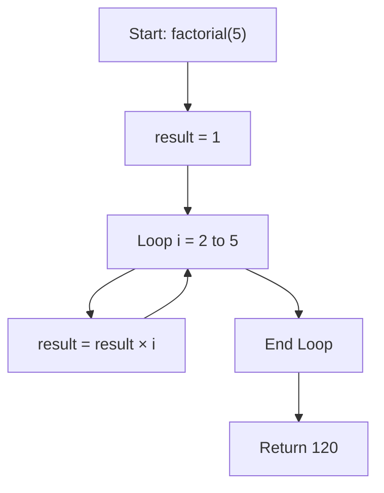
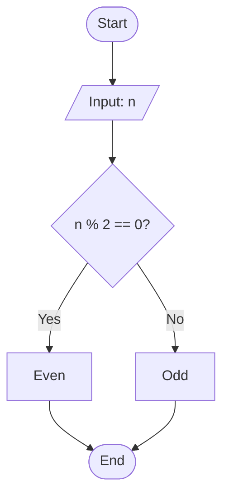
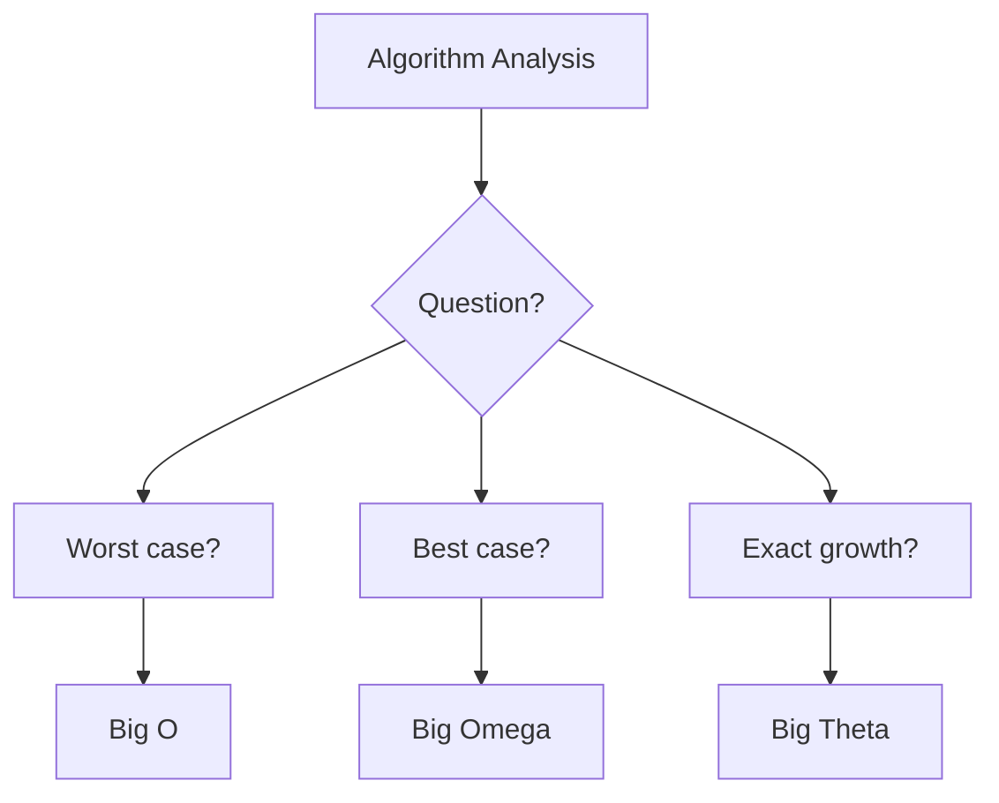
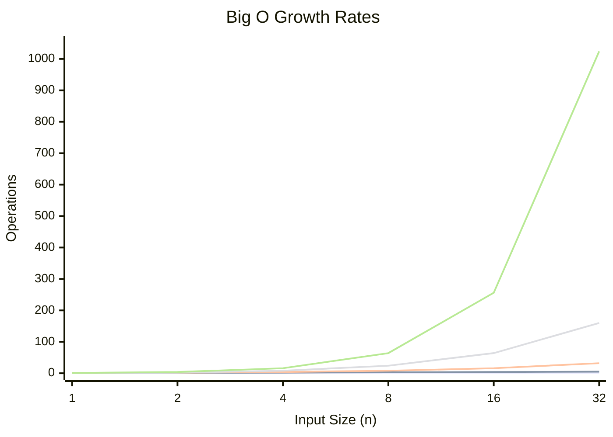

# Algorithm Fundamentals

## 1. Definition

**Algorithm** = A step-by-step procedure to solve a problem (like a recipe).

**Real-Life Example – Finding the largest test score:**
1. Remember the first score as the "largest".
2. Check each score; update if a larger one is found.
3. Return the largest.

**Key Point:** An algorithm is **not** code. It is a language-independent blueprint.

**C Implementation – find_maximum:**

```c
#include <stdio.h>

int find_maximum(int numbers[], int size) {
    int max_value = numbers[0];

    for (int i = 0; i < size; i++) {
        if (numbers[i] > max_value) {
            max_value = numbers[i];
        }
    }
    return max_value;
}

int main() {
    int numbers[] = {3, 7, 2, 9, 5};
    int size = sizeof(numbers) / sizeof(numbers[0]);

    int max = find_maximum(numbers, size);
    printf("Maximum value: %d\n", max);
    return 0;
}
```

---

## 2. Characteristics of an Algorithm

**Mnemonic:** I Often Drink Fresh Eggnog (I-O-D-F-E)

| # | Characteristic | Description | Example |
|--|----------------|-------------|---------|
| 1 | Input | 0 or more values provided | add(a, b) has 2 inputs |
| 2 | Output | At least 1 result produced | return a + b |
| 3 | Definiteness | Each step is unambiguous | "Add 5 grams" vs "Add some" |
| 4 | Finiteness | Must terminate | while True: is not valid |
| 5 | Effectiveness | Steps are feasible | "Add numbers" vs "Solve everything" |

---

## 3. Types of Algorithms

### Recursive Algorithms

A function calls itself to solve smaller instances.

**Python Example – Factorial:**

```python
def factorial(n):
    if n <= 1:          # BASE CASE (stops recursion)
        return 1
    return n * factorial(n - 1)  # RECURSIVE CASE
```

**Recursion Stack for factorial(4):**

```
factorial(4)
├── 4 * factorial(3)
    ├── 3 * factorial(2)
        ├── 2 * factorial(1)
            └── Returns 1
        └── Returns 2
    └── Returns 6
└── Returns 24
```

**Mermaid Trace:**



**Pros:** Clean code for tree/graph problems.
**Cons:** Memory-heavy, risk of stack overflow.

---

### Iterative Algorithms

Use loops instead of self-calls. More memory-efficient.

**C Example – Sum 1 to n:**

```c
#include <stdio.h>

int main() {
    int n = 5, sum = 0;
    for (int i = 1; i <= n; i++) {
        sum += i;
    }
    printf("%d", sum);
    return 0;
}
```

**Mermaid Flow:**



**Comparison:**

| Aspect   | Recursive                 | Iterative    |
| -------- | ------------------------- | ------------ |
| Memory   | High (stack frames)       | Low          |
| Speed    | Slower                    | Faster       |
| Best For | Trees, divide-and-conquer | Simple loops |

---

## 4. Representation of Algorithms

### Flowchart

Visual diagram using standard symbols:
- Oval – Start / End
- Parallelogram – Input / Output
- Rectangle – Process
- Diamond – Decision

**Example – Even or Odd:**



```python
def check_even_odd(n):
    return "Even" if n % 2 == 0 else "Odd"
```

---

### Pseudo Code

Plain-text, language-independent logic.

**Example – Calculate Average:**

```
ALGORITHM CalculateAverage
INPUT: list of numbers, size
OUTPUT: average

BEGIN
    total <- 0
    FOR i <- 0 TO size - 1 DO
        total <- total + list[i]
    END FOR

    IF size = 0 THEN
        RETURN 0
    ELSE
        RETURN total / size
    END
END
```

**C Implementation:**

```c
#include <stdio.h>

float calculateAverage(int arr[], int size) {
    int total = 0;
    for (int i = 0; i < size; i++) {
        total += arr[i];
    }
    if (size == 0) return 0;
    return (float)total / size;
}

int main() {
    int arr[] = {10, 20, 30, 40, 50, 60};
    int size = sizeof(arr) / sizeof(arr[0]);
    float avg = calculateAverage(arr, size);
    printf("Average = %.2f\n", avg);
    return 0;
}
```

**Same logic in Python & JavaScript:**

```python
# Python
def average(numbers):
    return sum(numbers) / len(numbers) if numbers else 0
```

```javascript
// JavaScript
const average = (numbers) => 
    numbers.length ? numbers.reduce((a,b) => a+b) / numbers.length : 0;
```

---

## 5. Efficiency of an Algorithm

Measures time and space resource usage.

**Example – Sum 1 to n:**

```c
// O(n) – slow
int sum_slow(int n) {
    int total = 0;
    for (int i = 1; i <= n; i++) total += i;
    return total;
}

// O(1) – fast
int sum_fast(int n) {
    return n * (n + 1) / 2;
}
```

For n = 1,000,000:
- Slow: 1 million operations
- Fast: 1 operation (330,000 times faster)

**Three Performance Cases:**
- Best – Minimum resources (lucky input)
- Average – Typical usage
- Worst – Maximum resources (guaranteed bound)

---

## 6. Complexity of Algorithms

### Space Complexity – Memory usage vs input size

```c
// O(1) – Constant space
int sum_array(int arr[], int n) {
    int total = 0;
    for (int i = 0; i < n; i++) total += arr[i];
    return total;
}

// O(n) – Linear space
int* duplicate_array(int arr[], int n) {
    int* new_arr = (int*)malloc(n * sizeof(int));
    for (int i = 0; i < n; i++) new_arr[i] = arr[i];
    return new_arr;
}
```

### Time Complexity – Speed vs input size

| Complexity | Operations for n=100 | Example |
|------------|----------------------|---------|
| O(1) | 1 | Array access |
| O(log n) | ~7 | Binary search |
| O(n) | 100 | Linear search |
| O(n log n) | ~664 | Merge sort |
| O(n²) | 10,000 | Bubble sort |

---

## 7. Asymptotic Notation

Standard notation to describe growth rates.

### Big O – Upper Bound / Worst Case

"Won't be worse than this"

```python
def linear_search(arr, target):
    for i, element in enumerate(arr):
        if element == target:
            return i
    return -1

# Worst case: O(n) – target is last or absent
```

### Big Omega (Ω) – Lower Bound / Best Case

"Can't be better than this"

```python
# Best case: Ω(1) – target is the first element
linear_search([5, 12, 8, 3], 5)
```

### Big Theta (Θ) – Tight Bound / Exact

"Grows exactly as" (when best = worst)

```python
def sum_array(arr):
    # Always Θ(n) – must visit every element
    total = 0
    for num in arr:
        total += num
    return total
```

### Notation Summary

| Notation | Symbol | Meaning | Use When |
|----------|--------|---------|----------|
| Big O | O | Worst case | Performance guarantees |
| Big Omega | Ω | Best case | Proving minimums |
| Big Theta | Θ | Exact | All cases are the same |

**Mermaid Decision Tree:**



---

## 8. Complexity Hierarchy (Fastest to Slowest)

```
O(1) < O(log n) < O(n) < O(n log n) < O(n²) < O(2ⁿ) < O(n!)
```

**Growth Rate Chart:**


