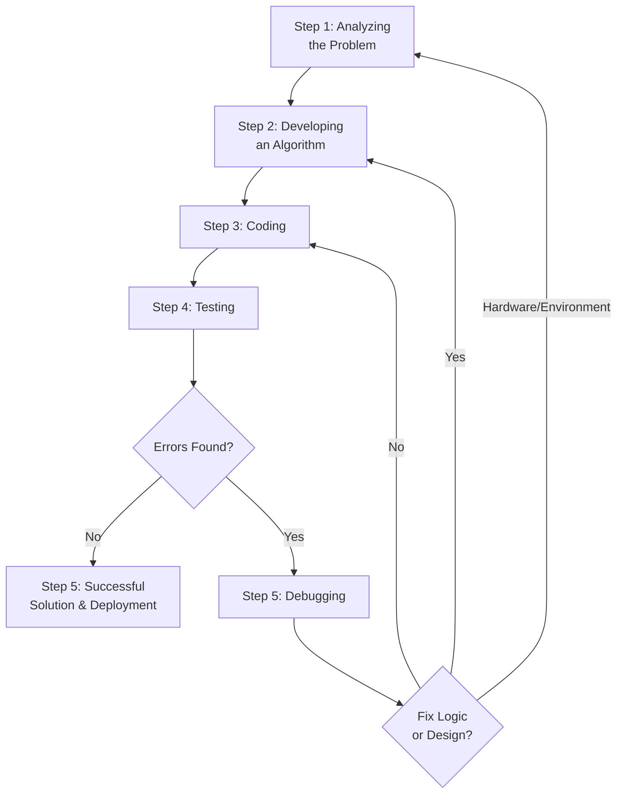

# Introduction To Problem Solving (EN)

## 1. Introduction to Problem Solving

**Problem Solving** in computer science is the process of transforming a given problem (real-world or theoretical) into a working, efficient, and correct software solution. It is the most fundamental skill for a programmer and involves logical thinking, analysis, and systematic execution.

---

## 2. Steps for Problem Solving

The process of solving a problem using a computer follows a standard **5-step lifecycle**. This is an iterative process—meaning if a later step fails (e.g., testing), you must go back to a previous step.



---

### Step 1: Analyzing the Problem

**Definition**: This is the most crucial phase. It involves understanding the problem deeply before attempting to solve it. If you misunderstand the problem, the entire solution will be wrong.

**Key Activities**:
1.  **Read and Re-read**: Carefully read the problem statement multiple times.
2.  **Identify Inputs**: What data does the problem provide? (e.g., numbers, strings, files).
3.  **Identify Outputs**: What is the expected result? (e.g., sum, sorted list, a boolean true/false).
4.  **Identify Constraints**: Are there any limitations? (e.g., input size, time limits, memory limits, valid ranges).
5.  **Stakeholder Queries**: Ask "what if" questions to clarify ambiguous parts.

**Example**:
- **Problem**: Calculate the area of a rectangle.
- **Analysis**:
  - Inputs: Length ($L$) and Breadth ($B$). Must be positive real numbers.
  - Output: Area ($A = L \times B$).
  - Constraints: $L > 0$, $B > 0$.

---

### Step 2: Developing an Algorithm

**Definition**: Once the problem is understood, the next step is to design a step-by-step logical procedure (the algorithm) to solve it.

**Key Activities**:
1.  Break down the main problem into smaller, manageable sub-problems (Modularization).
2.  Write down the exact sequence of operations.
3.  Choose the appropriate control structures: **Sequence**, **Selection** (if-else), and **Iteration** (loops).
4.  Represent the algorithm using:
    - **Flowcharts** (graphical representation).
    - **Pseudo-code** (textual representation).

**Example** (Rectangle Area Algorithm in Pseudo-code):
```
BEGIN
    INPUT L, B
    AREA ← L * B
    OUTPUT AREA
END
```

---

### Step 3: Coding

**Definition**: Translating the algorithm (pseudo-code/flowchart) into a specific programming language (like C, C++, Python, Java) that the computer can understand and execute.

**Key Activities**:
1.  Choose an appropriate programming language based on the problem domain.
2.  Write the source code following strict **syntax rules** (grammar of the language).
3.  Use meaningful variable names and proper indentation to make the code readable (maintainability).
4.  **Integrate** the various modules (if the algorithm was broken into functions/procedures).

**Example** (Coding the Rectangle Area in Python):
```python
# Step 3: Coding
L = float(input("Enter length: "))
B = float(input("Enter breadth: "))
Area = L * B
print("Area is:", Area)
```

---

### Step 4: Testing

**Definition**: Running the program with various sets of input data (test cases) to verify that the algorithm/code produces the correct output.

**Key Activities**:
1.  **Unit Testing**: Testing individual components/functions of the program.
2.  **Integration Testing**: Testing the interaction between combined modules.
3.  **System Testing**: Testing the entire program as a whole.
4.  **Types of Test Cases**:
    - **Valid / Normal**: Standard expected inputs (e.g., $L=5, B=10$).
    - **Boundary / Edge**: Values at the extreme limits (e.g., $L=0$, $B=1$).
    - **Invalid / Erroneous**: Incorrect data types or out-of-range values (e.g., $L=\text{"abc"}$).
5.  **Expected vs Actual**: Compare the actual output of the program against the manually calculated expected output.

---

### Step 5: Debugging

**Definition**: The systematic process of finding, isolating, and correcting **errors (bugs)** in the program discovered during testing.

**Types of Errors (Bugs)**:

| Error Type | Description | Example | Detection Method |
| :--- | :--- | :--- | :--- |
| **Syntax Error** | Violates the grammatical rules of the language. | Writing `prnit` instead of `print` in Python. | Compiler / Interpreter |
| **Runtime Error** | Occurs during execution; crashes the program. | Dividing by zero (`10/0`), accessing a missing file. | During execution (crashes) |
| **Logical Error** | Program runs without crashing but gives wrong results. | Using `L + B` instead of `L * B` for area. | Dry-run, Manual testing, Print statements. (Hardest to find) |

**Debugging Techniques**:
1.  **Dry Run**: Manually execute the code on paper with sample inputs, tracking variable values.
2.  **Print Statements**: Insert temporary `print` commands to check variable states at various points.
3.  **Debugging Tools (Debuggers)**: Use tools like `pdb` (Python), GDB (C/C++), or IDE built-in debuggers. They allow you to set **breakpoints** and step through the code line-by-line.
4.  **Rubber Duck Debugging**: Explaining the code logic aloud to someone (or an inanimate object) often reveals the flaw.

---

## 3. Iterative Nature of Problem Solving

It is crucial to understand that problem-solving is **not linear**. It is a **feedback loop**.

- If **Testing** finds a logical error → you go back to **Coding**.
- If the algorithm design seems too complex or flawed → you go back to **Developing the Algorithm**.
- If the problem constraints change or were misunderstood → you go back to **Analyzing the Problem**.
