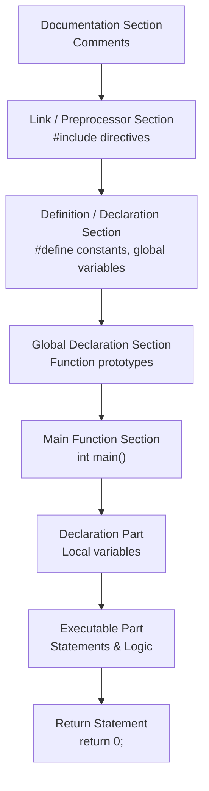

# Basic Structure (EN)

## 1. Basic Structure of a C Program

A C program follows a structured format. Understanding this skeleton is essential before writing any code.



**Detailed Breakdown of Sections**:

| Section | Description | Example |
| :--- | :--- | :--- |
| **Documentation** | Optional. Contains comments describing the program purpose/author. | `/* Program to add two numbers */` |
| **Link / Preprocessor** | Mandatory. Includes header files for standard I/O and library functions. | `#include <stdio.h>` |
| **Definition** | Defines constants (symbolic constants) using `#define`. | `#define PI 3.14` |
| **Global Declaration** | Declares variables/functions accessible by all functions. | `int globalVar;` |
| **`main()` Function** | Mandatory. The starting point of execution. Returns an integer. | `int main() { ... }` |
| **Declaration Part** | Declares local variables inside `main()`. | `int a, b, sum;` |
| **Executable Part** | Contains the logic (input, processing, output). | `printf`, `scanf`, arithmetic. |
| **Return Statement** | Returns 0 to the OS to indicate successful execution. | `return 0;` |

---

## 2. Character Set

The character set is the set of all valid characters that C recognizes. The C compiler supports the **ASCII** character set.

| Category            | Characters                                                      |
| :------------------ | :-------------------------------------------------------------- | ------------------------------------------------------------------------------------- |
| **Alphabets**       | Uppercase: `A` to `Z` <br> Lowercase: `a` to `z`                |
| **Digits**          | `0` to `9`                                                      |
| **Special Symbols** | `,` `.` `;` `:` `?` `'` `"` `!` `                               | ` `/` `\` `~` `$` `%` `^` `&` `*` `(` `)` `[` `]` `{` `}` `<` `>` `-` `+` `=` `#` `@` |
| **White Spaces**    | Blank space, Tab (`\t`), Newline (`\n`), Carriage return (`\r`) |

---

## 3. Keywords (Reserved Words)

**Keywords** are pre-defined, reserved words in C that have a special meaning to the compiler. They cannot be used as variable names, function names, or identifiers.

**List of 32 Keywords in C**:

| Group             | Keywords                                                                         |
| :---------------- | :------------------------------------------------------------------------------- |
| **Data Types**    | `int`, `char`, `float`, `double`, `void`, `short`, `long`, `signed`, `unsigned`  |
| **Control Flow**  | `if`, `else`, `switch`, `case`, `default`, `break`, `continue`, `goto`, `return` |
| **Loops**         | `for`, `while`, `do`                                                             |
| **Storage Class** | `auto`, `static`, `register`, `extern`                                           |
| **Miscellaneous** | `sizeof`, `typedef`, `const`, `union`, `struct`, `enum`, `volatile`              |

> **Exam Tip**: Keywords are always written in **lowercase**. In C, `Int` is NOT a keyword, but `int` is.

---

## 4. Identifiers

**Definition**: Identifiers are the names given to program elements such as variables, functions, arrays, structures, etc.

### Rules for Naming Identifiers (Valid Names)

1.  First character must be a letter (`A-Z`, `a-z`) or an underscore (`_`).
2.  Subsequent characters can be letters, digits (`0-9`), or underscores.
3.  No special symbols are allowed (except `_`). E.g., `$`, `@`, `#` are **not** allowed.
4.  C is **case-sensitive**. `Sum` and `sum` are different identifiers.
5.  Keywords **cannot** be used as identifiers.
6.  Length: ANSI standard guarantees up to 31 characters significant; modern compilers support longer.

**Valid Examples**: `roll_no`, `_temp`, `marks1`, `studentName`, `MAX_VALUE`.

**Invalid Examples**:

- `1stPlace` (starts with digit)
- `char` (keyword)
- `marks+` (special symbol `+`)

---

## 5. Constants

Constants are fixed values that do not change during the execution of a program. C supports two main types:

### 5.1 Literal Constants (Direct Values)

| Type                         | Description                                         | Example                                       |
| :--------------------------- | :-------------------------------------------------- | :-------------------------------------------- |
| **Integer Constant**         | Whole numbers (positive/negative/zero).             | `10`, `-5`, `0`, `1000`                       |
| **Floating / Real Constant** | Numbers with a decimal point or exponential form.   | `3.14`, `-0.5`, `1.2e3` ($1.2 \times 10^3$)   |
| **Character Constant**       | A single character enclosed in single quotes.       | `'A'`, `'5'`, `'$'`, `'\n'` (escape sequence) |
| **String Constant**          | A sequence of characters enclosed in double quotes. | `"Hello"`, `"C Programming"`                  |

### 5.2 Symbolic Constants (Named Constants)

Defined using `#define` preprocessor directive or `const` keyword.

- **Using `#define`**:
  ```c
  #define PI 3.14159
  #define MAX 100
  ```
- **Using `const`**:
  ```c
  const int DAYS = 7;
  const float GST = 0.18;
  ```

---

## 6. Variables and Type Declaration

### 6.1 Variables

A **variable** is a named memory location whose value can change during program execution. It holds data of a specific type.

### 6.2 Data Types and Type Declaration

Every variable must be declared with its **data type** before use. This tells the compiler how much memory to allocate and what operations are valid.

**Basic Primary Data Types**:

| Data Type | Size (Typical) | Range (Approx)                                  | Format Specifier | Use Case                                    |
| :-------- | :------------- | :---------------------------------------------- | :--------------- | :------------------------------------------ |
| `int`     | 2 or 4 bytes   | $-2^{31}$ to $2^{31}-1$                         | `%d`             | Whole numbers                               |
| `float`   | 4 bytes        | $3.4 \times 10^{-38}$ to $3.4 \times 10^{38}$   | `%f`             | Single-precision decimals                   |
| `double`  | 8 bytes        | $1.7 \times 10^{-308}$ to $1.7 \times 10^{308}$ | `%lf`            | Double-precision decimals                   |
| `char`    | 1 byte         | -128 to 127 (or 0 to 255)                       | `%c`             | Single character (ASCII)                    |
| `void`    | –              | No value                                        | –                | Represents "no value" (used for functions). |

**Type Declaration Syntax**:

```c
data_type variable_name;                // Declaration
data_type variable_name = initial_value; // Declaration + Initialization
```

**Example**:

```c
int age;                  // Declaration
float salary = 45000.50;  // Initialization
char grade = 'A';
double pi = 3.1415926535;
```

---

## 7. Pre-processor

**Definition**: The pre-processor is a program that processes the source code **before** it is passed to the compiler. All pre-processor directives begin with a `#` (hash) symbol and are executed at compile-time.

### Common Pre-processor Directives

| Directive                   | Purpose                                                                                    | Example                                                                           |
| :-------------------------- | :----------------------------------------------------------------------------------------- | :-------------------------------------------------------------------------------- |
| **`#include`**              | Includes the contents of a header file into the program.                                   | `#include <stdio.h>` (standard library) <br> `#include "myfile.h"` (user-defined) |
| **`#define`**               | Defines a macro (symbolic constant or function-like macro).                                | `#define MAX 100` <br> `#define SQUARE(x) ((x)*(x))`                              |
| **`#undef`**                | Undefines an existing macro.                                                               | `#undef MAX`                                                                      |
| **`#ifdef`** / **`#endif`** | Conditional compilation. Code inside is compiled only if macro is defined.                 | `#ifdef DEBUG` <br> `printf("Debug mode");` <br> `#endif`                         |
| **`#ifndef`**               | Compiles code if the macro is **not** defined (often used to prevent multiple inclusions). | `#ifndef HEADER_H`                                                                |
| **`#error`**                | Forces an error message and stops compilation.                                             | `#error "Version not supported"`                                                  |

**Example of Pre-processor Usage**:

```c
#include <stdio.h>        // Include standard I/O
#define PI 3.14159        // Define constant
#define AREA(r) (PI * r * r) // Function-like macro

int main() {
    float rad = 5.0;
    printf("Area = %f", AREA(rad)); // AREA(5) becomes PI * 5 * 5
    return 0;
}
```

> **Note**: Macros (`#define`) do **not** use semicolons at the end.

---

## 8. Sample Programs

### Program 1: Hello World (Basic Structure)

```c
#include <stdio.h>   // Pre-processor directive

int main() {         // Main function - execution starts here
    // Declaration and Executable Part
    printf("Hello, World!\n");
    return 0;        // Return statement
}
```

### Program 2: Addition of Two Numbers (Variables & Input)

```c
#include <stdio.h>

int main() {
    int a, b, sum;                 // Variable declaration

    printf("Enter two numbers: ");
    scanf("%d %d", &a, &b);        // Input using scanf (format specifier %d)

    sum = a + b;                   // Processing

    printf("Sum = %d\n", sum);     // Output
    return 0;
}
```

### Program 3: Using Symbolic Constants

```c
#include <stdio.h>
#define PI 3.14159

int main() {
    float radius, area;

    printf("Enter radius: ");
    scanf("%f", &radius);

    area = PI * radius * radius;

    printf("Area of circle = %.2f\n", area); // %.2f prints 2 decimal places
    return 0;
}
```
