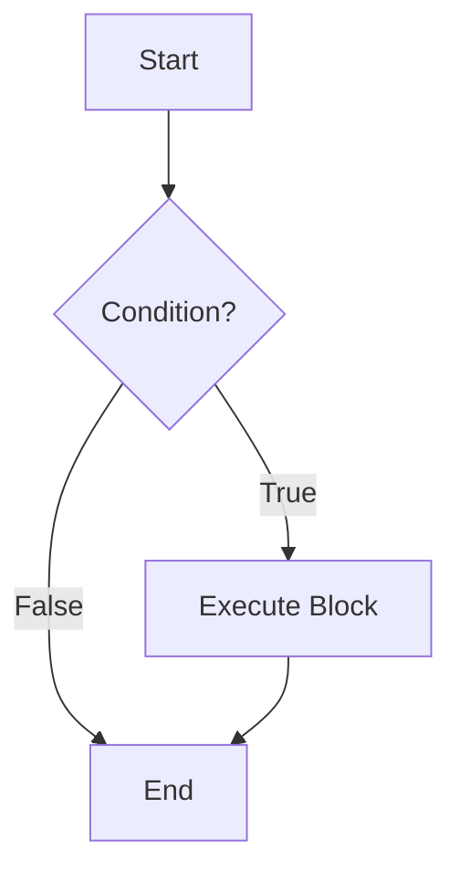
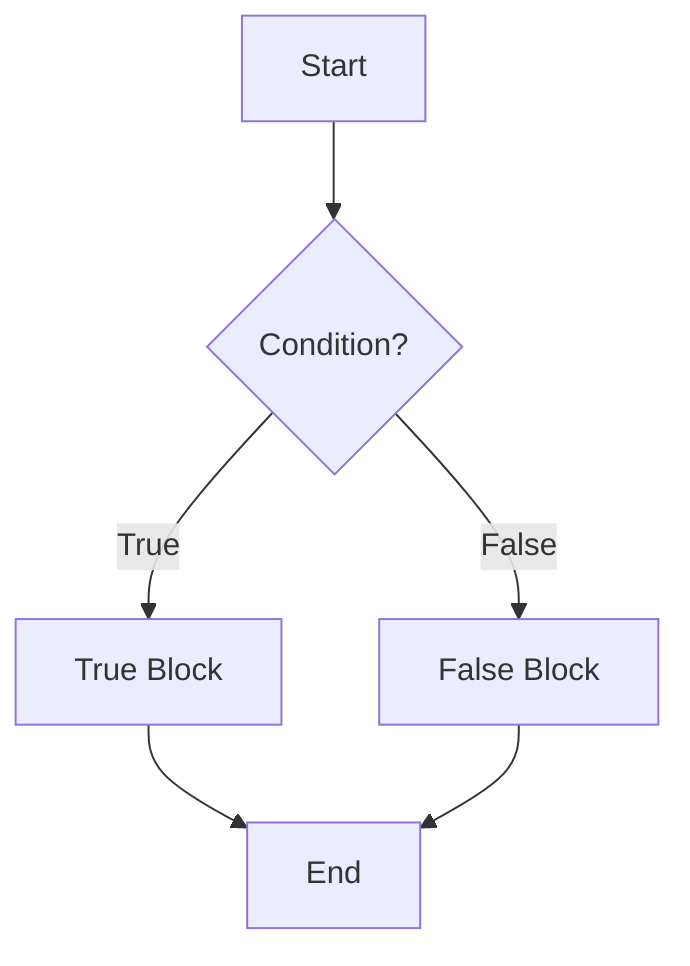
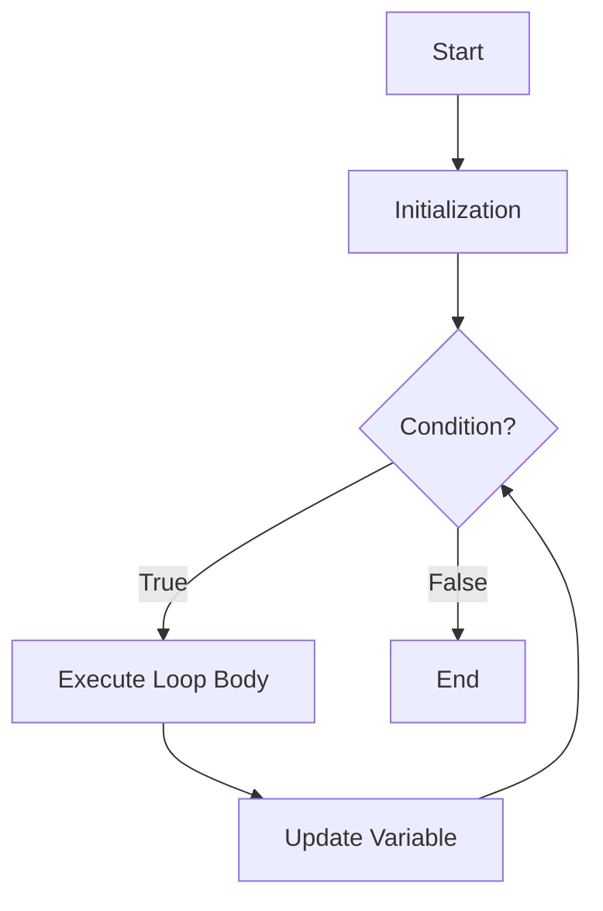
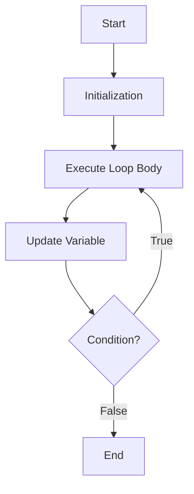
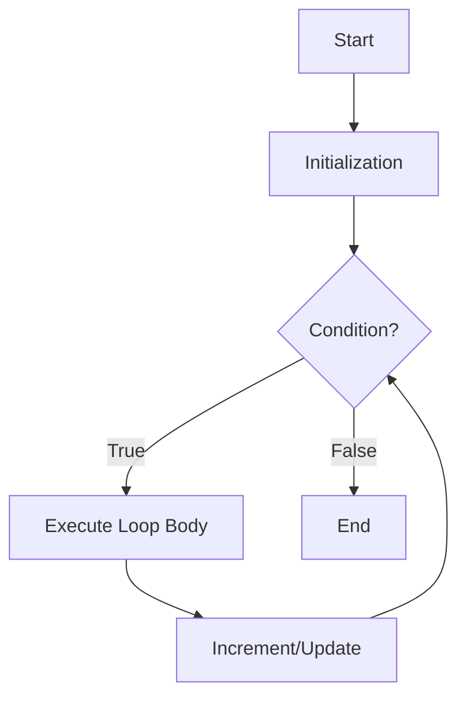

# Branching And Looping In C (EN)

## 1. Introduction to Control Flow

By default, a C program executes statements **sequentially** (line by line). However, to solve real-world problems, we need to:

1.  **Make decisions** – Execute certain statements only if a condition is met (Branching).
2.  **Repeat tasks** – Execute a block of code multiple times (Looping).

C provides powerful constructs for both. The building block for all decisions is the **condition** (an expression that evaluates to `0` for False, or non-zero for True).

---

## 2. Branching (Decision Making)

Branching statements alter the flow of execution based on a condition.

### 2.1 The `if` Statement

Executes a block of code **only if** the given condition is true.

**Syntax**:

```c
if (condition) {
    // Block of code executes if condition is true (non-zero)
}
```

**Flowchart**:



**Example**:

```c
int age = 18;
if (age >= 18) {
    printf("Eligible to vote.\n");
}
```

---

### 2.2 The `if-else` Statement

Executes one block if the condition is true, and a different block if the condition is false.

**Syntax**:

```c
if (condition) {
    // Executes if condition is true
} else {
    // Executes if condition is false
}
```

**Flowchart**:



**Example**:

```c
int num = 7;
if (num % 2 == 0) {
    printf("Even");
} else {
    printf("Odd");
}
// Output: Odd
```

---

### 2.3 The `else if` Ladder

Used when there are **multiple mutually exclusive conditions** to check.

**Syntax**:

```c
if (condition1) {
    // Block 1
} else if (condition2) {
    // Block 2
} else if (condition3) {
    // Block 3
} else {
    // Default block (if none of the above are true)
}
```

**Example** (Grading System):

```c
int marks = 85;
if (marks >= 90) {
    printf("Grade A");
} else if (marks >= 75) {
    printf("Grade B");
} else if (marks >= 60) {
    printf("Grade C");
} else {
    printf("Fail");
}
// Output: Grade B
```

---

### 2.4 Nested `if-else`

An `if` or `if-else` inside another `if` or `if-else`. Used for checking a condition inside another condition.

**Syntax & Example**:

```c
int age = 25;
int citizen = 1; // 1 = Yes, 0 = No

if (age >= 18) {
    if (citizen == 1) {
        printf("Eligible to vote.");
    } else {
        printf("Not a citizen.");
    }
} else {
    printf("Too young.");
}
// Output: Eligible to vote.
```

---

## 3. Looping (Iteration)

Loops allow the execution of a block of statements repeatedly as long as a condition holds true.

### 3.1 The `while` Loop (Entry-Controlled)

- **Condition is checked first**. If true, the loop body executes. This repeats until the condition becomes false.
- If the condition is initially false, the body **never executes** (Zero iterations possible).

**Syntax**:

```c
initialization;
while (condition) {
    // Loop body
    increment/update; // Critical to avoid infinite loop
}
```

**Flowchart**:



**Example** (Print 1 to 5):

```c
int i = 1;
while (i <= 5) {
    printf("%d ", i);
    i++; // Update
}
// Output: 1 2 3 4 5
```

---

### 3.2 The `do-while` Loop (Exit-Controlled)

- **Executes the loop body first**, then checks the condition.
- Guarantees that the loop body executes **at least once**, even if the condition is false.

**Syntax**:

```c
initialization;
do {
    // Loop body
    increment/update;
} while (condition); // Note the semicolon!
```

**Flowchart**:



**Example** (Menu-driven program to accept input at least once):

```c
int choice;
do {
    printf("1. Start\n2. Exit\nEnter choice: ");
    scanf("%d", &choice);
} while (choice != 2);
// Runs at least once, always shows the menu.
```

---

### 3.3 The `for` Loop (Entry-Controlled)

- The most compact and commonly used loop.
- It combines **initialization**, **condition**, and **increment/update** in a single line.

**Syntax**:

```c
for (initialization; condition; increment/update) {
    // Loop body
}
```

**Execution Flow**:

1.  **Initialization** executes once (at the start).
2.  **Condition** is checked.
3.  If true, the **Body** executes.
4.  **Increment/Update** executes.
5.  Go back to Step 2.

**Flowchart**:



**Example** (Sum of first 10 natural numbers):

```c
int sum = 0, i;
for (i = 1; i <= 10; i++) {
    sum += i; // sum = sum + i
}
printf("Sum = %d", sum); // Output: 55
```

> **Exam Tip**: All three loops (`for`, `while`, `do-while`) are interchangeable. The `for` loop is preferred when the number of iterations is known beforehand (counting loops).

---

## 4. Nested Loops

A loop inside another loop. For each iteration of the outer loop, the inner loop runs completely.

**Example** (Multiplication Table from 1 to 2):

```c
int i, j;
for (i = 1; i <= 2; i++) {      // Outer loop
    for (j = 1; j <= 5; j++) {  // Inner loop
        printf("%d x %d = %d\t", i, j, i * j);
    }
    printf("\n"); // Newline after each outer iteration
}
// Output:
// 1x1=1 1x2=2 1x3=3 1x4=4 1x5=5
// 2x1=2 2x2=4 2x3=6 2x4=8 2x5=10
```

**Complexity**: Time complexity $O(n \times m)$.

---

## 5. Comparison Table

| Feature              | `if` / `if-else`                | `while`                                      | `do-while`                                | `for`                                        |
| :------------------- | :------------------------------ | :------------------------------------------- | :---------------------------------------- | :------------------------------------------- |
| **Purpose**          | Decision / Branching            | Iteration / Repetition                       | Iteration / Repetition                    | Iteration / Repetition                       |
| **Control Type**     | Conditional jump                | Entry-Controlled                             | Exit-Controlled                           | Entry-Controlled                             |
| **Min Executions**   | 0 or 1 (runs once at most)      | 0 (if condition false initially)             | 1 (always runs at least once)             | 0 (if condition false initially)             |
| **Update Statement** | Not required                    | Inside body                                  | Inside body                               | In header (easy to forget bug)               |
| **Use Case**         | Testing logic, single decisions | Unknown iterations, reading files until EOF. | Menu-driven programs (must execute once). | Fixed/known number of iterations (counting). |

---

## 6. Infinite Loops and Common Pitfalls

- **Infinite Loop**: The condition never becomes false.
  - `while (1) { ... }` (Runs forever, needs `break` to stop).
  - `for (;;) { ... }` (Same as infinite).
  - _Common Mistake_: `for(i=0; i<10; i--);` (Decrement instead of increment).
- **Missing Braces**: Without `{}`, only the **immediate next statement** belongs to the loop/if.
  ```c
  if (a > b)
      printf("A is bigger"); // This is inside 'if'
      printf("This is always printed!"); // This is outside 'if'! (Indentation trick)
  ```
- **Semicolon after condition**:
  ```c
  while (i <= 5); { // The semicolon creates an empty infinite loop!
      printf("%d", i);
      i++;
  }
  ```
- **Using `=` (Assignment) instead of `==` (Equality)**:
  ```c
  if (x = 5) { ... } // Assigns 5 to x. Condition is always TRUE (non-zero).
  ```

---

## 7. Sample Exam Programs

**Program 1: Find factorial using `for`**

```c
#include <stdio.h>
int main() {
    int n, i, fact = 1;
    printf("Enter number: ");
    scanf("%d", &n);
    for (i = 1; i <= n; i++) {
        fact *= i;
    }
    printf("Factorial = %d", fact);
    return 0;
}
```

**Program 2: Check Prime using `while`**

```c
#include <stdio.h>
int main() {
    int n, i = 2, flag = 1;
    printf("Enter number: ");
    scanf("%d", &n);
    while (i <= n / 2) {
        if (n % i == 0) {
            flag = 0;
            break;
        }
        i++;
    }
    if (flag) printf("Prime");
    else printf("Not Prime");
    return 0;
}
```
