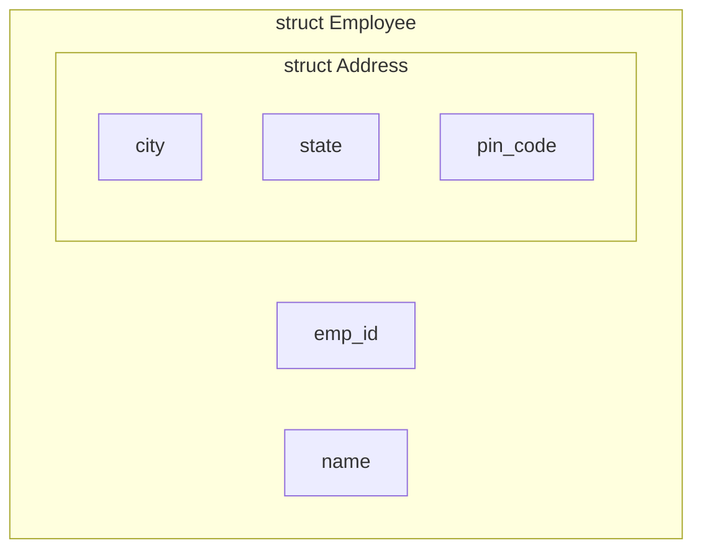

# Arrays And Structures In C (EN)

## 1. Introduction to Arrays

An **array** is a collection of similar data elements stored in contiguous memory locations under a single variable name. It allows us to store and manipulate a fixed number of elements efficiently.

**Why Arrays?**
Instead of creating 100 separate variables (e.g., `marks1`, `marks2` ... `marks100`), we create a single array `marks[100]`.

**Key Properties**:

- All elements are of the **same data type** (homogeneous).
- Indexing starts from `0`. So `arr[0]` is the first element.
- Elements are stored in contiguous (adjacent) memory locations, allowing fast random access.

---

## 2. One-Dimensional Arrays (1D)

### 2.1 Declaration

**Syntax**: `data_type array_name[size];`

**Example**:

```c
int marks[5];     // Array of 5 integers (indices 0 to 4)
float prices[10]; // Array of 10 floats
char name[50];    // Array of 50 characters (also a string)
```

### 2.2 Initialization

We can initialize arrays at the time of declaration.

```c
int arr1[5] = {10, 20, 30, 40, 50};     // Complete initialization.
int arr2[5] = {1, 2, 3};                // Partial: arr2[0]=1, arr2[1]=2, arr2[2]=3, rest = 0.
int arr3[] = {1, 2, 3};                 // Size automatically set to 3.
int arr4[5] = {0};                      // Sets all elements to 0.
```

### 2.3 Accessing and Reading/Writing

- **Access**: `array_name[index]` (e.g., `marks[2]`).
- **Read (Input)**: Using loops.

**Example: Read and Print 1D Array**:

```c
#include <stdio.h>
int main() {
    int arr[5], i;

    // Reading
    printf("Enter 5 elements: ");
    for (i = 0; i < 5; i++) {
        scanf("%d", &arr[i]);
    }

    // Writing / Printing
    printf("Array elements: ");
    for (i = 0; i < 5; i++) {
        printf("%d ", arr[i]);
    }
    return 0;
}
```

### 2.4 Uses of 1D Arrays

1. Storing a list of values (e.g., marks, ages, IDs).
2. Implementing mathematical vectors.
3. Sorting algorithms (Bubble Sort, Selection Sort).
4. Searching algorithms (Linear Search, Binary Search).
5. Handling strings (character arrays).

---

## 3. Two-Dimensional Arrays (2D)

A 2D array is like a **table** (matrix) consisting of rows and columns.

### 3.1 Declaration

**Syntax**: `data_type array_name[row_size][column_size];`

**Example**:

```c
int matrix[3][4];  // 3 rows, 4 columns (total 12 integers).
```

### 3.2 Initialization

```c
int arr[2][3] = { {1, 2, 3}, {4, 5, 6} }; // Row-wise initialization.
int arr[2][3] = {1, 2, 3, 4, 5, 6};      // Compiler fills row-wise (row 0: 1,2,3; row 1: 4,5,6).
int arr[][3] = { {1,2}, {4,5} };          // Column size is mandatory; row size can be omitted.
```

> **Note**: In C, the second dimension (column count) must always be specified.

### 3.3 Memory Representation (Row-Major Order)

C stores 2D arrays in **Row-Major Order** (row by row). All elements of Row 0 come first, then Row 1, etc.

**Example**: `arr[2][3] = { {1, 2, 3}, {4, 5, 6} }`

```mermaid
graph LR
    subgraph Memory Layout [Row-Major Order in RAM]
        direction LR
        A[Address: 1000] --> B[arr[0][0] = 1]
        A2[Address: 1004] --> C[arr[0][1] = 2]
        A3[Address: 1008] --> D[arr[0][2] = 3]
        A4[Address: 1012] --> E[arr[1][0] = 4]
        A5[Address: 1016] --> F[arr[1][1] = 5]
        A6[Address: 1020] --> G[arr[1][2] = 6]
    end
```

### 3.4 Accessing and Read/Write

Nested loops are used:

- Outer loop for rows.
- Inner loop for columns.

**Example: Read and Print a 2D Matrix**:

```c
#include <stdio.h>
int main() {
    int arr[2][3], i, j;

    // Reading
    printf("Enter 6 elements (row-wise): ");
    for (i = 0; i < 2; i++) {
        for (j = 0; j < 3; j++) {
            scanf("%d", &arr[i][j]);
        }
    }

    // Writing (Printing Matrix)
    printf("Matrix:\n");
    for (i = 0; i < 2; i++) {
        for (j = 0; j < 3; j++) {
            printf("%d ", arr[i][j]);
        }
        printf("\n"); // Newline after each row
    }
    return 0;
}
```

### 3.5 Uses of 2D Arrays

1. **Matrix Operations**: Addition, subtraction, multiplication, transposition.
2. **Tabular Data**: Storing student marks across multiple subjects.
3. **Games**: Chessboards, Tic-Tac-Toe (grid representation).
4. **Image Processing**: Representing pixel values in grayscale/RGB images.

---

## 4. Strings and String Handling with Arrays

A **string** in C is a sequence of characters stored in a `char` array, terminated by a **null character** (`'\0'`). This null character marks the end of the string.

**Declaration**:

```c
char str[20];                // Can hold up to 19 characters + '\0'
char name[5] = "John";       // Stored as: J, o, h, n, \0
```

### 4.1 Reading and Writing Strings

| Function                  | Purpose                                  | Example                  | Caveat                            |
| :------------------------ | :--------------------------------------- | :----------------------- | :-------------------------------- |
| `scanf("%s", str)`        | Reads a string (stops at space/newline). | `scanf("%s", name);`     | Cannot read multi-word strings.   |
| `gets(str)` (deprecated)  | Reads a line including spaces.           | `gets(sentence);`        | Unsafe (buffer overflow) – avoid. |
| `fgets(str, size, stdin)` | Safe reading of a line with spaces.      | `fgets(str, 20, stdin);` | Reads `\n` as well.               |
| `printf("%s", str)`       | Prints the string until `\0`.            | `printf("%s", name);`    | Standard output.                  |
| `puts(str)`               | Prints the string and adds a newline.    | `puts(name);`            | Fast and simple.                  |

**Example (Read/Write with spaces)**:

```c
#include <stdio.h>
int main() {
    char fullname[50];
    printf("Enter full name: ");
    fgets(fullname, 50, stdin); // Reads "John Doe"
    printf("Hello, %s", fullname); // Note: fgets retains newline, so output has an extra line break.
    return 0;
}
```

### 4.2 String Concatenation and Comparison (Manual & Library)

String functions are defined in the header file `<string.h>`.

| Function     | Prototype                 | Description                                                                            | Example                            |
| :----------- | :------------------------ | :------------------------------------------------------------------------------------- | :--------------------------------- |
| **`strlen`** | `int strlen(str);`        | Returns the length (excluding `\0`).                                                   | `int len = strlen("Hello");` → `5` |
| **`strcat`** | `strcat(dest, src);`      | Concatenates `src` at the end of `dest`.                                               | `strcat(s1, s2);`                  |
| **`strcmp`** | `int strcmp(str1, str2);` | Compares lexicographically. Returns `0` if equal, `<0` if str1 < str2, `>0` otherwise. | `if(strcmp(s1, s2)==0) { ... }`    |
| **`strcpy`** | `strcpy(dest, src);`      | Copies `src` into `dest`.                                                              | `strcpy(copy, original);`          |
| **`strlwr`** | `strlwr(str);`            | Converts all characters to lowercase (non-standard, but common).                       | `strlwr(str);`                     |
| **`strupr`** | `strupr(str);`            | Converts all characters to uppercase (non-standard).                                   | `strupr(str);`                     |

**Manual Concatenation (Logic)**:

```c
int i, j;
char s1[100] = "Hello", s2[] = "World";

// Find end of s1
i = 0;
while (s1[i] != '\0') i++;

// Copy s2 to end of s1
j = 0;
while (s2[j] != '\0') {
    s1[i] = s2[j];
    i++;
    j++;
}
s1[i] = '\0'; // Null terminate the result
printf("%s", s1); // Output: HelloWorld
```

**Manual Comparison (Logic)**:

```c
int flag = 1; // assume equal
for (i = 0; s1[i] != '\0' || s2[i] != '\0'; i++) {
    if (s1[i] != s2[i]) {
        flag = 0;
        break;
    }
}
```

---

## 5. Structures

A **structure** is a user-defined data type that allows grouping of logically related variables of **different data types** under a single name.

### 5.1 Defining and Declaring a Structure

**Syntax**:

```c
struct struct_name {
    data_type member1;
    data_type member2;
    ...
};
```

**Example** (Student Record):

```c
struct Student {
    int roll_no;
    char name[50];
    float marks;
};
```

### 5.2 Declaring Structure Variables

```c
struct Student s1;                // Local variable
struct Student s2, s3;            // Multiple variables
struct Student s4 = {101, "Alice", 85.5}; // Initialization at declaration
```

**Accessing Members**: Use the **dot (`.`) operator**.

```c
s1.roll_no = 102;
strcpy(s1.name, "Bob");
s1.marks = 92.0;
printf("Roll: %d, Name: %s", s1.roll_no, s1.name);
```

### 5.3 Alternative `typedef` (Optional but useful)

```c
typedef struct {
    int roll;
    char name[50];
} Student;

Student s1, s2; // No need to write 'struct' keyword repeatedly.
```

---

## 6. Arrays of Structures

We can create an array of structures to store data of multiple entities (e.g., a class of 50 students).

**Declaration**:

```c
struct Student class[50]; // Array of 50 Student structures
```

**Example** (Reading and Printing 3 Students):

```c
#include <stdio.h>
struct Student {
    int roll;
    char name[30];
    float marks;
};

int main() {
    struct Student s[3]; // Array of 3 structures
    int i;

    // Input
    for (i = 0; i < 3; i++) {
        printf("Enter roll, name, marks for student %d: ", i+1);
        scanf("%d %s %f", &s[i].roll, s[i].name, &s[i].marks);
    }

    // Output
    printf("\nStudent Details:\n");
    for (i = 0; i < 3; i++) {
        printf("%d\t%s\t%.2f\n", s[i].roll, s[i].name, s[i].marks);
    }
    return 0;
}
```

**Use Case**: Employee database, library book catalog, student result management.

---

## 7. Arrays within Structures

A structure can contain an array as one of its members. This is very common for storing multiple related data points for a single entity.

**Example** (Storing marks of 5 subjects for a student):

```c
struct Student {
    int roll;
    char name[50];
    int marks[5];     // Array within structure
};

int main() {
    struct Student s1;
    s1.roll = 101;
    strcpy(s1.name, "Alice");
    s1.marks[0] = 85;
    s1.marks[1] = 90;
    // ... and so on
    return 0;
}
```

---

## 8. Nested Structures (Structure within Structure)

A structure can contain another structure as a member. This is used to represent complex relationships (e.g., a student has an address, which has city, state, and pin).

**Example**:

```c
struct Address {
    char city[30];
    char state[30];
    int pin_code;
};

struct Employee {
    int emp_id;
    char name[50];
    struct Address addr;   // Nested structure
};

int main() {
    struct Employee emp1;
    emp1.emp_id = 1001;
    strcpy(emp1.name, "John Doe");

    // Accessing nested structure members
    strcpy(emp1.addr.city, "New York");
    strcpy(emp1.addr.state, "NY");
    emp1.addr.pin_code = 10001;

    printf("City: %s, State: %s", emp1.addr.city, emp1.addr.state);
    return 0;
}
```

**Memory Representation (Nested Structure)**:


