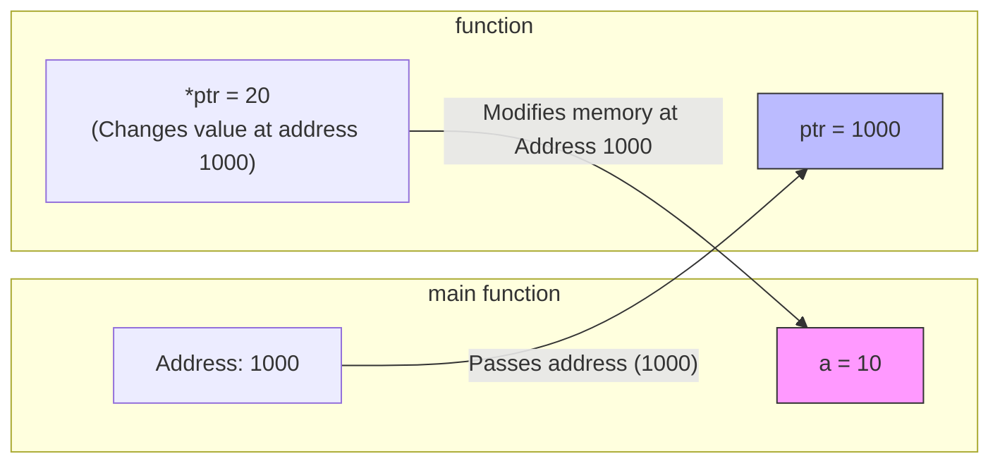

# User Defined Functions In C (EN)

## 1. Introduction and Need for Functions

A **function** is a self-contained block of code that performs a specific task. In C, functions can be broadly classified into:

1. **Library Functions**: Pre-defined functions provided by C (e.g., `printf()`, `scanf()`, `strlen()`).
2. **User-Defined Functions**: Functions created by the programmer to perform custom tasks.

### The Need for Functions (Advantages)

1. **Modularity**: Breaks a large program into smaller, manageable, and logical modules.
2. **Reusability (DRY Principle)**: Once defined, a function can be called multiple times from different parts of the program, reducing code duplication.
3. **Readability**: The `main()` function becomes concise and reads like a high-level solution.
4. **Ease of Debugging**: Errors are localized to specific functions, making testing and debugging easier.
5. **Team Development**: Different programmers can work on different functions simultaneously.
6. **Memory Efficiency**: Saves memory by executing shared code without duplicating it.

---

## 2. Components of a Function

A function typically has three parts:

1. **Declaration (Prototype)**: Tells the compiler about the function's name, return type, and parameters (optional, but required before calling).
2. **Definition**: Contains the actual body/logic of the function.
3. **Call**: Invoking the function from `main()` or another function.

### Syntax of Function Definition

```c
return_type function_name(parameter_list) {
    // Body of the function
    // ... statements ...
    return value; // If return_type is not 'void'
}
```

### Example

```c
#include <stdio.h>

// 1. Declaration (Prototype)
int add(int a, int b);

int main() {
    int result;
    // 3. Function Call
    result = add(5, 3);
    printf("Sum = %d", result);
    return 0;
}

// 2. Definition
int add(int a, int b) {
    return a + b; // Return value
}
```

---

## 3. Parameter Passing: Call by Value vs Call by Reference

### 3.1 Call by Value

- **Mechanism**: A copy of the actual argument's value is passed to the formal parameter.
- **Effect**: Changes made inside the function **do not** affect the original variable in the calling function.
- **Default Behavior**: C uses Call by Value by default for all data types (except arrays, which decay to pointers).

```mermaid
graph LR
    subgraph main [main function]
        M_A[a = 10]
    end
    subgraph function [function]
        F_A[x = 10 (copy)]
    end
    M_A -- "Passes value (10)" --> F_A
    F_A -- "Changes x to 20 (copy changes)" --> M_A
    style M_A fill:#f9f,stroke:#333
    style F_A fill:#bbf,stroke:#333
```

_(Note: `a` in main remains 10 because the function only changed the copy)._

**Example**:

```c
void changeValue(int x) {
    x = 20; // Modifies the local copy only
}

int main() {
    int a = 10;
    changeValue(a);
    printf("%d", a); // Output: 10 (unchanged)
    return 0;
}
```

---

### 3.2 Call by Reference (Simulated using Pointers)

- **Mechanism**: The **address** of the actual variable is passed to the formal parameter (which must be a pointer).
- **Effect**: The function can directly access and modify the original variable using the dereference operator (`*`).
- **Crucial Rule**: C does not have a native "pass by reference" for variables; we _simulate_ it by passing addresses via pointers.



_(Note: Changes affect the original `a` because the function writes directly to its memory address)._

**Example** (Swapping Two Numbers):

```c
#include <stdio.h>

// Pass by Reference (using pointers)
void swap(int *x, int *y) {
    int temp;
    temp = *x;  // Dereference x to get its value
    *x = *y;
    *y = temp;
}

int main() {
    int a = 5, b = 10;
    printf("Before: a=%d, b=%d\n", a, b); // 5, 10
    swap(&a, &b); // Pass addresses of a and b
    printf("After: a=%d, b=%d\n", a, b);  // 10, 5 (Swapped!)
    return 0;
}
```

### Comparison Table

| Feature                | Call by Value                                             | Call by Reference (using pointers)                            |
| :--------------------- | :-------------------------------------------------------- | :------------------------------------------------------------ |
| **Passed to function** | Value (copy)                                              | Address (pointer)                                             |
| **Memory**             | Separate memory allocated for parameter.                  | Pointer variable stores address (no duplicate data).          |
| **Original Variable**  | Protected (cannot be modified).                           | Can be modified directly.                                     |
| **Performance**        | Slower for large structures (due to copying).             | Faster (only address is passed, ~4/8 bytes).                  |
| **Syntax**             | Standard variable.                                        | `*` in declaration, `&` while calling.                        |
| **Use Case**           | Simple calculations where original data shouldn't change. | Modifying large arrays/structures, returning multiple values. |

---

## 4. Return Values and Types

A function can return a value to the caller using the `return` statement.

### 4.1 Return Types

| Return Type        | Description                                                                     | Example Function                           |
| :----------------- | :------------------------------------------------------------------------------ | :----------------------------------------- |
| `void`             | Returns nothing. Used for functions that just perform actions (e.g., printing). | `void printHello() { ... }`                |
| `int`              | Returns an integer value.                                                       | `int add(int a, int b) { return a+b; }`    |
| `float` / `double` | Returns floating-point numbers.                                                 | `float area(float r) { return 3.14*r*r; }` |
| `char *`           | Returns a character pointer (string).                                           | `char* getName() { return "John"; }`       |
| `struct`           | Can return an entire structure (by value).                                      | `Student getStudent() { ... }`             |
| `int*`             | Returns a pointer (e.g., dynamically allocated memory).                         | (Use with caution for local variables).    |

### 4.2 The `return` Statement

- It can appear anywhere in the function.
- As soon as `return` is executed, the function exits immediately.
- A function can have only one return value, but we can return multiple values indirectly using **Call by Reference** (pointers) or by returning a **structure**.

**Example** (Returning Multiple Values using Pointers):

```c
void calculate(int a, int b, int *sum, int *diff) {
    *sum = a + b;
    *diff = a - b;
}
// In main: calculate(5, 3, &s, &d);
```

---

## 5. Nesting of Functions

C does **not** allow defining a function inside another function (nested definitions). However, it allows **nested function calls**—calling one function from inside another function.

### Concept

- Function `A` can call Function `B`.
- Function `B` can call Function `C`.
- This creates a call hierarchy.

**Example** (Nested Calls):

```c
#include <stdio.h>

int add(int a, int b) {
    return a + b;
}

int multiply(int a, int b) {
    return a * b;
}

int calculate(int x, int y) {
    int sum = add(x, y);          // Nested call: calculate calls add
    int prod = multiply(sum, y);  // Nested call: calculate calls multiply
    return prod;
}

int main() {
    int result = calculate(3, 2); // main calls calculate
    // calculate -> add -> (returns) -> multiply -> (returns) -> main
    printf("%d", result); // (3+2) * 2 = 10
    return 0;
}
```

**Call Stack Flow (Nesting)**:

```mermaid
graph TD
    A[main()] --> B[calculate(3,2)]
    B --> C[add(3,2)]
    C -- returns 5 --> B
    B --> D[multiply(5,2)]
    D -- returns 10 --> B
    B -- returns 10 --> A
```

---

## 6. Recursion

**Definition**: Recursion is a programming technique where a function calls **itself** to solve a smaller instance of the same problem.

### Structure of a Recursive Function

1. **Base Case**: The simplest condition that stops the recursion and returns a direct answer (prevents infinite calls).
2. **Recursive Case**: The function calls itself with a modified input, moving toward the base case.

### Memory Management (Stack)

Each recursive call creates a new activation record (stack frame) on the call stack, storing local variables and the return address. Excessive recursion can lead to **Stack Overflow**.

---

### 6.1 Example: Factorial using Recursion

_Mathematical Formula_: $n! = n \times (n-1)!$ with base case $0! = 1$.

```c
#include <stdio.h>

int factorial(int n) {
    // Base Case
    if (n == 0 || n == 1) {
        return 1;
    }
    // Recursive Case
    else {
        return n * factorial(n - 1);
    }
}

int main() {
    int num = 5;
    printf("Factorial of %d is %d", num, factorial(num));
    // factorial(5) -> 5 * factorial(4) -> 4 * factorial(3) -> 3 * factorial(2) -> 2 * factorial(1)
    // factorial(1) returns 1.
    // Results in 5 * 4 * 3 * 2 * 1 = 120
    return 0;
}
```

**Recursive Call Stack Visualization**:

```mermaid
graph TD
    subgraph Stack [Function Call Stack]
        F1[factorial(1) returns 1] --> F2[factorial(2) returns 2 * 1]
        F2 --> F3[factorial(3) returns 3 * 2]
        F3 --> F4[factorial(4) returns 4 * 6]
        F4 --> F5[factorial(5) returns 5 * 24 = 120]
    end
```

**Time Complexity**:
The recurrence relation is $T(n) = T(n-1) + O(1)$, which solves to **$O(n)$**.

---

### 6.2 Example: Fibonacci Series using Recursion

_Formula_: $F(n) = F(n-1) + F(n-2)$ with base cases $F(0) = 0$, $F(1) = 1$.

```c
int fibonacci(int n) {
    if (n == 0) return 0;      // Base Case
    if (n == 1) return 1;      // Base Case
    return fibonacci(n - 1) + fibonacci(n - 2); // Recursive Case
}
// fibonacci(5) = fibonacci(4) + fibonacci(3) ... leads to 5
```

**Time Complexity**: $T(n) = T(n-1) + T(n-2) + O(1)$, which solves to **$O(2^n)$** (Exponential).

---

### 6.3 Recursion vs Iteration (Non-Recursive)

| Aspect                 | Recursion                                                         | Iteration (Loops)                                           |
| :--------------------- | :---------------------------------------------------------------- | :---------------------------------------------------------- |
| **Code Length**        | Shorter, cleaner, elegant.                                        | Longer, more verbose.                                       |
| **Memory Usage**       | High (uses stack for each call).                                  | Low (constant memory).                                      |
| **Speed**              | Slower (function call overhead).                                  | Faster.                                                     |
| **Infinite Loop Risk** | Risk of Stack Overflow if base case missing.                      | Can run indefinitely if condition false, but uses CPU only. |
| **Best For**           | Tree/Graph traversals, Divide-and-Conquer (QuickSort, MergeSort). | Simple repetitions, mathematical computations.              |
