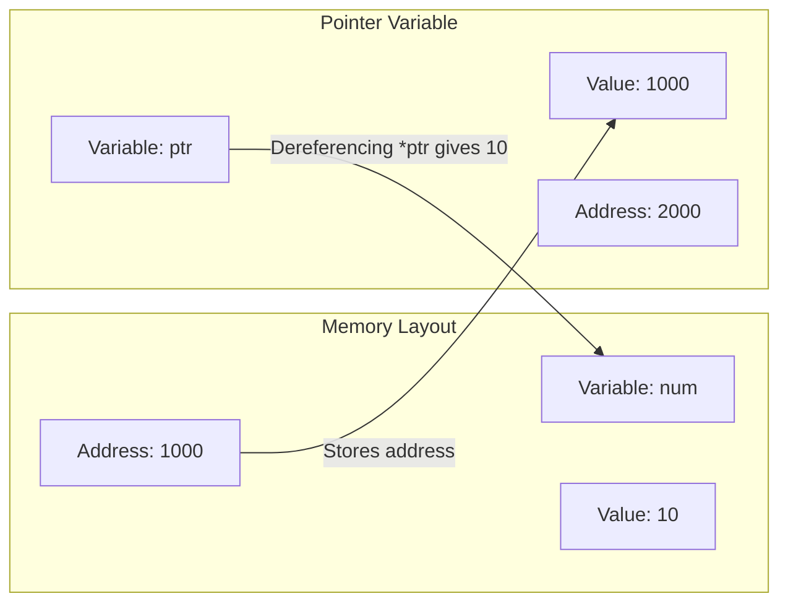

# Pointers In C (EN)

## 1. Introduction to Pointers

A **pointer** is a variable that stores the memory address of another variable (or function) instead of storing a direct value.

- **Why use pointers?**
  1. **Efficiency**: Pass large data structures (arrays, structs) without copying them.
  2. **Dynamic Memory**: Allocate memory at runtime using `malloc()`/`calloc()`.
  3. **Modification**: Change variables passed to functions (Call by Reference).
  4. **Data Structures**: Essential for building linked lists, trees, and graphs.

> **Think of it like this**: If a variable is a house, its address is a pointer. Instead of moving the house, you just tell someone the address. The `&` operator gives you the address; the `*` operator lets you look inside the house.

---

## 2. Declaration and Initialization

### 2.1 Declaration

When declaring a pointer, you must specify the **data type** of the variable it will point to. This tells the compiler how many bytes to read when dereferencing.

**Syntax**: `data_type *pointer_name;`

**Examples**:

```c
int *ptr;        // Pointer to an integer
float *fptr;     // Pointer to a float
char *cptr;      // Pointer to a character (string)
```

### 2.2 Initialization

A pointer should be initialized with a valid memory address before it is dereferenced.

1. **Using the Address-of Operator (`&`)**:

   ```c
   int num = 10;
   int *ptr = &num; // ptr stores the address of num
   ```

2. **Using Arrays (Base Address)**:

   ```c
   int arr[5] = {1,2,3,4,5};
   int *ptr = arr; // arr already gives the address of arr[0]; &arr[0] is also correct.
   ```

3. **Using `NULL` (Safety)**:
   A pointer that is not assigned to any valid memory address should be set to `NULL` (defined in `<stdio.h>` or `<stdlib.h>`).
   ```c
   int *ptr = NULL;
   // Always check if(ptr != NULL) before using it to avoid crashes.
   ```

**Mermaid Diagram (Pointer pointing to variable)**:



---

## 3. Pointer Operators

| Operator | Name                      | Description                                                  | Example                      |
| :------- | :------------------------ | :----------------------------------------------------------- | :--------------------------- |
| `&`      | Address-of                | Returns the memory address of its operand.                   | `&num` → address like `1000` |
| `*`      | Indirection (Dereference) | Returns the value stored at the address held by the pointer. | `*ptr` → value `10`          |

**Example**:

```c
#include <stdio.h>
int main() {
    int num = 25;
    int *ptr = &num;

    printf("Address of num: %p\n", &num);   // Prints address (e.g., 0x7fff)
    printf("Value of ptr: %p\n", ptr);      // Same address
    printf("Value at ptr: %d\n", *ptr);     // Prints 25
    printf("Address of ptr: %p\n", &ptr);   // Address where pointer itself is stored

    *ptr = 100; // Changing num indirectly
    printf("New num: %d", num);             // Prints 100
    return 0;
}
```

---

## 4. Accessing Variables

Pointers allow us to read and write values at specific memory locations using the dereference operator (`*`).

**Reading**:

```c
int a = 5;
int *p = &a;
int b = *p; // b = 5
```

**Writing (Modifying)**:

```c
*p = 20; // a now becomes 20
```

**Swapping two numbers (Classic Use Case)**:

```c
void swap(int *x, int *y) {
    int temp = *x; // Read value at x
    *x = *y;       // Write value at x
    *y = temp;     // Write value at y
}
// In main: swap(&a, &b);
```

---

## 5. Pointer Arithmetic

Pointer arithmetic is performed relative to the **size of the data type** the pointer points to.

- If `ptr` points to an `int` (size 4 bytes), `ptr + 1` moves the address forward by **4 bytes**.
- If `ptr` points to a `char` (size 1 byte), `ptr + 1` moves the address forward by **1 byte**.

| Operation | Description                                                      | Example (int \*p at address 1000)       |
| :-------- | :--------------------------------------------------------------- | :-------------------------------------- |
| `p + n`   | Adds `n * sizeof(type)` to the address.                          | `p + 2` → Address `1000 + (2*4) = 1008` |
| `p - n`   | Subtracts `n * sizeof(type)` from the address.                   | `p - 1` → Address `1000 - 4 = 996`      |
| `p++`     | Increments pointer to next element.                              | Moves to `1004`                         |
| `p--`     | Decrements pointer to previous element.                          | Moves to `996`                          |
| `p - q`   | Returns the number of elements between two pointers (not bytes). | If `p=1000`, `q=1008`, `p-q = -2`       |

**Visualizing Pointer Arithmetic (int array)**:

```mermaid
graph LR
    subgraph Memory [Memory Layout]
        direction LR
        A[Address 1000] --> B[arr[0] = 10]
        C[Address 1004] --> D[arr[1] = 20]
        E[Address 1008] --> F[arr[2] = 30]
    end
    P[ptr = 1000] --> A
    P1["ptr + 1 = 1004"] --> C
    P2["ptr + 2 = 1008"] --> E
```

**Code Example**:

```c
int arr[3] = {10, 20, 30};
int *p = arr; // p points to arr[0]

printf("%d\n", *p);     // 10
printf("%d\n", *(p+1)); // 20
printf("%d\n", *(p+2)); // 30
```

---

## 6. Pointers and Arrays

In C, the name of an array **acts as a constant pointer** to the first element.

- `arr` is equivalent to `&arr[0]`.
- `arr[i]` is equivalent to `*(arr + i)`.

### 6.1 Traversing Array using Pointer

```c
int arr[5] = {11, 22, 33, 44, 55};
int *ptr = arr; // or &arr[0]

for(int i = 0; i < 5; i++) {
    printf("%d ", *(ptr + i)); // Prints all elements
}
```

### 6.2 Difference between `arr` and `ptr`

- `arr` is a **constant pointer**. You cannot do `arr++` or `arr = something`.
- `ptr` is a **variable pointer**. You can do `ptr++` to move to the next element.

### 6.3 Array of Pointers

We can have an array where each element is a pointer.

**Example**:

```c
int a = 1, b = 2, c = 3;
int *arr[3] = {&a, &b, &c};
for(int i = 0; i < 3; i++) {
    printf("%d ", *arr[i]); // Prints 1 2 3
}
```

---

## 7. Pointers and Strings

In C, strings are represented as arrays of characters terminated by a `\0`. There are two main ways to handle strings using pointers:

### 7.1 String as a Character Array (`char str[]`)

Memory is allocated in the stack (or global). The string is modifiable.

```c
char str[] = "Hello";
char *ptr = str; // ptr points to str[0]
printf("%c", *ptr); // 'H'
printf("%s", ptr);  // "Hello"
```

### 7.2 String as a Pointer to a Character (`char *str`)

Memory is allocated in the **read-only** section (string literal). It cannot be modified directly (undefined behavior).

```c
char *str = "World";
printf("%s", str);  // Outputs "World"
// str[0] = 'A'; // CRASH! Do not modify string literals.
```

To modify it safely, use an array `char str[] = "World";`.

### 7.3 Traversing a String using Pointer

```c
char str[20] = "Pointer";
char *p = str;
while(*p != '\0') {
    printf("%c", *p);
    p++; // Move to next character
}
// Output: Pointer
```

---

## 8. Pointers and Functions

Pointers and functions interact in three major ways: passing arguments, returning values, and function pointers.

### 8.1 Pointers as Function Arguments (Call by Reference)

Already covered in the "Functions" chapter. Allows modification of original variables.

```c
void addTen(int *val) {
    *val = *val + 10;
}
int main() {
    int num = 5;
    addTen(&num);
    printf("%d", num); // 15
    return 0;
}
```

### 8.2 Pointers as Return Values

A function can return a pointer. However, **never return a pointer to a local variable** (as it goes out of scope). Return pointers to:

- Static variables.
- Dynamically allocated memory (using `malloc`).

**Correct Example (Static)**:

```c
int* getStaticValue() {
    static int x = 100; // Static variable persists beyond function scope
    return &x;
}
```

**Correct Example (Dynamic)**:

```c
#include <stdlib.h>
int* createArray(int size) {
    int *arr = (int*)malloc(size * sizeof(int)); // Allocated in Heap
    return arr; // Valid
}
```

**Wrong Example (Causes Undefined Behavior)**:

```c
int* invalid() {
    int local = 10;
    return &local; // WARNING! local is destroyed when function exits.
}
```

### 8.3 Function Pointers (Advanced Concept)

Functions themselves have addresses. We can store the address of a function in a pointer and call it later.

**Syntax**: `return_type (*ptr_name)(parameter_types) = function_name;`

**Example**:

```c
#include <stdio.h>

int add(int a, int b) {
    return a + b;
}

int main() {
    int (*funcPtr)(int, int) = add; // funcPtr stores address of add
    int result = funcPtr(5, 3);     // Calling add via pointer
    printf("%d", result);           // 8
    return 0;
}
```

**Use Case**: Used in callback functions (e.g., `qsort()` sorting function) and event-driven programming.
