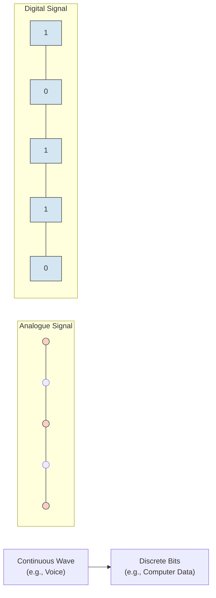
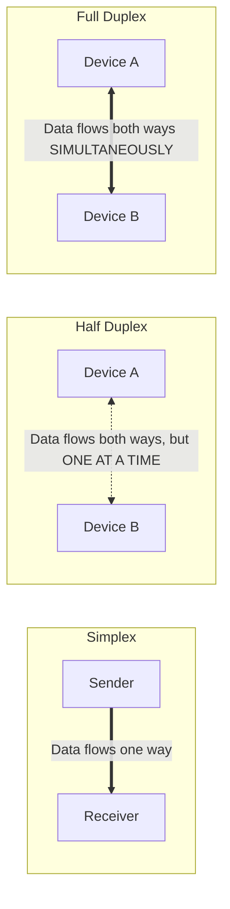
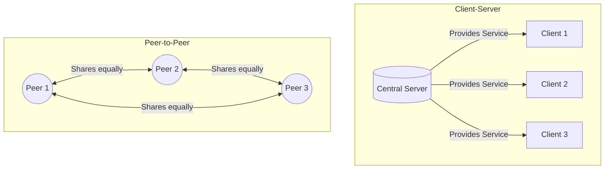
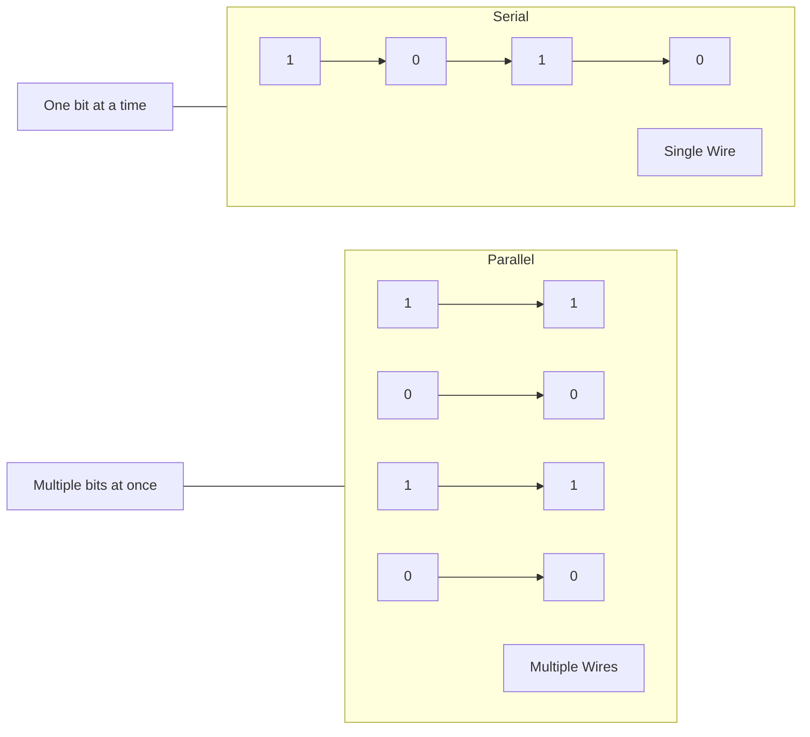
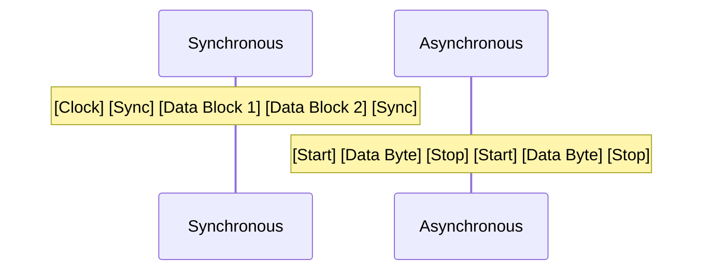

# 📚 কম্পিউটার নেটওয়ার্ক: নেটওয়ার্কিং পরিচিতি 
**ক্লাস ১১-এর বিস্তারিত স্টাডি নোটস**  
*(নম্বর বণ্টন: ১০ নম্বর | আনুমানিক পড়ার সময়: ২০ ঘণ্টা)*

---

## ১. অ্যানালগ এবং ডিজিটাল যোগাযোগ (Analogue and Digital Communication)

যোগাযোগ হলো একটি ট্রান্সমিশন মিডিয়ার মাধ্যমে দুটি ডিভাইসের মধ্যে ডেটা আদান-প্রদান করা। ডেটা মূলত দুটি মৌলিক রূপে প্রেরণ করা যায়:

| বৈশিষ্ট্য | অ্যানালগ যোগাযোগ (Analogue) | ডিজিটাল যোগাযোগ (Digital) |
| :--- | :--- | :--- |
| **সিগন্যালের ধরন** | অবিচ্ছিন্ন, মসৃণ এবং তরঙ্গের মতো (Continuous, wave-like) সিগন্যাল। | বিচ্ছিন্ন, অ-অবিচ্ছিন্ন সিগন্যাল (বাইনারি: ০ এবং ১)। |
| **উপস্থাপন** | সাইন ওয়েভ (Sine waves) দ্বারা উপস্থাপিত হয়। | স্কোয়ার ওয়েভ (Square waves) দ্বারা উপস্থাপিত হয়। |
| **উদাহরণ** | মানুষের কণ্ঠস্বর, প্রথাগত রেডিও, ল্যান্ডলাইন টেলিফোন। | কম্পিউটার, স্মার্টফোন, আধুনিক ইন্টারনেট, সিডি (CD)। |
| **নয়েজ বা ব্যাঘাত** | নয়েজ এবং বিকৃতির প্রতি অত্যন্ত সংবেদনশীল। | নয়েজের প্রতি কম সংবেদনশীল; ত্রুটি শনাক্ত ও সংশোধন করা যায়। |
| **ব্যান্ডউইথ** | কম ব্যান্ডউইথ প্রয়োজন হয়। | বেশি ব্যান্ডউইথ প্রয়োজন হয়। |

*(দ্রষ্টব্য: অ্যানালগ ডায়াগ্রামটি ধারণাগতভাবে একটি মসৃণ, অবিচ্ছিন্ন তরঙ্গ নির্দেশ করে, যেখানে ডিজিটাল ডায়াগ্রামটি বিচ্ছিন্ন, ধাপের মতো বাইনারি মান নির্দেশ করে।)*

---

## ২. যোগাযোগের ধরন (Mode of Communication)

এটি দুটি সংযুক্ত ডিভাইসের মধ্যে ডেটা প্রবাহের দিক নির্দেশ করে।

| মোড | প্রবাহের দিক | বিবরণ | বাস্তব জীবনের উদাহরণ |
| :--- | :--- | :--- | :--- |
| **সিমপ্লেক্স (Simplex)** | শুধুমাত্র একমুখী | ডেটা শুধুমাত্র এক দিকে প্রবাহিত হয়। একটি ডিভাইস কঠোরভাবে প্রেরক (Sender), অন্যটি গ্রাহক (Receiver)। | কিবোর্ড থেকে CPU, রেডিও সম্প্রচার, টিভি। |
| **হাফ ডুপ্লেক্স (Half Duplex)** | দ্বিমুখী, কিন্তু একসাথে নয় | উভয় ডিভাইস পাঠাতে ও গ্রহণ করতে পারে, কিন্তু **একই সময়ে নয়**। যখন একটি পাঠায়, অন্যটিকে অপেক্ষা করতে হয়। | ওয়াকি-টকি, সিবি রেডিও। |
| **ফুল ডুপ্লেক্স (Full Duplex)** | একই সময়ে দ্বিমুখী | উভয় ডিভাইস **একই সময়ে** ডেটা পাঠাতে ও গ্রহণ করতে পারে। | মোবাইল ফোন, আধুনিক ইথারনেট নেটওয়ার্ক। |

---

## ৩. নেটওয়ার্ক আর্কিটেকচার (Network Architecture)

নেটওয়ার্ক আর্কিটেকচার সংজ্ঞায়িত করে যে একটি নেটওয়ার্কে কম্পিউটারগুলো কীভাবে সাজানো থাকে এবং কীভাবে কাজ বণ্টন করা হয়।

### ক. ক্লায়েন্ট-সার্ভার নেটওয়ার্ক (Client-Server Network)
*   **ধারণা**: একটি কেন্দ্রীভূত মডেল যেখানে একটি শক্তিশালী কম্পিউটার (**সার্ভার**) রিসোর্স, সেবা বা ডেটা প্রদান করে এবং অন্য কম্পিউটারগুলো (**ক্লায়েন্ট**) সেগুলো অনুরোধ করে ব্যবহার করে।
*   **সুবিধা**: কেন্দ্রীভূত নিরাপত্তা, ডেটা ব্যাকআপ করা সহজ, স্কেলেবল (বড় করা সহজ)।
*   **অসুবিধা**: স্থাপন করতে ব্যয়বহুল, সার্ভার বন্ধ হলে পুরো নেটওয়ার্ক প্রভাবিত হয় (Single point of failure)।
*   **উদাহরণ**: ওয়েব ব্রাউজিং (আপনার ব্রাউজার ক্লায়েন্ট, গুগলের কম্পিউটার সার্ভার), স্কুলের কম্পিউটার ল্যাব।

### খ. পিয়ার-টু-পিয়ার নেটওয়ার্ক (Peer-to-Peer / P2P Network)
*   **ধারণা**: একটি বিকেন্দ্রীভূত মডেল যেখানে সব কম্পিউটার (পিয়ার) সমান মর্যাদার। প্রতিটি কম্পিউটার একই সাথে ক্লায়েন্ট এবং সার্ভার হিসেবে কাজ করতে পারে এবং সরাসরি অন্যদের সাথে রিসোর্স শেয়ার করতে পারে।
*   **সুবিধা**: স্থাপন করতে সস্তা, কোনো কেন্দ্রীয় সার্ভারের প্রয়োজন নেই, কনফিগার করা সহজ।
*   **অসুবিধা**: নিরাপত্তা দুর্বল, ব্যাকআপ করা কঠিন, বড় নেটওয়ার্কের জন্য উপযুক্ত নয়।
*   **উদাহরণ**: ফাইল শেয়ারিংয়ের জন্য হোম ওয়াই-ফাই নেটওয়ার্ক, বিটটরেন্ট (BitTorrent)।

---

## ৪. সিরিয়াল এবং প্যারালাল যোগাযোগ (Serial and Parallel Communication)

এটি নির্দেশ করে যে একটি যোগাযোগ চ্যানেলের ওপর দিয়ে কীভাবে বিট (bits) ভৌতভাবে প্রেরণ করা হয়।

| বৈশিষ্ট্য | সিরিয়াল যোগাযোগ (Serial) | প্যারালাল যোগাযোগ (Parallel) |
| :--- | :--- | :--- |
| **ট্রান্সমিশন** | বিটগুলো **একটির পর একটি** করে একটি **একক তার/চ্যানেল** দিয়ে পাঠানো হয়। | একাধিক বিট **একই সময়ে** **একাধিক তার/চ্যানেল** দিয়ে পাঠানো হয়। |
| **গতি (Speed)** | স্বল্প দূরত্বের জন্য ধীর, কিন্তু দীর্ঘ দূরত্বের জন্য **দ্রুত এবং বেশি নির্ভরযোগ্য** (কোনো স্কিউ বা বিচ্যুতি হয় না)। | স্বল্প দূরত্বের জন্য দ্রুত, কিন্তু দীর্ঘ দূরত্বে **স্কিউ (Skew)** বা বিট ভিন্ন সময়ে পৌঁছানোর সমস্যায় পড়ে। |
| **খরচ** | সস্তা (কম তার বা কেবল প্রয়োজন)। | বেশি ব্যয়বহুল (চওড়া, বহু-তারের কেবল প্রয়োজন)। |
| **উদাহরণ** | USB, SATA, ইথারনেট, ফাইবার অপটিক্স। | পুরনো প্রিন্টার পোর্ট (LPT), IDE হার্ড ড্রাইভ কেবল। |

---

## ৫. যোগাযোগ মাধ্যমের ক্ষমতা পরিমাপ (Measuring Capacity of Communication Media)

একটি নেটওয়ার্ক কতটা ডেটা পরিচালনা করতে পারে তা বোঝার জন্য আমরা তিনটি মূল পরিভাষা ব্যবহার করি:

1. **ব্যান্ডউইথ (Bandwidth)**: 
   * **সংজ্ঞা**: একটি নির্দিষ্ট সময়ে একটি নেটওয়ার্ক পথের মধ্য দিয়ে সর্বোচ্চ যে হারে ডেটা স্থানান্তর করা যায়। 
   * **একক**: বিটস পার সেকেন্ড (bps), Kbps, Mbps, Gbps.
   * **উপমা**: একটি জলের পাইপের প্রস্থ। পাইপ যত চওড়া (বেশি ব্যান্ডউইথ), এর মধ্য দিয়ে তত বেশি জল (ডেটা) প্রবাহিত হতে পারে।
2. **চ্যানেল ক্যাপাসিটি (Channel Capacity)**: 
   * **সংজ্ঞা**: আদর্শ পরিস্থিতিতে একটি নির্দিষ্ট যোগাযোগ চ্যানেলের মধ্য দিয়ে ত্রুটিমুক্ত ডেটা প্রেরণের *তাত্ত্বিক সর্বোচ্চ* হার (শ্যাননের উপপাদ্য দ্বারা সংজ্ঞায়িত)। এটি ব্যান্ডউইথ এবং সিগন্যাল-টু-নয়েজ রেশিও (SNR)-এর ওপর নির্ভর করে।
   * **একক**: বিটস পার সেকেন্ড (bps)।
3. **বড রেট (Baud Rate)**: 
   * **সংজ্ঞা**: একটি যোগাযোগ চ্যানেলে প্রতি সেকেন্ডে **সিগন্যাল পরিবর্তনের** (বা সিম্বলের) সংখ্যা। 
   * **একক**: বড (Baud) বা সিম্বলস পার সেকেন্ড।
   * **গুরুত্বপূর্ণ বিষয়**: বড রেট **সর্বদা** বিট রেট (bps)-এর সমান হয় না। যদি একটি সিগন্যাল পরিবর্তন ১ বিট নির্দেশ করে, তবে Baud = bps। যদি একটি সিগন্যাল পরিবর্তন ৪ বিট নির্দেশ করে (জটিল মডুলেশন ব্যবহার করে), তবে bps = ৪ × Baud rate.

---

## ৬. সিঙ্ক্রোনাস এবং অ্যাসিঙ্ক্রোনাস ট্রান্সমিশন মোড (Synchronous and Asynchronous Transmission Mode)

এটি সংজ্ঞায়িত করে যে কীভাবে প্রেরক এবং গ্রাহক ডেটা ট্রান্সমিশনের সময়ের (timing) সমন্বয় সাধন করে।

| বৈশিষ্ট্য | সিঙ্ক্রোনাস ট্রান্সমিশন (Synchronous) | অ্যাসিঙ্ক্রোনাস ট্রান্সমিশন (Asynchronous) |
| :--- | :--- | :--- |
| **ডেটা ইউনিট** | ডেটা **ব্লক বা ফ্রেম** আকারে প্রেরণ করে। | ডেটা **একটি বাইট (বা ক্যারেক্টার)** করে প্রেরণ করে। |
| **টাইমিং/ক্লক** | প্রেরক ও গ্রাহককে পুরোপুরি সিঙ্ক্রোনাইজড রাখতে একটি **সাধারণ ক্লক সিগন্যাল** ব্যবহার করে। | কোনো সাধারণ ক্লক ব্যবহার করে **না**। প্রতিটি বাইটকে ফ্রেম করতে **স্টার্ট (Start)** এবং **স্টপ (Stop)** বিট ব্যবহার করে। |
| **ওভারহেড (Overhead)** | কম ওভারহেড (প্রতিটি বাইটের জন্য স্টার্ট/স্টপ বিট নেই), তাই বড় ডেটার জন্য অত্যন্ত দক্ষ। | বেশি ওভারহেড (প্রতিটি বাইটের জন্য ২-৩টি অতিরিক্ত বিট), তাই কম দক্ষ। |
| **গতি** | উচ্চ গতি, উচ্চ-কার্যক্ষমতা সম্পন্ন নেটওয়ার্কে ব্যবহৃত হয়। | নিম্ন গতি, সাধারণ ও কম খরচের ডিভাইসে ব্যবহৃত হয়। |
| **উদাহরণ** | ফাইবার অপটিক যোগাযোগ, আধুনিক LAN. | কিবোর্ড ইনপুট, পুরনো মডেম, RS-232 সিরিয়াল পোর্ট। |

---

## ৭. বেসব্যান্ড এবং ব্রডব্যান্ড নেটওয়ার্ক (Baseband and Broadband Network)

এই পরিভাষাগুলো বর্ণনা করে যে কীভাবে একটি ট্রান্সমিশন মিডিয়ার ক্ষমতা (ব্যান্ডউইথ) ব্যবহার করা হয়।

| বৈশিষ্ট্য | বেসব্যান্ড ট্রান্সমিশন (Baseband) | ব্রডব্যান্ড ট্রান্সমিশন (Broadband) |
| :--- | :--- | :--- |
| **সিগন্যালের ধরন** | **ডিজিটাল** সিগন্যাল। | **অ্যানালগ** সিগন্যাল (প্রায়শই মডুলেশনের মাধ্যমে ডিজিটাল ডেটা বহন করে)। |
| **ব্যান্ডউইথ ব্যবহার** | একটি **একক সিগন্যালের** জন্য মিডিয়ার **সম্পূর্ণ ব্যান্ডউইথ** ব্যবহার করে। | ব্যান্ডউইথকে **একাধিক স্বাধীন চ্যানেলে** বিভক্ত করে (ফ্রিকোয়েন্সি ডিভিশন মাল্টিপ্লেক্সিং - FDM ব্যবহার করে)। |
| **ডেটার দিক** | সাধারণত হাফ-ডুপ্লেক্স বা ফুল-ডুপ্লেক্স (প্রকৃত ফুল-ডুপ্লেক্সের জন্য দুটি কেবল প্রয়োজন)। | ফুল-ডুপ্লেক্স (পাঠানো ও গ্রহণ করার জন্য ভিন্ন ফ্রিকোয়েন্সি ব্যবহার করে)। |
| **দূরত্ব** | স্বল্প দূরত্বের জন্য উপযুক্ত (যেমন: একটি বিল্ডিংয়ের ভেতরে)। | দীর্ঘ দূরত্বের জন্য উপযুক্ত (সহজেই অ্যাম্প্লিফাই বা শক্তিশালী করা যায়)। |
| **উদাহরণ** | ইথারনেট LAN (যেমন: 100BASE-TX), USB. | কেবল টিভি, DSL ইন্টারনেট, ওয়াই-ফাই (Wi-Fi), সেলুলার নেটওয়ার্ক। |

---

## 📝 দ্রুত রিভিশন সারাংশ (চিট শিট)

| ধারণা (Concept) | মনে রাখার মূল বাক্য (Key Phrase) |
| :--- | :--- |
| **অ্যানালগ (Analogue)** | অবিচ্ছিন্ন তরঙ্গ, নয়েজ-প্রবণ (মানুষের কণ্ঠস্বর)। |
| **ডিজিটাল (Digital)** | বিচ্ছিন্ন ০ এবং ১, নয়েজ-প্রতিরোধী (কম্পিউটার)। |
| **সিমপ্লেক্স (Simplex)** | একমুখী রাস্তা (রেডিও)। |
| **হাফ ডুপ্লেক্স (Half Duplex)** | দ্বিমুখী, কিন্তু একসাথে নয় (ওয়াকি-টকি)। |
| **ফুল ডুপ্লেক্স (Full Duplex)** | দ্বিমুখী, একই সময়ে (মোবাইল ফোন)। |
| **ক্লায়েন্ট-সার্ভার (Client-Server)** | কেন্দ্রীভূত, বস-কর্মী সম্পর্ক। |
| **পিয়ার-টু-পিয়ার (P2P)** | বিকেন্দ্রীভূত, সবাই সমান। |
| **সিরিয়াল (Serial)** | এক লেনের রাস্তা, একবারে একটি গাড়ি (USB)। |
| **প্যারালাল (Parallel)** | মাল্টি-লেন হাইওয়ে, একসাথে একাধিক গাড়ি (পুরনো প্রিন্টার)। |
| **ব্যান্ডউইথ (Bandwidth)** | সর্বোচ্চ ডেটা ট্রান্সফার রেট (পাইপের প্রস্থ)। |
| **বড (Baud)** | প্রতি সেকেন্ডে সিগন্যাল পরিবর্তন (সর্বদা bps-এর সমান নয়)। |
| **সিঙ্ক্রোনাস (Synchronous)** | ব্লক ট্রান্সমিশন, শেয়ার্ড ক্লক, অত্যন্ত দক্ষ। |
| **অ্যাসিঙ্ক্রোনাস (Asynchronous)** | বাইট-বাই-বাইট, স্টার্ট/স্টপ বিট, সরল। |
| **বেসব্যান্ড (Baseband)** | ডিজিটাল, সম্পূর্ণ ব্যান্ডউইথ, একক সিগন্যাল (LAN)। |
| **ব্রডব্যান্ড (Broadband)** | অ্যানালগ, বিভক্ত ব্যান্ডউইথ, একাধিক সিগন্যাল (কেবল/DSL)। |

---
