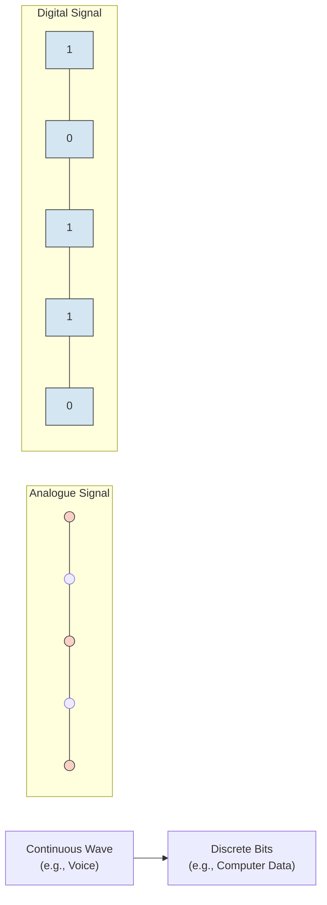
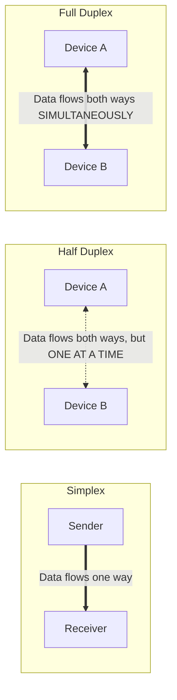
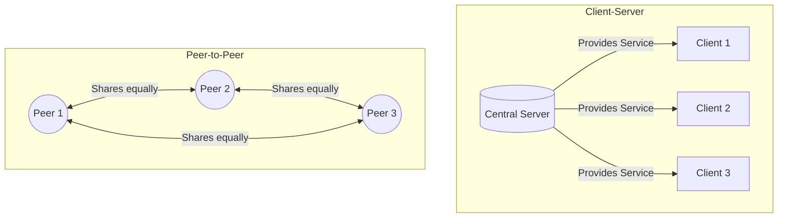
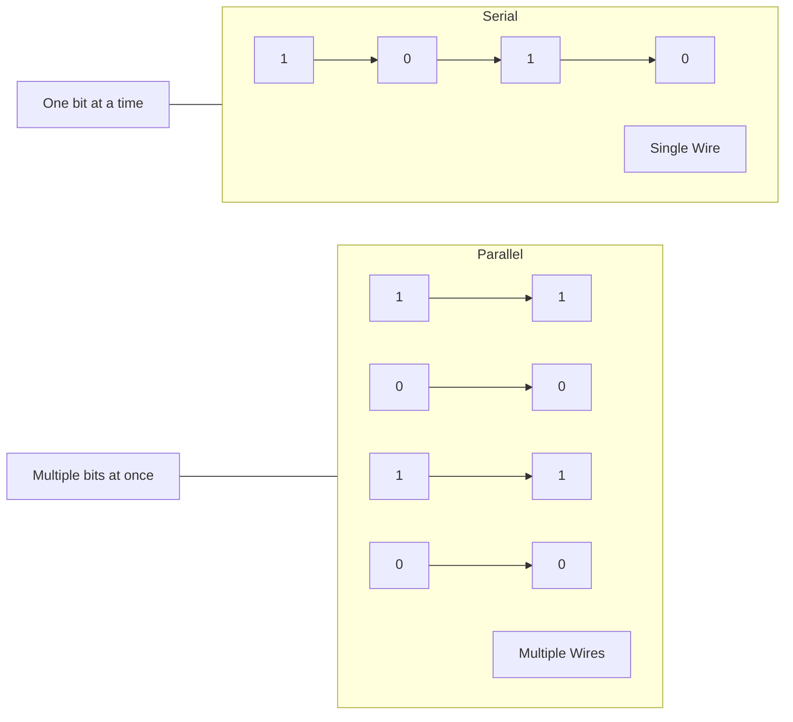
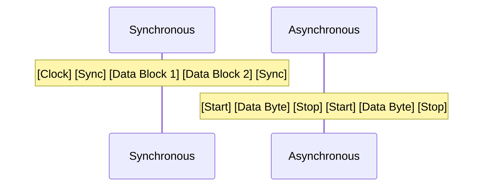

# 📚 Computer Networks: Introduction to Networking 
**Detailed Study Notes for Class 11**  
*(Weightage: 10 Marks | Estimated Study Time: 20 Hours)*

---

## 1. Analogue and Digital Communication

Communication is the exchange of data between two devices via a transmission medium. The data can be transmitted in two fundamental forms:

| Feature | Analogue Communication | Digital Communication |
| :--- | :--- | :--- |
| **Signal Type** | Continuous, smooth, wave-like signals. | Discrete, non-continuous signals (binary: 0s and 1s). |
| **Representation** | Represented by sine waves. | Represented by square waves. |
| **Examples** | Human voice, traditional radio, landline telephones. | Computers, smartphones, modern internet, CDs. |
| **Noise Susceptibility**| Highly susceptible to noise and distortion. | Less susceptible; errors can be detected and corrected. |
| **Bandwidth** | Requires less bandwidth. | Requires more bandwidth. |

*(Note: The analogue diagram conceptually represents a smooth, continuous wave, while the digital diagram represents discrete, step-like binary values.)*

---

## 2. Mode of Communication

This refers to the direction of data flow between two connected devices.

| Mode | Direction of Flow | Description | Real-life Example |
| :--- | :--- | :--- | :--- |
| **Simplex** | One-way only | Data flows in only one direction. One device is strictly the sender, the other is strictly the receiver. | Keyboard to CPU, Radio broadcasting, TV. |
| **Half Duplex** | Two-way, but one at a time | Both devices can send and receive, but **not at the same time**. When one sends, the other must wait. | Walkie-Talkie, CB Radio. |
| **Full Duplex** | Two-way simultaneously | Both devices can send and receive data **at the exact same time**. | Mobile phones, Modern Ethernet networks. |

---

## 3. Network Architecture

Network architecture defines how computers are organized and how tasks are allocated in a network.

### A. Client-Server Network
*   **Concept**: A centralized model where one powerful computer (the **Server**) provides resources, services, or data, and other computers (**Clients**) request and use them.
*   **Pros**: Centralized security, easy to back up data, scalable.
*   **Cons**: Expensive to set up, if the server goes down, the whole network is affected (single point of failure).
*   **Example**: Web browsing (Your browser is the client, Google's computer is the server), School computer labs.

### B. Peer-to-Peer (P2P) Network
*   **Concept**: A decentralized model where all computers (peers) are equal. Each computer can act as both a client and a server, sharing resources directly with others.
*   **Pros**: Cheap to set up, no central server needed, easy to configure.
*   **Cons**: Poor security, difficult to back up, not scalable for large networks.
*   **Example**: Home Wi-Fi networks sharing files, BitTorrent.

---

## 4. Serial and Parallel Communication

This refers to how bits are physically transmitted over a communication channel.

| Feature          | Serial Communication                                                                       | Parallel Communication                                                                                    |
| :--------------- | :----------------------------------------------------------------------------------------- | :-------------------------------------------------------------------------------------------------------- |
| **Transmission** | Bits are sent **one after another** over a **single wire/channel**.                        | Multiple bits are sent **simultaneously** over **multiple wires/channels**.                               |
| **Speed**        | Slower for short distances, but **faster and more reliable for long distances** (no skew). | Faster for short distances, but prone to **skew** (bits arriving at different times) over long distances. |
| **Cost**         | Cheaper (requires fewer wires/cables).                                                     | More expensive (requires wider, multi-wire cables).                                                       |
| **Examples**     | USB, SATA, Ethernet, Fiber Optics.                                                         | Old Printer ports (LPT), IDE hard drive cables.                                                           |

---

## 5. Measuring Capacity of Communication Media

To understand how much data a network can handle, we use three key terms:

1. **Bandwidth**: 
   * **Definition**: The maximum rate at which data can be transferred over a network path in a given amount of time. 
   * **Unit**: Bits per second (bps), Kbps, Mbps, Gbps.
   * **Analogy**: The width of a water pipe. A wider pipe (higher bandwidth) allows more water (data) to flow through.
2. **Channel Capacity**: 
   * **Definition**: The *theoretical maximum* rate of error-free data that can be transmitted over a specific communication channel under ideal conditions (defined by Shannon’s Theorem). It depends on bandwidth and the signal-to-noise ratio.
   * **Unit**: Bits per second (bps).
3. **Baud Rate**: 
   * **Definition**: The number of **signal changes** (or symbols) per second in a communication channel. 
   * **Unit**: Baud (symbols per second).
   * **Important Note**: Baud rate is **not** always equal to bit rate (bps). If one signal change represents 1 bit, Baud = bps. If one signal change represents 4 bits (using complex modulation), then bps = 4 × Baud rate.

---

## 6. Synchronous and Asynchronous Transmission Mode

This defines how the sender and receiver coordinate the timing of data transmission.

| Feature | Synchronous Transmission | Asynchronous Transmission |
| :--- | :--- | :--- |
| **Data Unit** | Transmits data in **blocks or frames**. | Transmits data **one byte (or character) at a time**. |
| **Timing/Clock** | Uses a **common clock signal** to keep sender and receiver perfectly synchronized. | Does **not** use a common clock. Uses **Start** and **Stop** bits to frame each byte. |
| **Overhead** | Low overhead (no start/stop bits for every byte), making it highly efficient for large data. | High overhead (2-3 extra bits per byte for start/stop), making it less efficient. |
| **Speed** | High speed, used in high-performance networks. | Low speed, used in simple, low-cost devices. |
| **Example** | Fiber optic communication, modern LANs. | Keyboard input, old modems, RS-232 serial ports. |

---

## 7. Baseband and Broadband Network

These terms describe how the transmission medium's capacity (bandwidth) is utilized.

| Feature | Baseband Transmission | Broadband Transmission |
| :--- | :--- | :--- |
| **Signal Type** | **Digital** signals. | **Analog** signals (often carrying digital data via modulation). |
| **Bandwidth Usage**| Uses the **entire bandwidth** of the medium for a **single signal**. | Divides the bandwidth into **multiple independent channels** (using Frequency Division Multiplexing - FDM). |
| **Data Direction** | Usually Half-Duplex or Full-Duplex (requires two cables for true full-duplex). | Full-Duplex (different frequencies for sending and receiving). |
| **Distance** | Best for short distances (e.g., within a building). | Suitable for long distances (can be amplified easily). |
| **Examples** | Ethernet LAN (e.g., 100BASE-TX), USB. | Cable TV, DSL Internet, Wi-Fi, Cellular networks. |

---

## 📝 Quick Revision Summary (Cheat Sheet)

| Concept | Key Phrase to Remember |
| :--- | :--- |
| **Analogue** | Continuous waves, noise-prone (Human voice). |
| **Digital** | Discrete 0s and 1s, noise-resistant (Computers). |
| **Simplex** | One-way street (Radio). |
| **Half Duplex** | Two-way, one at a time (Walkie-Talkie). |
| **Full Duplex** | Two-way, simultaneously (Mobile Phone). |
| **Client-Server** | Centralized, boss-worker relationship. |
| **Peer-to-Peer** | Decentralized, everyone is equal. |
| **Serial** | Single lane road, one car at a time (USB). |
| **Parallel** | Multi-lane highway, multiple cars at once (Old Printer). |
| **Bandwidth** | Max data transfer rate (Width of the pipe). |
| **Baud** | Signal changes per second (Not always = bps). |
| **Synchronous** | Block transmission, shared clock, efficient. |
| **Asynchronous** | Byte-by-byte, start/stop bits, simpler. |
| **Baseband** | Digital, entire bandwidth, single signal (LAN). |
| **Broadband** | Analog, split bandwidth, multiple signals (Cable/DSL). |

---

