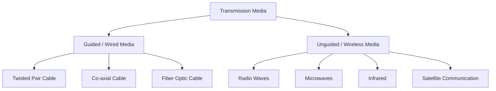

# 📚 কম্পিউটার নেটওয়ার্ক: ট্রান্সমিশন মিডিয়া (Transmission Media)  
**ক্লাস ১১-এর বিস্তারিত স্টাডি নোটস**  
*(আনুমানিক পড়ার সময়: ৩ ঘণ্টা)*

---

## ১. ট্রান্সমিশন মিডিয়া পরিচিতি (Introduction to Transmission Media)
**ট্রান্সমিশন মিডিয়া** বলতে নেটওয়ার্কে একটি প্রেরক (Sender) থেকে গ্রাহকের (Receiver) কাছে ডেটা প্রেরণের ভৌত পথ বা চ্যানেলকে বোঝায়। এটি প্রধানত দুই শ্রেণিতে বিভক্ত:
1. **গাইডেড মিডিয়া (Guided Media / Wired)**: ডেটা একটি কঠিন ভৌত মাধ্যম (কেবল বা তার)-এর মধ্য দিয়ে প্রবাহিত হয়।
2. **আনগাইডেড মিডিয়া (Unguided Media / Wireless)**: ডেটা ইলেক্ট্রোম্যাগনেটিক তরঙ্গ ব্যবহার করে কোনো ভৌত পরিবাহী ছাড়াই বাতাস বা শূন্যস্থানের মধ্য দিয়ে প্রবাহিত হয়।

---

## ২. তারযুক্ত যোগাযোগ মাধ্যম (Wired Communication Media / Guided Media)
গাইডেড মিডিয়ায় সিগন্যালগুলো একটি নির্দিষ্ট ভৌত লিঙ্কের (তার) মধ্যে দিয়ে পরিচালিত ও সীমাবদ্ধ থাকে।

### ক. টুইস্টেড পেয়ার কেবল (Twisted Pair Cable)
এতে দুটি অন্তরক (insulated) তামার তার একসাথে পাকানো (twisted) থাকে, যাতে ইলেক্ট্রোম্যাগনেটিক ইন্টারফারেন্স (EMI) এবং ক্রসটক (crosstalk) কমানো যায়।
*   **প্রকারভেদ**: 
    *   **UTP (Unshielded Twisted Pair)**: কোনো অতিরিক্ত শিল্ডিং থাকে না (যেমন: সাধারণ ইথারনেট LAN কেবল)।
    *   **STP (Shielded Twisted Pair)**: ভালো নয়েজ প্রতিরোধের জন্য ধাতব ফয়েল বা বোনা শিল্ড থাকে।
*   **সুবিধা**: সস্তা, ইনস্টল করা সহজ, নমনীয় (flexible)।
*   **অসুবিধা**: দীর্ঘ দূরত্বে উচ্চ অ্যাটেনুয়েশন (সিগন্যাল লস), EMI-এর প্রতি সংবেদনশীল (বিশেষ করে UTP), ফাইবারের তুলনায় ব্যান্ডউইথ কম।
*   **উদাহরণ**: টেলিফোন লাইন, লোকাল এরিয়া নেটওয়ার্ক (LAN / Cat5e, Cat6 কেবল)।

### খ. কো-এক্সিয়াল কেবল (Co-axial Cable)
এতে একটি কেন্দ্রীয় কঠিন তামার পরিবাহী থাকে, যার চারপাশে একটি অন্তরক স্তর, একটি বোনা ধাতব শিল্ড এবং সবশেষে একটি বাইরের প্লাস্টিকের জ্যাকেট থাকে।
*   **সুবিধা**: টুইস্টেড পেয়ারের তুলনায় EMI-এর বিরুদ্ধে ভালো সুরক্ষা, টুইস্টেড পেয়ারের চেয়ে বেশি ব্যান্ডউইথ এবং দীর্ঘ দূরত্ব সমর্থন করে।
*   **অসুবিধা**: মোটা এবং কম নমনীয়, টুইস্টেড পেয়ারের চেয়ে ব্যয়বহুল, ইনস্টল করা কিছুটা কঠিন।
*   **উদাহরণ**: কেবল টিভি নেটওয়ার্ক, পুরনো ইথারনেট নেটওয়ার্ক (10BASE2), ব্রডব্যান্ড ইন্টারনেট সংযোগ।

### গ. ফাইবার অপটিক কেবল (Fiber Optic Cable)
এটি অত্যন্ত পাতলা কাঁচ বা প্লাস্টিকের একটি কোর (Core) দিয়ে তৈরি, যার চারপাশে কাঁচের একটি স্তর থাকে যাকে **ক্ল্যাডিং (Cladding)** বলে এবং একটি সুরক্ষামূলক বাইরের জ্যাকেট থাকে।
*   **কাজের নীতি**: **পূর্ণ অভ্যন্তরীণ প্রতিফলন (Total Internal Reflection)**-এর নীতি ব্যবহার করে আলোর পালস (pulses of light) হিসেবে ডেটা প্রেরণ করে।
*   **সুবিধা**: 
    *   সর্বোচ্চ ব্যান্ডউইথ এবং দ্রুততম ডেটা ট্রান্সফার গতি।
    *   ইলেক্ট্রোম্যাগনেটিক ইন্টারফারেন্স (EMI) এবং রেডিও ফ্রিকোয়েন্সি ইন্টারফারেন্স দ্বারা প্রভাবিত হয় না।
    *   অত্যন্ত নিরাপদ (ট্যাপ করা বা চুরি করা খুব কঠিন)।
    *   সিগন্যাল অ্যাটেনুয়েশন নগণ্য (রিপিটার ছাড়াই দশ কিলোমিটারেরও বেশি দূরত্ব অতিক্রম করতে পারে)।
*   **অসুবিধা**: অত্যন্ত ব্যয়বহুল, ভঙ্গুর (fragile), ইনস্টলেশন এবং স্প্লাইসিংয়ের জন্য উচ্চ দক্ষ কারিগরের প্রয়োজন হয়।
*   **উদাহরণ**: ইন্টারনেট ব্যাকবোন নেটওয়ার্ক, সমুদ্রের তলদেশের কেবল (undersea cables), উচ্চ-গতির FTTH (Fiber to the Home) সংযোগ।

---

## ৩. বেতার যোগাযোগ মাধ্যম (Wireless Communication Media / Unguided Media)
আনগাইডেড মিডিয়ায় কোনো ভৌত পরিবাহী ছাড়াই বাতাস বা শূন্যস্থানের মধ্য দিয়ে ইলেক্ট্রোম্যাগনেটিক তরঙ্গ ব্যবহার করে ডেটা প্রেরণ করা হয়।

### ক. রেডিও তরঙ্গ (Radio Waves)
বেতার স্পেকট্রামে সর্বনিম্ন ফ্রিকোয়েন্সি এবং দীর্ঘতম তরঙ্গদৈর্ঘ্য বিশিষ্ট ইলেক্ট্রোম্যাগনেটিক তরঙ্গ। এগুলো **সর্বমুখী (Omni-directional)**, অর্থাৎ সব দিকে ছড়িয়ে পড়ে।
*   **সুবিধা**: দেয়াল ও বাধা ভেদ করতে পারে, বাস্তবায়ন করতে সস্তা, বিস্তৃত কভারেজ এলাকা।
*   **অসুবিধা**: কম ব্যান্ডউইথ, অন্যান্য ডিভাইস থেকে আসা ইন্টারফারেন্সের প্রতি অত্যন্ত সংবেদনশীল, কম নিরাপদ (রেঞ্জের মধ্যে যেকেউ আটকাতে পারে)।
*   **উদাহরণ**: AM/FM রেডিও সম্প্রচার, ওয়াই-ফাই (Wi-Fi 2.4 GHz), ব্লুটুথ, ওয়াকি-টকি।

### খ. মাইক্রোওয়েভ (Microwaves)
উচ্চ-ফ্রিকোয়েন্সির ইলেক্ট্রোম্যাগনেটিক তরঙ্গ যা সরলরেখায় চলে। এগুলো **একমুখী (Uni-directional)** এবং প্রেরক ও গ্রাহকের মধ্যে **লাইন-অফ-সাইট (Line-of-Sight / LOS)** বা সরাসরি দৃশ্যমান পথের প্রয়োজন হয়।
*   **প্রকারভেদ**: 
    *   *টারেস্ট্রিয়াল মাইক্রোওয়েভ (Terrestrial)*: ভূমি-ভিত্তিক টাওয়ার ব্যবহার করে (পৃথিবীর বক্রতার কারণে প্রতি ৩০-৫০ কিমি অন্তর টাওয়ার প্রয়োজন)।
    *   *স্যাটেলাইট মাইক্রোওয়েভ (Satellite)*: রিলে স্টেশন হিসেবে উপগ্রহ ব্যবহার করে (নিচে বিস্তারিত)।
*   **সুবিধা**: উচ্চ ব্যান্ডউইথ, ভৌত কেবল পাতার প্রয়োজন নেই, পয়েন্ট-টু-পয়েন্ট যোগাযোগের জন্য উপযুক্ত।
*   **অসুবিধা**: কঠোর Line-of-Sight (LOS) প্রয়োজন, ভবন বা পাহাড় দ্বারা সহজেই অবরুদ্ধ হয়, ভারী বৃষ্টি বা কুয়াশা দ্বারা প্রভাবিত হয় (Rain fade)।
*   **উদাহরণ**: মোবাইল ফোন নেটওয়ার্ক (4G/5G টাওয়ার), এক ভবন থেকে অন্য ভবনে পয়েন্ট-টু-পয়েন্ট লিঙ্ক, রাডার।

### গ. ইনফ্রারেড (Infrared / IR)
দৃশ্যমান আলোর ঠিক নিচের কম ফ্রিকোয়েন্সির আলোক তরঙ্গ ব্যবহার করে। এটি কঠোরভাবে **স্বল্প-পরিসরের (Short-range)** এবং **লাইন-অফ-সাইট (LOS)** প্রয়োজন হয়।
*   **সুবিধা**: অত্যন্ত সস্তা, নিরাপদ (দেয়াল ভেদ করতে পারে না, তাই একটি ঘরের মধ্যেই সীমাবদ্ধ থাকে), রেডিও ডিভাইসের সাথে কোনো ইন্টারফারেন্স হয় না।
*   **অসুবিধা**: খুব স্বল্প পরিসর (কয়েক মিটার), সরাসরি লাইন-অফ-সাইট প্রয়োজন, বাধা বা উজ্জ্বল সূর্যালোক দ্বারা সহজেই বাধাগ্রস্ত হয়।
*   **উদাহরণ**: টিভি রিমোট কন্ট্রোল, ওয়্যারলেস মাউস/কিবোর্ড, স্বল্প-পরিসরের ডেটা ট্রান্সফার (পুরনো মোবাইল ফোন)।

### ঘ. স্যাটেলাইট যোগাযোগ (Satellite Communication)
পৃথিবীর কক্ষপথে স্থাপিত কৃত্রিম উপগ্রহ (যেমন: Geostationary - GEO, Low Earth Orbit - LEO) মাইক্রোওয়েভ সিগন্যালের রিলে স্টেশন হিসেবে কাজ করে।
*   **কাজের পদ্ধতি**: একটি গ্রাউন্ড স্টেশন উপগ্রহের দিকে সিগন্যাল পাঠায় যাকে **আপলিঙ্ক (Uplink)** বলে, উপগ্রহ সেটি অ্যাম্প্লিফাই (শক্তিশালী) করে অন্য একটি গ্রাউন্ড স্টেশনে পাঠায় যাকে **ডাউনলিঙ্ক (Downlink)** বলে।
*   **সুবিধা**: বিশাল ভৌগোলিক এলাকা জুড়ে কভারেজ প্রদান করে (মহাসাগর এবং প্রত্যন্ত গ্রামের জন্যও উপযুক্ত), গ্লোবাল ব্রডকাস্টিং এবং GPS-এর জন্য আদর্শ।
*   **অসুবিধা**: স্থাপন ও রক্ষণাবেক্ষণের খরচ অত্যন্ত বেশি, উচ্চ লেটেন্সি বা সিগন্যাল বিলম্ব (বিশেষ করে GEO উপগ্রহে), বায়ুমণ্ডলীয় অবস্থার কারণে সিগন্যাল দুর্বল হতে পারে।
*   **উদাহরণ**: GPS নেভিগেশন, ডিরেক্ট-টু-হোম (DTH) স্যাটেলাইট টিভি, গ্লোবাল ইন্টারনেট সেবা (যেমন: Starlink)।

---

## 📝 দ্রুত রিভিশন সারাংশ (চিট শিট)

| মিডিয়ার ধরন | মূল বৈশিষ্ট্য (Key Characteristic) | সর্বোত্তম ব্যবহার (Best Use Case) |
| :--- | :--- | :--- |
| **Twisted Pair** | সস্তা, নমনীয়, EMI-এর প্রতি সংবেদনশীল। | LANs, টেলিফোন ওয়্যারিং। |
| **Co-axial** | কেন্দ্রীয় তামার কোর + বোনা ধাতব শিল্ড। | কেবল টিভি, ব্রডব্যান্ড। |
| **Fiber Optic** | আলোর পালস, পূর্ণ অভ্যন্তরীণ প্রতিফলন, EMI-মুক্ত, দ্রুততম। | ইন্টারনেট ব্যাকবোন, দীর্ঘ দূরত্বের উচ্চ-গতির ডেটা। |
| **Radio Waves** | সর্বমুখী (Omni-directional), দেয়াল ভেদ করে, কম ফ্রিকোয়েন্সি। | Wi-Fi, ব্লুটুথ, FM রেডিও। |
| **Microwaves** | একমুখী (Uni-directional), Line-of-Sight (LOS) প্রয়োজন। | মোবাইল টাওয়ার, পয়েন্ট-টু-পয়েন্ট লিঙ্ক। |
| **Infrared** | স্বল্প-পরিসর, LOS প্রয়োজন, দেয়াল ভেদ করতে পারে না। | টিভি রিমোট, ওয়্যারলেস পেরিফেরালস। |
| **Satellite** | মহাকাশ-ভিত্তিক রিলে, বিশাল কভারেজ, উচ্চ লেটেন্সি। | GPS, DTH টিভি, প্রত্যন্ত এলাকার সংযোগ। |

---

### 💡 পরীক্ষার জন্য প্রো-টিপ (Pro-Tip for Exams):
যখনই **ফাইবার অপটিক** এবং **কপার কেবল** (Twisted Pair/Co-axial)-এর মধ্যে পার্থক্য করতে বলা হবে, অবশ্যই এই ৩টি বিষয় উল্লেখ করবেন:
1. **সিগন্যালের ধরন**: আলো (Light) বনাম বৈদ্যুতিক প্রবাহ (Electrical signals)।
2. **EMI প্রতিরোধ**: ফাইবার অপটিক সম্পূর্ণ ইমিউন (Immune), কিন্তু কপার কেবল EMI দ্বারা প্রভাবিত হয়।
3. **ব্যান্ডউইথ/গতি**: ফাইবার অপটিকের গতি ও ব্যান্ডউইথ কপারের তুলনায় অসামান্যভাবে বেশি।

