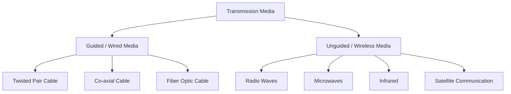

# 📚 Computer Networks: Transmission Media  
**Detailed Study Notes for Class 11**  
*(Estimated Study Time: 3 Hours)*

---

## 1. Introduction to Transmission Media
**Transmission Media** refers to the physical path or channel through which data is transmitted from a sender to a receiver in a network. It is broadly classified into two categories:
1. **Guided Media (Wired)**: Data travels through a solid physical medium (cables).
2. **Unguided Media (Wireless)**: Data travels through the air or vacuum using electromagnetic waves.

---

## 2. Wired Communication Media (Guided Media)
In guided media, signals are directed and contained within a physical link. 

### A. Twisted Pair Cable
Consists of two insulated copper wires twisted together to reduce electromagnetic interference (EMI) and crosstalk.
*   **Types**: 
    *   **UTP (Unshielded Twisted Pair)**: No extra shielding (e.g., standard Ethernet LAN cables).
    *   **STP (Shielded Twisted Pair)**: Has a metallic foil/braided shield for better noise protection.
*   **Pros**: Cheap, easy to install, flexible.
*   **Cons**: High attenuation (signal loss) over long distances, susceptible to EMI (especially UTP), lower bandwidth compared to fiber.
*   **Examples**: Telephone lines, Local Area Networks (LAN / Cat5e, Cat6 cables).

### B. Co-axial Cable
Consists of a central solid copper conductor, surrounded by an insulating layer, a braided metallic shield, and an outer plastic jacket.
*   **Pros**: Better shielding against EMI than twisted pair, supports higher bandwidth and longer distances than twisted pair.
*   **Cons**: Bulkier, less flexible, more expensive than twisted pair, difficult to install.
*   **Examples**: Cable TV networks, older Ethernet networks (10BASE2), broadband internet connections.

### C. Fiber Optic Cable
Consists of a core made of extremely thin glass or plastic, surrounded by a layer of glass called **cladding**, and a protective outer jacket. 
*   **Working Principle**: Transmits data as pulses of light using the principle of **Total Internal Reflection**.
*   **Pros**: 
    *   Highest bandwidth and fastest data transfer speeds.
    *   Immune to Electromagnetic Interference (EMI) and radio frequency interference.
    *   Highly secure (very difficult to tap).
    *   Minimal signal attenuation (can travel tens of kilometers without repeaters).
*   **Cons**: Very expensive, fragile, requires highly skilled technicians for installation and splicing.
*   **Examples**: Internet backbone networks, undersea cables, high-speed FTTH (Fiber to the Home) connections.

---

## 3. Wireless Communication Media (Unguided Media)
In unguided media, data is transmitted through the air or vacuum using electromagnetic waves without a physical conductor.

### A. Radio Waves
Electromagnetic waves with the lowest frequency and longest wavelength in the wireless spectrum. They are **omni-directional** (travel in all directions).
*   **Pros**: Can penetrate walls and obstacles, cheap to implement, wide coverage area.
*   **Cons**: Low bandwidth, highly susceptible to interference from other devices, less secure (anyone within range can intercept).
*   **Examples**: AM/FM radio broadcasting, Wi-Fi (2.4 GHz), Bluetooth, walkie-talkies.

### B. Microwaves
High-frequency electromagnetic waves that travel in a straight line. They are **uni-directional** and require **Line-of-Sight (LOS)** between the sender and receiver.
*   **Types**: 
    *   *Terrestrial Microwave*: Uses ground-based towers (spaced ~30-50 km apart due to Earth's curvature).
    *   *Satellite Microwave*: Uses satellites as relay stations (covered below).
*   **Pros**: High bandwidth, no need for laying physical cables, good for point-to-point communication.
*   **Cons**: Requires strict Line-of-Sight (LOS), easily blocked by buildings/mountains, affected by heavy rain or fog (rain fade).
*   **Examples**: Mobile phone networks (4G/5G towers), point-to-point building-to-building links, radar.

### C. Infrared (IR)
Uses low-frequency light waves just below the visible light spectrum. It is strictly **short-range** and requires **Line-of-Sight (LOS)**.
*   **Pros**: Very cheap, secure (cannot penetrate walls, so it stays within a room), no interference with radio devices.
*   **Cons**: Very short range (a few meters), requires direct line-of-sight, easily blocked by obstacles or bright sunlight.
*   **Examples**: TV remote controls, wireless mice/keyboards, short-range data transfer (older mobile phones).

### D. Satellite Communication
Uses artificial satellites placed in Earth's orbit (e.g., Geostationary - GEO, Low Earth Orbit - LEO) to act as relay stations for microwave signals.
*   **How it works**: A ground station sends a signal *up* to the satellite (**Uplink**), the satellite amplifies it and sends it *down* to another ground station (**Downlink**).
*   **Pros**: Provides coverage over vast geographic areas (even oceans and remote villages), ideal for global broadcasting and GPS.
*   **Cons**: Very high setup and maintenance cost, high latency (signal delay, especially in GEO satellites), signal degradation due to atmospheric conditions.
*   **Examples**: GPS navigation, Direct-to-Home (DTH) satellite TV, global internet services (e.g., Starlink).

---

## 📝 Quick Revision Summary (Cheat Sheet)

| Media Type | Key Characteristic | Best Use Case |
| :--- | :--- | :--- |
| **Twisted Pair** | Cheap, flexible, prone to EMI. | LANs, Telephone wiring. |
| **Co-axial** | Central copper core + braided shield. | Cable TV, Broadband. |
| **Fiber Optic** | Light pulses, Total Internal Reflection, immune to EMI, fastest. | Internet backbone, long-distance high-speed data. |
| **Radio Waves** | Omni-directional, penetrates walls, low frequency. | Wi-Fi, Bluetooth, FM Radio. |
| **Microwaves** | Uni-directional, requires Line-of-Sight (LOS). | Mobile towers, point-to-point links. |
| **Infrared** | Short-range, LOS required, cannot penetrate walls. | TV remotes, wireless peripherals. |
| **Satellite** | Space-based relay, wide coverage, high latency. | GPS, DTH TV, remote area connectivity. |

---

### 💡 Pro-Tip for Exams:
When differentiating between **Fiber Optic** and **Copper cables** (Twisted/Co-axial), always mention:
1. Signal type (Light vs. Electrical)
2. EMI Immunity (Fiber is immune, Copper is not)
3. Bandwidth/Speed (Fiber is vastly superior)

