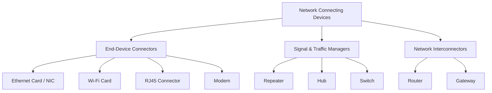

# 📚 কম্পিউটার নেটওয়ার্ক: নেটওয়ার্ক সংযোগকারী ডিভাইস (Network Connecting Devices)  
**ক্লাস ১১-এর বিস্তারিত স্টাডি নোটস**  
*(আনুমানিক পড়ার সময়: ২ ঘণ্টা)*

---

## ১. নেটওয়ার্ক সংযোগকারী ডিভাইস পরিচিতি (Introduction)
নেটওয়ার্ক সংযোগকারী ডিভাইস (যাকে নেটওয়ার্কিং হার্ডওয়্যারও বলা হয়) হলো এমন ভৌত উপাদান যা কম্পিউটার, সার্ভার এবং অন্যান্য ডিভাইসগুলোকে একসাথে যুক্ত করে একটি নেটওয়ার্ক তৈরি করতে সাহায্য করে। এগুলো নিশ্চিত করে যে ডেটা নেটওয়ার্কের মধ্য দিয়ে দক্ষতার সাথে, সঠিকভাবে এবং নিরাপদে প্রেরিত হচ্ছে। এগুলো OSI মডেলের বিভিন্ন স্তরে (Layer) কাজ করে।

---

## ২. এন্ড-ডিভাইস কানেক্টর এবং অ্যাডাপ্টার (End-Device Connectors & Adapters)

### ক. মডেম (Modem - Modulator-Demodulator)
*   **কাজ**: কম্পিউটার থেকে আসা ডিজিটাল সিগন্যালকে টেলিফোন লাইনের মধ্য দিয়ে প্রেরণের জন্য অ্যানালগ সিগন্যালে রূপান্তর করে (**Modulation**) এবং আসা অ্যানালগ সিগন্যালকে পুনরায় ডিজিটাল সিগন্যালে রূপান্তর করে (**Demodulation**)।
*   **প্রকারভেদ**: ইন্টারনাল (পিসির ভেতরে লাগানো), এক্সটারনাল (আলাদা বক্স), DSL/কেবল মডেম।
*   **OSI স্তর**: ফিজিক্যাল লেয়ার (Layer 1) এবং ডেটা লিঙ্ক লেয়ার (Layer 2)।
*   **উদাহরণ**: আপনার ISP (ইন্টারনেট প্রোভাইডার) যে ডিভাইসটি দিয়ে আপনার বাড়িকে ইন্টারনেটের সাথে যুক্ত করে।

### খ. ইথারনেট কার্ড বা নেটওয়ার্ক ইন্টারফেস কার্ড (Ethernet Card / NIC)
*   **কাজ**: এটি একটি হার্ডওয়্যার উপাদান যা কম্পিউটারে সংযুক্ত করা হয়, যাতে এটি একটি ওয়্যার্ড (তারযুক্ত) নেটওয়ার্কের সাথে যুক্ত হতে পারে। এটি নেটওয়ার্ক মিডিয়ার জন্য ডেটা প্রস্তুত করে, পাঠায় এবং ডেটা প্রবাহ নিয়ন্ত্রণ করে।
*   **মূল বৈশিষ্ট্য**: প্রতিটি NIC-এর একটি অনন্য, স্থায়ী ৪৮-বিট ফিজিক্যাল ঠিকানা থাকে, যাকে প্রস্তুতকারক কোম্পানি এর মধ্যে স্থায়ীভাবে সেট করে দেয়। একে **MAC (Media Access Control) Address** বলে।
*   **OSI স্তর**: ফিজিক্যাল লেয়ার (Layer 1) এবং ডেটা লিঙ্ক লেয়ার (Layer 2)।
*   **উদাহরণ**: আপনার ডেস্কটপ পিসির পেছনের যে পোর্টে আপনি LAN কেবল প্লাগ করেন।

### গ. আরজে৪৫ (RJ45 - Registered Jack 45)
*   **কাজ**: এটি নিজে কোনো ডিভাইস নয়, বরং এটি টুইস্টেড-পেয়ার ইথারনেট কেবলের (যেমন Cat5e বা Cat6) দুই প্রান্তে ব্যবহৃত একটি **স্ট্যান্ডার্ড ৮-পিন ফিজিক্যাল কানেক্টর**।
*   **মূল বৈশিষ্ট্য**: এটি দেখতে একটি চওড়া টেলিফোন জ্যাকের (RJ11) মতো এবং এটি NIC, সুইচ বা রাউটারের ইথারনেট পোর্টে "ক্লিক" করে শক্তভাবে আটকে যায়।
*   **উদাহরণ**: আপনার LAN কেবলের শেষ প্রান্তে থাকা স্বচ্ছ প্লাস্টিকের প্লাগটি।

### ঘ. ওয়াই-ফাই কার্ড (Wi-Fi Card / Wireless NIC)
*   **কাজ**: একটি হার্ডওয়্যার উপাদান (যা ইন্টারনাল বা USB ডঙ্গল হতে পারে) যা একটি কম্পিউটারকে ওয়্যারলেস নেটওয়ার্কের (WLAN) সাথে যুক্ত হতে দেয়। এতে রেডিও তরঙ্গের মাধ্যমে ডেটা পাঠানো ও গ্রহণ করার জন্য একটি রেডিও ট্রান্সমিটার এবং রিসিভার থাকে।
*   **মূল বৈশিষ্ট্য**: এরও একটি অনন্য MAC অ্যাড্রেস থাকে এবং এটি IEEE 802.11 স্ট্যান্ডার্ড (যেমন: Wi-Fi 5, Wi-Fi 6) ব্যবহার করে।
*   **OSI স্তর**: ফিজিক্যাল লেয়ার (Layer 1) এবং ডেটা লিঙ্ক লেয়ার (Layer 2)।

---

## ৩. সিগন্যাল এবং ট্রাফিক ম্যানেজার (Signal & Traffic Managers)

### ঙ. রিপিটার (Repeater)
*   **কাজ**: একটি দুর্বল বা ক্ষয়প্রাপ্ত সিগন্যাল গ্রহণ করে, সেটিকে **পুনরুজ্জীবিত** (regenerates/পরিষ্কার ও শক্তিশালী) করে এবং উচ্চতর পাওয়ার লেভেলে পুনরায় প্রেরণ করে।
*   **উদ্দেশ্য**: একটি নেটওয়ার্কের ভৌত দূরত্বকে সাধারণ কেবলের দৈর্ঘ্য সীমার (যেমন ইথারনেটের জন্য ১০০ মিটার) বাইরে প্রসারিত করা।
*   **OSI স্তর**: ফিজিক্যাল লেয়ার (Layer 1)।
*   **সীমাবদ্ধতা**: এটি ট্রাফিক ফিল্টার করে না; সিগন্যালের সাথে নয়েজও (noise) একসাথে অ্যাম্প্লিফাই বা শক্তিশালী করে।

### চ. হাব (Hub)
*   **কাজ**: এটি মূলত একটি "মাল্টি-পোর্ট রিপিটার"। যখন একটি পোর্টে ডেটা প্যাকেট আসে, হাবটি অন্ধের মতো সেটিকে **ব্রডকাস্ট** করে (কপি করে) নেটওয়ার্কের *অন্য সকল* সক্রিয় পোর্টে পাঠিয়ে দেয়।
*   **সুবিধা**: অত্যন্ত সস্তা, সেটআপ করা সহজ।
*   **অসুবিধা**: অত্যন্ত অদক্ষ, নেটওয়ার্ক জ্যাম (congestion) তৈরি করে এবং একটি একক **কলিশন ডোমেইন (Collision Domain)** তৈরি করে (যদি দুটি ডিভাইস একসাথে ডেটা পাঠায়, ডেটা সংঘর্ষে লিপ্ত হয় এবং নষ্ট হয়ে যায়)।
*   **OSI স্তর**: ফিজিক্যাল লেয়ার (Layer 1)।
*   **বর্তমান অবস্থা**: সুইচ দ্বারা প্রতিস্থাপিত হওয়ায় এটি এখন প্রায় অবলুপ্ত (obsolete)।

### ছ. সুইচ (Switch)
*   **কাজ**: এটি একটি "বুদ্ধিমান হাব" (Intelligent Hub)। এটি এর পোর্টগুলোতে সংযুক্ত সকল ডিভাইসের **MAC অ্যাড্রেস** শিখে নেয় এবং একটি MAC অ্যাড্রেস টেবিল তৈরি করে। যখন ডেটা আসে, এটি প্যাকেটটিকে সকল পোর্টে না পাঠিয়ে **শুধুমাত্র নির্দিষ্ট গন্তব্য পোর্টে** ফরোয়ার্ড করে।
*   **সুবিধা**: অত্যন্ত দক্ষ, নেটওয়ার্ক জ্যাম কমায়, প্রতিটি পোর্টে ডেডিকেটেড ব্যান্ডউইথ প্রদান করে এবং প্রতিটি পোর্টের জন্য আলাদা **কলিশন ডোমেইন** তৈরি করে।
*   **OSI স্তর**: ডেটা লিঙ্ক লেয়ার (Layer 2)। *(দ্রষ্টব্য: লেয়ার ৩ সুইচও存在 করে যা বেসিক রাউটিং করতে পারে)*।
*   **উদাহরণ**: আধুনিক অফিস বা স্কুলের কম্পিউটার ল্যাবের কেন্দ্রীয় সংযোগকারী ডিভাইস।

---

## ৪. নেটওয়ার্ক ইন্টারকানেক্টর (Network Interconnectors)

### জ. রাউটার (Router)
*   **কাজ**: **দুই বা ততোধিক ভিন্ন নেটওয়ার্ককে** (যেমন: আপনার হোম LAN এবং ইন্টারনেট/WAN) সংযুক্ত করে এবং ডেটা ভ্রমণের জন্য সেরা পথ (best path) নির্ধারণ করে।
*   **কাজের পদ্ধতি**: এটি **IP অ্যাড্রেস** ব্যবহার করে এবং স্মার্ট ফরোয়ার্ডিং সিদ্ধান্ত নেওয়ার জন্য একটি **রাউটিং টেবিল (Routing Table)** বজায় রাখে। এটি বেসিক ফায়ারওয়াল এবং NAT (Network Address Translation) নিরাপত্তাও প্রদান করে।
*   **OSI স্তর**: নেটওয়ার্ক লেয়ার (Layer 3)।
*   **উদাহরণ**: আপনার বাড়ির ওয়াই-ফাই রাউটার যা আপনার ফোন/ল্যাপটপকে ISP-এর নেটওয়ার্কের সাথে যুক্ত করে।

### ঝ. গেটওয়ে (Gateway)
*   **কাজ**: এটি মূলত একটি "প্রোটোকল কনভার্টার" (Protocol Converter)। এটি এমন দুটি নেটওয়ার্ককে সংযুক্ত করে যেগুলো **সম্পূর্ণ ভিন্ন আর্কিটেকচার বা যোগাযোগ প্রোটোকল** ব্যবহার করে (যেমন: একটি TCP/IP LAN নেটওয়ার্ককে একটি পুরনো IBM মেইনফ্রেম নেটওয়ার্কের সাথে, অথবা একটি কর্পোরেট নেটওয়ার্ককে ISP-এর মাধ্যমে ইন্টারনেটের সাথে যুক্ত করা)।
*   **কাজের পদ্ধতি**: এটি ডেটা ফরম্যাট, প্রোটোকল এবং আর্কিটেকচার অনুবাদ (translate) করে, যাতে দুটি ভিন্ন নেটওয়ার্ক একে অপরের ভাষা বুঝতে পারে।
*   **OSI স্তর**: যেকোনো স্তরে কাজ করতে পারে, তবে প্রধানত নেটওয়ার্ক, ট্রান্সপোর্ট বা অ্যাপ্লিকেশন লেয়ারে (Layer 3 থেকে Layer 7) কাজ করে।
*   **উদাহরণ**: একটি কর্পোরেট প্রক্সি সার্ভার, বা একটি VoIP গেটওয়ে যা ভয়েস সিগন্যালকে IP প্যাকেটে রূপান্তর করে।

---

## 📝 দ্রুত রিভিশন সারাংশ (চিট শিট)

| ডিভাইস | প্রাথমিক কাজ (Primary Function) | OSI স্তর | মূল শনাক্তকারী / কি-ওয়ার্ড |
| :--- | :--- | :--- | :--- |
| **Modem** | ডিজিটাল ↔ অ্যানালগ রূপান্তর | Layer 1 / 2 | Modulation, Demodulation, ISP সংযোগ। |
| **Ethernet Card (NIC)** | পিসিকে ওয়্যার্ড নেটওয়ার্কের সাথে যুক্ত করে | Layer 1 / 2 | অনন্য **MAC Address** থাকে। |
| **RJ45** | ফিজিক্যাল কেবল কানেক্টর | N/A (Physical) | টুইস্টেড পেয়ার কেবলের জন্য ৮-পিন প্লাগ। |
| **Wi-Fi Card** | পিসিকে ওয়্যারলেস নেটওয়ার্কের সাথে যুক্ত করে | Layer 1 / 2 | রেডিও ট্রান্সমিটার/রিসিভার, IEEE 802.11। |
| **Repeater** | সিগন্যাল পুনরুজ্জীবিত ও শক্তিশালী করে | Layer 1 | কেবলের দূরত্ব বাড়ায়, নয়েজও বাড়ায়। |
| **Hub** | মাল্টি-পোর্ট রিপিটার, সকলের কাছে পাঠায় | Layer 1 | "বোকা" (Dumb) ডিভাইস, একক Collision Domain। |
| **Switch** | নির্দিষ্ট MAC অ্যাড্রেসে ডেটা পাঠায় | Layer 2 | "বুদ্ধিমান" (Intelligent) ডিভাইস, একাধিক Collision Domain। |
| **Router** | ভিন্ন নেটওয়ার্ক যুক্ত করে, সেরা পথ খুঁজে বের করে | Layer 3 | **IP Address** এবং Routing Table ব্যবহার করে। |
| **Gateway** | ভিন্ন প্রোটোকলের মধ্যে অনুবাদ করে | Layer 3 to 7 | প্রোটোকল কনভার্টার, ভিন্ন নেটওয়ার্ক যুক্ত করে। |

---

## 💡 পরীক্ষার জন্য প্রো-টিপ (Common Differentiations)

1. **Hub বনাম Switch**: 
   - *Hub* সকলের কাছে ডেটা ব্রডকাস্ট করে (অদক্ষ, Layer 1)। 
   - *Switch* শুধুমাত্র উদ্দিষ্ট গ্রাহকের কাছে MAC অ্যাড্রেস ব্যবহার করে ডেটা পাঠায় (দক্ষ, Layer 2)।
2. **Switch বনাম Router**: 
   - *Switch* **একই** নেটওয়ার্কের (LAN) ভেতরের ডিভাইসগুলোকে যুক্ত করে। 
   - *Router* **ভিন্ন** নেটওয়ার্ককে (LAN থেকে WAN/ইন্টারনেট) IP অ্যাড্রেস ব্যবহার করে যুক্ত করে।
3. **Router বনাম Gateway**: 
   - একটি *Router* **একই** প্রোটোকল ব্যবহারকারী নেটওয়ার্ক যুক্ত করে (যেমন: IP থেকে IP)। 
   - একটি *Gateway* **ভিন্ন** প্রোটোকল ব্যবহারকারী নেটওয়ার্ক যুক্ত করে (যেমন: IP থেকে SNA, বা ফরম্যাট অনুবাদ করা)।
4. **Repeater বনাম Amplifier**: একটি রিপিটার ডিজিটাল সিগন্যালকে *পুনরুজ্জীবিত* (regenerate) করে (নয়েজ মুক্ত করে), যেখানে একটি সাধারণ অ্যাম্প্লিফায়ার শুধু সিগন্যালকে বাড়িয়ে দেয় (নয়েজসহ)।

