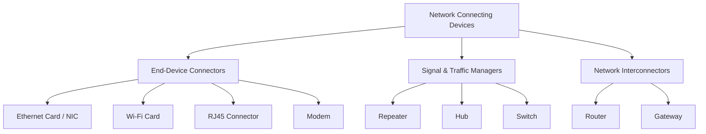

# 📚 Computer Networks: Network Connecting Devices  
**Detailed Study Notes for Class 11**  
*(Estimated Study Time: 2 Hours)*

---

## 1. Introduction to Network Connecting Devices
Network connecting devices (also called networking hardware) are physical components used to connect computers, servers, and other devices together to form a network. They ensure that data is transmitted efficiently, accurately, and securely across the network. They operate at different layers of the OSI model.

---

## 2. End-Device Connectors & Adapters

### A. Modem (Modulator-Demodulator)
*   **Function**: Converts digital signals from a computer into analog signals for transmission over telephone lines (**Modulation**), and converts incoming analog signals back into digital signals (**Demodulation**).
*   **Types**: Internal (installed inside the PC), External (standalone box), DSL/Cable Modems.
*   **OSI Layer**: Physical Layer (Layer 1) & Data Link Layer (Layer 2).
*   **Example**: The device provided by your ISP to connect your home to the internet.

### B. Ethernet Card (Network Interface Card - NIC)
*   **Function**: A hardware component installed in a computer that allows it to connect to a wired network. It prepares data for the network medium, sends it, and controls the flow of data.
*   **Key Feature**: Every NIC has a unique, permanent 48-bit physical address called a **MAC (Media Access Control) Address** burned into it by the manufacturer.
*   **OSI Layer**: Physical Layer (Layer 1) & Data Link Layer (Layer 2).
*   **Example**: The port on the back of your desktop PC where you plug in a LAN cable.

### C. RJ45 (Registered Jack 45)
*   **Function**: Not a device itself, but the **standard 8-pin physical connector** used at the ends of twisted-pair Ethernet cables (like Cat5e or Cat6). 
*   **Key Feature**: It resembles a wider telephone jack (RJ11) and "clicks" securely into the Ethernet port of a NIC, Switch, or Router.
*   **Example**: The transparent plastic plug at the end of your LAN cable.

### D. Wi-Fi Card (Wireless NIC)
*   **Function**: A hardware component (can be internal or a USB dongle) that allows a computer to connect to a wireless network (WLAN). It contains a radio transmitter and receiver to send/receive data via radio waves.
*   **Key Feature**: Also has a unique MAC address and uses IEEE 802.11 standards (e.g., Wi-Fi 5, Wi-Fi 6).
*   **OSI Layer**: Physical Layer (Layer 1) & Data Link Layer (Layer 2).

---

## 3. Signal & Traffic Managers (Layer 1 & 2 Devices)

### E. Repeater
*   **Function**: Receives a weak or degraded signal, **regenerates** (cleans and amplifies) it, and retransmits it at a higher power level. 
*   **Purpose**: Extends the physical distance a network can cover beyond the standard cable length limits (e.g., beyond 100 meters for Ethernet).
*   **OSI Layer**: Physical Layer (Layer 1).
*   **Limitation**: It does not filter traffic; it also amplifies noise along with the signal.

### F. Hub
*   **Function**: A "multi-port repeater." When a data packet arrives at one port, the Hub blindly **broadcasts** (copies and sends) it to *all* other active ports.
*   **Pros**: Very cheap, simple to set up.
*   **Cons**: Highly inefficient, causes network congestion, and creates a single **Collision Domain** (if two devices transmit at once, data collides and is lost).
*   **OSI Layer**: Physical Layer (Layer 1).
*   **Current Status**: Largely obsolete, replaced by Switches.

### G. Switch
*   **Function**: An "intelligent hub." It learns the **MAC addresses** of all devices connected to its ports and builds a MAC address table. When data arrives, it forwards the packet **only to the specific destination port**, not to all ports.
*   **Pros**: Highly efficient, reduces network congestion, provides dedicated bandwidth to each port, and creates separate **Collision Domains** for each port.
*   **OSI Layer**: Data Link Layer (Layer 2). *(Note: Layer 3 Switches also exist and can do basic routing).*
*   **Example**: The central connecting device in a modern office or school computer lab.

---

## 4. Network Interconnectors (Layer 3 & Above Devices)

### H. Router
*   **Function**: Connects **two or more different networks** (e.g., your home LAN to the Internet/WAN) and determines the best path for data to travel. 
*   **How it works**: Uses **IP Addresses** and maintains a **Routing Table** to make intelligent forwarding decisions. It also provides basic firewall/NAT (Network Address Translation) security.
*   **OSI Layer**: Network Layer (Layer 3).
*   **Example**: The Wi-Fi router in your home that connects your phones/laptops to the ISP's network.

### I. Gateway
*   **Function**: A "protocol converter." It connects two networks that use **entirely different architectures or communication protocols** (e.g., a TCP/IP LAN network connecting to an old IBM Mainframe network, or a corporate network connecting to the internet via an ISP).
*   **How it works**: It translates data formats, protocols, and architectures so the two disparate networks can understand each other.
*   **OSI Layer**: Can operate at any layer, but primarily at the Network, Transport, or Application Layer (Layer 3 to Layer 7).
*   **Example**: A corporate proxy server, or a VoIP gateway converting voice signals to IP packets.

---

## 📝 Quick Revision Summary (Cheat Sheet)

| Device | Primary Function | OSI Layer | Key Identifier / Keyword |
| :--- | :--- | :--- | :--- |
| **Modem** | Digital ↔ Analog conversion | Layer 1 / 2 | Modulation, Demodulation, ISP connection. |
| **Ethernet Card (NIC)** | Connects PC to wired network | Layer 1 / 2 | Has a unique **MAC Address**. |
| **RJ45** | Physical cable connector | N/A (Physical) | 8-pin plug for Twisted Pair cables. |
| **Wi-Fi Card** | Connects PC to wireless network | Layer 1 / 2 | Radio transmitter/receiver, IEEE 802.11. |
| **Repeater** | Regenerates and amplifies signals | Layer 1 | Extends cable distance, amplifies noise too. |
| **Hub** | Multi-port repeater, broadcasts to all | Layer 1 | "Dumb" device, single Collision Domain. |
| **Switch** | Forwards data to specific MAC address | Layer 2 | "Intelligent" device, multiple Collision Domains. |
| **Router** | Connects different networks, finds best path | Layer 3 | Uses **IP Addresses** and Routing Tables. |
| **Gateway** | Translates between different protocols | Layer 3 to 7 | Protocol converter, connects dissimilar networks. |

---

## 💡 Pro-Tips for Exams (Common Differentiations)

1. **Hub vs. Switch**: 
   - *Hub* broadcasts data to everyone (inefficient, Layer 1). 
   - *Switch* sends data only to the intended recipient using MAC addresses (efficient, Layer 2).
2. **Switch vs. Router**: 
   - *Switch* connects devices within the **same** network (LAN). 
   - *Router* connects **different** networks together (LAN to WAN/Internet) using IP addresses.
3. **Router vs. Gateway**: 
   - A *Router* connects networks using the *same* protocol (e.g., IP to IP). 
   - A *Gateway* connects networks using *different* protocols (e.g., IP to SNA, or translating formats).
4. **Repeater vs. Amplifier**: A repeater *regenerates* the digital signal (removes noise), whereas a simple amplifier just boosts the signal (including the noise).

